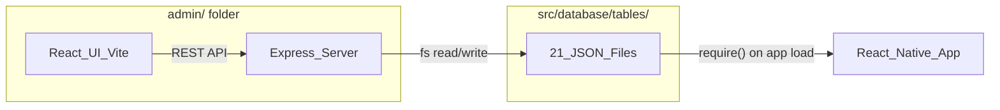

# Admin Panel for Exercise Configuration Tables

## Architecture




- `**admin/**` folder at the project root (completely separate from the RN app)
- **Backend**: Express server that uses `fs` to read/write the JSON files in `src/database/tables/`
- **Frontend**: Vite + React (with TypeScript), served by the Express server in dev
- Run with a single command: `npm run admin` from the project root

---

## Table Inventory and Schema Registry

A central `admin/tableRegistry.ts` file defines the schema for every table. This drives the entire UI -- forms, dropdowns, validation, and relationship resolution are all generated from it.

### All 21 tables grouped by domain (19 existing + 2 new)

**Exercise Setup**

- `exerciseCategories.json` -- standalone; nested `cardio_types_allowed`, `muscle_groups_allowed`, `training_focus_allowed` objects
- `cardioTypes.json` -- standalone
- `trainingFocus.json` -- standalone

**Muscles (3-tier hierarchy)**

- `muscleGroups.json` -- standalone metadata
- `primaryMuscles.json` -- standalone; `upper_lower` array
- `secondaryMuscles.json` -- FK: `primary_muscle_ids` references `primaryMuscles`
- `tertiaryMuscles.json` -- FK: `secondary_muscle_ids` references `secondaryMuscles`

**Equipment (3-tier hierarchy)**

- `equipmentCategories.json` -- standalone; `sub_categories_table` references sub-category tables
- `supportEquipmentCategories.json` -- standalone sub-categories
- `weightsEquipmentCategories.json` -- standalone sub-categories
- `gymEquipment.json` -- FK: `equipment_categories` is array of `{CATEGORY: SUBCATEGORY}` mappings; `cable_attachments` flag; `allowed_grip_types`, `allowed_grip_widths`, `allowed_stance_types`, `allowed_stance_widths` (FK[] columns referencing gripTypes, gripWidths, stanceTypes, stanceWidths)
- `cableAttachments.json` -- `allowed_grip_types`, `allowed_grip_widths`, `allowed_stance_types`, `allowed_stance_widths` (FK[] columns, same as gymEquipment)
- `equipmentIcons.json` -- simple key-value map (id -> filename)

**Motions (2-tier)**

- `primaryMotions.json` -- standalone; nested `muscle_targets` scoring object
- `primaryMotionVariations.json` -- FK: `primary_motion_key` references `primaryMotions`; nested `muscle_targets`, `motion_planes` array
- `motionPlanes.json` -- standalone

**Grips and Stance (with sub-variations)**

- `gripTypes.json` -- `variations` field references `rotatingGripVariations` table name
- `gripWidths.json` -- standalone
- `rotatingGripVariations.json` -- standalone (linked from `gripTypes` where `variations = "ROTATING_GRIP_VARIATIONS"`)
- `stanceTypes.json` -- **NEW** (migrated from hardcoded `STANCE_TYPES` in data.js)
- `stanceWidths.json` -- **NEW** (migrated from hardcoded `STANCE_WIDTHS` in data.js)

### Schema entry shape (in tableRegistry)

Each table entry will define:

```typescript
interface TableField {
  name: string;
  type: 'string' | 'number' | 'boolean' | 'string[]' | 'json' | 'fk' | 'fk[]';
  required?: boolean;
  // For FK fields:
  refTable?: string;       // e.g. "primaryMuscles"
  refLabelField?: string;  // e.g. "label" (for dropdown display)
  // For json fields:
  jsonShape?: 'muscle_targets' | 'equipment_category_map' | 'allowed_rules' | 'free';
}

interface TableSchema {
  file: string;            // relative path from src/database/tables/
  label: string;           // display name
  group: string;           // "Muscles" | "Equipment" | "Motions" | "Grips" | "Exercise Setup"
  idField: string;         // always "id"
  labelField: string;      // which field to use for display (usually "label")
  fields: TableField[];
  sortField?: string;      // default: "sort_order"
}
```

---

## New JSON Tables to Create (migrating hardcoded data)

### 1. `stanceTypes.json` and `stanceWidths.json`

Currently hardcoded as `STANCE_TYPES` and `STANCE_WIDTHS` in [data.js](src/constants/data.js) (lines 30-44). Move to JSON tables with the same `{id, label, subLabel?, sort_order, is_active}` shape as `gripTypes.json`.

### 2. New columns on `gymEquipment.json` (replaces `EQUIPMENT_GRIP_STANCE_OPTIONS`)

Instead of a separate rules table, add four new array columns directly to each row in [gymEquipment.json](src/database/tables/gymEquipment.json). This keeps the relationship co-located with the equipment it describes. Example for the Barbell row:

```json
{
  "id": "BARBELL",
  "label": "Barbell",
  "...existing fields...": "...",
  "allowed_grip_types": ["GRIP_PRONATED", "GRIP_SUPINATED", "GRIP_ALTERNATING"],
  "allowed_grip_widths": ["WIDTH_EXTRA_NARROW", "WIDTH_NARROW", "WIDTH_SHOULDER", "WIDTH_WIDE", "WIDTH_EXTRA_WIDE"],
  "allowed_stance_types": ["neutral_feet_forward", "toes_out_external_rotation", "toes_in_internal_rotation", "split_stance", "other"],
  "allowed_stance_widths": ["extra_narrow", "narrow", "shoulder_width", "wide", "extra_wide"]
}
```

A `null` or absent value means the field is not applicable for that equipment (e.g. Weighted Vest has `"allowed_grip_types": null`).

Data is migrated from `EQUIPMENT_GRIP_STANCE_OPTIONS` in [data.js](src/constants/data.js) (lines 97-269), matching equipment labels to their IDs.

### 3. New columns on `cableAttachments.json` (replaces `CABLE_ATTACHMENT_GRIP_STANCE_OPTIONS`)

Same approach -- add `allowed_grip_types`, `allowed_grip_widths`, `allowed_stance_types`, `allowed_stance_widths` columns to each row in [cableAttachments.json](src/database/tables/cableAttachments.json).

Data is migrated from `CABLE_ATTACHMENT_GRIP_STANCE_OPTIONS` in [data.js](src/constants/data.js) (lines 275-368), matching attachment IDs directly.

---

## Backend API Design (`admin/server.ts`)

All routes scoped under `/api`:

- `GET  /api/tables` -- list all registered tables with metadata
- `GET  /api/tables/:name` -- read full JSON for a table
- `PUT  /api/tables/:name` -- overwrite full JSON (validated, pretty-printed)
- `POST /api/tables/:name/rows` -- add a row
- `PUT  /api/tables/:name/rows/:id` -- update a row
- `DELETE /api/tables/:name/rows/:id` -- delete a row
- `GET  /api/schema/:name` -- get schema for a table from the registry
- `GET  /api/schema` -- get all schemas (for building the full UI)
- `GET  /api/relationships` -- computed: scan all FKs and return a graph of table relationships
- `POST /api/validate/:name` -- validate a row against schema + FK integrity

File writes: always `JSON.stringify(data, null, 2)` + trailing newline. Atomic write via write-to-temp then rename.

---

## Frontend UI Pages

### Page 1: Dashboard / Table Browser

- Sidebar groups tables by domain (Muscles, Equipment, Motions, Grips, Exercise Setup)
- Each table shows: name, row count, last modified
- Click to open table editor

### Page 2: Table Editor (main workhorse)

- **Data grid** showing all rows (sortable, filterable)
- **Inline editing** for simple fields (label, sort_order, is_active)
- **Row detail panel** (slide-out or modal) for editing all fields:
  - Text inputs for `string` fields
  - Number inputs for `number` fields
  - Toggle for `boolean` fields
  - Tag/chip input for `string[]` fields (e.g. `common_names`)
  - **Dropdown with search** for `fk` fields (e.g. `primary_motion_key` shows primary motion labels)
  - **Multi-select dropdown** for `fk[]` fields (e.g. `primary_muscle_ids` shows checkboxes of primary muscles)
  - **JSON tree editor** for `muscle_targets` (nested scoring objects)
  - **Checkbox matrix** for `motion_planes` (multi-select from motionPlanes table)
- **Add Row** button: generates a new row with defaults, opens detail panel
- **Delete Row** with confirmation + FK integrity warning (e.g. "3 secondary muscles reference this primary muscle")
- **Drag-to-reorder** rows (updates `sort_order` for all rows)

### Page 3: Filter Matrix Editor

For the `allowed_grip_types`, `allowed_grip_widths`, `allowed_stance_types`, `allowed_stance_widths` columns on `gymEquipment.json` and `cableAttachments.json`:

- **Matrix grid**: rows = equipment items (or cable attachments), columns = grip types (or grip widths, stance types, stance widths -- tabs to switch)
- Each cell is a checkbox: checked = this equipment allows this grip/width/stance
- Can also edit in reverse: select a grip type and see which equipment allows it
- Changes write back to the `allowed`_* columns on the respective table's JSON file

### Page 4: Relationship Viewer (optional, lower priority)

- Visual graph (using something like react-flow or a simple SVG) showing FK connections between tables
- Clickable nodes navigate to the table editor
- Useful for understanding the full data model at a glance

---

## Key Implementation Details

### Muscle Targets Editor

`primaryMotions.json` and `primaryMotionVariations.json` have deeply nested `muscle_targets` objects like:

```json
{
  "ARMS": {
    "_score": 1.4,
    "BICEPS": {
      "_score": 1.0,
      "INNER_BICEP": { "_score": 0.5 },
      "OUTER_BICEP": { "_score": 0.5 }
    }
  }
}
```

The UI should render this as a collapsible tree where:

- Level 1 keys are selectable from `primaryMuscles` IDs
- Level 2 keys are selectable from `secondaryMuscles` IDs (filtered by the parent primary)
- Level 3 keys are selectable from `tertiaryMuscles` IDs (filtered by the parent secondary)
- Each node has an editable `_score` number input

### Equipment Categories Mapping

`gymEquipment.json` uses `equipment_categories` as an array of `{"CATEGORY": "SUBCATEGORY"}` objects. The admin should render this as:

- Dropdown for top-level category (from `equipmentCategories`)
- Then dropdown for sub-category (from `supportEquipmentCategories` or `weightsEquipmentCategories` depending on selection)

### FK Integrity on Delete

Before deleting a row, the backend should scan all tables for references to that ID and return warnings. For example, deleting primary muscle "ARMS" would warn that N secondary muscles reference it.

---

## Migrating data.js

After the admin and new JSON tables are in place, [data.js](src/constants/data.js) should be updated:

- Remove `EQUIPMENT_GRIP_STANCE_OPTIONS` object (replaced by `allowed_*` columns on `gymEquipment.json`)
- Remove `CABLE_ATTACHMENT_GRIP_STANCE_OPTIONS` object (replaced by `allowed_*` columns on `cableAttachments.json`)
- Remove `STANCE_TYPES` and `STANCE_WIDTHS` arrays (replaced by `stanceTypes.json` and `stanceWidths.json`)
- Update [initDatabase.ts](src/database/initDatabase.ts) to seed the new stance tables and the new `allowed_*` columns on gym_equipment and cable_attachments DB tables
- Update [EditExercise.tsx](src/components/ExerciseEditor/EditExercise.tsx) and related components to read rules from the database (gym_equipment and cable_attachments rows) instead of importing from `data.js`

---

## Tech Stack for Admin

- **Vite** -- fast dev server and build
- **React 18** + TypeScript
- **TanStack Table** (or AG Grid community) -- data grid with sorting/filtering
- **Tailwind CSS** -- rapid UI styling
- **Express** -- backend API
- **react-hook-form** -- form state management in row editor
- **dnd-kit** -- drag-and-drop for sort order

---

## Folder Structure

```
admin/
  package.json
  vite.config.ts
  tsconfig.json
  server/
    index.ts              # Express entry point
    routes/
      tables.ts           # CRUD routes
      schema.ts           # Schema routes
      validate.ts         # Validation routes
    tableRegistry.ts      # Central schema definitions
    fileOps.ts            # Atomic JSON read/write helpers
  src/
    main.tsx              # React entry
    App.tsx               # Router + layout
    pages/
      Dashboard.tsx       # Table browser
      TableEditor.tsx     # CRUD grid + row editor
      FilterMatrix.tsx    # Equipment grip/stance matrix
      RelationshipGraph.tsx  # (optional) visual graph
    components/
      Sidebar.tsx
      DataGrid.tsx
      RowEditor.tsx
      FieldRenderers/
        StringField.tsx
        NumberField.tsx
        BooleanField.tsx
        ArrayField.tsx
        FKDropdown.tsx
        FKMultiSelect.tsx
        MuscleTargetTree.tsx
        JsonEditor.tsx
      FilterMatrixGrid.tsx
```

---

## Difficulty and Effort Estimate


| Component                                                              | Effort          |
| ---------------------------------------------------------------------- | --------------- |
| Backend (Express + file ops + validation)                              | ~2 days         |
| Schema registry (all 19 tables + 2 new ones)                           | ~1 day          |
| Table editor (grid + row editor + all field types)                     | ~3-4 days       |
| Muscle target tree editor                                              | ~1 day          |
| Filter matrix editor (gymEquipment/cableAttachments allowed_* columns) | ~1-2 days       |
| Migration of hardcoded data.js into existing table columns             | ~1 day          |
| Relationship viewer (optional)                                         | ~1 day          |
| **Total**                                                              | **~10-12 days** |


For a faster MVP: skip the relationship viewer, use a simpler JSON editor for muscle_targets initially, and build only the table editor + filter matrix. That brings it down to **~6-7 days**.