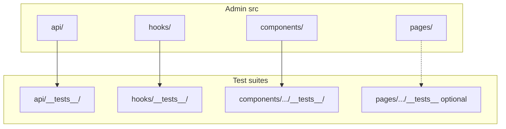

# Admin Test Suites Plan

## Context: How the rest of the ecosystem tests

| Project     | Runner | Env       | Placement                                        | Key mocks                                                        |
| ----------- | ------ | --------- | ------------------------------------------------ | ---------------------------------------------------------------- |
| **Backend** | Vitest | node      | `src/**/__tests__/*.test.ts`                     | Prisma in [backend/src/test/setup.ts](backend/src/test/setup.ts) |
| **Web**     | Vitest | jsdom     | `**/*.test.{ts,tsx}` (colocated or `__tests__/`) | —                                                                |
| **Mobile**  | Jest   | jsdom/RNE | root `src/` + `shared/`                          | API, AsyncStorage                                                |

Backend tests **services and middleware** with mocked Prisma; Web tests **utils and UI** (e.g. [web/lib/**tests**/utils.test.ts](web/lib/__tests__/utils.test.ts), [web/components/ui/**tests**/Button.test.tsx](web/components/ui/__tests__/Button.test.tsx)). Admin has no tests today.

---

## 1. Framework and config (align with Web)

- **Runner:** Vitest (same as Backend and Web; Admin already uses Vite 6).
- **Environment:** `jsdom` for component and hook tests (React DOM).
- **Assertions / DOM:** `@testing-library/react` + `@testing-library/jest-dom` (same as Web).
- **Config:** Dedicated Vitest config so test settings do not depend on Vite dev server. Reuse Admin’s existing resolve alias: `@shared` only ([admin/vite.config.ts](admin/vite.config.ts) has no `@/`).

**New files:**

- `**admin/vitest.config.ts`**  
  - `environment: 'jsdom'`, `globals: true`, `include: ['src/**/*.test.{ts,tsx}']`, `setupFiles: ['vitest-setup.ts']`.  
  - `resolve.alias`: `@shared` → `path.resolve(__dirname, '../shared')` (same as Vite so imports resolve in tests).
- `**admin/vitest-setup.ts`**  
  - `import '@testing-library/jest-dom/vitest';` (and any future global mocks, e.g. `react-hot-toast` if needed).

`**admin/package.json`:**

- **Scripts:** `"test": "vitest"`, `"test:ci": "vitest run"`.
- **DevDependencies:** `vitest`, `jsdom`, `@testing-library/react`, `@testing-library/jest-dom` (versions compatible with React 19; align with Web where possible).

No change to Vite app build or dev server.

---

## 2. Test layers and placement

Follow Backend/Web conventions: **colocated `__tests__`** next to the code under test so each layer stays discoverable and scoped.

| Layer          | Purpose                                                                        | Mock strategy                                     |
| -------------- | ------------------------------------------------------------------------------ | ------------------------------------------------- |
| **API**        | `request()` behavior; table/schema/scoring/matrixConfigs URL and body building | Mock `fetch` (global or in test); no real backend |
| **Hooks**      | State transitions, callbacks, and which API methods get called                 | Mock `../api` and optionally `react-hot-toast`    |
| **Components** | Rendered output and user interactions (controlled inputs, buttons)             | Minimal props; mock parents only if needed        |
| **Pages**      | Optional later: smoke or key flows                                             | Mock `api` and router                             |

---

## 3. What to test (priority order)

### 3.1 API layer (highest value, no UI)

- `**admin/src/api/__tests__/client.test.ts`**
  - `**request()`:** Success (200 + JSON body returns parsed data). Error (4xx/5xx: assert thrown Error message; non-JSON error body: assert fallback to status text). Assert `fetch` called with correct URL (`BASE + path`), `Content-Type: application/json`, and method/body when provided.
  - `**BASE`:** Export equals `'/api'` (trivial but documents contract).
- `**admin/src/api/__tests__/tables.test.ts`**
  - Use **mocked `request`** (e.g. `vi.mock('../client')`) so no real HTTP. Assert: `listTables()` calls `request('/tables')`; `getTable(key)` calls `request(\`/tables/${key})`;` addRow(key, row)`uses POST and`body: JSON.stringify(row)`;` deleteRow(key, id, { breakLinks: true })`includes`?breakLinks=true`;` reorder(key, ids)`POSTs`{ ids }`. Same style for` updateRow`,` putTable`,` syncTable`,` bulkUpdateMatrix` (build correct path and body).
- `**admin/src/api/__tests__/schema.test.ts`**
  - With `request` mocked: `getSchemas()` → `request('/schema')`; `getSchema(key)` → `request(\`/schema/${key})`;` validate(key, row)`→ POST to`/schema/${key}/validate`with body`row`;` getFKRefs(key, id)`→ path`/schema/meta/fk-refs/${key}/${id}`.
- `**admin/src/api/__tests__/scoring.test.ts`**
  - With `request` mocked: `computeScoring`, `traceScoring`, `evaluateConstraints`, `runLinter`, etc. — assert correct path and method and body shape.
- `**admin/src/api/__tests__/matrixConfigs.test.ts`** (if [admin/src/api/matrixConfigs.ts](admin/src/api/matrixConfigs.ts) has pure logic or clear request shapes)
  - Same idea: mock `request`, assert paths and payloads for main entry points (CRUD, validate, activate, etc.).

This gives **unit tests for all API entry points** without a backend and matches Backend’s “mock the data layer” approach.

### 3.2 Hooks (state and API usage)

- `**admin/src/hooks/__tests__/useWorkstationState.test.tsx`**
  - Render a small component that calls `useWorkstationState(motions, editingConfig, configDirty, onSaveConfig)`. Mock `../api` (and optionally `react-hot-toast`) so no real requests. Assert: initial `selectedMotionId` is null; after `setSelectedMotionId('m1')` (or equivalent), state updates; `saveBaseline` calls the expected API method; `dirtyDomains` / `clearAllDirty` behave as expected. Prefer testing observable behavior (state and calls) rather than implementation details.
- `**admin/src/hooks/__tests__/useScoringSimulation.test.tsx`** (if the hook has testable logic)
  - Same pattern: mock API and toast, render a wrapper that uses the hook, assert inputs → outputs and API invocations.

Hooks that only forward to API with no branching can be covered indirectly by API tests plus one “calls api when invoked” test.

### 3.3 Components (presentation and interaction)

- **FieldRenderers (simple first):**
  - `**admin/src/components/FieldRenderers/__tests__/StringField.test.tsx`**  
  Render with `value` and `onChange`; assert displayed value; fire change and assert `onChange` called with new string. Test `multiline` renders textarea.
  - `**admin/src/components/FieldRenderers/__tests__/NumberField.test.tsx`**  
  Same idea: value, onChange, and type/format if applicable.
  - `**admin/src/components/FieldRenderers/__tests__/BooleanField.test.tsx`**  
  Renders and toggling calls `onChange` with boolean.
- **FieldRenderers (more complex):**
  - **FKDropdown, FKMultiSelect, JsonEditor, etc.**  
  Test with mocked options/data: correct option list, selection calls `onChange`, and (where relevant) validation or error display. Add tests incrementally to avoid big, brittle setups.
- **Workstation components:**
  - `**admin/src/components/workstation/__tests__/DirtyBadge.test.tsx`** (if it’s presentational)  
  Render with dirty true/false; assert visibility or class.
  - **DeltaBranchCard, BaselineCard, SimulationPreview**  
  Render with minimal props; assert key content or callbacks when user interacts. Mock any shared types or API if needed.

Use **React Testing Library** only; avoid testing internal state. Prefer `getByRole`, `getByLabelText`, or `getByText` and `fireEvent`/`userEvent` for interactions.

### 3.4 Pages (optional, later)

- **Dashboard / TableEditor**  
Smoke test: render inside a router (e.g. `MemoryRouter`), mock `api.listTables` and `api.getSchemas` to return minimal data, assert no crash and that main sections or headings render. Defer until API and hooks are covered.

---

## 4. Mocking standards

- `**fetch`:** In `client.test.ts`, use `vi.stubGlobal('fetch', vi.fn())` and control response (ok, status, json()). Do not use real backend.
- `**api` (unified object):** In hook tests, `vi.mock('../../api')` (or the correct relative path from the test file) and provide `api.listTables`, `api.getTable`, etc., as `vi.fn()` returning resolved promises. Assert call counts and arguments.
- `**react-hot-toast`:** If hook tests fail due to toast calls, add in setup: `vi.mock('react-hot-toast', () => ({ default: { success: vi.fn(), error: vi.fn() } }));` (or equivalent).
- **Router:** For components that use `useNavigate` or `useParams`, wrap with `<MemoryRouter>` or a small test wrapper that provides routes/params.
- `**@shared`:** Use real shared code in tests (types, utils); mock only when necessary for speed or isolation (e.g. heavy scoring).

---

## 5. File and naming conventions

- **Pattern:** `src/**/*.test.{ts,tsx}` (Vitest default).
- **Placement:** Prefer `__tests`__ next to the module (e.g. `api/__tests__/client.test.ts`, `hooks/__tests__/useWorkstationState.test.tsx`, `components/FieldRenderers/__tests__/StringField.test.tsx`). This mirrors Backend and Web.
- **Naming:** `*.test.ts` for logic-only, `*.test.tsx` when the test file imports JSX.

---

## 6. CI and documentation

- **Run Admin tests:** From repo root, `cd admin && npm run test:ci`. Add this step to any existing “run all tests” script (after Mobile, Backend, Web) so Admin is part of the same pipeline.
- **Docs:** Update [docs/testing.md](docs/testing.md): in the summary table, set Admin row to “Vitest + React Testing Library”, config `admin/vitest.config.ts`, scripts `cd admin && npm run test:ci`, and approximate test count once the first suites are in. Add a short “Admin” subsection under “What is tested” (API client and modules, hooks, FieldRenderers/workstation components) and under “Adding tests” (add `*.test.ts`/`*.test.tsx` under `admin/src/`, use `vi.mock` for api/fetch).

---

## 7. Implementation order (recommended)

1. Add Vitest, jsdom, RTL, jest-dom to Admin; add `vitest.config.ts` and `vitest-setup.ts`; add `test` / `test:ci` scripts.
2. Implement `api/__tests__/client.test.ts` (mock `fetch`).
3. Implement `api/__tests__/tables.test.ts`, `schema.test.ts`, `scoring.test.ts` (mock `request`).
4. Implement `api/__tests__/matrixConfigs.test.ts` if the module has clear request shapes.
5. Implement `hooks/__tests__/useWorkstationState.test.tsx` (mock `api` and optionally toast).
6. Implement `hooks/__tests__/useScoringSimulation.test.tsx` if applicable.
7. Implement `FieldRenderers/__tests__/StringField.test.tsx`, `NumberField.test.tsx`, `BooleanField.test.tsx`.
8. Add a few more FieldRenderer and workstation component tests as needed.
9. Run `npm run test:ci` from `admin/`; add Admin to CI and update [docs/testing.md](docs/testing.md).

This order delivers fast feedback (API and hooks first), then UI coverage, and keeps the plan consistent with Backend and Web patterns while acting as both senior QA (coverage, mocks, no flake) and senior full-stack (structure, CI, docs).