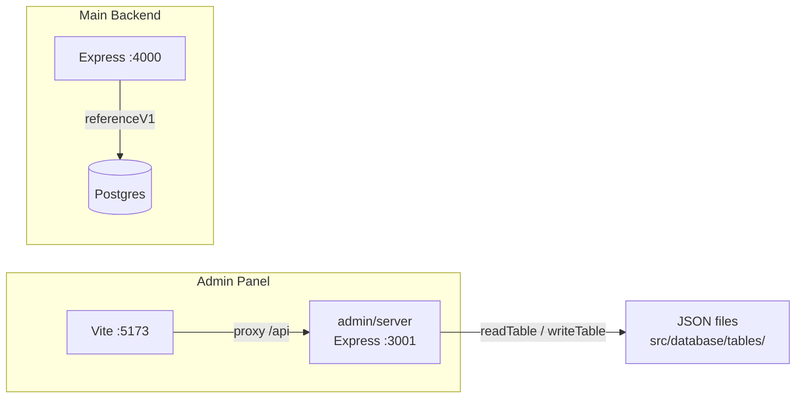
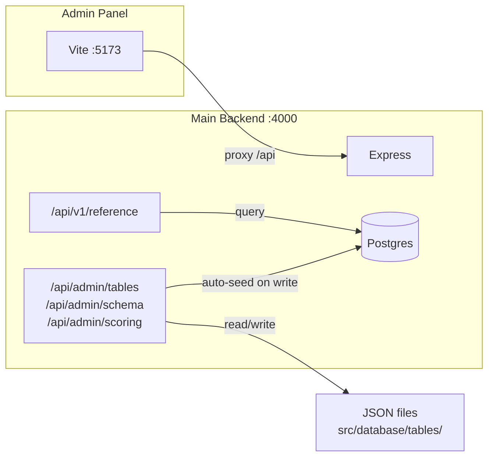

# Admin Panel Migration to Main Backend

## Current State




The admin panel runs its **own** Express server on :3001 with three route groups:

- `/api/tables` -- CRUD on JSON files (list, get, put, add/update/delete row, reorder, bulk-matrix, sync) in [admin/server/routes/tables.ts](admin/server/routes/tables.ts)
- `/api/schema` -- Schema registry, FK graph, validation, FK-ref lookups in [admin/server/routes/schema.ts](admin/server/routes/schema.ts)
- `/api/scoring` -- Shared scoring engine endpoints in [admin/server/routes/scoring.ts](admin/server/routes/scoring.ts)

All of these operate on JSON files via [admin/server/fileOps.ts](admin/server/fileOps.ts) and [admin/server/tableRegistry.ts](admin/server/tableRegistry.ts).

## Target State




Single server. Admin CRUD routes live under `/api/admin/*` on the backend. Every write triggers an incremental re-seed to keep Postgres in sync.

## Strategy: Move Routes, Not Rewrite Them

The admin routes are well-tested and the admin UI depends on their exact response shapes. The safest path is to **move the route files and their dependencies** into the backend and mount them under `/api/admin/`*, then re-point the Vite proxy.

## Key Changes

### 1. Copy admin server modules into backend

Move these files into `backend/src/admin/`:

- [admin/server/routes/tables.ts](admin/server/routes/tables.ts) -- table CRUD
- [admin/server/routes/schema.ts](admin/server/routes/schema.ts) -- schema/FK routes
- [admin/server/routes/scoring.ts](admin/server/routes/scoring.ts) -- scoring engine
- [admin/server/fileOps.ts](admin/server/fileOps.ts) -- JSON read/write
- [admin/server/tableRegistry.ts](admin/server/tableRegistry.ts) -- schema registry
- [admin/server/tableDescriptions.ts](admin/server/tableDescriptions.ts) -- table descriptions

Adapt imports to use `backend/src/config` for `TABLES_DIR` (already configured as `config.tablesDir`).

### 2. Mount in backend under `/api/admin`

In [backend/src/index.ts](backend/src/index.ts):

```typescript
import adminTablesRouter from "./admin/routes/tables";
import adminSchemaRouter from "./admin/routes/schema";
import adminScoringRouter from "./admin/routes/scoring";

app.use("/api/admin/tables", adminTablesRouter);
app.use("/api/admin/schema", adminSchemaRouter);
app.use("/api/admin/scoring", adminScoringRouter);
```

### 3. Auto-seed on write (keep Postgres in sync)

After every JSON write (add/update/delete row, reorder, bulk-matrix), trigger an incremental seed of the affected table. Add a `syncTableToPostgres(tableKey)` helper that:

- Reads the updated JSON file
- Runs the upsert + deprecation for that single table inside a transaction
- Keeps the same upsert-only/guarded-deprecation logic from the seed pipeline

This is placed in a new `backend/src/seed/incrementalSync.ts` and called from the admin table routes after each successful write.

### 4. Re-point admin Vite proxy

In [admin/vite.config.ts](admin/vite.config.ts), change the proxy target:

```typescript
proxy: {
  '/api': {
    target: 'http://localhost:4000',  // was 3001
    changeOrigin: true,
    rewrite: (path) => path.replace(/^\/api/, '/api/admin'),
  },
},
```

This rewrites `/api/tables` to `/api/admin/tables` so the admin UI code (`api.ts`) requires zero changes.

### 5. Update admin dev script

In [admin/package.json](admin/package.json), remove the `dev:server` script and simplify `dev` to only run Vite (the backend must be started separately):

```json
{
  "scripts": {
    "dev": "vite",
    "build": "vite build"
  }
}
```

### 6. Keep admin server as fallback (optional)

The old `admin/server/` directory can remain for a transitional period. No files are deleted -- only new files are created in the backend, and the vite config and package.json are updated.

## Files Created / Modified

**New files in backend:**

- `backend/src/admin/fileOps.ts` -- adapted from admin/server/fileOps.ts, uses `config.tablesDir`
- `backend/src/admin/tableRegistry.ts` -- copied from admin/server/tableRegistry.ts
- `backend/src/admin/tableDescriptions.ts` -- copied from admin/server/tableDescriptions.ts
- `backend/src/admin/routes/tables.ts` -- adapted from admin routes, adds post-write sync
- `backend/src/admin/routes/schema.ts` -- adapted from admin routes
- `backend/src/admin/routes/scoring.ts` -- adapted from admin routes
- `backend/src/seed/incrementalSync.ts` -- single-table upsert to keep Postgres in sync

**Modified files:**

- `backend/src/index.ts` -- mount `/api/admin/`* routes
- `admin/vite.config.ts` -- proxy to :4000 with path rewrite
- `admin/package.json` -- remove dev:server, simplify dev script

**No changes to:**

- `admin/src/api.ts` -- unchanged (path rewrite handles the `/api` prefix)
- Any admin UI components
- The existing `/api/reference` or `/api/v1/reference` routes

