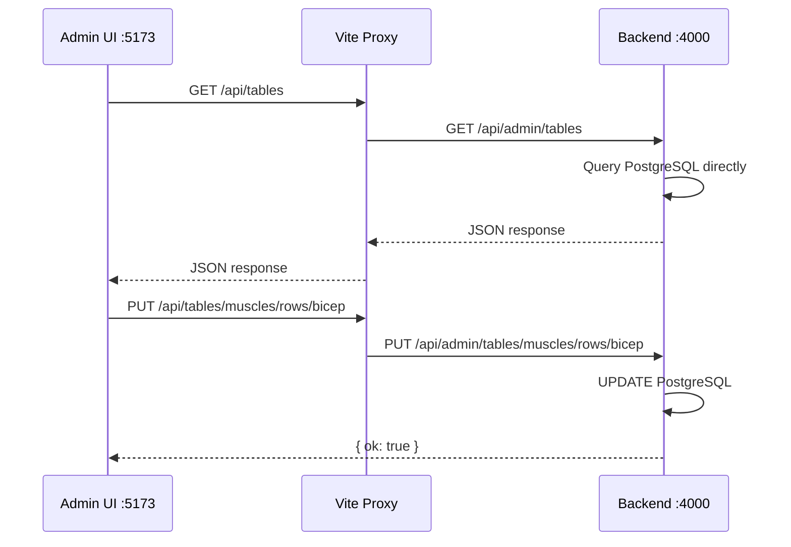
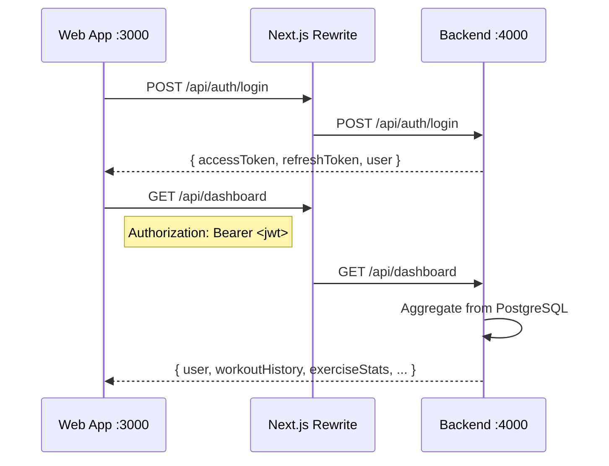
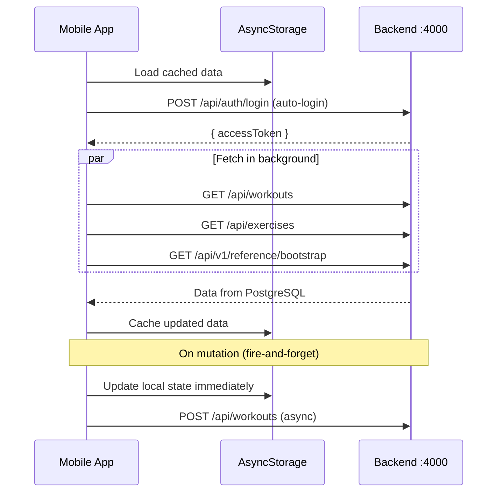

# System Architecture and Startup Guide

## Overall Architecture

```mermaid
flowchart TB
  subgraph infra [Infrastructure]
    Docker["Docker Desktop"]
    PG[("PostgreSQL 16\n:5432\ncontainer: onlyfit-db")]
    Docker --> PG
  end

  subgraph backend [Backend - Express API :4000]
    Auth["/api/auth\nlogin, register, refresh"]
    UserRoutes["/api/users\nprofile, settings"]
    WorkoutRoutes["/api/workouts\nCRUD"]
    ExerciseRoutes["/api/exercises\nCRUD"]
    MeasurementRoutes["/api/measurements\nCRUD"]
    GoalRoutes["/api/goals\nCRUD"]
    PRRoutes["/api/personal-records\nGET, POST"]
    DashboardRoute["/api/dashboard\naggregate endpoint"]
    RefV1["/api/v1/reference\nbootstrap, version, table"]
    AdminRoutes["/api/admin\ntables, schema, scoring"]
    HealthRoute["/api/health"]
  end

  subgraph admin [Admin Panel - Vite :5173]
    AdminUI["React + TailwindCSS\nTable Editor, Schema Viewer,\nScoring Engine"]
  end

  subgraph web [Web App - Next.js :3000]
    WebMarketing["Marketing Landing Page"]
    WebDashboard["Dashboard\nworkouts, analytics, goals,\nmeasurements, history"]
    WebAuth["Login via JWT"]
  end

  subgraph mobile [Mobile App - Expo :8081]
    MobileUI["React Native\nworkout tracker, profile,\nlibrary, exercise composer"]
    MobileAPI["src/api/*\nfetch wrapper + auto-login"]
    AsyncStore["AsyncStorage\noffline cache"]
    RefProvider["RemotePostgresProvider\nreference data cache"]
  end

  PG <--> backend
  AdminUI -->|"proxy /api -> /api/admin"| AdminRoutes
  WebAuth -->|"POST /api/auth/login"| Auth
  WebDashboard -->|"GET /api/dashboard"| DashboardRoute
  MobileAPI -->|"auto-login + CRUD"| Auth
  MobileAPI --> WorkoutRoutes
  MobileAPI --> ExerciseRoutes
  MobileAPI --> MeasurementRoutes
  MobileAPI --> GoalRoutes
  MobileAPI --> UserRoutes
  RefProvider -->|"GET /api/v1/reference/*"| RefV1
  MobileAPI -.->|"cache"| AsyncStore
  RefProvider -.->|"cache"| AsyncStore
```




---

## How Each App Communicates with the Backend

### Admin Panel (:5173 -> :4000)




- **Proxy**: Vite rewrites `/api/`* to `http://localhost:4000/api/admin/`*
- **Auth**: None (admin routes are unprotected)
- **Data flow**: Admin UI -> Vite proxy -> Backend -> PostgreSQL (direct SQL via `pgCrud.ts`)
- **Config**: [admin/vite.config.ts](admin/vite.config.ts)

### Web App (:3000 -> :4000)




- **Proxy**: Next.js rewrites `/api/:path`* to `http://localhost:4000/api/:path`*
- **Auth**: JWT Bearer token (stored in `localStorage`)
- **Login**: `POST /api/auth/login` with `alex@example.com` / `password123`
- **Data**: Single `/api/dashboard` aggregate endpoint returns all dashboard data
- **Config**: [web/next.config.js](web/next.config.js), [web/lib/api.ts](web/lib/api.ts)

### Mobile App (:8081 -> :4000)




- **Direct HTTP**: `fetch()` to `http://localhost:4000/api/`* (no proxy)
- **Auth**: Auto-login with hardcoded credentials; JWT stored in AsyncStorage
- **Offline-first**: Loads from AsyncStorage first, then fetches from backend; mutations are optimistic (local-first, backend sync is fire-and-forget)
- **Reference data**: Fetched via `/api/v1/reference/bootstrap`, cached in AsyncStorage
- **Feature flags**: Controlled by `USE_BACKEND_REFERENCE` and `USE_BACKEND_USERDATA` in [src/config/featureFlags.ts](src/config/featureFlags.ts)
- **Config**: [src/api/client.ts](src/api/client.ts)

---

## Port Summary

- **:5432** -- PostgreSQL (Docker container `onlyfit-db`)
- **:4000** -- Backend Express API
- **:5173** -- Admin Panel (Vite dev server)
- **:3000** -- Web App (Next.js dev server)
- **:8081** -- Mobile App (Expo Metro bundler)

---

## Startup Commands (in order)

### Step 1: Start PostgreSQL (Docker)

```bash
cd c:\Home\Basuru\Solto\Mobile
docker compose up -d postgres
```

Wait for it to be healthy: `docker ps` should show `(healthy)`.

### Step 2: Run database migrations and seed (first time only)

```bash
cd backend
npx prisma db push
npx prisma db seed
npm run drizzle:push
npm run ref:seed
```

### Step 3: Start the Backend

```bash
cd backend
npm run dev
```

Runs on **[http://localhost:4000](http://localhost:4000)**. Verify: `http://localhost:4000/api/health`

### Step 4: Start the Admin Panel

```bash
cd admin
npm run dev
```

Runs on **[http://localhost:5173](http://localhost:5173)**. Proxies `/api` to backend `:4000`.

### Step 5: Start the Web App

```bash
cd web
npm run dev
```

Runs on **[http://localhost:3000](http://localhost:3000)**. Login: `alex@example.com` / `password123`.

### Step 6: Start the Mobile App

```bash
cd c:\Home\Basuru\Solto\Mobile
npx expo start
```

Metro bundler on **[http://localhost:8081](http://localhost:8081)**. Scan QR with Expo Go or press `a` for Android emulator.

---

## Quick Start (all at once)

Open **5 terminals** and run one command in each:


| Terminal | Directory  | Command                         | Port |
| -------- | ---------- | ------------------------------- | ---- |
| 1        | repo root  | `docker compose up -d postgres` | 5432 |
| 2        | `backend/` | `npm run dev`                   | 4000 |
| 3        | `admin/`   | `npm run dev`                   | 5173 |
| 4        | `web/`     | `npm run dev`                   | 3000 |
| 5        | repo root  | `npx expo start`                | 8081 |


**Note:** Terminal 1 (Docker) only needs to run once; the container persists. The backend (terminal 2) must be running before the other apps can function.