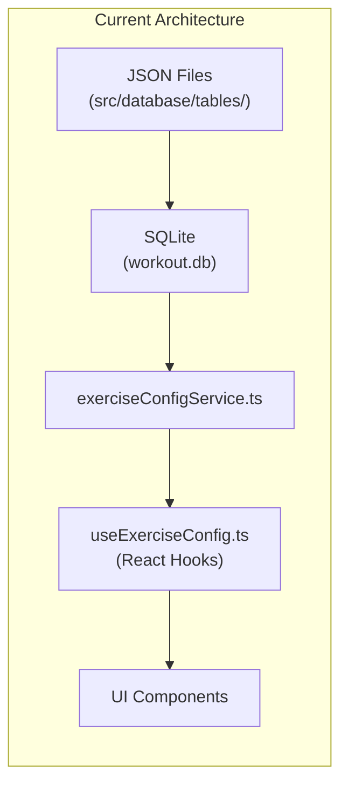
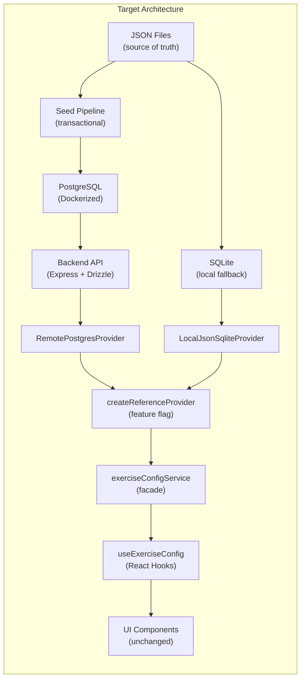
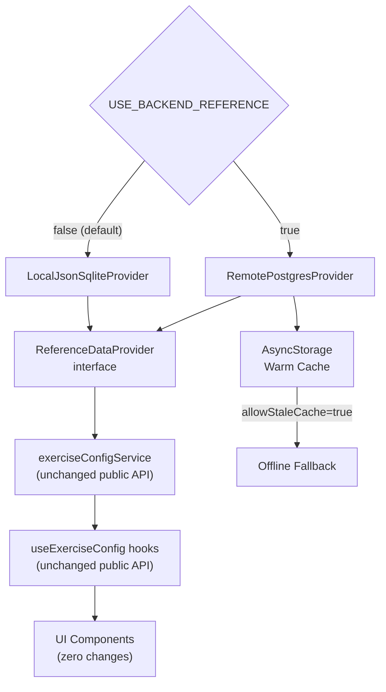
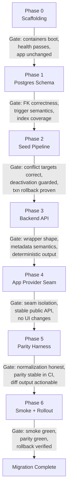
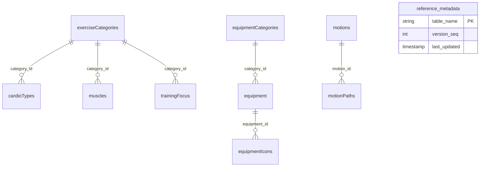
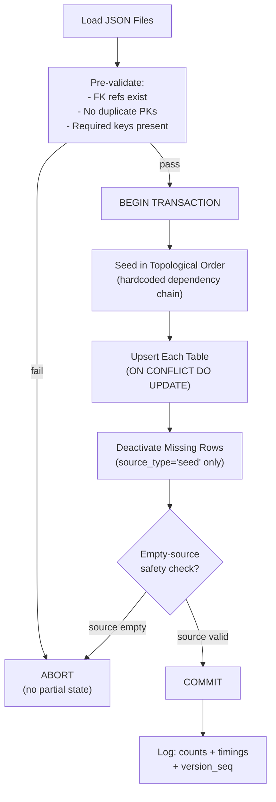
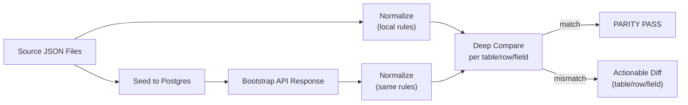
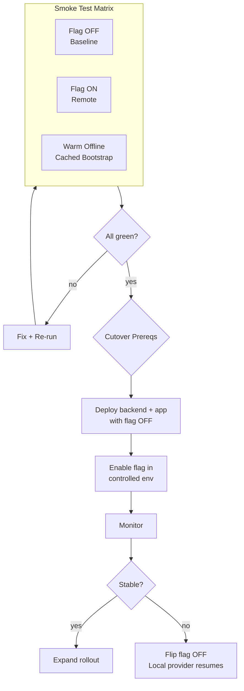

# Reference Data Backend Migration -- Execution Plan

---

## 1. Mission and Scope

Migrate **reference/config data** from the app's current local JSON-to-SQLite pattern into a **PostgreSQL backend**, with a **Dockerized local runtime**, **feature-flagged app integration**, and **provable data parity before cutover**.

### In Scope

- Postgres schema, constraints, indexes, trigger-based metadata versioning for all 20+ reference tables
- Transactional, idempotent JSON-to-Postgres seed/import pipeline
- Backend API contracts (bootstrap / version / granular)
- App provider seam (`ReferenceDataProvider`) + local/remote provider integration
- Cache/version invalidation behavior
- Parity tests, smoke tests, rollout/rollback controls

### Out of Scope

- User/workout/session backend migration
- UI redesign unrelated to data-source compatibility
- Taxonomy semantic redesign (unless correctness bug found)
- New features unrelated to the migration

---

## 2. Current vs Target Architecture







---

## 3. Provider Seam Architecture

The core integration pattern is a **provider seam** that isolates the transport layer behind a stable interface. The feature flag `USE_BACKEND_REFERENCE` controls which provider is active.




**Key files involved:**

- Current service: [src/database/exerciseConfigService.ts](src/database/exerciseConfigService.ts)
- Current hooks: [src/database/useExerciseConfig.ts](src/database/useExerciseConfig.ts)
- Current DB init: [src/database/initDatabase.ts](src/database/initDatabase.ts)
- Existing backend routes: [backend/src/routes/reference.ts](backend/src/routes/reference.ts)
- Existing backend repo interface: [backend/src/reference/repository.ts](backend/src/reference/repository.ts)

---

## 4. Workstream Ownership

```mermaid
flowchart LR
  subgraph wsA ["Workstream A: Backend Data Layer + API"]
    A1["Schema + Migrations"]
    A2["Triggers + Metadata"]
    A3["Seed Pipeline"]
    A4["API Endpoints"]
    A5["Docker Runtime"]
  end
  
  subgraph wsB ["Workstream B: App Provider Integration"]
    B1["Provider Interface"]
    B2["Local Provider"]
    B3["Remote Provider"]
    B4["Service Facade"]
    B5["Feature Flag Wiring"]
  end
  
  subgraph wsC ["Workstream C: Validation + Release"]
    C1["Parity Harness"]
    C2["Normalization Contract"]
    C3["Smoke Tests"]
    C4["Rollout Playbook"]
  end
  
  wsA -->|"feeds"| wsB
  wsA -->|"feeds"| wsC
  wsB -->|"validated by"| wsC
```




- **Workstream A** -- Primary: Grok, Reviewer: Gemini
- **Workstream B** -- Primary: Grok, Reviewer: Chat
- **Workstream C** -- Primary: Chat/Grok (shared), Reviewer: Gemini

---

## 5. Phase Execution Flow

Seven phases (0--6) with explicit gate checks between each phase. No phase advances until its gates pass.




---

## 6. Phase Details

### Phase 0 -- Scaffolding and Delivery Rails

**Goal:** Set up execution rails with no behavior changes.

**Deliverables:**

- Root `docker-compose.yml` (Postgres + backend) -- existing: [backend/docker-compose.yml](backend/docker-compose.yml)
- Backend env template + startup scripts
- App flag plumbing (`USE_BACKEND_REFERENCE=false`)
- Backend health endpoint (existing: `/api/health`)
- CI placeholder jobs

**Gates:** Containers boot cleanly; health passes; app behavior unchanged with flag off.

---

### Phase 1 -- Postgres Schema, Constraints, Indexes, Metadata Triggers

**Goal:** Establish production-safe relational foundation and reference versioning.

**Deliverables:**

- All 20+ reference tables with **natural keys as PKs**
- Foreign keys: `ON UPDATE CASCADE`, `ON DELETE RESTRICT`
- Every table has `is_active BOOLEAN DEFAULT TRUE` and `source_type` constrained to `'seed' | 'admin'`
- FK indexes + active-row read optimization indexes
- `reference_metadata` table with monotonic `version_seq` + `last_updated`
- **Statement-level** trigger function (`AFTER ... FOR EACH STATEMENT`)
- Drizzle migrations committed

**Schema design decisions (locked):**

- Natural keys as PKs (Logan decision)
- Statement-level triggers to prevent update storms during bulk seed operations
- Active-row indexes to optimize bootstrap reads




**Gate (Gemini hard gate):** FK correctness, dependency graph integrity, `source_type` guardrails, no missing FK indexes, trigger semantics correct under bulk transactional seed, active-row optimization present.

---

### Phase 2 -- Seed/Import Pipeline

**Goal:** Safely import JSON reference truth into Postgres.




**Non-negotiables:**

- Abort on malformed FK refs / duplicate PKs / missing required keys
- Never delete rows (upsert-only, deactivation for missing seed-managed rows)
- Roll back entire seed on any failure
- Deactivation only for rows where `source_type='seed'`
- Empty-source safety check prevents mass deactivation from bad input

**Gate (Gemini hard gate):** Conflict targets match natural PKs; deactivation guardrail correct; transaction rollback integrity proven; no ordering gaps causing FK failures.

---

### Phase 3 -- Backend API Contracts

**Goal:** Deliver stable, versioned endpoints for app and tooling.

**Endpoints:**

- `GET /health` -- liveness probe
- `GET /api/v1/reference/version` -- returns current `referenceVersion` token
- `GET /api/v1/reference/bootstrap` -- full active-only dataset
- `GET /api/v1/reference/:table` -- granular per-table access

**Bootstrap response wrapper:**

```json
{
  "schemaVersion": "1.0",
  "referenceVersion": "seq:42",
  "generatedAt": "2026-02-24T...",
  "tables": {
    "exerciseCategories": [...],
    "muscles": [...],
    "equipment": [...]
  }
}
```

**Gate (Chat hard gate):** Wrapper shape correctness; metadata semantics not conflated; deterministic output shape/order; no transport-specific leakage into app domain expectations.

---

### Phase 4 -- App Provider Seam and Remote Integration

**Goal:** Integrate backend source without changing UI contracts.

**Deliverables:**

- `ReferenceDataProvider` interface
- `LocalJsonSqliteProvider` (wraps current [initDatabase.ts](src/database/initDatabase.ts) + SQLite path)
- `RemotePostgresProvider` (calls bootstrap API + AsyncStorage warm cache)
- `createReferenceProvider(config)` factory driven by feature flag
- `exerciseConfigService` facade refactor (delegates to active provider)
- `getBootstrap(options?: { allowStaleCache?: boolean })` for offline support

**Behavioral requirements:**

- Flag OFF = identical current behavior (local JSON to SQLite)
- Flag ON = equivalent data consumed via remote provider
- First launch in remote mode may require network
- Subsequent launches can use cached bootstrap offline

**Gate (Chat hard gate):** Provider seam cleanly isolates transport; public service/hook API stable; no UI file changes required beyond dependency wiring.

---

### Phase 5 -- Parity Harness + Normalization Contract

**Goal:** Prove backend data equivalence before cutover.




**Normalization contract (must be codified):**

- Deterministic sorting (PK + defined rules)
- String trimming
- Empty-string / null / missing normalization policy
- Boolean/number type preservation
- Array normalization rules

**Gate (Gemini + Chat):** Normalization does not hide true mismatches; parity stable and non-flaky in CI; diff output supports fast debugging.

---

### Phase 6 -- Smoke Validation, Rollout, Rollback

**Goal:** Validate real workflows and cut over safely.

**Required smoke paths (locked):**

- Exercise library browse/filter
- Exercise edit/create flow
- Live workout exercise selection
- Scoring-dependent reference lookup screen(s)




**Cutover prerequisites:** Migrations applied; seed successful; parity green; smoke tests green; backend healthy; version endpoint functioning; local provider rollback path verified.

**Rollback (locked):** Flip flag OFF; local provider resumes as source of truth; keep local provider for one full release post-cutover.

---

## 7. Engineering Guardrails (All Locked)

- **Seed safety:** Empty-source checks per table; deactivation only for `source_type='seed'`; full transaction rollback on failure
- **Trigger/versioning:** Statement-level triggers only; single shared trigger function; monotonic `version_seq`; safe under bulk mutations
- **API determinism:** Stable sort order; active-only filtering default for bootstrap; explicit wrapper metadata fields
- **App integration:** No direct API calls from UI components; all reference reads go through service/provider seam; feature flag defaults OFF until all gates pass

---

## 8. Risk Register

- **Risk A -- Natural-key rename side effects:** Mitigated by `ON UPDATE CASCADE`, review discipline, future admin tooling controls
- **Risk B -- Seed deactivation overreach:** Mitigated by `source_type` guardrail, empty-source checks, transaction rollback
- **Risk C -- Cache/version drift:** Mitigated by metadata trigger + `version_seq`, explicit `allowStaleCache`, version endpoint
- **Risk D -- UI regression despite data parity:** Mitigated by mandatory smoke paths in flag OFF/ON modes
- **Risk E -- Trigger overhead during bulk seed:** Mitigated by statement-level triggers (locked refinement)
- **Risk F -- Slow bootstrap reads from deprecated rows:** Mitigated by active-row read optimization indexes (locked refinement)
- **Risk G -- Process drift / manual DB changes:** Mitigated by migration discipline, parity harness, release gates

---

## 9. Definition of Done

This migration phase is complete **only** when:

1. All in-scope reference tables exist in Postgres with locked constraints/indexes
2. `reference_metadata` + statement-level trigger versioning works correctly
3. Seed pipeline is transactional, idempotent, upsert-only, and deprecates seed-managed rows safely
4. Bootstrap/version/granular endpoints implement the locked wrapper and semantics
5. App provider seam and local/remote providers are integrated with no public contract breakage
6. Feature flag defaults OFF and cleanly controls source selection
7. Parity harness passes in CI under the documented normalization contract
8. Required UI smoke paths pass with flag OFF and ON (and warm offline where applicable)
9. Rollout and rollback playbooks are documented and executable
10. Local provider path remains available for at least one release after cutover

