# Reference Datatable Migration -- Official Execution Plan

---

## 1. Current Architecture

The app currently uses a chain of JSON files, SQLite seeding, and hooks. There is no runtime sync -- admin edits require an app restart.

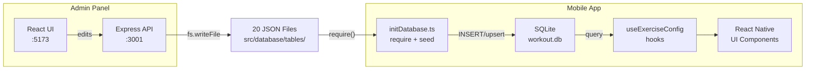

**Key files in the current system:**

- [src/database/initDatabase.ts](src/database/initDatabase.ts) -- Seeds 20 tables from JSON into SQLite (1570 lines, v24 migration system)
- [src/database/exerciseConfigService.ts](src/database/exerciseConfigService.ts) -- 30+ typed query functions against SQLite
- [src/database/useExerciseConfig.ts](src/database/useExerciseConfig.ts) -- React hooks with module-level caching
- [admin/server/tableRegistry.ts](admin/server/tableRegistry.ts) -- Central schema registry defining all 20 tables
- [backend/src/reference/repository.ts](backend/src/reference/repository.ts) -- Existing `ReferenceDataRepository` interface
- [backend/src/reference/jsonRepository.ts](backend/src/reference/jsonRepository.ts) -- JSON file implementation of the repository

---

## 2. Target Architecture

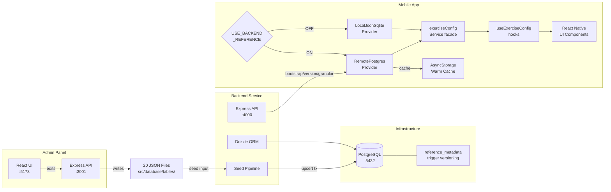

---

## 3. The 20 Reference Tables and Their Dependency Graph

The seed must respect FK ordering. This is the locked topological seed order:

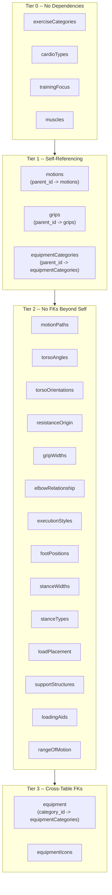

---

## 4. Phase-by-Phase Execution

### Phase 0 -- Scaffolding and Delivery Rails

**Goal:** Set up execution rails with zero behavior changes.

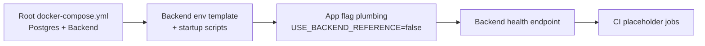

**Deliverables:**

- Root-level `docker-compose.yml` with Postgres 16 + backend service
- `.env.example` with `USE_BACKEND_REFERENCE=false`
- Feature flag module in mobile app (`src/config/featureFlags.ts`)
- `GET /health` endpoint on backend
- CI placeholder for parity tests

**Key files to create/modify:**

- `docker-compose.yml` (repo root -- new)
- `src/config/featureFlags.ts` (new)
- [backend/src/index.ts](backend/src/index.ts) (health endpoint already exists)

**Gates:** Containers boot cleanly; health endpoint returns 200; app behavior unchanged with flag OFF.

---

### Phase 1 -- PostgreSQL Schema, Constraints, Indexes, Metadata Triggers

**Goal:** Establish the relational foundation and reference versioning system.

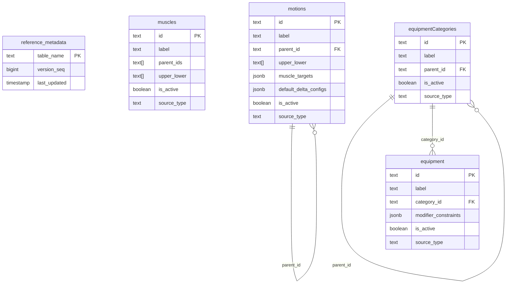

**Deliverables:**

- Drizzle schema for all 20 reference tables with natural PKs (`text` primary keys)
- FKs with `ON UPDATE CASCADE`, `ON DELETE RESTRICT`
- All tables include `is_active BOOLEAN DEFAULT TRUE` and `source_type` constrained to `'seed' | 'admin'`
- FK indexes + active-row read optimization indexes
- `reference_metadata` table with `version_seq` (monotonic) and `last_updated`
- Single shared trigger function + **statement-level** `AFTER INSERT OR UPDATE OR DELETE FOR EACH STATEMENT` triggers on all 20 tables
- Drizzle migrations committed

**Key files to create:**

- `backend/src/drizzle/schema/referenceMetadata.ts` (new)
- `backend/src/drizzle/schema/muscles.ts` (new, one per table)
- `backend/src/drizzle/migrations/` (generated)

**Review gates:** FK graph integrity; `source_type` guardrail everywhere; no missing FK indexes; trigger semantics correct under bulk seed.

---

### Phase 2 -- Seed/Import Pipeline

**Goal:** Safely import JSON reference truth into Postgres, transactionally and idempotently.

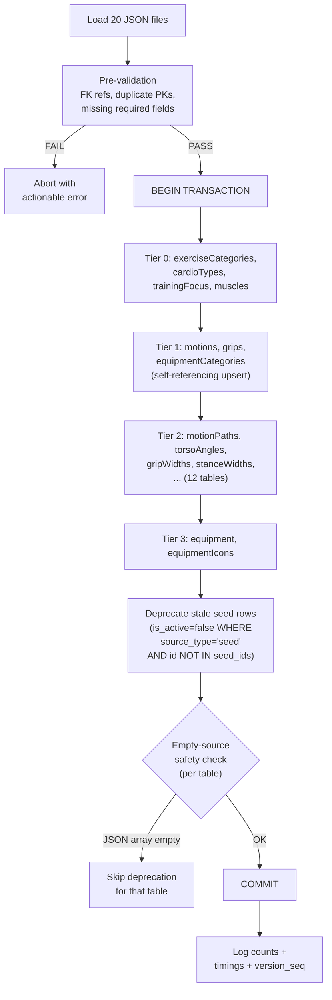

**Non-negotiables:**

- Upsert-only (`ON CONFLICT (id) DO UPDATE`)
- Never delete rows -- only deprecate (`is_active=false`)
- Deactivation guarded: only for `source_type='seed'` rows
- Empty-source safety: if a JSON file is empty/missing, skip deprecation for that table
- Full transaction rollback on any failure

**Key file to create:**

- `backend/src/seed/seedPipeline.ts` (new)
- `backend/src/seed/topologicalOrder.ts` (new)
- `backend/src/seed/validators.ts` (new)

---

### Phase 3 -- Backend API Contracts

**Goal:** Deliver stable, versioned endpoints for app and tooling consumption.

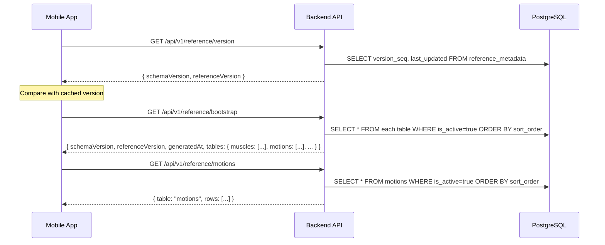

**Endpoints:**

- `GET /health` -- already exists
- `GET /api/v1/reference/version` -- returns `{ schemaVersion, referenceVersion }`
- `GET /api/v1/reference/bootstrap` -- full active-only snapshot of all 20 tables with wrapper metadata
- `GET /api/v1/reference/:table` -- single table, active-only, deterministic sort

**Key files to create/modify:**

- `backend/src/routes/referenceV1.ts` (new)
- `backend/src/services/referenceService.ts` (new)

---

### Phase 4 -- App Provider Seam and Remote Integration

**Goal:** Integrate the backend source without changing any UI contracts.

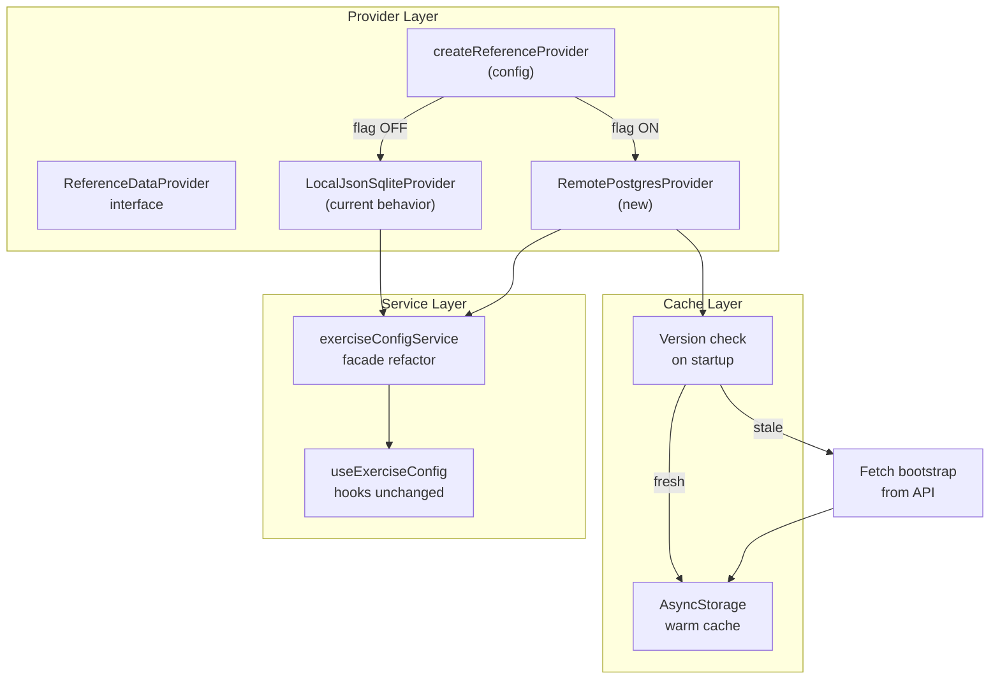

**Provider interface (new `src/database/providers/types.ts`):**

```typescript
interface ReferenceDataProvider {
  getBootstrap(options?: { allowStaleCache?: boolean }): Promise<BootstrapData>;
  getVersion(): Promise<{ schemaVersion: string; referenceVersion: string }>;
  getTable(key: string): Promise<unknown[]>;
}
```

**Key files to create:**

- `src/database/providers/types.ts` (new)
- `src/database/providers/localProvider.ts` (wraps current behavior)
- `src/database/providers/remoteProvider.ts` (new -- API + AsyncStorage cache)
- `src/database/providers/factory.ts` (new)
- Refactor [src/database/exerciseConfigService.ts](src/database/exerciseConfigService.ts) to consume provider

**Behavioral requirements:**

- Flag OFF = identical to current behavior (zero regression risk)
- Flag ON = data fetched via remote provider, cached in AsyncStorage
- First launch in remote mode requires network
- Subsequent launches can use warm cache offline (per `allowStaleCache` policy)

---

### Phase 5 -- Parity Harness and Normalization Contract

**Goal:** Prove the PostgreSQL pipeline produces identical data to the JSON source.

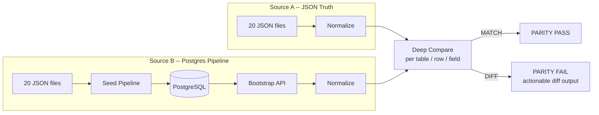

**Normalization contract (codified rules):**

- Deterministic sort by PK + `sort_order`
- String trimming
- Empty string / null / missing field normalization
- Boolean and number type preservation
- Array sort normalization (where order is not semantic)

**Key files to create:**

- `backend/src/parity/normalize.ts` (new)
- `backend/src/parity/compare.ts` (new)
- `backend/src/parity/parityHarness.ts` (new -- orchestrator)

---

### Phase 6 -- Smoke Validation, Cutover, and Rollback

**Goal:** Validate real workflows and cut over safely.

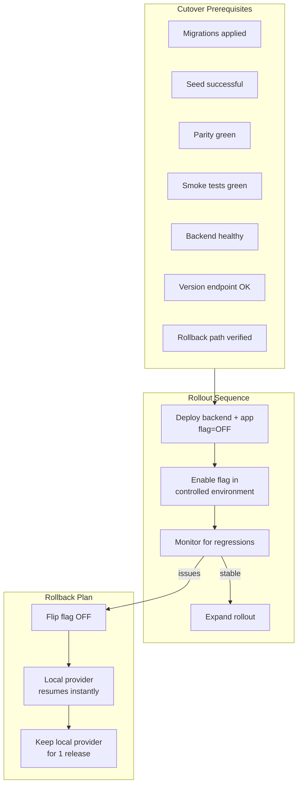

**Required smoke paths:**

- Exercise library browse/filter
- Exercise edit/create flow
- Live workout exercise selection
- Scoring-dependent reference lookup screens

**Test modes:** Flag OFF baseline, Flag ON remote, Warm offline (cached bootstrap)

---

## 5. Engineering Guardrails Summary

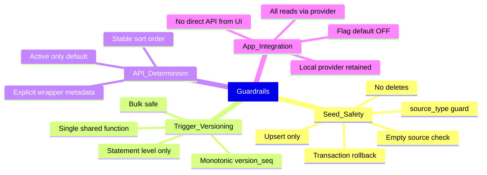

---

## 6. Risk Register

- **Risk A -- Natural-key rename side effects:** Mitigated by `ON UPDATE CASCADE` and review discipline
- **Risk B -- Seed deactivation overreach:** Mitigated by `source_type` guardrail + empty-source checks + tx rollback
- **Risk C -- Cache/version drift:** Mitigated by metadata trigger + `version_seq` + explicit `allowStaleCache`
- **Risk D -- UI regression despite data parity:** Mitigated by mandatory smoke paths in flag OFF/ON modes
- **Risk E -- Trigger overhead during bulk seed:** Mitigated by statement-level triggers (not row-level)
- **Risk F -- Slow bootstrap reads:** Mitigated by active-row read optimization indexes
- **Risk G -- Process drift:** Mitigated by migration discipline + parity harness + release gates

---

## 7. Definition of Done

1. All 20 reference tables exist in PostgreSQL with locked constraints/indexes
2. `reference_metadata` + statement-level trigger versioning works correctly
3. Seed pipeline is transactional, idempotent, upsert-only, with guarded deprecation
4. Bootstrap/version/granular endpoints implement the locked wrapper semantics
5. App provider seam and local/remote providers integrated with no public contract breakage
6. Feature flag defaults OFF and cleanly controls source selection
7. Parity harness passes in CI under the normalization contract
8. UI smoke paths pass with flag OFF and ON (and warm offline)
9. Rollout and rollback playbooks are documented and executable
10. Local provider retained for at least one full release after cutover
