# Exercise Config System Finalization Plan

**Core Principle:** Every user-logged "exercise" is a computation -- base motion score + modifier deltas + constraint/dead-zone logic + score policy. This is authored in admin, shared via `/packages/shared`, and consumed offline by mobile.

**Lock date:** February 23, 2026  
**Repo:** monorepo with admin + mobile; `TABLE_REGISTRY` in [admin/server/tableRegistry.ts](admin/server/tableRegistry.ts) is the central schema source.

### Roadmap Sequence Overview

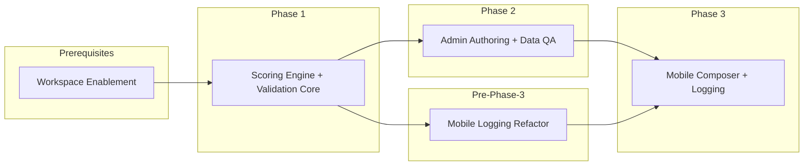

---

## Current Baseline

- `TABLE_REGISTRY` defines all table schemas, field types, FK refs, and JSON shapes
- `equipment.modifier_constraints` uses `jsonShape: 'free'` (to be tightened in Phase 2)
- `motions` has structured `muscle_targets` and `default_delta_configs` JSON fields
- `exerciseCategories` has `exercise_input_permissions`
- Mobile stack: Expo + SQLite + Reanimated + Gesture Handler + SVG

### Scoring Computation Model (how it works today)

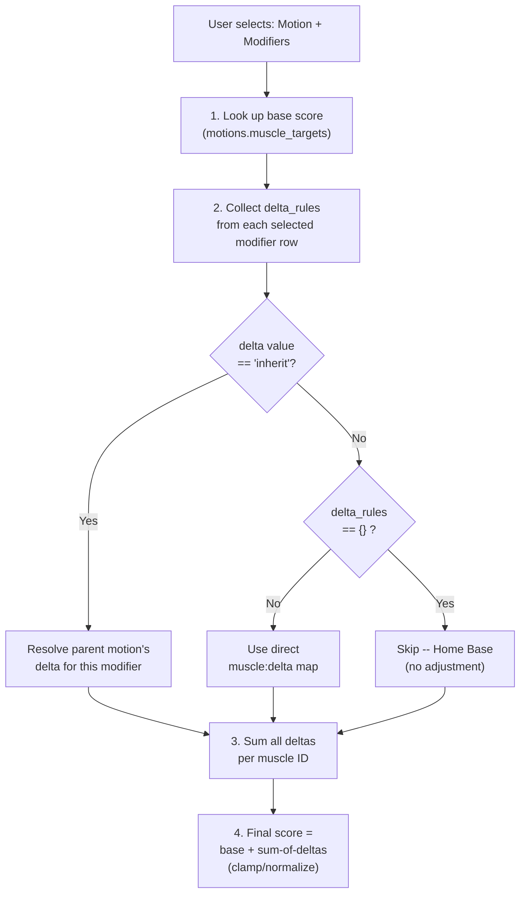

### Data Relationship Map (tables involved in scoring)

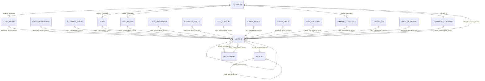

---

## Prerequisites (before Phase 1 execution)

### Workspace and Shared Package Enablement

- Establish monorepo package-sharing (`/packages/shared` consumable by admin server, admin frontend, and mobile/Expo/Metro)
- Tooling decision: npm workspaces / pnpm workspaces / Turborepo (decided during kickoff spike)
- Add build/test smoke checks across all consumers

### Target Monorepo Structure

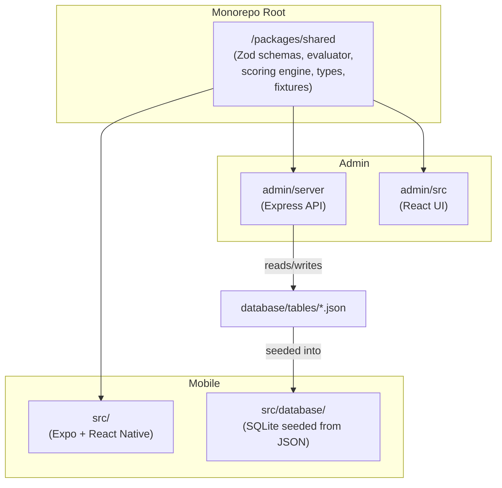

### Mobile Logging Architecture Refactor (before Phase 3)

- Extract logic from large components (`indexWorkoutTemplate.tsx`, `SetRow.tsx`) into state layer + hooks (reducer/store/Zustand)
- Establish boundaries: UI = presentation, shared evaluator = logic, cache/logging services = orchestration

### Mobile Refactor: Before and After

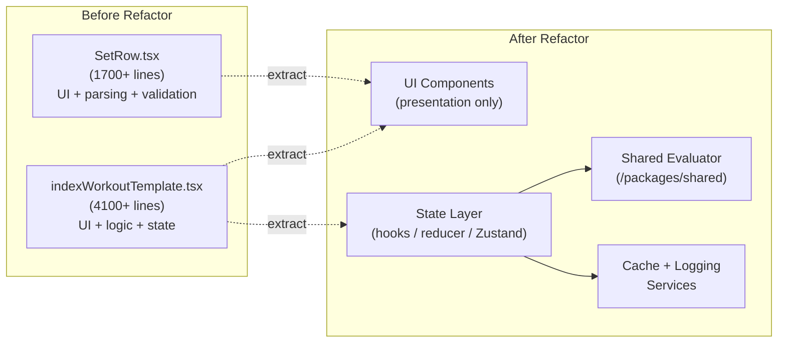

---

## Phase 1 -- Scoring Engine + Validation Core

**Goal:** Deliver a mathematically bulletproof, versioned, shareable scoring + constraint engine trusted by both admin and mobile.

### Phase 1 Architecture

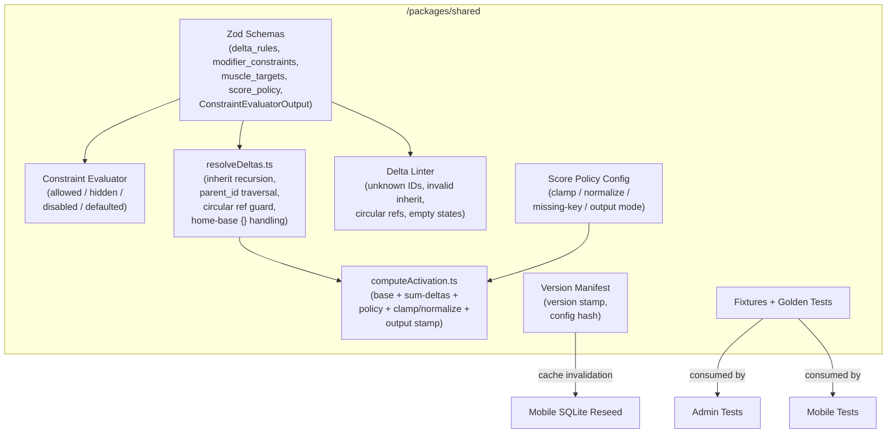

### Deliverables

1. **Shared Zod schemas** in `/packages/shared` -- delta rules, modifier constraints, muscle targets, motion config, score policy, constraint rules, `ConstraintEvaluatorOutput`
2. **Constraint Evaluator Core** -- shared function returning deterministic output: allowed/hidden/disabled/defaulted inputs, suppressions, validation errors
3. **Scoring engine**
  - `resolveDeltas.ts`: inherit recursion, `parent_id` chain traversal, circular ref protection, home-base `{}` handling
  - `computeActivation.ts`: base + sum-of-deltas + policy application, clamp/normalization modes, output stamping
4. **Delta and inheritance linting** -- unknown IDs, invalid inherit, circular refs, suspicious empty/missing states
5. **Score policy config** -- clamp/normalization policy, missing-key behavior, output mode (raw / normalized / both)
6. **Scoring version manifest** -- version stamp for outputs, cache invalidation, auditability
7. **Config hash + mobile reseed trigger** -- manifest/config hash-based reseed propagation for mobile SQLite
8. **Validation endpoint + CLI** -- `validate-all-deltas` or equivalent machine-readable validation run
9. **Fixtures / golden tests** -- golden lifts, inheritance-heavy cases, impossible combos rejected by constraints

### Constraint Evaluator Flow

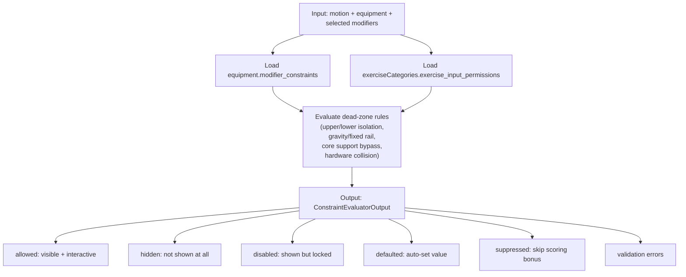

### Delta Inheritance Resolution

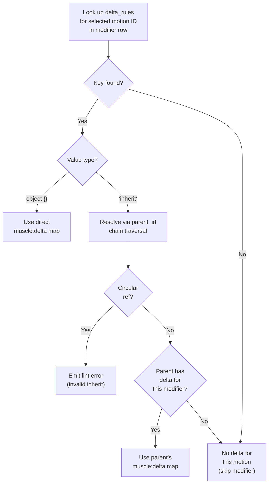

### Guardrails

- Canonicalization spec doc (field ordering, null/default omission, array sorting, version salt)
- Shared test fixture package / fixture JSONs consumed by admin server and mobile tests
- Schema/data migration policy: breaking data-contract or scoring-relevant shape change triggers manifest bump + migration/fallback path

### Acceptance Criteria

- All unit + fixture tests pass (including deep inheritance cases)
- Validation/lint run reports zero errors on current repo table data
- Constraint evaluator output identical across Node and React Native for same canonical config
- Mobile reseed triggers correctly on manifest/config version change
- No hardcoded dead-zone/scoring logic outside shared contracts

---

## Phase 2 -- Admin Authoring + Data QA

**Goal:** Turn admin into the full biomechanical authoring + QA command center: registry-driven, safe, observable, maintainable.

### Phase 2 Admin Authoring Workflow

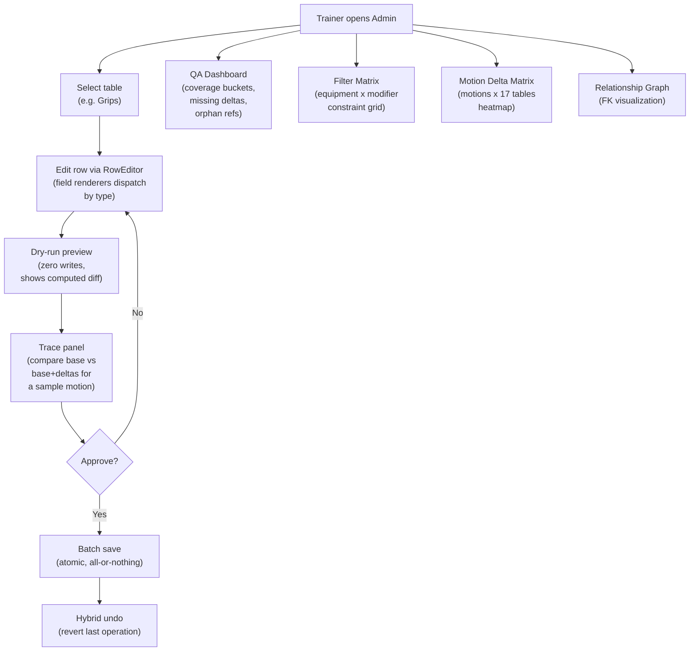

### Deliverables

- Registry-driven CRUD, Filter Matrix, Motion Delta Matrix, Relationship Graph
- Hybrid undo, batch transactions, trace panel, dry-run mode
- QA dashboard with split coverage buckets and row links
- Tighten `equipment.modifier_constraints` from `jsonShape: 'free'` to strict schema

### Guardrails

- Error/diagnostic event schema (structured payloads for validator failures, dry-run results, trace mismatches) shared with mobile

### Acceptance Criteria

- Trainer (zero SQL) can create/edit a motion + deltas + constraints + preview/undo/trace in less than 10 minutes
- Matrices match the original PART 5/6 data contracts and workflows
- No admin feature implements scoring/dead-zone logic outside shared Phase 1 contracts
- Dry-run performs zero writes; batch saves are all-or-nothing; file writes remain atomic
- QA dashboard exposes split coverage buckets with row links
- Data integrity preserved across all operations

---

## Phase 3 -- Mobile Composer + Logging Experience

**Goal:** Deliver the "the app understands kinesiology" moment -- fast, offline-capable exercise composing and logging with real-time activation feedback.

### Phase 3 Mobile User Journey

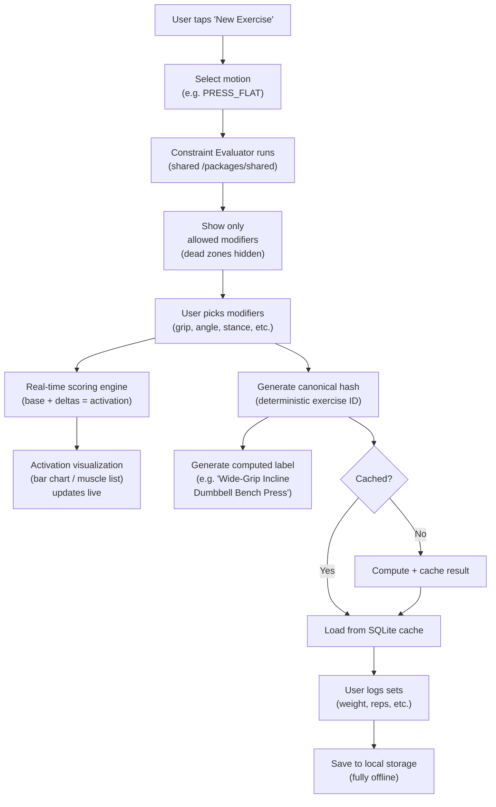

### Deliverables

- Dynamic exercise composer (motion + modifiers, constraint-driven UI)
- Canonical hashing + label generation
- Computed config cache (SQLite-backed, offline)
- Real-time logging + activation visualization (bar chart / grouped muscle list MVP; SVG body heatmap optional)
- Mobile debug panel for parity validation
- Basic history/log list

### Guardrails

- Performance budget + profiling checkpoints (input to evaluator to render latency thresholds, checked during Reanimated flows)
- Shared error/diagnostic event schema (same as Phase 2)

### Acceptance Criteria

- All dead-zone/constraint behavior from shared Phase 1 evaluator output; zero duplicated scoring logic
- Composer/scoring/naming/caching/logging fully offline after seed/reseed
- Logging a complex lift takes less than 30 seconds
- Canonical hash is deterministic and stable; cache invalidates on version changes
- Activation visualization updates live and matches scoring engine output exactly
- Dev/debug panel supports admin/mobile parity validation
- Data flows cleanly: admin JSON to mobile SQLite reseed via Phase 1 version/hash contracts

---

## Cross-Phase Architecture Guardrails

### End-to-End Data Flow (Admin to Mobile)

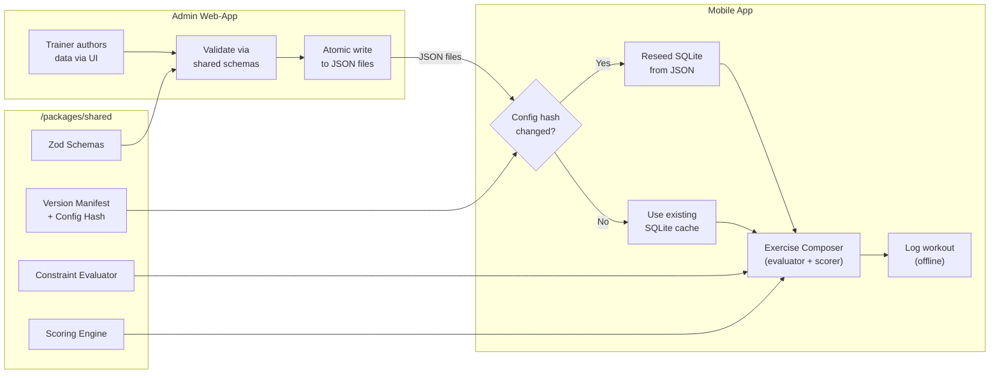

### Parity Validation Loop

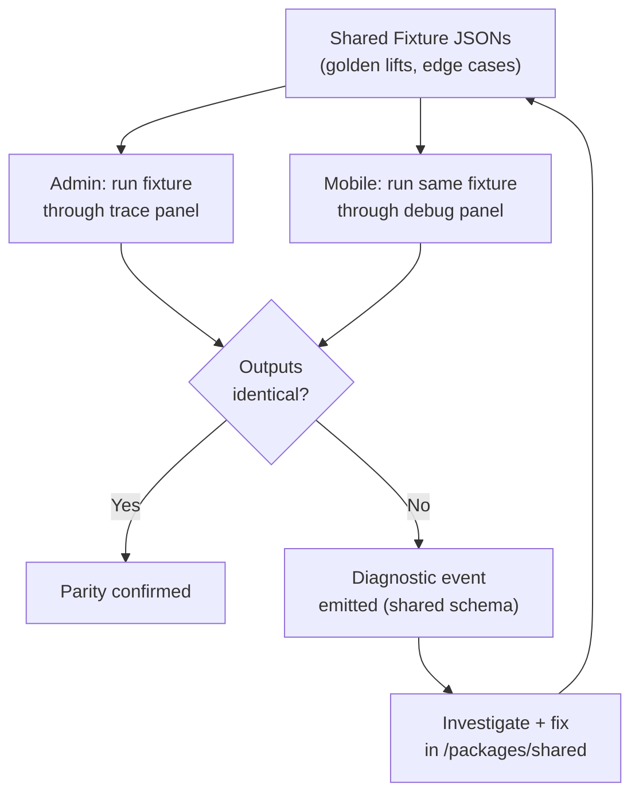

- No duplicated biomechanics logic -- math lives in one place only
- Compiled-output consumption -- UI layers consume evaluator/scoring outputs and present them
- Version-aware data evolution -- safe data shape changes over time
- Atomicity and validation-first writes -- changes are never half-saved
- Parity-first debugging -- shared fixtures + shared diagnostics + admin/mobile trace parity checks

---

## Risks This Roadmap Prevents

- Exercise database explosion (static exercise-per-row modeling)
- Inaccurate activation scores causing plateaus or injury risk
- Admin/mobile scoring drift from duplicated logic
- Hash instability / identity drift breaking progression and cache
- Silent data-authoring errors from missing validation
- Unmaintainable authoring UX without matrix tools or QA visibility
- Mobile cache staleness without manifest/version invalidation
- Offline failure from network-dependent logging
- Hard-to-debug parity bugs without shared fixtures or diagnostic schema

---

## Immediate Next Steps

- Phase 1 kickoff: create `/packages/shared` + canonicalization spec doc + first Zod schemas + shared fixtures (targeting early working evaluator prototype in first sprint)
- Create a dedicated `ROADMAP.md` in repo root linking to this overview
- Schedule weekly parity checks (admin trace vs mobile debug panel) starting Week 2 of Phase 1

