# Exercise Config System Finalization Plan (Revised)

**Core Principle:** Every user-logged "exercise" is a computation -- base motion score + modifier deltas + constraint/dead-zone logic + score policy. Authored in admin, shared across the repo, consumed offline by mobile.

**Lock date:** February 23, 2026
**Repo:** monorepo with admin + mobile; `TABLE_REGISTRY` in [admin/server/tableRegistry.ts](admin/server/tableRegistry.ts) is the central schema source.

### Key Revision Notes

This plan revises the original locked roadmap based on a pragmatic assessment of the actual codebase state:

- No `/packages/shared` exists yet; no workspaces configured
- No test files exist (jest is installed but unused)
- No Zod anywhere in the codebase
- Admin already has working Filter Matrix, Motion Delta Matrix, and Relationship Graph
- Mobile god components (`indexWorkoutTemplate.tsx` at 4100+ lines, `SetRow.tsx` at 1700+ lines) need structural refactoring before the scoring engine can plug in
- Many motion x modifier delta cells are empty -- the math engine is useless without data coverage

The revisions: tier deliverables by criticality, start the mobile refactor early, distinguish already-built admin features from new ones, defer canonical hashing, and add data completeness as an explicit workstream.

### Revised Roadmap Sequence

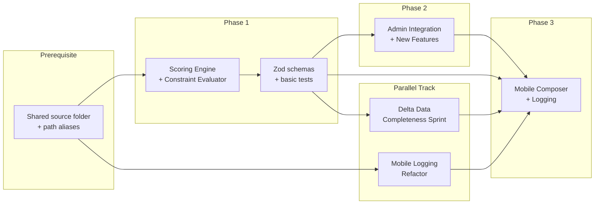

---

## Current Baseline (Honest Assessment)

- `TABLE_REGISTRY` defines all table schemas, field types, FK refs, and JSON shapes
- `equipment.modifier_constraints` uses `jsonShape: 'free'` (loose, unvalidated)
- `motions` has structured `muscle_targets` and `default_delta_configs` JSON fields
- `exerciseCategories` has `exercise_input_permissions`
- Mobile stack: Expo + SQLite + Reanimated + Gesture Handler + SVG
- **No shared packages, no workspaces, no Zod, no test files, admin and mobile are disconnected codebases reading the same JSON files**
- **Admin already has**: working TableEditor, RowEditor with specialized field renderers, Filter Matrix, Motion Delta Matrix, Relationship Graph, import/export, FK-safe delete
- **Many delta_rules cells are empty** across the 17 modifier tables -- the engine will produce flat/identical scores until this data is authored

### Scoring Computation Model

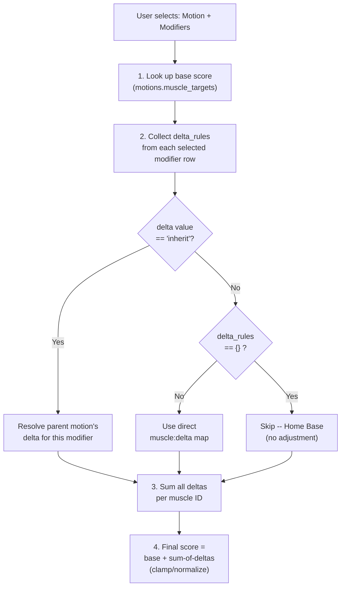

### Data Relationship Map

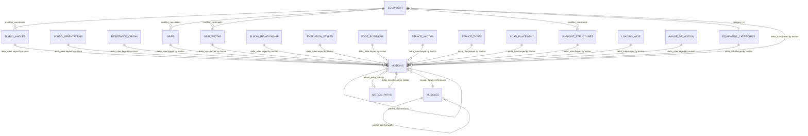

---

## Prerequisite -- Shared Source (Simplified)

**Change from original:** Instead of a full monorepo workspace setup (npm/pnpm workspaces, Turborepo) as a blocking prerequisite, start with a **shared source folder + TypeScript path aliases**. This gets code sharing working in hours, not weeks. Upgrade to proper workspaces later when the shared package stabilizes.

### Approach

- Create `shared/` at repo root with the scoring engine, constraint evaluator, types, and schemas
- Configure `tsconfig.json` path aliases (`@shared/`*) in admin and mobile
- For admin (Vite): add alias in `vite.config.ts`
- For mobile (Expo/Metro): add alias in `metro.config.js` and `tsconfig.json`
- Upgrade to full workspaces/Turborepo only after the shared code stabilizes and a proper build step is justified

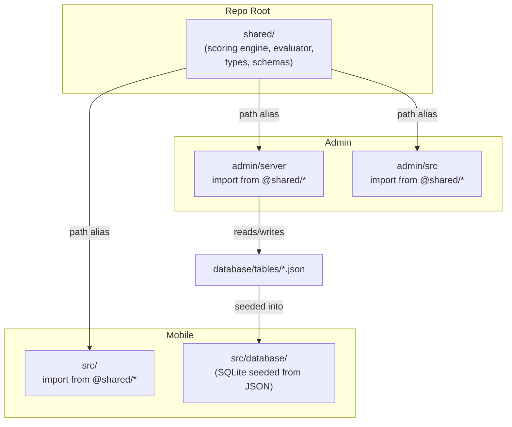

---

## Parallel Track -- Mobile Logging Refactor (start alongside Phase 1)

**Change from original:** This was gated as "before Phase 3." But it has zero dependency on the scoring engine -- it is purely structural. Starting it in parallel with Phase 1 means the mobile codebase is ready to receive the composer by the time Phases 1 and 2 complete, instead of creating a sequential bottleneck.

- Extract logic from `indexWorkoutTemplate.tsx` (4100+ lines) and `SetRow.tsx` (1700+ lines) into state layer + hooks
- Establish boundaries: UI = presentation only, shared evaluator = logic, cache/logging services = orchestration
- This is a large refactor; starting early prevents it from blocking Phase 3

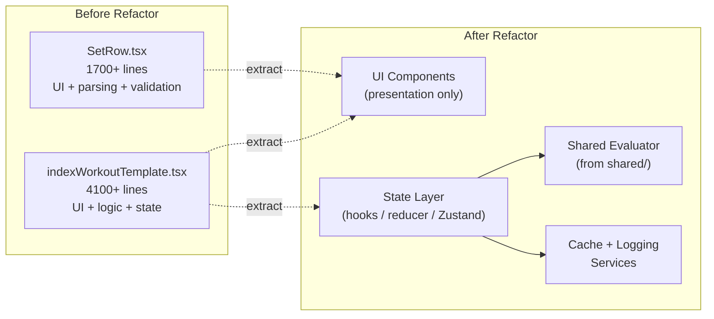

---

## Phase 1 -- Scoring Engine + Constraint Evaluator

**Goal:** Ship the two functions that everything else depends on: `resolveDeltas` + `computeActivation` (the scoring engine) and the constraint evaluator (the dead-zone logic). Get them working with basic tests. Everything else in this phase is layered on afterward.

### Tiered Deliverables

**Change from original:** The original plan listed 9 deliverables + 3 guardrails as a flat list, all equally "locked." This revision tiers them by criticality so the critical path is clear.

#### Tier 1 -- Critical Path (ship these first, in order)

1. **Scoring engine** -- the two core files:
  - `resolveDeltas.ts`: inherit recursion, `parent_id` chain traversal, circular ref protection, home-base `{}` handling
  - `computeActivation.ts`: base + sum-of-deltas + clamp/normalization + output
2. **Constraint Evaluator Core** -- shared function returning deterministic output: allowed/hidden/disabled/defaulted inputs, suppressions
3. **Basic TypeScript types** -- interfaces for delta rules, modifier constraints, muscle targets, score policy, `ConstraintEvaluatorOutput` (plain TS first, not Zod yet)
4. **Golden tests** -- 5-10 real-world lifts (e.g. flat bench, sumo deadlift, cable fly) as test fixtures; run with jest

#### Tier 2 -- Harden (after Tier 1 works end-to-end)

1. **Zod schemas** wrapping the Tier 1 types -- runtime validation for delta rules, modifier constraints, muscle targets
2. **Delta and inheritance linting** -- scan all tables for unknown IDs, invalid inherit, circular refs, suspicious empty states
3. **Validation CLI** -- `validate-all-deltas` script that runs the linter across all 17 delta tables and reports errors
4. **Score policy config** -- clamp/normalization policy, missing-key behavior, output mode (raw / normalized / both)

#### Tier 3 -- Infrastructure (after Tiers 1-2 are stable)

1. **Scoring version manifest** -- version stamp for outputs, cache invalidation
2. **Config hash + mobile reseed trigger** -- manifest-based reseed propagation for mobile SQLite
3. **Canonicalization spec doc** -- field ordering, null/default omission, array sorting rules (only needed when canonical hashing is implemented in Phase 3)
4. **Schema/data migration policy doc** -- rules for breaking changes

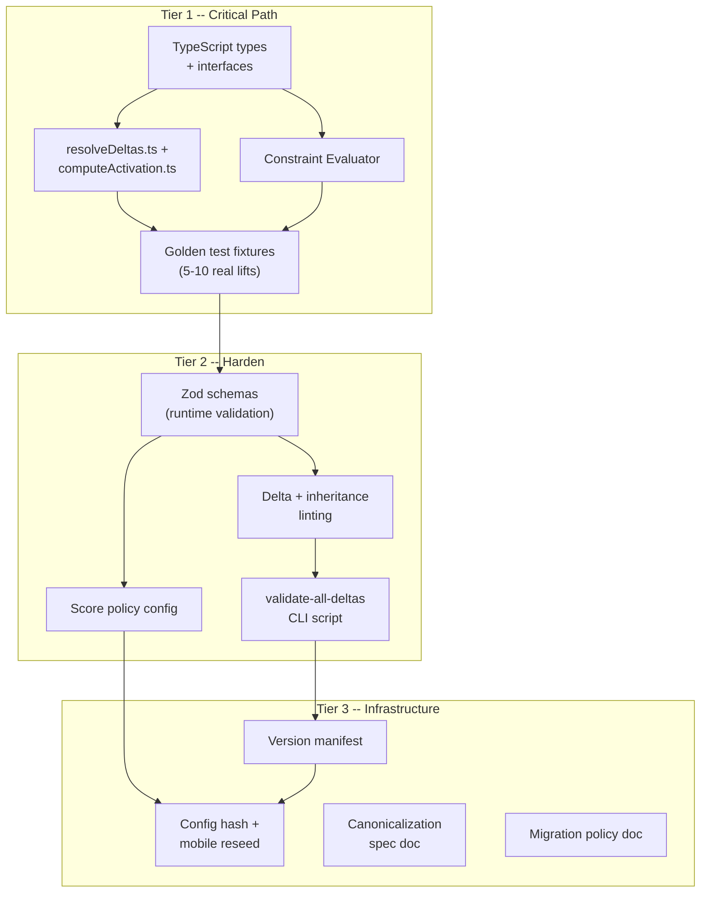

### Constraint Evaluator Flow

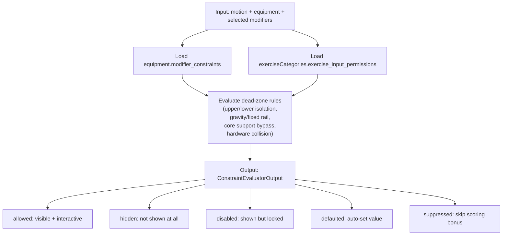

### Delta Inheritance Resolution

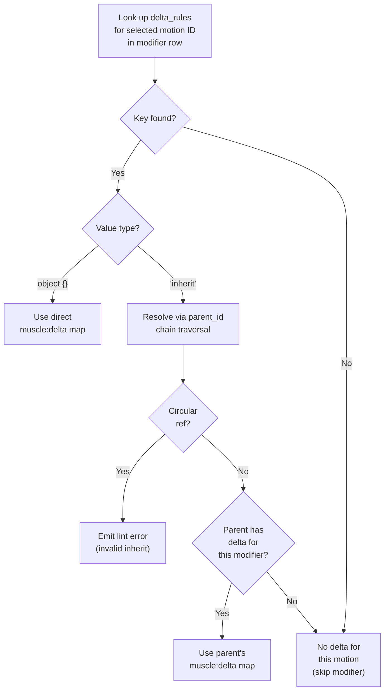

### Acceptance Criteria

- `resolveDeltas` and `computeActivation` produce correct output for all golden test fixtures
- Constraint evaluator hides/disables inputs correctly for all dead-zone rules
- All tests pass via jest
- Linter reports zero errors on current repo delta data (warnings acceptable)
- No hardcoded dead-zone/scoring logic outside shared/

---

## Parallel Track -- Delta Data Completeness Sprint

**Change from original:** This was not in the original plan at all, but it is the biggest practical risk. The scoring engine can be mathematically perfect, but if most delta_rules cells are empty, users will see flat/identical scores for different modifier choices and the "app understands kinesiology" moment will not land.

- Use the existing Motion Delta Matrix to identify coverage gaps (empty cells show as red)
- Prioritize the highest-impact modifier tables first: Grips, Grip Widths, Torso Angles, Stance Widths (these cover the most common exercise variations)
- Target: at least the top 10 most common motions should have complete delta coverage across all relevant modifier tables
- This can run in parallel with Phase 1 and Phase 2 using the existing admin tools

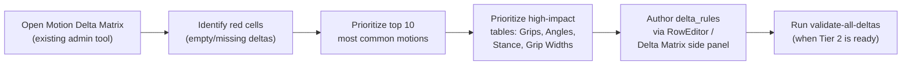

---

## Phase 2 -- Admin Integration + New Features

**Goal:** Wire the existing admin tools to use the shared scoring engine from Phase 1, then build the new features (undo, dry-run, trace, QA dashboard).

**Change from original:** The original plan listed Filter Matrix, Motion Delta Matrix, and Relationship Graph as Phase 2 deliverables. These are already built and working. Phase 2 is about (a) integrating them with the shared engine and (b) adding genuinely new capabilities.

### What Already Exists vs. What Is New

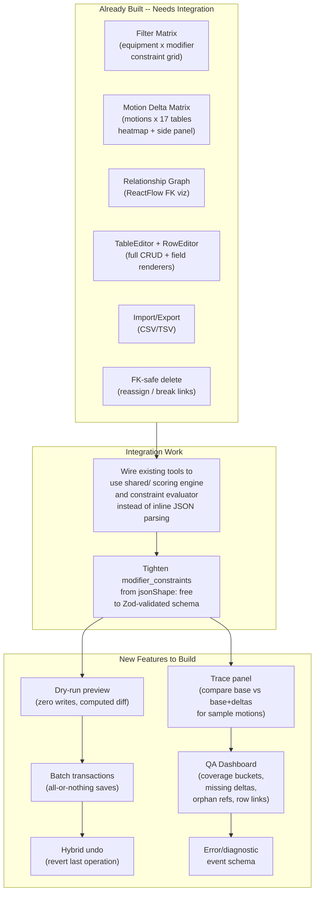

### Phase 2 Trainer Workflow

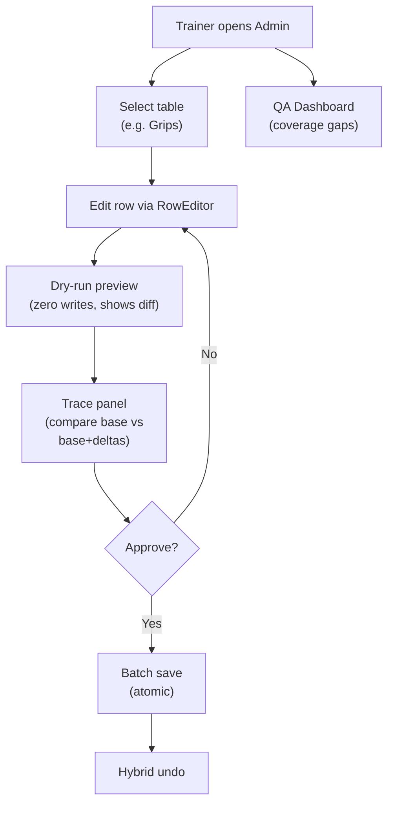

### Deliverables

**Integration (existing tools):**

- Wire Filter Matrix, Motion Delta Matrix, RowEditor to use shared scoring engine + constraint evaluator
- Tighten `equipment.modifier_constraints` from `jsonShape: 'free'` to Zod-validated schema

**New features:**

- Dry-run preview mode (zero writes, shows computed score diff before saving)
- Trace panel (compare base scores vs base+deltas for a sample motion, powered by shared `computeActivation`)
- Hybrid undo (revert last operation)
- Batch transactions (all-or-nothing saves)
- QA dashboard (delta coverage buckets with row links, orphan FK refs, missing data alerts)
- Error/diagnostic event schema (shared with mobile)

### Acceptance Criteria

- Trainer (zero SQL) can create/edit a motion + deltas + constraints + preview/undo/trace in less than 10 minutes
- No admin feature implements scoring/dead-zone logic outside shared/ -- all math goes through Phase 1 engine
- Dry-run performs zero writes; batch saves are all-or-nothing; file writes remain atomic
- QA dashboard exposes coverage buckets with clickable row links
- Data integrity preserved across all operations

---

## Phase 3 -- Mobile Composer + Logging Experience

**Goal:** Deliver the "the app understands kinesiology" moment -- fast, offline-capable exercise composing and logging with real-time activation feedback.

**Change from original:** Canonical hashing is deferred to a v1.1 follow-up. It only matters for progression tracking (linking "the same lift" across sessions), which is not in scope for the initial composer. The app currently tracks exercises by `exerciseId` (library item ID) which is sufficient for v1. Ship the composer without hashing; add it when building progression tracking.

### Phase 3 Mobile User Journey

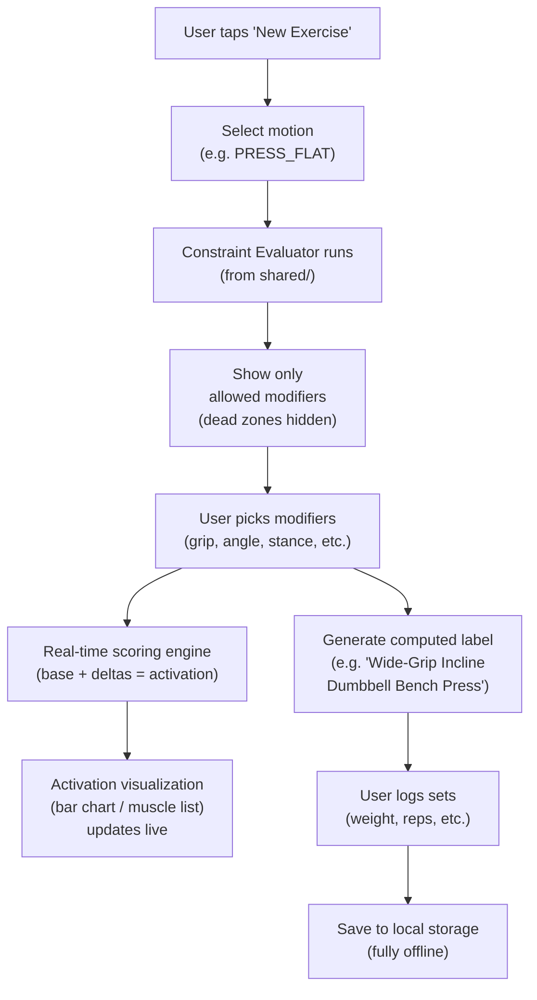

### Deliverables

**v1 (ship this):**

- Dynamic exercise composer (motion + modifiers, constraint-driven UI powered by shared evaluator)
- Computed label generation (derived from selected motion + modifiers)
- Real-time activation visualization (bar chart / grouped muscle list MVP)
- Fully offline operation (SQLite-backed, seeded from JSON)
- Mobile debug panel for parity validation

**v1.1 (defer until progression tracking):**

- Canonical hashing (deterministic exercise identity)
- Canonicalization spec doc
- Computed config cache (SQLite cache keyed by canonical hash)
- Version-manifest-based cache invalidation

### Guardrails

- Performance budget: input-to-render latency under 100ms on mid-range device
- All dead-zone/constraint behavior from shared evaluator; zero duplicated scoring logic in mobile code

### Acceptance Criteria

- Composer/scoring/logging fully offline after seed
- Logging a complex lift takes less than 30 seconds
- Activation visualization updates live and matches scoring engine output exactly
- All constraint behavior comes 100% from shared evaluator output
- Zero duplicated scoring/dead-zone condition trees in mobile code
- Dev/debug panel available for internal QA

---

## Cross-Phase Architecture Guardrails

### End-to-End Data Flow

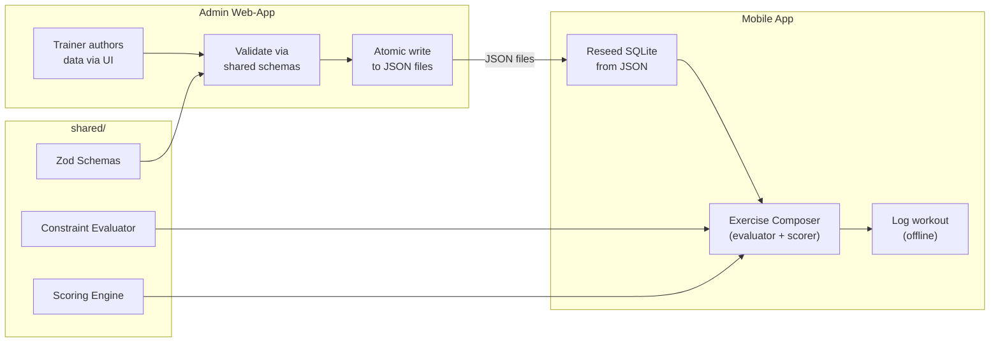

### Parity Validation Loop

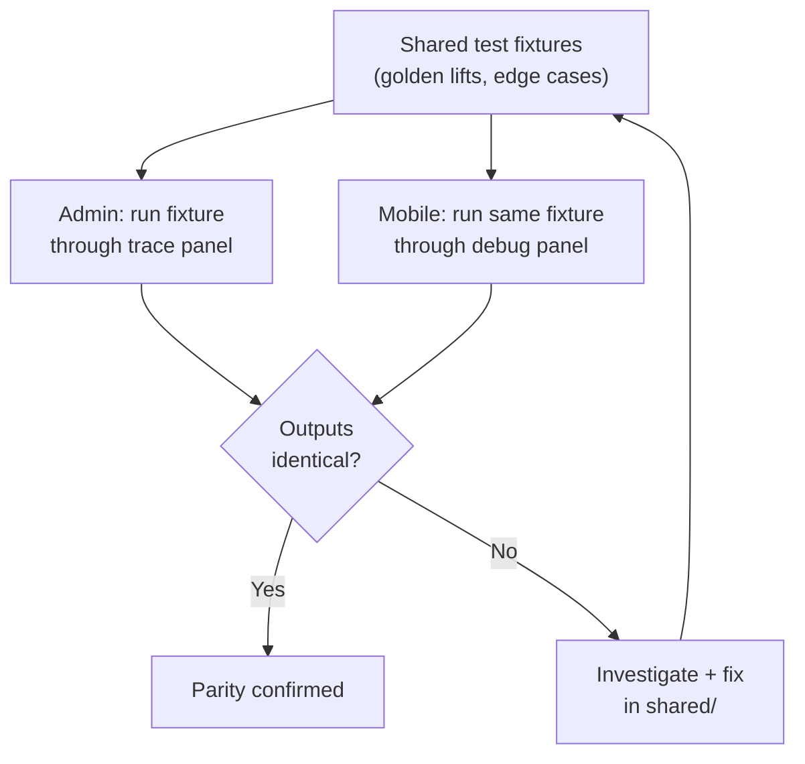

- No duplicated biomechanics logic -- math lives in `shared/` only
- UI layers consume evaluator/scoring outputs and present them; they never re-derive physics
- Atomicity and validation-first writes -- changes are never half-saved
- Parity-first debugging -- shared fixtures + admin trace panel + mobile debug panel

---

## Risks This Roadmap Prevents

- Exercise database explosion (static exercise-per-row modeling)
- Inaccurate activation scores causing plateaus or injury risk
- Admin/mobile scoring drift from duplicated logic
- Silent data-authoring errors from missing validation
- Unmaintainable authoring UX without matrix tools or QA visibility
- Offline failure from network-dependent logging
- **NEW: Flat/identical scores from empty delta data** (addressed by Data Completeness Sprint)

---

## Immediate Next Steps

1. Create `shared/` directory with TypeScript types for delta rules, muscle targets, modifier constraints, and ConstraintEvaluatorOutput
2. Implement `resolveDeltas.ts` and `computeActivation.ts` with basic tests (5-10 golden lifts)
3. Implement constraint evaluator with dead-zone rules
4. Configure path aliases in admin (`vite.config.ts`) and mobile (`metro.config.js`, `tsconfig.json`)
5. Begin mobile refactor: extract first hook/state-layer from `indexWorkoutTemplate.tsx` (parallel track)
6. Open Motion Delta Matrix, identify top 10 motions with worst delta coverage, begin authoring (parallel track)

