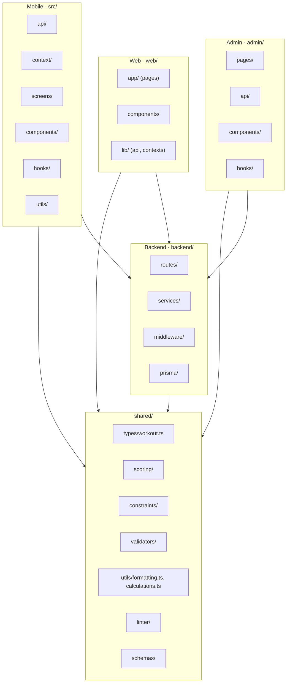

# Full Ecosystem Refactoring Plan

## Guiding Principles

- **Zero feature regression.** Every phase ends with a verification gate (tests + manual smoke).
- **One phase = one PR.** If something breaks, revert the PR, not the whole branch.
- **Move files, don't rewrite logic.** Refactoring means reorganizing, not reimplementing.
- **Tests before changes.** Where coverage is missing, write tests FIRST, then refactor.

## Pre-Flight: Baseline Snapshot

Before any code changes, capture the current working state so we can always compare back.

- Run `npm run test:ci` in mobile root and record the 166-pass result
- Run `npm run build` in web and admin to confirm they compile
- Start backend (`npm run dev`) and hit `GET /api/health` to confirm it works
- Start mobile on Android emulator and verify the main flow (start workout, add exercise, finish workout, view history)
- Tag this commit as `baseline-before-refactor`

---

## Phase 1: Shared Foundation -- Consolidate Types and Utilities

**Goal:** Single source of truth for types and formatting utilities. All four projects import from `shared/`.

**Risk: LOW** -- pure type/function moves, compile-time verification.

### 1A. Consolidate Workout Types into `shared/types/workout.ts`

Currently duplicated in:

- [src/types/workout.ts](src/types/workout.ts) (233 lines, mobile)
- [web/types/index.ts](web/types/index.ts) (154 lines, web)

Actions:

- Create `shared/types/workout.ts` with the **superset** of both files, using the mobile names as the standard (`Set`, not `WorkoutSet`)
- Update `web/types/index.ts` to re-export from `@shared/types/workout` (no aliases -- standardize names)
- Update mobile `src/types/workout.ts` to re-export from `@shared/types/workout`
- Update web `tsconfig.json` to add `@shared/`* path alias pointing to `../shared/`*
- Update `web/next.config.js` to support the `@shared` alias via webpack config
- Fix all import references in web that used the old names (e.g., `WorkoutSet` -> `Set`)

### 1B. Consolidate Formatting Utilities into `shared/utils/formatting.ts`

Currently duplicated:

- `formatDate()` -- 3 copies across mobile + web
- `formatDuration()` -- 3 implementations (different signatures)
- `formatWeight()`, `formatNumber()` -- web only but useful everywhere

Actions:

- Create `shared/utils/formatting.ts` with standardized versions:
  - `formatDate(dateStr: string | number): string`
  - `formatDuration(seconds: number): string` (seconds-based, the mobile standard)
  - `formatDurationMs(ms: number): string` (for web dashboard which uses ms)
  - `formatWeight(value: number, unit: string): string`
  - `formatNumber(value: number): string`
- Create `shared/utils/calculations.ts`:
  - `calculateTotalVolume(workouts: Workout[]): number`
  - `calculateStreak(workouts: Workout[]): number`
- Update mobile imports: replace inline `formatDate` in `MeasurementHistoryItem.tsx`, `SavedNoteItem.tsx`
- Update web imports: replace `web/lib/utils.ts` formatting functions with `@shared/utils/formatting`
- Keep `cn()` in `web/lib/utils.ts` (web-specific)

### 1C. Wire Up Web `@shared` Alias

- Add to `web/tsconfig.json`: `"@shared/*": ["../shared/*"]`
- Add to `web/next.config.js`: webpack alias for `@shared`
- Verify build passes

### Verification Gate

- `npm run test:ci` (mobile) -- 166 tests pass
- `npm run build` (web) -- compiles
- `npm run build` (admin) -- compiles
- TypeScript strict mode passes in all projects

---

## Phase 2: Backend Cleanup -- Eliminate JSON, Extract Services

**Goal:** Postgres is the only data source. Routes are thin HTTP layers. Business logic lives in services.

**Risk: LOW-MEDIUM** -- removing JSON removes a code path, but Postgres paths already exist and are tested.

### 2A. Remove JSON File Support

Files to **delete**:

- [backend/src/reference/jsonRepository.ts](backend/src/reference/jsonRepository.ts) -- entire file
- [backend/src/seed/incrementalSync.ts](backend/src/seed/incrementalSync.ts) -- never called
- [backend/src/parity/](backend/src/parity/) -- entire directory (parityHarness, compare, normalize)

Files to **modify**:

- [backend/src/routes/scoring.ts](backend/src/routes/scoring.ts) -- replace `fs.readFileSync` with Postgres queries (use `pgCrud.ts` or Prisma)
- [backend/src/routes/reference.ts](backend/src/routes/reference.ts) -- remove JSON branch, use Postgres only (or delete entirely since `/api/v1/reference` exists)
- [backend/src/config/index.ts](backend/src/config/index.ts) -- remove `referenceDataSource` and `tablesDir` config
- [backend/src/setup/dbSetup.ts](backend/src/setup/dbSetup.ts) -- update to not reference JSON seed pipeline
- [backend/src/seed/seedPipeline.ts](backend/src/seed/seedPipeline.ts) -- **keep** but convert to read from a migration SQL or Prisma seed, not JSON files

Dead routes to **remove**:

- `/api/reference/`* in `reference.ts` -- mobile uses `/api/v1/reference/`* instead
- `/api/scoring/`* in `scoring.ts` -- admin uses `/api/admin/scoring/*` instead
- Remove their registrations from [backend/src/index.ts](backend/src/index.ts)

### 2B. Extract `wrap()` to Shared Middleware

Create [backend/src/middleware/asyncHandler.ts](backend/src/middleware/asyncHandler.ts):

```typescript
import { Request, Response, NextFunction } from "express";
export const wrap = (fn: (req: Request, res: Response) => Promise<void>) =>
  (req: Request, res: Response, next: NextFunction) => fn(req, res).catch(next);
```

Update these 9 files to import from `asyncHandler.ts` instead of defining inline:

- `routes/auth.ts`, `routes/profile.ts`, `routes/workouts.ts`, `routes/exercises.ts`
- `routes/measurements.ts`, `routes/goals.ts`, `routes/dashboard.ts`
- `routes/personalRecords.ts`, `routes/referenceV1.ts`

### 2C. Extract Business Logic into Services

Create service files for routes that currently mix HTTP handling with business logic:

- [backend/src/services/workoutService.ts](backend/src/services/workoutService.ts) -- extract from `routes/workouts.ts`
- [backend/src/services/exerciseService.ts](backend/src/services/exerciseService.ts) -- extract from `routes/exercises.ts`
- [backend/src/services/measurementService.ts](backend/src/services/measurementService.ts) -- extract from `routes/measurements.ts`
- [backend/src/services/goalService.ts](backend/src/services/goalService.ts) -- extract from `routes/goals.ts`
- [backend/src/services/profileService.ts](backend/src/services/profileService.ts) -- extract from `routes/profile.ts`
- [backend/src/services/dashboardService.ts](backend/src/services/dashboardService.ts) -- extract from `routes/dashboard.ts`

Pattern: Route handles request parsing + response formatting. Service handles Prisma queries + business logic.

### 2D. Add Database Indexes

Add to [backend/prisma/schema.prisma](backend/prisma/schema.prisma):

- `Workout`: `@@index([userId, startedAt])`
- `BodyMeasurement`: `@@index([userId, date])`
- `UserGoal`: `@@index([userId, createdAt])`
- `WorkoutExercise`: index on `parentId`
- `PersonalRecord`: `@@index([userId, exerciseId])`

Run `npx prisma migrate dev` to apply.

### Verification Gate

- Start backend, hit every endpoint via curl/Postman
- Confirm mobile app still loads data (workouts, exercises, profile, measurements, goals)
- Confirm admin dashboard + table editor still work
- Confirm web dashboard still loads

---

## Phase 3: Backend Testing Infrastructure

**Goal:** Backend has test infrastructure and critical path coverage before we touch frontend structure.

**Risk: LOW** -- adding tests doesn't change behavior.

### 3A. Set Up Backend Test Framework

- Add `vitest` + `supertest` to backend `devDependencies`
- Create `backend/vitest.config.ts`
- Create `backend/src/test/setup.ts` with Prisma test client setup
- Add `"test"` and `"test:ci"` scripts to `backend/package.json`

### 3B. Write Critical Backend Tests

Priority order:

1. **Auth middleware tests** -- verify JWT validation, missing token, expired token
2. **Auth route tests** -- register, login, refresh, logout
3. **Workout CRUD tests** -- create, list, get, delete with proper user isolation
4. **Exercise CRUD tests** -- create, list, update, delete
5. **Dashboard route test** -- verify aggregated response structure
6. **Measurement + Goal CRUD tests**
7. **Admin scoring route tests** -- compute, trace, constraints

Target: ~40-50 tests covering all critical API paths.

### Verification Gate

- All backend tests pass
- All existing mobile tests still pass (166)

---

## Phase 4: Dead Code Removal and JS-to-TS Conversion

**Goal:** Clean codebase with zero dead code and consistent TypeScript usage.

**Risk: LOW** -- removing unused code, converting JS to TS.

### 4A. Delete Dead Files

- [web/lib/mockData.ts](web/lib/mockData.ts) -- unused, replaced by real API
- [backend/src/reference/repository.ts](backend/src/reference/repository.ts) -- interface for deleted JSON repo

### 4B. Convert JS Constants to TypeScript

- `src/constants/colors.js` -> `colors.ts`
- `src/constants/defaultStyles.js` -> `defaultStyles.ts`
- `src/constants/defaultToggles.js` -> `defaultToggles.ts`
- `src/constants/data.js` -> `data.ts`

Add proper type annotations to all exports.

### 4C. Remove Unused Exports

- Verify and remove `resetProvider()` from `src/database/providers/factory.ts` if unused
- Clean up any orphaned imports flagged by TypeScript compiler

### Verification Gate

- `npm run test:ci` (mobile) -- all tests pass
- `npm run build` (web + admin) -- compile clean
- Backend starts and health check passes

---

## Phase 5: Admin App Refactoring

**Goal:** Split monolithic files into feature folders with reusable components.

**Risk: MEDIUM** -- restructuring a working app. Verify every page after.

### 5A. Split `api.ts` into Domain Modules

Split [admin/src/api.ts](admin/src/api.ts) into:

- `admin/src/api/client.ts` -- base fetch wrapper + types
- `admin/src/api/tables.ts` -- table CRUD endpoints
- `admin/src/api/schema.ts` -- schema + relationship endpoints
- `admin/src/api/scoring.ts` -- scoring + linting endpoints
- `admin/src/api/matrixConfigs.ts` -- matrix config endpoints
- `admin/src/api/index.ts` -- re-exports all

### 5B. Organize Pages into Feature Folders

Current flat structure -> feature folders:

```
admin/src/pages/
  Dashboard/
    index.tsx
  TableEditor/
    index.tsx
    components/
      TableToolbar.tsx  (extract from main file)
      TableGrid.tsx     (extract from main file)
    hooks/
      useTableState.ts  (extract state logic)
  FilterMatrix/
    index.tsx
  MotionDeltaMatrix/
    index.tsx
    MatrixV2ConfigPanel.tsx
  ScoringPanel/
    index.tsx
  RelationshipGraph/
    index.tsx
```

### 5C. Add Table Virtualization

- Add `@tanstack/react-virtual` to admin dependencies
- Virtualize the table body in `TableEditor` for large datasets
- Apply same treatment to `FilterMatrix` and `MotionDeltaMatrix`

### Verification Gate

- Navigate every admin page
- CRUD a row in table editor
- Run scoring panel trace
- Verify matrix editing works
- Check relationship graph renders

---

## Phase 6: Web App Refactoring

**Goal:** Wire up shared types/utils, improve data fetching, add tests.

**Risk: MEDIUM** -- type changes + SSR migration.

### 6A. Replace Duplicated Types and Utils

- Update [web/types/index.ts](web/types/index.ts) to import and re-export from `@shared/types/workout`
- Remove duplicate type definitions
- Update all web files that reference changed type names
- Replace formatting functions in `web/lib/utils.ts` with imports from `@shared/utils/formatting`

### 6B. Memoize Dashboard Computations

- Add `useMemo` to expensive computations in [web/app/dashboard/page.tsx](web/app/dashboard/page.tsx)
- Memoize volume calculations, frequency data, streak calculations
- Memoize context value objects in [web/lib/dashboard-context.tsx](web/lib/dashboard-context.tsx)

### 6C. Add Web Test Infrastructure

- Add Vitest + React Testing Library to web `devDependencies`
- Create `web/vitest.config.ts`
- Write tests for:
  - `web/lib/utils.ts` -- utility functions
  - `web/lib/api.ts` -- API client (mock fetch)
  - `web/components/ui/` -- Button, Card, Badge, ProgressBar
  - `web/app/dashboard/page.tsx` -- dashboard renders with mock data

Target: ~15-20 tests covering core logic and key components.

### Verification Gate

- `npm run build` (web) -- compiles
- All web tests pass
- Load every page: landing, pricing, privacy, terms, all 5 dashboard pages
- Verify charts render, data displays, login works

---

## Phase 7: Mobile Performance Optimizations

**Goal:** Faster renders, less AsyncStorage thrashing, memoized contexts.

**Risk: MEDIUM** -- touching context providers affects the whole app.

### 7A. Memoize Context Values

- [src/context/WorkoutContext.tsx](src/context/WorkoutContext.tsx): Wrap the context value object in `useMemo` with proper deps. Wrap callbacks in `useCallback`.
- [src/context/UserSettingsContext.tsx](src/context/UserSettingsContext.tsx): Same treatment.

### 7B. Debounce AsyncStorage Writes

- Create `shared/utils/debounce.ts` with a type-safe debounce utility
- Debounce AsyncStorage writes in `WorkoutContext` (history, library, stats) -- 500ms delay
- Debounce settings write in `UserSettingsContext` -- 300ms delay

### 7C. Batch AsyncStorage Reads

- In `WorkoutContext.loadData()`, already uses `Promise.all` which is good
- Consider using `AsyncStorage.multiGet` instead of 4 individual `getItem` calls

### 7D. Add Mobile Hook Tests

Write tests for critical hooks:

- `useBodyStats` -- verify sync pattern (local load -> API fetch -> merge)
- `useGoals` -- verify CRUD operations and persistence
- `useUserProfile` -- verify profile load and update
- `useWorkoutDragDrop` -- verify reorder logic

Target: ~15-20 additional tests.

### Verification Gate

- `npm run test:ci` -- all tests pass (166 existing + new)
- Run mobile on Android, verify:
  - Start/finish workout flow
  - Exercise library browsing
  - Profile measurements
  - Drag-and-drop reordering
  - Settings persistence

---

## Phase 8: Final Integration Testing and Report

**Goal:** Full cross-project integration test, performance benchmark, architecture documentation.

### 8A. End-to-End Smoke Test

Run full flow across all apps:

1. Backend starts and all health checks pass
2. Mobile: Register -> Login -> Create workout -> Add exercises -> Finish -> View history -> Edit -> View profile -> Add measurement -> Set goal
3. Web: Login -> Dashboard loads with data from mobile -> History shows workouts -> Analytics shows charts -> Measurements display -> Goals display
4. Admin: Dashboard -> Open table editor -> CRUD a row -> Scoring panel -> Matrix editor -> Relationship graph

### 8B. Performance Benchmark

- Measure backend response times for key endpoints (dashboard, workouts list, scoring compute)
- Verify no N+1 queries in Prisma logs
- Check mobile app startup time and context load time
- Verify admin table editor handles 500+ rows smoothly

### 8C. Generate Architecture Report

Produce a markdown report with:

- New folder structure diagrams (all 4 projects)
- Data flow diagrams (mermaid)
- API endpoint catalog
- Test coverage summary
- Performance benchmarks (before vs after)
- List of all removed files and why
- List of all new shared modules
- Dependency graph between projects

---

## Architecture After Refactoring




## Estimated Effort and Timeline

- Phase 1 (Shared Foundation): ~2-3 hours
- Phase 2 (Backend Cleanup): ~3-4 hours
- Phase 3 (Backend Tests): ~3-4 hours
- Phase 4 (Dead Code): ~1-2 hours
- Phase 5 (Admin Refactor): ~4-5 hours
- Phase 6 (Web Refactor): ~3-4 hours
- Phase 7 (Mobile Performance): ~3-4 hours
- Phase 8 (Integration + Report): ~2-3 hours

**Total: ~21-29 hours of focused work**