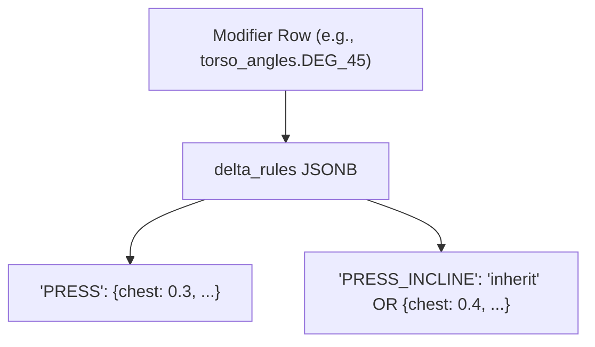

# Matrix V2 Unified Authoring Workstation

## What I Found (Current State vs Requirements)

### Already exists and will be reused:

- **MuscleTargetTree** ([admin/src/components/FieldRenderers/MuscleTargetTree.tsx](admin/src/components/FieldRenderers/MuscleTargetTree.tsx)) -- hierarchical `muscle_targets` editor with add/remove, score inputs, collapsible tree
- **DeltaRulesField** ([admin/src/components/FieldRenderers/DeltaRulesField.tsx](admin/src/components/FieldRenderers/DeltaRulesField.tsx)) -- full delta rules editor with inherit toggle, `DeltaMuscleTree`, `ReadOnlyMuscleTree` (before/after overlay)
- **Shared scoring pipeline** ([shared/scoring/resolveDeltas.ts](shared/scoring/resolveDeltas.ts), [shared/scoring/computeActivation.ts](shared/scoring/computeActivation.ts)) -- `resolveSingleDelta`, `resolveAllDeltas`, `flattenMuscleTargets`, `sumDeltas`, `applyDeltas`, `computeActivation`
- **Score policies** ([shared/policy/scorePolicy.ts](shared/policy/scorePolicy.ts))
- **MatrixV2ConfigPanel** ([admin/src/pages/MatrixV2ConfigPanel.tsx](admin/src/pages/MatrixV2ConfigPanel.tsx)) -- full config CRUD, scope picker, validate/activate/clone/export/import, resolver preview
- **ScoringPanel** ([admin/src/pages/ScoringPanel.tsx](admin/src/pages/ScoringPanel.tsx)) -- trace/lint/manifest (separate page, pattern to reference)
- **Backend** -- Matrix V2 resolver, config service, 3-layer validation, all CRUD endpoints for modifier rows and motions

### Critical data model alignment:

The prompt's "delta branch model" maps **directly** to the existing system:




- **No new tables or migrations needed** -- the motion-keyed entries in `delta_rules` JSONB ARE the "branches"
- `"inherit"` already walks `parent_id` chain via `resolveSingleDelta()`
- `DeltaRulesField` already has an inherit toggle per motion
- Save Baseline = `PUT /api/admin/tables/motions/rows/:id` with `{ muscle_targets: ... }`
- Save Delta Branch = `PUT /api/admin/tables/:modifierTable/rows/:rowId` with updated `delta_rules`
- Save Matrix Config = `PUT /api/admin/matrix-configs/:id`

### What does NOT exist:

- Unified workstation layout (baseline + deltas + constraints + simulation on one screen)
- Client-side live scoring wired into the V2 panel
- Provenance chips for delta source
- Dirty indicators per write domain
- Localized save buttons (Save Baseline, Save Delta Branch independently)
- Baseline vs Effective comparison view
- Top-3 impact callout
- Semantics dictionary shared artifact (referenced in plans, never created)
- Coaching cues panel, joint-action/ROM summary, realism advisory
- Diff against active config
- Explicit preview context selector for group scope

---

## Proposed Implementation Plan (4 Phases)

### Phase 1: Workstation Foundation (Recommended First PR)

**Goal:** Add motion selection context to V2 panel, embed baseline editor, and wire live client-side simulation.

#### 1a. Workstation state hook

Create `admin/src/hooks/useWorkstationState.ts`:

- Tracks the selected motion in V2 context (separate from scope picker)
- Loads motion's `muscle_targets` as editable local state
- Tracks dirty flags per domain: `baselineDirty`, `deltaDirty`, `configDirty`
- Provides `saveBaseline()` -- calls `api.updateRow('motions', motionId, { muscle_targets })`
- Provides `saveDeltaBranch(tableKey, rowId, updatedDeltaRules)` -- calls `api.updateRow(tableKey, rowId, { delta_rules })`

#### 1b. Client-side simulation hook

Create `admin/src/hooks/useScoringSimulation.ts`:

- Imports `resolveAllDeltas` and `computeActivation` from `shared/scoring/`
- Accepts: `motionId`, `muscleTargets` (local/unsaved), `selectedModifiers` (from matrix config defaults or custom combo), `modifierTableData`, `motionsMap`
- Returns: `ActivationResult` (baseScores, finalScores, rawScores, appliedDeltas)
- Debounces recomputation at ~150ms
- Memoizes flattened trees and derived outputs
- Uses local unsaved state for both baseline and delta edits

#### 1c. Motion selector in V2 panel

Modify [admin/src/pages/MatrixV2ConfigPanel.tsx](admin/src/pages/MatrixV2ConfigPanel.tsx):

- When a scope is selected (group or motion), add a **motion context selector** below the scope picker
- For `motion_group` scope: show dropdown of child motions in that family
- For `motion` scope: auto-select that motion
- This selected motion drives the baseline card, delta cards, and simulation preview

#### 1d. Baseline card

Create `admin/src/components/workstation/BaselineCard.tsx`:

- Reuses `MuscleTargetTree` from existing [FieldRenderers/MuscleTargetTree.tsx](admin/src/components/FieldRenderers/MuscleTargetTree.tsx)
- Wraps it with:
  - Header: "Baseline Muscle Targets -- [Motion Label]"
  - Dirty indicator badge
  - **Save Baseline** button (writes ONLY to motions table)
  - Success/error toast per save
- Reads from local workstation state (unsaved edits reflect in simulation)

#### 1e. Simulation preview panel

Create `admin/src/components/workstation/SimulationPreview.tsx`:

- Replaces the right-side "Resolved Preview" raw JSON section
- Sections:
  1. **Mode toggle**: "Simulate Defaults" / "Custom Test Combo"
  2. **Baseline vs Effective** side-by-side (flat muscle scores, color-coded deltas)
  3. **Per-muscle delta** display with +/- indicators
  4. **Top-3 Impact Callout** (top 3 muscles by absolute delta shift)
  5. **Simulation provenance chips**: "Local Unsaved Baseline + Saved Delta Branches + Draft Matrix Config"
- In "Simulate Defaults" mode, uses `default_row_id` from matrix config for each applicable table
- In "Custom Test Combo" mode, renders mini modifier row selectors filtered to allowed rows

#### 1f. Layout refactor

Restructure MatrixV2ConfigPanel from current 2-column to 3-section layout:

```
+--------------------+--------------------------------+------------------------+
| Left Sidebar       | Center Editing Area            | Right Preview          |
| (272px)            |                                | (320px)                |
|                    | [Toolbar: Save/Validate/etc]   |                        |
| Scope Picker       |                                | Simulation Preview     |
| Config List        | [Baseline Card]                |   Mode toggle          |
|                    |                                |   Base vs Effective    |
| Motion Context     | [Modifier Table Cards          |   Per-muscle deltas    |
|   Selector         |  with delta editing]           |   Top-3 impact         |
|                    |                                |   Provenance chips     |
|                    | [Matrix Config (tables/rows/   |                        |
|                    |  defaults/rules)]              | Validation Panel       |
|                    |                                |   (existing)           |
+--------------------+--------------------------------+------------------------+
```

---

### Phase 2: Delta Branch Integration

**Goal:** Embed per-row delta editing into modifier table cards, with inherit/override UI and provenance.

#### 2a. Delta branch editor per allowed row

Create `admin/src/components/workstation/DeltaBranchCard.tsx`:

- For each modifier table that is `applicability: true`, for each `allowed_row_id`:
  - Show the row label (e.g., `torsoAngles.DEG_45`)
  - Show delta source mode chip: `Inherited from PRESS` or `Custom override for PRESS_INCLINE`
  - If primary motion: show `DeltaMuscleTree` (editable) directly
  - If child motion:
    - **Inherit toggle**: ON = show parent's deltas read-only; OFF = show editable custom override
    - When toggling OFF (inherit -> custom): **clone parent's delta** as starting point
    - When toggling ON (custom -> inherit): confirm dialog before switching (soft-preserve old override in local state)
  - **Save Delta Rule Branch** button per row (writes only that row's `delta_rules` to the modifier table)
  - Dirty indicator per row

#### 2b. Integrate delta cards into table config cards

Modify the modifier table card expansion in MatrixV2ConfigPanel:

- Below the existing "Allowed Rows" and "Default" sections, add a collapsible "Delta Scoring" section
- This section contains DeltaBranchCards for each allowed row
- Delta edits flow into the simulation preview in real-time (via local state)

#### 2c. Simulation receives local delta edits

Update `useScoringSimulation`:

- Accept `localDeltaOverrides: Record<tableKey.rowId, Record<muscleId, number>>` for unsaved delta changes
- When computing, overlay local delta edits on top of loaded modifier data
- Provenance chips update: "Local Unsaved Baseline + **Local Unsaved Delta Branches** + Draft Matrix Config"

---

### Phase 3: Workflow Polish and Guardrails

**Goal:** Workflow accelerators, safety, and UX improvements.

#### 3a. Save and Next Motion

Add to toolbar:

- **Save and Next Motion** button: fires localized saves for all dirty domains (baseline, delta branches, config), then advances motion selection to next sibling in family
- Surfaces partial failure clearly (e.g., "Baseline saved, delta save failed for torsoAngles.DEG_45")

#### 3b. Dirty indicators

Create `admin/src/components/workstation/DirtyBadge.tsx`:

- Small colored dot/badge for each write domain: baseline, each delta branch, config
- Yellow = unsaved changes, green = saved, red = save error
- Show in toolbar area as summary: "2 unsaved changes"

#### 3c. Group preview context selector

Modify the "Preview" button behavior for group scope:

- Instead of silently using first child motion, show a dropdown: "Preview as: [child motion selector]"
- Remove hidden "first child motion" behavior

#### 3d. Inherited rule visibility

In the table config cards, when viewing a motion-scope config:

- Show inherited group rules with a visual marker (dimmed / "inherited" tag)
- Show tombstoned rules with strikethrough
- Local rules shown normally

#### 3e. Diff against active (basic)

If an active config exists for the same scope:

- Add a "Compare to Active" toggle in the right panel
- Show basic diff: tables added/removed, rows added/removed, defaults changed
- Use color coding (green = added, red = removed, yellow = changed)

---

### Phase 4: Simulation Enrichment and Shared Artifacts

**Goal:** Complete the simulation preview output and create shared semantic artifacts.

#### 4a. Coaching cue panel (stub)

- Add a "Coaching Cues" collapsible section in the simulation preview
- If modifier rows have `coaching_cue_examples` in their data, show merged cues for current combo
- If data doesn't exist yet: show "No coaching cues available" with a note

#### 4b. Joint-Action and ROM summary

- Add a read-only summary section derived from the selected modifier combo
- ROM quality flag: full / partial / lockout-bias / stretch-biased
- Derived client-side from modifier metadata (if available) or shared policy

#### 4c. Realism advisory flag

Create `shared/policy/realismAdvisory.ts`:

- Green / yellow / red badge based on score distribution sanity
- Input: ActivationResult
- Rules: e.g., total delta magnitude > threshold = yellow, any muscle clamped at max = yellow, extreme negative deltas = red
- Non-blocking, informational

#### 4d. Semantics dictionary (stub)

Create `shared/semantics/dictionary.ts`:

- Exports per-modifier-table semantic descriptors
- Coaching cue templates, joint action labels, ROM descriptors
- Stub/foundation that can be populated over time
- Not stored in `motion_matrix_configs` payload -- kept as importable shared code

#### 4e. Documentation updates

Update [MATRIX_V2_CONFIG_OVERVIEW.md](MATRIX_V2_CONFIG_OVERVIEW.md):

- Add "Unified Authoring Workstation" section describing the new layout
- Document: constraint resolver vs scoring simulation separation
- Document: parent/child delta branch inheritance model (mapping to existing delta_rules)
- Document: client-side simulation architecture
- Document: localized save paths
- Document: preview provenance
- Mark current implementation status vs TODOs

Update [docs/currentdocs/BIOMECHANICS_ARCHITECTURE.md](docs/currentdocs/BIOMECHANICS_ARCHITECTURE.md):

- Cross-link to Matrix V2 workstation docs
- Note the V2 workstation as the primary authoring surface for delta scoring

---

## Exact Files to Change

### New files:

- `admin/src/hooks/useWorkstationState.ts` -- unified state management
- `admin/src/hooks/useScoringSimulation.ts` -- client-side scoring hook
- `admin/src/components/workstation/BaselineCard.tsx` -- muscle_targets editor card
- `admin/src/components/workstation/DeltaBranchCard.tsx` -- per-row delta editor with inheritance
- `admin/src/components/workstation/SimulationPreview.tsx` -- live scoring preview panel
- `admin/src/components/workstation/DirtyBadge.tsx` -- dirty state indicator
- `shared/policy/realismAdvisory.ts` -- realism flags (Phase 4)
- `shared/semantics/dictionary.ts` -- semantics dictionary stub (Phase 4)

### Modified files:

- `admin/src/pages/MatrixV2ConfigPanel.tsx` -- major refactor to workstation layout
- `admin/src/api.ts` -- no new API methods needed (existing `updateRow` and matrix config APIs suffice)
- `MATRIX_V2_CONFIG_OVERVIEW.md` -- documentation updates
- `docs/currentdocs/BIOMECHANICS_ARCHITECTURE.md` -- cross-links

### NO backend changes needed for Phases 1-3:

- Save baseline uses existing `PUT /api/admin/tables/motions/rows/:id`
- Save delta uses existing `PUT /api/admin/tables/:key/rows/:id`
- Save config uses existing `PUT /api/admin/matrix-configs/:id`
- All data in modifier rows and motions table already supports the delta branch model

---

## Data Shape Clarification (No Changes Needed)

The existing data shapes already support the requirements:

**motions.muscle_targets** (hierarchical, stored in motions table):

```typescript
// Record<string, MuscleTargetNode> where MuscleTargetNode = { _score: number; [child]: MuscleTargetNode | number }
{ "CHEST": { "_score": 3.2, "UPPER_CHEST": { "_score": 2.1, "CLAVICULAR_HEAD": { "_score": 1.8 } } } }
```

**modifier_row.delta_rules** (motion-keyed branches, stored in each modifier table row):

```typescript
// Record<motionId, Record<muscleId, number> | "inherit">
{ "PRESS": { "CHEST": 0.3, "TRICEPS": 0.1 }, "PRESS_INCLINE": "inherit", "PRESS_DECLINE": { "LOWER_CHEST": 0.15 } }
```

**motion_matrix_configs.config_json** (constraint config, stored in motion_matrix_configs table):

```typescript
// MatrixConfigJson -- no changes to shape
{ meta: {}, tables: { torsoAngles: { applicability: true, allowed_row_ids: [...], default_row_id: "DEG_0", ... } }, rules: [], extensions: {} }
```

---

## Risks / Assumptions / Compromises

- **Performance**: Loading all modifier table data for client-side simulation could be heavy for large datasets. Mitigation: load only allowed rows per matrix config, debounce simulation, memoize aggressively.
- **Coaching cues / ROM / joint-action data**: May not exist in current modifier row data. Phase 4 items will be stubs until data is authored.
- **Semantics dictionary**: Starting as a stub -- real content requires biomechanics authoring which is separate from this engineering work.
- **Diff against active**: Implementing full structural diff is non-trivial. Phase 3 targets a basic summary diff only.
- **No backend changes for scoring simulation**: All scoring math runs client-side using shared utilities. This is intentional for zero-latency feedback.
- **Rule authoring UI**: Remains JSON/manual for now. The visual rule builder is documented as a future phase and does not block the workstation rollout.
- **Active uniqueness race condition**: Known existing gap -- not addressed in this plan (documented in existing Known Gaps).

---

## Recommended First PR Slice

**Phase 1 (1a through 1f)**: Workstation foundation.

This delivers the highest immediate value:

- Logan can select a motion, see and edit its baseline `muscle_targets`, and see live scoring simulation
- Simulation uses defaults from matrix config and shows base vs effective scores
- Save Baseline writes only to motions table
- All existing V2 config functionality preserved
- Clear separation of write domains visible from day one

Estimated scope: ~5 new files, 1 major file modification, ~800-1200 lines of new code.