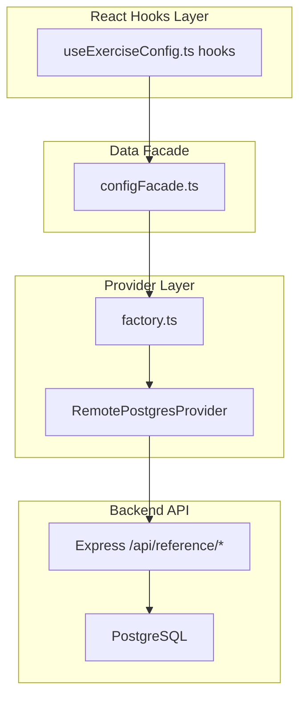

# Mobile App Dead Code Cleanup

Both feature flags in `featureFlags.ts` are permanently `true`, making the entire local SQLite data layer dead code. Additionally, several components and hooks are never used. This plan removes all dead code while keeping AsyncStorage caching intact.

## What Gets Deleted

### Dead Files (~2,200 lines)

| File | Lines | Why Dead |
| ---- | ----- | -------- |

- **[src/database/initDatabase.ts](src/database/initDatabase.ts)** (~1,567 lines) -- SQLite init, table creation, migrations, seeding. Never called when `USE_BACKEND_REFERENCE` is `true`.
- **[src/database/exerciseConfigService.ts](src/database/exerciseConfigService.ts)** (~546 lines) -- All SQLite queries. Only consumer is `configFacade.ts`, which bypasses it when the flag is `true`.
- **[src/database/providers/localProvider.ts](src/database/providers/localProvider.ts)** (92 lines) -- `LocalJsonSqliteProvider` class. Never instantiated because `factory.ts` always creates `RemotePostgresProvider`.
- **[src/components/ExerciseComposer/](src/components/ExerciseComposer/)** (entire directory, 5 files) -- `ExerciseComposerScreen`, `ActivationBar`, `ModifierSelector`, `useExerciseComposer`, `index.ts`. Exported but never imported anywhere outside the directory.
- **[src/components/WorkoutTemplate/hooks/useCustomKeyboard.ts](src/components/WorkoutTemplate/hooks/useCustomKeyboard.ts)** -- Hook defined but never imported.
- **[src/components/WorkoutTemplate/hooks/useWorkoutTimer.ts](src/components/WorkoutTemplate/hooks/useWorkoutTimer.ts)** -- Hook defined but never imported (inline `elapsed` state used instead).
- **[src/components/WorkoutTemplate/components/MoveModeBanner.tsx](src/components/WorkoutTemplate/components/MoveModeBanner.tsx)** -- Component only imported by its own test file; never used in production code.
- **[src/components/WorkoutTemplate/components/MoveModeBanner.test.tsx](src/components/WorkoutTemplate/components/MoveModeBanner.test.tsx)** -- Test for the unused component above.

### Dead JSON Data Files (20 of 23 files in `src/database/tables/`)

These are only consumed by `initDatabase.ts` (seeding) and `exerciseConfigService.ts` (both dead). Delete all **except**:

- `equipmentIcons.json` -- still used by `configFacade.ts` line 266
- `muscles.json` -- still directly imported by `MotionPickerModal.tsx` line 15
- `equipment.json` -- still used by `constants/data.js` line 2

Files to delete: `exerciseCategories.json`, `cardioTypes.json`, `trainingFocus.json`, `motions.json`, `motionPaths.json`, `grips.json`, `gripWidths.json`, `equipmentCategories.json`, `footPositions.json`, `stanceTypes.json`, `stanceWidths.json`, `torsoAngles.json`, `torsoOrientations.json`, `supportStructures.json`, `elbowRelationship.json`, `loadingAids.json`, `rangeOfMotion.json`, `loadPlacement.json`, `executionStyles.json`, `resistanceOrigin.json`.

**However**: `motions.json` and `motionPaths.json` are also directly imported by [src/components/ExerciseEditor/EditExercise.tsx](src/components/ExerciseEditor/EditExercise.tsx) (lines 349-350). These two must be **kept** as well. That makes 5 JSON files kept, 18 deleted.

## What Gets Refactored

### 1. [src/database/configFacade.ts](src/database/configFacade.ts)

Currently a facade that routes between `exerciseConfigService` (SQLite) and the backend bootstrap based on the flag. After cleanup:

- Remove `import * as svc from "./exerciseConfigService"` and `export * from "./exerciseConfigService"`
- Remove all `if (!FEATURE_FLAGS.USE_BACKEND_REFERENCE) return svc.`* branches from every function
- The type exports that came from `exerciseConfigService` (e.g., `ExerciseCategory`, `CardioType`, `Muscle`, etc.) need to be moved. Define them directly in `configFacade.ts` or a new `types.ts` file.
- Remove the `FEATURE_FLAGS` import since no branching remains.

### 2. [src/database/providers/factory.ts](src/database/providers/factory.ts)

- Remove the `else` branch (lines 19-21) that creates `LocalJsonSqliteProvider`
- Remove import of `LocalJsonSqliteProvider`
- Remove import of `FEATURE_FLAGS` (no branching needed)
- Always create `RemotePostgresProvider`

### 3. [src/database/providers/index.ts](src/database/providers/index.ts)

- Remove `export { LocalJsonSqliteProvider }` line

### 4. [src/database/useExerciseConfig.ts](src/database/useExerciseConfig.ts)

- Remove `initExerciseConfigDatabase()` function entirely (it's a no-op)
- Remove `dbInitialised` variable
- Remove `FEATURE_FLAGS` import
- All hooks remain unchanged (they already use `configFacade`)

### 5. [src/context/WorkoutContext.tsx](src/context/WorkoutContext.tsx)

- Remove `import { initExerciseConfigDatabase }` (line 5)
- Remove the dead `if (!FEATURE_FLAGS.USE_BACKEND_REFERENCE)` block (lines 62-64)
- Remove `FEATURE_FLAGS` import if no longer needed

### 6. [src/config/featureFlags.ts](src/config/featureFlags.ts)

- Remove both `USE_BACKEND_REFERENCE` and `USE_BACKEND_USERDATA` flags and all related comments/types
- Keep `BACKEND_PORT` and `REFERENCE_API_BASE_URL` (still used)

### 7. Remove all remaining flag checks across the codebase

Search for and remove all `FEATURE_FLAGS.USE_BACKEND_REFERENCE` and `FEATURE_FLAGS.USE_BACKEND_USERDATA` checks, keeping only the "flag is true" code paths.

### 8. `expo-sqlite` dependency

After cleanup, no file in `src/` imports `expo-sqlite`. It can be removed from `package.json` dependencies.

## Data Flow After Cleanup

## Files Unchanged

- All AsyncStorage reads/writes in context files (offline caching kept)
- `remoteProvider.ts`, `types.ts` in providers
- `resolveBackendUrl.ts`
- `api/client.ts`
- All screens, most components, all context files (except minor import cleanups)

