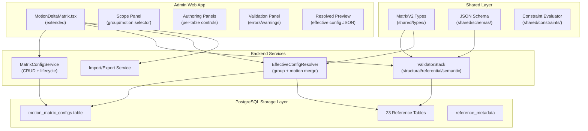
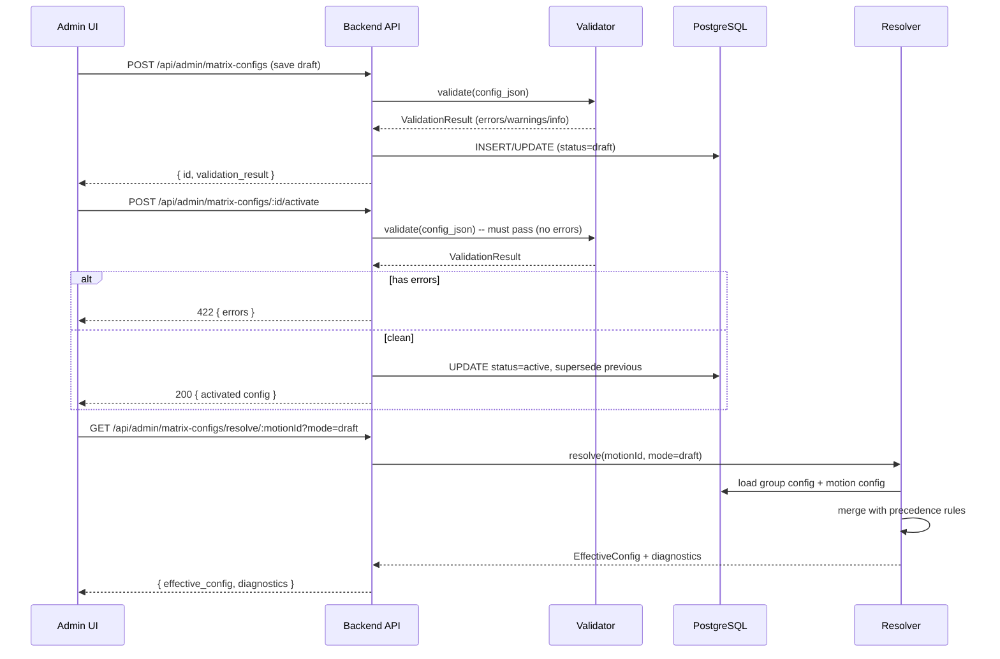
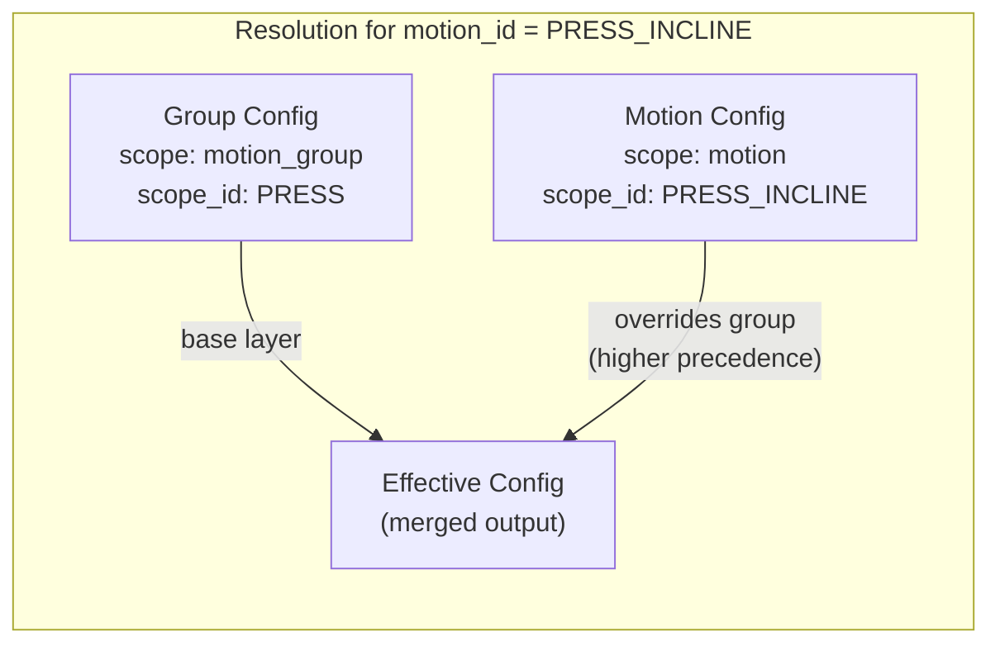
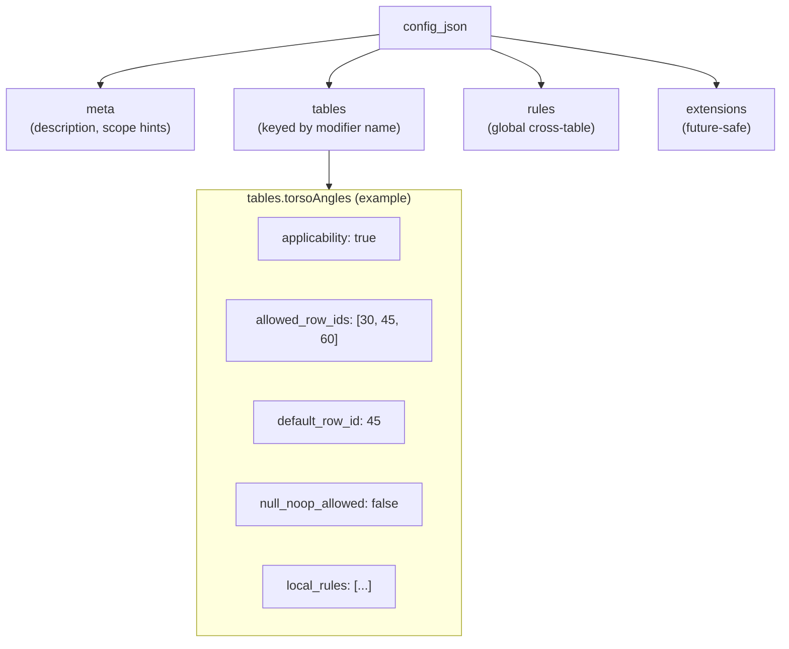
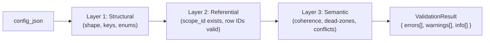
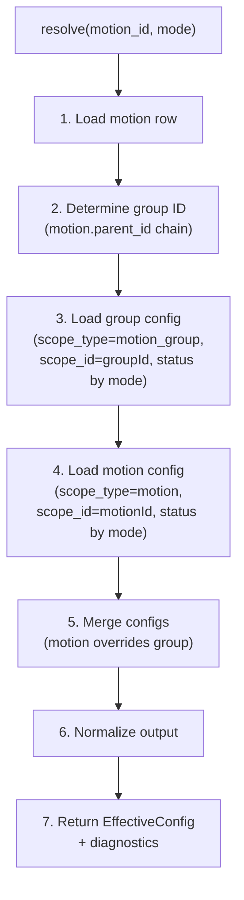
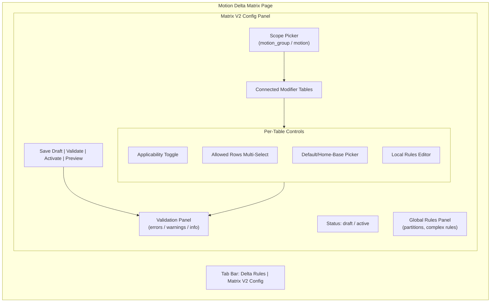
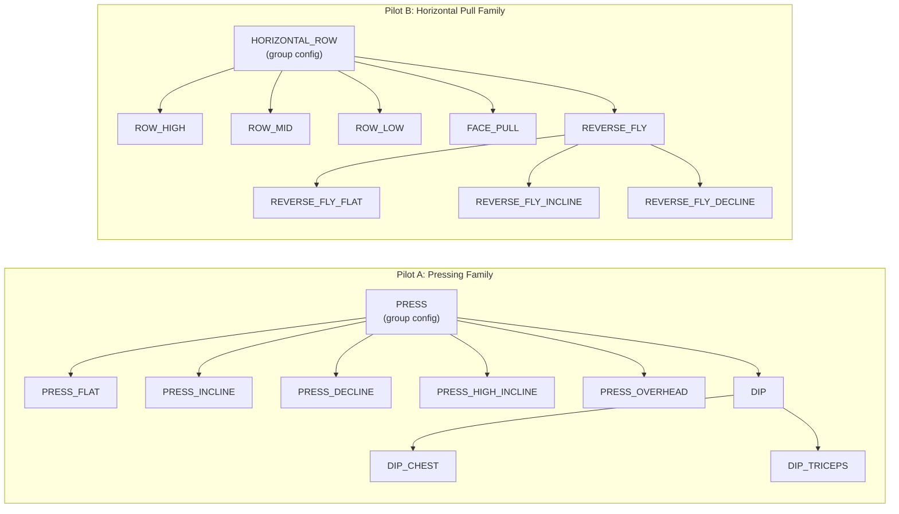
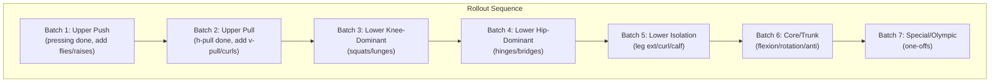

# Motion Delta Matrix V2 -- Actionable Execution Plan

## Context

The existing codebase has:

- **23 reference tables** in PostgreSQL via Drizzle ORM (`[backend/src/drizzle/schema/referenceTables.ts](backend/src/drizzle/schema/referenceTables.ts)`)
- **Admin CRUD** via `[backend/src/admin/pgCrud.ts](backend/src/admin/pgCrud.ts)`
- **Table registry** at `[backend/src/admin/tableRegistry.ts](backend/src/admin/tableRegistry.ts)` driving all admin UI
- **Existing Motion Delta Matrix** UI at `[admin/src/pages/MotionDeltaMatrix.tsx](admin/src/pages/MotionDeltaMatrix.tsx)`
- **Constraint evaluator** at `[shared/constraints/evaluator.ts](shared/constraints/evaluator.ts)` with dead-zone logic
- **Scoring engine** at `[shared/scoring/](shared/scoring/)` (resolveDeltas, computeActivation)
- **SQL migrations** at `[backend/src/drizzle/migrations/](backend/src/drizzle/migrations/)`
- **Docker** setup with PostgreSQL 16 (docker-compose.yml)

Matrix V2 adds a **new layer** on top of this: scoped configuration rules that govern which modifier rows are applicable, default, excluded, or conditionally hidden -- per motion family or individual motion.

---

## Architecture Overview




---

## Data Flow: Draft to Active Lifecycle




---

## Scope Precedence Model




**Single-parent hierarchy (locked):** Each motion has exactly one `parent_id`; there is no multi-parent inheritance. Group derivation walks the single parent chain to the root.

**Precedence rule (locked):** `motion` overrides `motion_group`. If a field is absent at motion scope, inherit from group. If group is also absent, use system defaults.

---

## Stage 1 -- Core Infrastructure (Phase 2)

### 1.1 New `motion_matrix_configs` Table

**File:** New migration `backend/src/drizzle/migrations/0003_matrix_configs.sql`
**Schema:** New export in `[backend/src/drizzle/schema/referenceTables.ts](backend/src/drizzle/schema/referenceTables.ts)`

```sql
CREATE TABLE IF NOT EXISTS motion_matrix_configs (
  id            TEXT PRIMARY KEY,
  scope_type    TEXT NOT NULL CHECK (scope_type IN ('motion', 'motion_group')),
  scope_id      TEXT NOT NULL,
  status        TEXT NOT NULL DEFAULT 'draft' CHECK (status IN ('draft', 'active')),
  schema_version TEXT NOT NULL DEFAULT '1.0',
  config_version INTEGER NOT NULL DEFAULT 1,
  config_json   JSONB NOT NULL DEFAULT '{}',
  notes         TEXT,
  validation_status TEXT CHECK (validation_status IN ('valid', 'warning', 'error')),
  validation_summary JSONB,
  created_at    TIMESTAMPTZ NOT NULL DEFAULT NOW(),
  updated_at    TIMESTAMPTZ NOT NULL DEFAULT NOW(),
  published_at  TIMESTAMPTZ,
  created_by    TEXT,
  updated_by    TEXT
);

CREATE INDEX idx_mmc_scope ON motion_matrix_configs (scope_type, scope_id, status);
CREATE INDEX idx_mmc_scope_updated ON motion_matrix_configs (scope_type, scope_id, updated_at);
```

**Drizzle schema addition** -- add to `referenceTables.ts` following existing patterns (pgTable, text columns, jsonb for config_json).

**pgAdmin visibility:** This table will appear in pgAdmin alongside the 23 existing reference tables. Queryable via `SELECT * FROM motion_matrix_configs WHERE scope_type = 'motion_group' AND status = 'active'`.

---

### 1.2 Shared TypeScript Types

**File:** `shared/types/matrixV2.ts` (new)

Key types to define:

- `MatrixScopeType` = `'motion' | 'motion_group'`
- `MatrixConfigStatus` = `'draft' | 'active'`
- `MatrixConfigRow` -- flat metadata row shape
- `MatrixConfigJson` -- the `config_json` payload shape with `meta`, `tables`, `rules`, `extensions`
- `TableConfig` -- per-modifier-table config (applicability, allowed_row_ids, default, local rules)
- `LocalRule` / `GlobalRule` -- declarative rule shapes with stable `rule_id`
- `ValidationMessage` -- `{ severity, code, path, message, suggested_fix?, rule_id? }`
- `ResolverOutput` -- effective config + diagnostics
- `RuleTombstone` -- `{ rule_id, _tombstoned: true }`

**Integration:** Import from `shared/types/` in both backend and admin app (same pattern used by existing `shared/scoring/` and `shared/constraints/`).

---

### 1.3 `config_json` Payload Structure




Each table config object maps directly to one of the 15 modifier tables already registered in `[tableRegistry.ts](backend/src/admin/tableRegistry.ts)`:

- `motionPaths`, `torsoAngles`, `torsoOrientations`, `resistanceOrigin`, `grips`, `gripWidths`, `elbowRelationship`, `executionStyles`, `footPositions`, `stanceWidths`, `stanceTypes`, `loadPlacement`, `supportStructures`, `loadingAids`, `rangeOfMotion`

---

### 1.4 Validator Stack

**File:** `shared/validators/matrixV2Validator.ts` (new)

Three layers, each returning `ValidationMessage[]`:




- **Layer 1 (Structural):** Validates JSON shape against schema -- required keys, allowed enums, no unknown top-level keys outside `extensions`. Runs client-side AND server-side. Use existing Zod patterns from `shared/schemas/`.
- **Layer 2 (Referential):** Validates `scope_id` against `motions` table, modifier table names against registry, row IDs against actual table data. Requires database access -- backend-only. Leverages existing `pgCrud.listRows()` and `pgCrud.rowExists()`.
- **Layer 3 (Semantic):** Validates logical coherence -- default row in allowed set, no rules on inapplicable tables, no conflicting local/global rules, partition overlaps. Builds on existing `shared/constraints/evaluator.ts` patterns.

---

### 1.5 Resolver Engine

**File:** `backend/src/services/matrixV2Resolver.ts` (new)




**Merge rules (locked):**

- Applicability: motion overrides group
- Allowed rows: motion **replaces** group (not union)
- Default: motion overrides group
- Local rules: merge by `rule_id` (motion wins on collision)
- Global rules: merge by `rule_id` (motion wins on collision)
- Tombstones: motion-level `{ rule_id, _tombstoned: true }` removes inherited group rule
- Absent fields: inherit from group

**Group identity:** Use `motions.parent_id` to walk up the hierarchy to find the root/family motion ID. This aligns with how motions are already grouped in the existing Matrix UI (see `MotionDeltaMatrix.tsx` which groups by parent).

---

### 1.5b Resolver Output Versioning (Locked)

The `ResolverOutput` type must include explicit provenance metadata so that "why did this preview change?" is always answerable at scale.

**Required fields on every resolver response:**

- `resolver_version` -- semver string identifying the resolver algorithm version (e.g., `"1.0.0"`). Increment on any merge-logic or precedence change. This lets consumers detect whether a changed preview is due to config edits vs resolver behavior changes.
- `resolved_from` -- provenance block containing:
  - `group_config_id` / `group_config_version` / `group_status` (or `null` if no group config)
  - `motion_config_id` / `motion_config_version` / `motion_status` (or `null` if no motion config)
  - `resolved_at` -- ISO timestamp of resolution

**Why this matters:** Once coverage scales past the two pilot families, debugging "the preview changed but I didn't edit anything" becomes a real support cost. With `resolved_from`, the admin can immediately see whether the group config was updated by someone else, whether a new active version was published, or whether the resolver itself was upgraded.

**Type addition to `shared/types/matrixV2.ts`:**

```typescript
interface ResolvedFrom {
  group_config_id: string | null;
  group_config_version: number | null;
  group_status: MatrixConfigStatus | null;
  motion_config_id: string | null;
  motion_config_version: number | null;
  motion_status: MatrixConfigStatus | null;
  resolved_at: string; // ISO 8601
}

interface ResolverOutput {
  resolver_version: string;
  resolved_from: ResolvedFrom;
  motion_id: string;
  resolved_group_id: string | null;
  mode: 'active_only' | 'draft_preview';
  effective_tables: Record<string, EffectiveTableConfig>;
  effective_rules: GlobalRule[];
  diagnostics: ValidationMessage[];
}
```

---

### 1.5c Deterministic Hash Canonicalization Utility (Locked)

Deterministic `rule_id` hashing is critical for stable import/export round-trips, override targeting, and tombstone reliability. This must be implemented as a **single shared utility**, not ad hoc in UI and backend independently.

**File:** `shared/utils/deterministicHash.ts` (new)

**Required exports:**

- `canonicalizeRuleForHash(rule: LocalRule | GlobalRule): string` -- produces a stable canonical string from a rule object by:
  1. Deep-sorting all object keys alphabetically at every nesting level
  2. Sorting array values where order is not semantically meaningful (e.g., `allowed_row_ids`, `target_row_ids`)
  3. Stripping transient/non-semantic fields before hashing (e.g., `_ui_collapsed`, `_last_edited_by`, any field prefixed with `_`)
  4. Serializing to a deterministic JSON string (no whitespace variance)
- `generateRuleId(rule: LocalRule | GlobalRule): string` -- calls `canonicalizeRuleForHash()` then applies a stable hash algorithm (SHA-256 truncated to 16 hex chars, or equivalent). Returns the `rule_id`.
- `HASH_CONTRIBUTING_FIELDS` -- exported constant documenting which fields contribute to the hash, so the contract is inspectable and testable.

**Usage contract:**

- Backend uses `generateRuleId()` when saving/validating rules
- Admin UI uses `generateRuleId()` when creating new rules client-side
- Import pipeline uses `canonicalizeRuleForHash()` to verify round-trip stability
- Tombstones reference the `rule_id` of the original rule -- the hash of the original must remain the reference target even after the group rule is edited (tombstone targets are stored `rule_id` values, not recomputed)

**Test requirement:** Golden tests verifying that the same logical rule always produces the same `rule_id` regardless of key insertion order or transient field presence.

---

### 1.5d Soft-Delete Safety Guards (API Contract)

The `DELETE /:id` endpoint performs a soft-delete (sets a flag, does not destroy data). The service layer must enforce safety constraints to prevent orphaned or broken state.

**Locked constraints:**

1. **Cannot delete an active config without explicit deactivation/supersede.** If a config has `status = 'active'`, the DELETE endpoint must return `409 Conflict` with a message indicating the config must be deactivated first (either by activating a replacement, or by an explicit deactivate action). This prevents accidentally removing the only active config for a scope.
2. **Cannot delete the only config for a scope if it is referenced by active resolver output.** If caching or snapshotting is introduced later, the delete service must check for downstream references before proceeding. For Phase 1 (no caching), this is a design note enforced by the active-config guard above.
3. **Soft-deleted configs are excluded from resolver queries and list endpoints by default.** They remain in the database for audit/recovery but are invisible to normal operations unless explicitly queried with a `?include_deleted=true` flag.

**Implementation location:** `backend/src/services/matrixConfigService.ts` (or equivalent CRUD service). The route handler calls the service, which enforces these guards before marking the row as deleted.

---

### 1.6 Backend API Routes

**File:** `backend/src/routes/adminMatrixConfigs.ts` (new)

Mount at `/api/admin/matrix-configs` alongside existing admin routes.


| Endpoint             | Method | Purpose                                               |
| -------------------- | ------ | ----------------------------------------------------- |
| `/`                  | GET    | List configs (filter by scope_type, scope_id, status) |
| `/`                  | POST   | Create new config (draft)                             |
| `/:id`               | GET    | Get single config                                     |
| `/:id`               | PUT    | Update draft config                                   |
| `/:id`               | DELETE | Soft-delete config                                    |
| `/:id/validate`      | POST   | Run full validation, return results                   |
| `/:id/activate`      | POST   | Activate (blocks on errors)                           |
| `/:id/clone`         | POST   | Clone config to new draft                             |
| `/resolve/:motionId` | GET    | Resolve effective config (?mode=active                |
| `/export/:id`        | GET    | Export config as JSON                                 |
| `/import`            | POST   | Import config JSON (preview + create draft)           |


**Pattern:** Follow existing admin route patterns in the backend (pool-based Postgres queries via pgCrud helpers).

---

### 1.7 Admin UI Extension

**File:** Extend `[admin/src/pages/MotionDeltaMatrix.tsx](admin/src/pages/MotionDeltaMatrix.tsx)`

The existing matrix already shows motions x modifier tables as a heatmap with side-panel editing. V2 adds a **new tab or panel mode** for matrix config authoring:




**Key UI components to build:**

- `MatrixV2ConfigPanel` -- main container with scope selection and lifecycle controls
- `ModifierTableConfigCard` -- per-modifier-table authoring card (applicability toggle, row picker, default picker, local rule list)
- `GlobalRulesPanel` -- cross-table rule authoring
- `ValidationResultPanel` -- structured error/warning display with path-based navigation
- `ResolvedPreviewPanel` -- raw JSON preview of resolver output

**API integration:** Use existing `admin/src/api.ts` pattern to add matrix config API calls.

---

### 1.8 Import/Export

**Pattern:** Follow existing CSV/TSV export pattern in `MotionDeltaMatrix.tsx` but for JSON.

- **Export:** GET `/api/admin/matrix-configs/export/:id` returns full config row (metadata + config_json) as deterministic JSON
- **Import:** POST `/api/admin/matrix-configs/import` accepts JSON, runs validation preview, returns errors before committing as new draft
- **Round-trip safety:** Deterministic key ordering in exports, `rule_id` stability via deterministic hashing

---

## Stage 2 -- Governance + Pilot Families (Phase 3)

### 2.1 Global Semantics Dictionary

**File:** `docs/currentdocs/MODIFIER_SEMANTICS_DICTIONARY.md` (new)

One entry per modifier table documenting canonical meaning, interpretation basis, null/no-op policy, coaching cues. This is a documentation deliverable, not code -- but it informs validation rules and admin UI tooltips.

### 2.2 Pilot Families




**Before authoring:** Verify exact motion IDs against `src/database/tables/motions.json` to prevent ID drift.

### 2.3 Pilot Workflow

For each pilot family:

1. Create group-level config (applicability, allowed rows, defaults for each modifier table)
2. Add motion-specific overrides where the child differs from group
3. Add global partition rules (e.g., torso-angle ranges partitioned between incline/decline/flat)
4. Validate all configs (zero errors)
5. Preview resolved effective config for each child motion
6. Activate group + motion configs
7. Document issues found (categorized: semantics gap, missing row, rule pattern gap, UI gap, schema blocker)

---

## Stage 3 -- Scaled Rollout to 90% (Phase 4)




**Per-batch workflow:** Same as pilot workflow. Use group configs for shared defaults, motion overrides only where needed. Target: 90% of motions with active, error-free matrix configs.

**Gap handling priority:** Existing rows > new rows in existing table > scoped rows > one-off table > schema change (blocker only).

---

## Stage 4 -- Hardening + Operationalization (Phase 5)

- **Test suite:** Validator tests (all 3 layers), resolver tests (group-only, motion-only, merged, tombstoned), lifecycle tests (draft save, activate blocked on errors, version increment)
- **Golden fixtures:** Canonical test configs for fake motions with expected resolved output
- **UX improvements:** Clone active-to-draft, compare draft vs active, inline inherited rule visibility, rule template insertion
- **Docs:** Authoring guide, troubleshooting guide, resolver endpoint docs, semantics dictionary
- **Performance:** Resolver latency check, validator caching, registry map memoization

---

## Key Integration Points with Existing Code


| Existing Module                   | How V2 Integrates                                                                             |
| --------------------------------- | --------------------------------------------------------------------------------------------- |
| `referenceTables.ts` (Drizzle)    | Add `motionMatrixConfigs` table definition                                                    |
| `tableRegistry.ts`                | Add matrix config schema entry; use registry for modifier table name validation               |
| `pgCrud.ts`                       | New `MatrixConfigCrud` service following same patterns (pool queries, JSONB handling)         |
| `MotionDeltaMatrix.tsx`           | Add V2 config tab/panel; reuse motion grouping, muscle tree, table iteration logic            |
| `shared/constraints/evaluator.ts` | Resolver can delegate applicability checks; V2 configs become the source for constraint state |
| `shared/scoring/resolveDeltas.ts` | Unchanged in Phase 1; later phases connect matrix-resolved defaults to delta resolution       |
| `migrations/`                     | Add `0003_matrix_configs.sql`                                                                 |
| `docker-compose.yml`              | No changes needed; new table auto-created via migration                                       |
| pgAdmin                           | Table visible and queryable immediately after migration runs                                  |


---

## pgAdmin / Docker Compatibility

The `motion_matrix_configs` table:

- Created via SQL migration (same pattern as `0000_schema.sql`)
- Visible in pgAdmin under the `onlyfit` database alongside all 23 reference tables
- `config_json` stored as JSONB -- fully queryable in pgAdmin (e.g., `SELECT config_json->'tables'->'torsoAngles' FROM motion_matrix_configs`)
- Indexes on `(scope_type, scope_id, status)` for fast lookups
- No Docker changes required -- migration runs on existing PostgreSQL 16 container

---

## Definition of Done (Phase 2 Exit Gate)

- `motion_matrix_configs` table created via migration and visible in pgAdmin
- Drizzle schema + shared TS types implemented
- Validator stack operational (3 layers, severity model)
- Resolver returns deterministic effective config (group + motion merge)
- Draft preview mode works for admin
- Admin UI can author/save/validate/activate matrix configs
- Import/export round-trip stable
- One smoke config: draft save -> validate -> activate -> resolve -> preview

