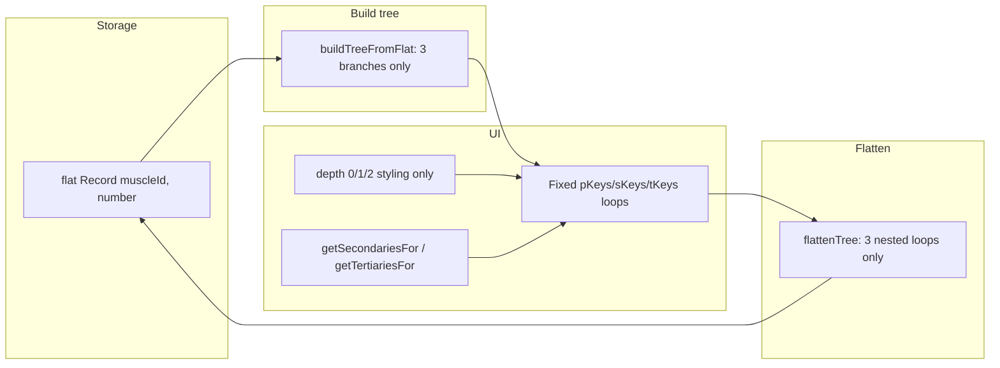

# Recursive Muscle Hierarchy Refactor

## Goal and importance

**Objective:** Replace every assumption of "exactly 3 levels" (primary → secondary → tertiary) with **recursive, depth-agnostic** logic so the MUSCLES table can support **any depth** (e.g. a 4th or 5th level) without data loss, broken UI, or inconsistent behavior.

**Why every touchpoint matters:**

- **Data integrity:** [DeltaRulesField](admin/src/components/FieldRenderers/DeltaRulesField.tsx) and [MotionPathsField](admin/src/components/FieldRenderers/MotionPathsField.tsx) use a 3-level `flattenTree`; saving drops any 4th-level scores. Missing one consumer would cause silent data loss.
- **Consistency:** If dropdowns, tables, and config trees treat depth differently (e.g. some recursive, some not), users see conflicting structure and wrong labels.
- **Future-proofing:** A single remaining `depth === 2 ? tertiary : ...` or `getTertiariesFor` forces the product to stay at 3 levels or risk bugs in that path.
- **Docs and types:** Types like `'primary' | 'secondary' | 'tertiary'` and docs that say "three levels" would mislead maintainers and block safe addition of deeper levels.

The plan below covers **every** place the hierarchy is used, then adds a review pass for gaps.

---

## Current state (3-level assumptions)

- **Storage:** Flat `Record<muscleId, number>` and `muscles.parent_ids` already support arbitrary depth; no change.
- **Build/flatten:** Multiple copies of `buildTreeFromFlat` and `flattenTree` assume exactly 3 levels; 4th level is dropped on save where flatten is used.
- **UI:** Many components branch on `depth === 0 | 1 | 2` or use `getMuscleLevel` / `getSecondariesFor` / `getTertiariesFor` (fixed levels).

---

## 1. Shared recursive tree layer

**Goal:** One canonical implementation for build-tree-from-flat, flatten-tree, and depth/children helpers so all consumers stay in sync.

- **New (or extend) shared module** (e.g. under [shared/utils/](shared/utils/) or [shared/scoring/](shared/scoring/)):
  - **buildMuscleTreeFromFlat(flat, allMuscles): TreeNode** — Build tree recursively: for each (muscleId, score), resolve full ancestor chain from `parent_ids`, then place score at the correct leaf; internal nodes get _score from flat when present. Tree shape: `TreeNode = { _score: number; [childId: string]: TreeNode }` (no fixed depth).
  - **flattenMuscleTree(tree): Record<string, number>** — Recursively walk tree and emit every key (including nested) into flat map. Must visit all levels.
  - **recomputeScoresRecursive(tree): void** — For each node, _score = sum of children’s (recomputed) totals; recursion from leaves up.
  - **getDepthUnderRoot(muscleId, rootId, muscleMap): number** — Replace current `0 | 1 | 2` with numeric depth (0 = root, 1 = child of root, etc.).
  - **getChildrenOf(parentId, allMuscles): MuscleRecord[]** — Generic “children of this node”; replace usages of getSecondariesFor(pId) / getTertiariesFor(sId) where only “children” is meant.

**Files to add/change:**

- New: e.g. `shared/utils/muscleTree.ts` (or `shared/scoring/muscleTree.ts`) with the above.
- [shared/utils/muscleGrouping.ts](shared/utils/muscleGrouping.ts) — Already uses recursive `collectUnder` and depth-agnostic logic; confirm it needs no change beyond any shared types.

---

## 2. Admin: dropdown and grouping utilities

**File:** [admin/src/utils/muscleDropdownGroups.ts](admin/src/utils/muscleDropdownGroups.ts)

- **depthUnderRoot:** Change return type from `0 | 1 | 2` to `number`; implement by walking parent chain until root (cycle-safe).
- **secondaryIdUnderRoot:** Currently “parent if tertiary, else self if secondary.” Generalize to “parent id of this node under root” (parent in chain toward rootId); used for grouping options under their immediate parent at any depth.
- **buildOptionsForRoot / buildOptionsForSecondaryDropdown:** Instead of grouping only by “secondary” (depth 1), group by **immediate parent** under root. Each option gets a `depth: number` (depth under root). Sort by (parent label, then self label).
- **MuscleDropdownOption.depth:** Change from `1 | 2` to `number` (depth under the dropdown’s root).
- **buildPrimaryMuscleDropdownGroups / buildSecondaryMuscleDropdownGroups:** Use the updated buildOptions so that “secondary” dropdown under a root shows all descendants grouped by immediate parent, with correct depth for styling (e.g. indent by depth).

**File:** [admin/src/components/FieldRenderers/MuscleSecondarySelect.tsx](admin/src/components/FieldRenderers/MuscleSecondarySelect.tsx)

- Styling: today `opt.depth === 1` = bold, else `pl-5`. Use **depth-based indent**: e.g. `depth === 1` bold, `depth >= 2` indent by `(depth - 1) * 12px` (or similar) so 4th level gets more indent than tertiary.

---

## 3. Admin: delta rules and motion paths (critical — data loss today)

**Files:** [admin/src/components/FieldRenderers/DeltaRulesField.tsx](admin/src/components/FieldRenderers/DeltaRulesField.tsx), [admin/src/components/FieldRenderers/MotionPathsField.tsx](admin/src/components/FieldRenderers/MotionPathsField.tsx)

- **Replace local buildTreeFromFlat / flattenTree / recomputeScores** with shared **buildMuscleTreeFromFlat**, **flattenMuscleTree**, **recomputeScoresRecursive**.
- **Tree type:** Keep `TreeNode = { _score: number; [childId: string]: TreeNode }`; ensure all mutation helpers (add primary/secondary/tertiary, set score, remove) work over **arbitrary paths** (e.g. addChild(parentId, childId) or addAtPath(path: string[]), and ensure flatten writes every node).
- **Render:** Replace fixed `pKeys → sKeys → tKeys` loops with **recursive render**: one component that takes a node and depth, renders row + nest, and maps over `Object.keys(node).filter(k => k !== '_score')` for children; call itself for each child with `depth + 1`.
- **Styling:** Replace `depth === 0 ? rowPrimary : depth === 1 ? rowSecondary : rowTertiary` with **depth-based style**: e.g. `rowStyle = treeRowByDepth[depth] ?? treeRowDeep` (fallback for depth >= 3). Same for labelStyle, wrapperStyle, nestStyle.
- **Add-child flow:** Replace addPrimary/addSecondary/addTertiary with a single “add child under this node” (by parent id). At root (depth 0) keep using “secondary” dropdown (children of root); at depth >= 1 use “available children” of current node (from getChildrenOf). Ensure shared dropdown builder is used so new levels get correct depth/indent.
- **getMuscleLevel:** Remove or replace with shared **getDepthUnderRoot** where only depth is needed; if a label like “primary/secondary/tertiary” is still desired for display, derive from depth (e.g. 0 → primary, 1 → secondary, 2 → tertiary, 3+ → “level 4”, or generic “child”).
- **findPrimaryFor / findSecondaryFor:** Keep findPrimaryFor (root of chain); replace findSecondaryFor usages with “parent of this node” or “path to root” where needed; use getChildrenOf for “what can I add under this node?”

---

## 4. Admin: Motion Delta Matrix page

**File:** [admin/src/pages/MotionDeltaMatrix/index.tsx](admin/src/pages/MotionDeltaMatrix/index.tsx)

- **buildTreeFromFlat:** Replace with shared recursive build (or local copy that matches shared algorithm) so 4th-level muscles appear in the tree.
- **buildDeltaTreeFromFlat** (tooltip tree): Make recursive (same shape as TreeNode); render tooltip recursively so deeper levels are visible.
- **getSecondariesFor / getTertiariesFor:** Replace with **getChildrenOf(parentId)**.
- **Render:** Replace fixed pKeys/sKeys/tKeys nesting with recursive component; apply depth-based styling (reuse same pattern as DeltaRulesField).
- **getMuscleLevel:** Same as above (depth or derived label).

---

## 5. Admin: DeltaBranchCard (workstation)

**File:** [admin/src/components/workstation/DeltaBranchCard.tsx](admin/src/components/workstation/DeltaBranchCard.tsx)

- **deltaTree type:** Today `Record<string, { score, children: Record<string, { score, children: Record<string, number> }> }>`. Replace with **recursive type** e.g. `Record<string, { score: number; children: DeltaTree }>` (or same TreeNode shape as shared).
- **Build logic:** Use shared buildMuscleTreeFromFlat (or equivalent) so 4th level is present; avoid hardcoded “primary → secondary → tertiary” structure.
- **Render:** Recursive over `children`; depth-based row/label styling; “add” dropdown per node using getChildrenOf and shared dropdown options (depth under current root).
- **getSecondariesFor / getTertiariesFor:** Replace with getChildrenOf.

---

## 6. Admin: MuscleTargetTree and MotionConfigTree (already recursive structure)

**File:** [admin/src/components/FieldRenderers/MuscleTargetTree.tsx](admin/src/components/FieldRenderers/MuscleTargetTree.tsx)

- **Display tree:** Already recursive (buildNode with depth). No structural change.
- **Add dropdown at depth 0:** Uses buildSecondaryMuscleDropdownGroups(rootId). Once muscleDropdownGroups support N levels, this will show 4th level under the right parent with correct indent.
- **Add dropdown at depth >= 1:** Already uses “available children” (getAvailableChildren). Ensure that uses getChildrenOf so 4th-level muscles appear as addable under a tertiary.
- **Styling:** Currently only isRoot vs not; optional: add depth-based class for deeper levels (e.g. more indent or muted color for depth >= 3).

**File:** [admin/src/components/FieldRenderers/MotionConfigTree.tsx](admin/src/components/FieldRenderers/MotionConfigTree.tsx)

- **buildFlatTree:** Already recursive; no change.
- **renderNode:** Replace `depth === 0 ? rowPrimary : depth === 1 ? rowSecondary : rowTertiary` with depth-based lookup (and fallback for depth >= 3). Same for labelStyle, wrapperStyle, nestStyle.
- **Add at depth 0:** buildSecondaryMuscleDropdownGroups; will gain N levels from muscleDropdownGroups refactor.
- **Add at depth >= 1:** Already “available children”; ensure getChildrenOf so 4th level is addable.

---

## 7. Admin: MuscleHierarchyField and MuscleTree

**File:** [admin/src/components/FieldRenderers/MuscleHierarchyField.tsx](admin/src/components/FieldRenderers/MuscleHierarchyField.tsx)

- **MuscleTier:** Today `'primary' | 'secondary' | 'tertiary'`. Options: (A) extend to `'primary' | 'secondary' | 'tertiary' | 'quaternary'` and classify by depth, or (B) use **depth number** and derive labels (e.g. “Primary”, “Secondary”, “Level 3”, “Level 4”). Prefer (B) for scalability.
- **classifyMuscle:** Return depth (e.g. 0 = root, 1 = child of root, …) or keep tier with “tertiary” meaning “depth >= 2” and add “quaternary” for depth 3; then hierarchyItems and views must handle “depth 3” (e.g. quaternary-view: show parent chain and children).
- **Views:** primary-view (current record is root), secondary-view (current is depth 1), tertiary-view (current is depth 2). Add **generic “child-view”** for depth >= 3: show full parent chain and list of children (same UX as tertiary-view but for any depth). Ensure “Add parent” / “Add child” use getChildrenOf and parent chain logic so 4th-level nodes can be linked/unlinked.

**File:** [admin/src/components/MuscleTree.tsx](admin/src/components/MuscleTree.tsx)

- Same tier/depth decision as MuscleHierarchyField.
- **treeData:** Currently built from primaries/secondaries/tertiaries. Build **recursively** from rootIds and childrenOf so any depth is included; current tier-based views (primary/secondary/tertiary) become depth-based (depth 0/1/2 and “deeper” if needed).

---

## 8. Admin: TableEditor (grouping and display)

**File:** [admin/src/pages/TableEditor/index.tsx](admin/src/pages/TableEditor/index.tsx)

- **buildMuscleDisplayTree / renderNode (tooltip):** Already recursive. Replace **styling** `depth === 0 ? ... : depth === 1 ? ... : ...` with depth-based (e.g. array or map by depth, fallback for depth >= 3).
- **MOTIONS grouping by muscles:** Currently groups by root (primary) and optionally “secondary” (effectiveId). effectiveId can already be any muscle (e.g. tertiary). Today section headers are _groupLevel 0 (root) and 1 (secondary). For **N-level hierarchy**, either: (A) keep two header levels (root + one level of “grouping key”) and keep effectiveId as the grouping key (no change), or (B) add more header levels when the grouping key’s path from root has multiple steps (e.g. root → secondary → tertiary → motions). Recommend (A) unless product explicitly wants nested section headers (e.g. Arms → Biceps → Outer Bicep). If (B), build path from root to effectiveId and emit one section header per level with increasing _groupLevel; render already uses `headerLevel * 24` for indent.
- **findPrimaryForMuscles / findSecondaryForMuscles:** Used for grouping; can keep “root” and “immediate parent” semantics; ensure they use shared or consistent depth-agnostic helpers.

---

## 9. Admin: Styles

**File:** [admin/src/styles/sidePanelStyles.ts](admin/src/styles/sidePanelStyles.ts)

- **deltaRules.treeRowPrimary / treeRowSecondary / treeRowTertiary** (and ReadOnly): Add **treeRowDepth3** (and optionally treeRowDepth4, …) or a single **treeRowNested** used for depth >= 3. Alternatively, one parameterized class or data attribute (e.g. `data-depth`) and CSS that scales indent/opacity by depth.
- **treeNestSecondaries / treeNestTertiaries:** Replace with **treeNestChildren** (one style for “nested list”) or keep nestSecondaries for depth 1 and use same nest style for depth >= 2 (nestTertiaries → nestChildren) so recursive render uses one nest class for all non-root levels.

---

## 10. Frontend app (React Native / config)

**File:** [src/database/configFacade.ts](src/database/configFacade.ts)

- **getPrimaryMuscles:** Keep (roots only).
- **getSecondaryMuscles / getTertiaryMuscles:** Today “parents are roots” and “parents are secondaries”. For N levels, either: (A) keep as “depth 1” and “depth 2” (so getTertiaryMuscles = “muscles whose parent is depth 1”); or (B) add **getMusclesAtDepth(depth: number)** and/or **getDescendants(rootId)** and implement recursively. Recommend (A) for minimal app change; (B) if app should show “granular” (e.g. quaternary) pickers.
- **buildPrimaryToSecondaryMap:** Today primary → list of secondary labels. Can stay as “root → direct children labels”; if product wants “root → all descendant labels” or multi-level map, extend after shared tree helpers exist.

**Files:** [src/components/ExerciseEditor/EditExercise.tsx](src/components/ExerciseEditor/EditExercise.tsx), [src/components/ExerciseEditor/MotionPickerModal.tsx](src/components/ExerciseEditor/MotionPickerModal.tsx)

- **Primary/secondary/tertiary labels:** Keep as UX terms; “Primary” = roots, “Secondary” = depth 1, “Granular muscles” / “Tertiary” = depth 2. If you add 4th level to the picker, use getMusclesByParent(tertiaryId) (already generic) and show under “Granular” or a new “Level 4” section with same pattern.
- **getPrimaryMusclesFromTargets (MotionPickerModal):** Derives “primary” muscles from motion’s muscle_targets (roots with score); keep as-is (depth-agnostic).

**File:** [src/database/useExerciseConfig.ts](src/database/useExerciseConfig.ts)

- Hooks use getPrimaryMuscles, getSecondaryMuscles, getTertiaryMuscles; no change if configFacade keeps same semantics (depth 0/1/2). If you add getMusclesAtDepth(3), add a hook that uses it when needed.

---

## 11. Backend

- **stripParentZerosFromFlatScores** ([shared/scoring/stripParentZeros.ts](shared/scoring/stripParentZeros.ts)): Already depth-agnostic; no change.
- **normalizeDeltaRules** ([backend/src/admin/routes/tables.ts](backend/src/admin/routes/tables.ts)): Uses stripParentZerosFromFlatScores; no change. Stored payload remains flat `Record<muscleId, number>`.

---

## 12. Tests and docs

- **Tests:** [shared/**tests**/muscleGrouping.test.ts](shared/__tests__/muscleGrouping.test.ts) — Add a case with 4-level hierarchy (root → A → B → C) for findRootMuscleId, getCalculatedScore, buildMuscleOptionGroups if that moves to shared. New shared muscleTree tests: buildMuscleTreeFromFlat and flattenMuscleTree with 3- and 4-level data.
- **Docs:** [docs/currentdocs/BIOMECHANICS_ARCHITECTURE.md](docs/currentdocs/BIOMECHANICS_ARCHITECTURE.md), [docs/currentdocs/MATRIX_V2_CONFIG_OVERVIEW.md](docs/currentdocs/MATRIX_V2_CONFIG_OVERVIEW.md) — Replace “primary → secondary → tertiary” and “three levels” with “recursive hierarchy” / “arbitrary depth”; note that UI may still use “primary/secondary/tertiary” as labels for depth 0/1/2 and “level 4” or “child” for deeper.

---

## 13. Review pass — potential gaps

- **MatrixV2ConfigPanel** ([admin/src/pages/MotionDeltaMatrix/MatrixV2ConfigPanel.tsx](admin/src/pages/MotionDeltaMatrix/MatrixV2ConfigPanel.tsx)): Uses `allows_secondary`, `is_valid_secondary`, `valid_secondary_ids`, `secondary_overrides` — these are **motion/row** concepts (allowed rows), not muscle depth. No change unless a UI label says “secondary” in the muscle sense.
- **RowEditor** ([admin/src/components/RowEditor.tsx](admin/src/components/RowEditor.tsx)): Only wires MuscleGroupingDropdown and MotionConfigTree; no direct 3-level muscle logic. No change.
- **MotionPickerModal** “primary muscles from targets”: Already root-based; no change.
- **SecondaryMuscleFilter** ([src/components/WorkoutTemplate/modals/ExercisePicker/SecondaryMuscleFilter.tsx](src/components/WorkoutTemplate/modals/ExercisePicker/SecondaryMuscleFilter.tsx)): Name is UI only; no muscle hierarchy logic. No change.
- **Duplicate getMuscleLevel / findPrimaryFor / findSecondaryFor:** Remove or consolidate into shared module so no file reimplements 3-level logic.
- **Placeholder text:** “+ tertiary…”, “+ secondary…” in DeltaRulesField, MotionPathsField, DeltaBranchCard, MotionDeltaMatrix — change to “+ Add child…” or depth-agnostic label so 4th level doesn’t say “tertiary”.
- **ADMIN_UI_NOTES.md** (if present): Update any “3 levels” or “primary/secondary/tertiary” tree description.

---

## Implementation order (suggested)

1. **Shared layer:** Add `muscleTree.ts` with buildMuscleTreeFromFlat, flattenMuscleTree, recomputeScoresRecursive, getDepthUnderRoot, getChildrenOf; add tests.
2. **muscleDropdownGroups.ts:** depthUnderRoot → number, recursive grouping by parent, depth on options; MuscleSecondarySelect depth-based indent.
3. **DeltaRulesField + MotionPathsField:** Switch to shared tree + recursive render + depth-based styles; unify add-child; remove local getMuscleLevel/findSecondaryFor where replaced by shared.
4. **MotionDeltaMatrix + DeltaBranchCard:** Recursive tree and render; getChildrenOf; depth-based styles.
5. **MotionConfigTree + MuscleTargetTree:** Depth-based styles; ensure getChildrenOf for add-child.
6. **MuscleHierarchyField + MuscleTree:** Depth or extended tier; generic child-view for depth >= 3.
7. **TableEditor:** Depth-based tooltip styling; MOTIONS grouping decision (keep 2 header levels or N).
8. **Styles:** treeRowNested or depth map; nestChildren.
9. **Frontend configFacade/hooks/EditExercise:** Optional getMusclesAtDepth(3) and picker section if product wants 4th level in app.
10. **Docs and remaining copy:** “+ Add child…”, ADMIN_UI_NOTES, BIOMECHANICS_ARCHITECTURE, MATRIX_V2_CONFIG_OVERVIEW.

---

## Summary checklist (all touchpoints)

| Area                             | What to change                                                                  |
| -------------------------------- | ------------------------------------------------------------------------------- |
| Shared                           | New muscleTree: buildTree, flatten, recompute, getDepthUnderRoot, getChildrenOf |
| muscleDropdownGroups             | depthUnderRoot → number; group by parent; depth on options                      |
| MuscleSecondarySelect            | Indent by depth (not just 1 vs 2)                                               |
| DeltaRulesField                  | Shared tree + recursive render + depth styles + addChild                        |
| MotionPathsField                 | Same as DeltaRulesField                                                         |
| MotionDeltaMatrix                | Recursive build + render; getChildrenOf; depth styles                           |
| DeltaBranchCard                  | Recursive tree type + build + render; getChildrenOf                             |
| MuscleTargetTree                 | Depth styles; ensure add uses getChildrenOf                                     |
| MotionConfigTree                 | Depth-based row/label/nest styles; add uses getChildrenOf                       |
| MuscleHierarchyField             | Depth or tier; child-view for depth >= 3                                        |
| MuscleTree                       | Recursive treeData; depth-based views                                           |
| TableEditor                      | Depth-based tooltip styles; MOTIONS grouping (2 vs N headers)                   |
| sidePanelStyles                  | treeRowNested / depth map; nestChildren                                         |
| configFacade (app)               | Optional getMusclesAtDepth(3); keep primary/secondary/tertiary as depth 0/1/2   |
| EditExercise / MotionPickerModal | Optional 4th-level picker section                                               |
| Backend                          | No change (stripParentZeros already agnostic)                                   |
| Tests                            | muscleTree tests; 4-level case in muscleGrouping if needed                      |
| Docs                             | Recursive hierarchy; update “three levels” and placeholder copy                 |

