# Styling Condition Trees for ExercisePicker Components

This document provides comprehensive visual diagrams showing all styling conditions applied to elements in the ExercisePicker component files.

---

## 1. index.js (Main ExercisePicker Component)

### Element Hierarchy

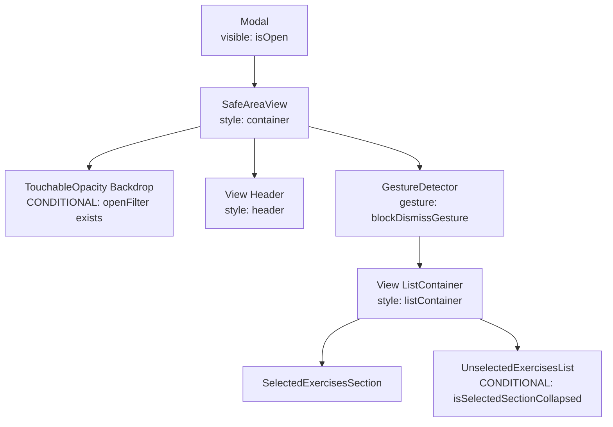

### Styling Conditions

| Element | Condition | Style Applied | Notes |
|---------|-----------|---------------|-------|
| **Modal** | `isOpen === true` | Renders modal | No conditional styling, only visibility |
| **SafeAreaView** | Always | `backgroundColor: COLORS.white` | Base container |
| **Backdrop** | `openFilter !== null` | `position: absolute`, `zIndex: 85`, `backgroundColor: transparent` | Blocks clicks outside dropdown |
| **Header View** | Always | `paddingHorizontal: 16`, `paddingTop: 16`, `paddingBottom: 12`, `borderBottomWidth: 1`, `borderBottomColor: COLORS.slate[200]`, `zIndex: 100` | Fixed header styling |
| **ListContainer** | Always | `flex: 1` | Takes remaining space |
| **UnselectedList** | `isSelectedSectionCollapsed === true` | Renders component | Conditional render only |

### Verification

✅ **Correct**: 
- Backdrop only renders when `openFilter` is set, preventing unnecessary overlays
- UnselectedList only shows when selected section is collapsed, saving space
- Header has proper z-index to stay above content

---

## 2. SelectedExercisesSection.js (Most Complex)

### Element Hierarchy

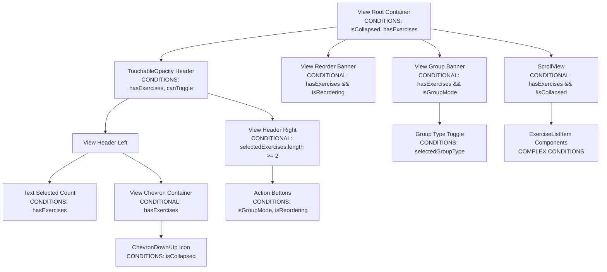

### Styling Conditions - Root Container

| Element | Condition Variable | Condition Logic | Style Applied | Notes |
|---------|-------------------|-----------------|---------------|-------|
| **Root View** | `header_expanded` | `!isCollapsed && hasExercises` | `borderBottomWidth: 0` | No border when collapsed with exercises |
| **Root View** | `header_collapsed` | `isCollapsed && hasExercises` | `borderBottomWidth: 2` | Border when collapsed |
| **Root View** | Always | `borderBottomColor: COLORS.slate[200]` | Base border color |
| **Root View** | `!isCollapsed` | `flex: 1` | Takes full height when expanded |
| **Root View** | `isCollapsed` | `flex: 0` | No flex when collapsed |

### Styling Conditions - Header TouchableOpacity

| Element | Condition Variable | Condition Logic | Style Applied | Notes |
|---------|-------------------|-----------------|---------------|-------|
| **Header TouchableOpacity** | `hasExercises === true` | Active state | `backgroundColor: COLORS.blue[400]`, `paddingHorizontal: 16`, `paddingVertical: 8`, `minHeight: 40`, `borderBottomWidth: 1`, `borderBottomColor: COLORS.slate[200]` | Enabled header styling |
| **Header TouchableOpacity** | `hasExercises === false` | Disabled state | `backgroundColor: COLORS.slate[300]`, `opacity: 0.6`, `borderBottomWidth: 0` | Disabled header styling |
| **Header TouchableOpacity** | `header_expanded` | `!isCollapsed && hasExercises` | Empty object (placeholder) | No additional styles |
| **Header TouchableOpacity** | `header_collapsed` | `isCollapsed && hasExercises` | Empty object (placeholder) | No additional styles |

**⚠️ ISSUE FOUND**: The `header_expanded` and `header_collapsed` condition variables are defined but apply empty style objects. These are redundant and should be removed.

### Styling Conditions - Header Text

| Element | Condition Variable | Condition Logic | Style Applied | Notes |
|---------|-------------------|-----------------|---------------|-------|
| **Header Text** | `hasExercises === true` | Active state | `fontSize: 12`, `fontWeight: 'bold'`, `color: COLORS.white`, `textTransform: 'uppercase'` | Enabled text styling |
| **Header Text** | `hasExercises === false` | Disabled state | `fontSize: 12`, `fontWeight: 'bold'`, `color: COLORS.slate[600]`, `textTransform: 'uppercase'` | Disabled text styling |
| **Header Text** | `headerText_expanded` | `!isCollapsed` | Empty object (placeholder) | Redundant |
| **Header Text** | `headerText_collapsed` | `isCollapsed` | Empty object (placeholder) | Redundant |

**⚠️ ISSUE FOUND**: Same issue as above - redundant empty condition variables.

### Styling Conditions - Action Buttons Section

| Element | Condition | Style Applied | Notes |
|---------|-----------|---------------|-------|
| **Action Buttons Container** | `selectedExercises.length >= 2` | Renders buttons | Only shows when 2+ exercises |
| **Cancel Button** | `isGroupMode === true` | `paddingHorizontal: 10`, `paddingVertical: 4`, `borderRadius: 4`, `backgroundColor: COLORS.slate[100]` | Group mode cancel |
| **Save Button (Group)** | `isGroupMode === true` | Base: `paddingHorizontal: 12`, `paddingVertical: 4`, `borderRadius: 4`, `backgroundColor: COLORS.green[500]` | Group mode save |
| **Save Button (Group)** | `groupSelectionMode === 'create' && groupSelectionIndices.length < 2` | `backgroundColor: COLORS.slate[300]` | Disabled when creating with < 2 items |
| **Cancel Button (Reorder)** | `isReordering === true` | Same as group cancel | Reorder mode cancel |
| **Save Button (Reorder)** | `isReordering === true` | Base: `paddingHorizontal: 12`, `paddingVertical: 4`, `borderRadius: 4`, `backgroundColor: COLORS.green[500]` | Reorder mode save |
| **Save Button (Reorder)** | `saveButton_disabled` | `backgroundColor: 'rgba(255, 255, 255, 0.3)'` | Disabled when not all assigned |
| **Save Button Text (Reorder)** | `saveButtonText_disabled` | `opacity: 0.5` | Disabled text |
| **Reorder Button** | `!isReordering && !isGroupMode` | `paddingHorizontal: 10`, `paddingVertical: 4`, `borderRadius: 4`, `backgroundColor: 'rgba(255, 255, 255, 0.2)'` | Normal mode reorder |
| **Group Button** | `!isReordering && !isGroupMode` | Same as reorder button | Normal mode group |

**✅ VERIFICATION**: Action buttons properly switch based on mode. Save button correctly disables when conditions not met.

### Styling Conditions - Reorder Banner

| Element | Condition | Style Applied | Notes |
|---------|-----------|---------------|-------|
| **Reorder Banner** | `hasExercises && isReordering` | `backgroundColor: COLORS.amber[100]`, `paddingHorizontal: 16`, `paddingVertical: 8`, `borderBottomWidth: 1`, `borderBottomColor: COLORS.amber[200]` | Shows progress during reordering |

**✅ VERIFICATION**: Correctly shows only when reordering with exercises.

### Styling Conditions - Group Banner

| Element | Condition | Style Applied | Notes |
|---------|-----------|---------------|-------|
| **Group Banner** | `hasExercises && isGroupMode` | `backgroundColor: COLORS.blue[100]`, `paddingHorizontal: 16`, `paddingVertical: 8`, `borderBottomWidth: 1`, `borderBottomColor: COLORS.blue[200]`, `flexDirection: 'row'`, `justifyContent: 'space-between'`, `alignItems: 'center'` | Shows group mode info |
| **Group Type Toggle - Superset Button** | `selectedGroupType === 'Superset'` | `borderColor: defaultSupersetColorScheme[500]`, `backgroundColor: defaultSupersetColorScheme[500]` | Active Superset |
| **Group Type Toggle - Superset Button** | `selectedGroupType !== 'Superset'` | `borderColor: defaultSupersetColorScheme[200]`, `backgroundColor: 'transparent'` | Inactive Superset |
| **Group Type Toggle - Superset Text** | `selectedGroupType === 'Superset'` | `color: COLORS.white` | Active text |
| **Group Type Toggle - Superset Text** | `selectedGroupType !== 'Superset'` | `color: defaultSupersetColorScheme[300]` | Inactive text |
| **Group Type Toggle - HIIT Button** | `selectedGroupType === 'HIIT'` | `borderColor: defaultHiitColorScheme[500]`, `backgroundColor: defaultHiitColorScheme[500]` | Active HIIT |
| **Group Type Toggle - HIIT Button** | `selectedGroupType !== 'HIIT'` | `borderColor: defaultHiitColorScheme[200]`, `backgroundColor: 'transparent'` | Inactive HIIT |
| **Group Type Toggle - HIIT Text** | `selectedGroupType === 'HIIT'` | `color: COLORS.white` | Active text |
| **Group Type Toggle - HIIT Text** | `selectedGroupType !== 'HIIT'` | `color: defaultHiitColorScheme[300]` | Inactive text |

**✅ VERIFICATION**: Group type toggle correctly switches between Superset and HIIT with proper color schemes.

### Styling Conditions - ScrollView Container

| Element | Condition Variable | Condition Logic | Style Applied | Notes |
|---------|-------------------|-----------------|---------------|-------|
| **ScrollView** | `hasExercises && !isCollapsed` | Renders | `flex: 1` | Only shows when expanded |
| **ScrollView** | `listContainer_expanded` | `!isCollapsed` | Empty object (placeholder) | Redundant |
| **ScrollView** | `listContainer_collapsed` | `isCollapsed` | Empty object (placeholder) | Redundant |

**⚠️ ISSUE FOUND**: Redundant empty condition variables for listContainer.

### Styling Conditions - ExerciseListItem (within SelectedExercisesSection)

The ExerciseListItem components have complex conditional rendering based on:
- `isGroupMode` vs normal mode
- `isReordering` vs normal mode
- Group membership (`exerciseGroup`)
- Selection state in group mode (`isSelectedInGroup`)
- Position in group (`isFirstInGroup`, `isLastInGroup`)

These are documented in detail in the ExerciseListItem section below.

---

## 3. UnselectedExercisesList.js

### Element Hierarchy

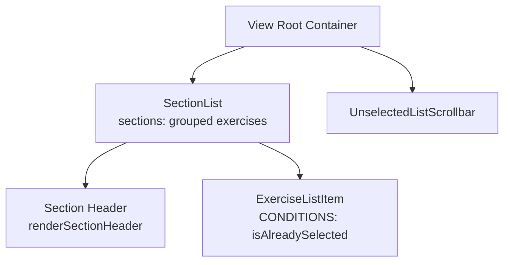

### Styling Conditions

| Element | Condition | Style Applied | Notes |
|---------|-----------|---------------|-------|
| **Root View** | Always | `flex: 1`, `flexDirection: 'row'` | Container for list and scrollbar |
| **SectionList** | Always | `flex: 1`, `stickySectionHeadersEnabled: true`, `showsVerticalScrollIndicator: false` | Main list container |
| **Section Header** | Always | `backgroundColor: COLORS.slate[50]`, `paddingHorizontal: 16`, `paddingVertical: 6`, `borderBottomWidth: 1`, `borderBottomColor: COLORS.slate[50]` | Letter headers (A-Z) |
| **Section Header Text** | Always | `fontSize: 10`, `fontWeight: 'bold'`, `color: COLORS.slate[500]` | Header text styling |
| **ExerciseListItem** | `isAlreadySelected === true` | Receives `selectedInListStyle` prop | Styled as selected |
| **ExerciseListItem** | `isAlreadySelected === false` | `selectedInListStyle: null` | Normal styling |
| **Empty State View** | `exercises.length === 0` | `flex: 1`, `paddingVertical: 40`, `alignItems: 'center'` | No exercises message |
| **Empty State Text** | `exercises.length === 0` | `color: COLORS.slate[400]`, `fontSize: 14` | Empty message text |

**✅ VERIFICATION**: 
- SectionList properly groups exercises alphabetically
- Selected exercises receive special styling via props
- Empty state handled correctly

---

## 4. FilterDropdown.js

### Element Hierarchy

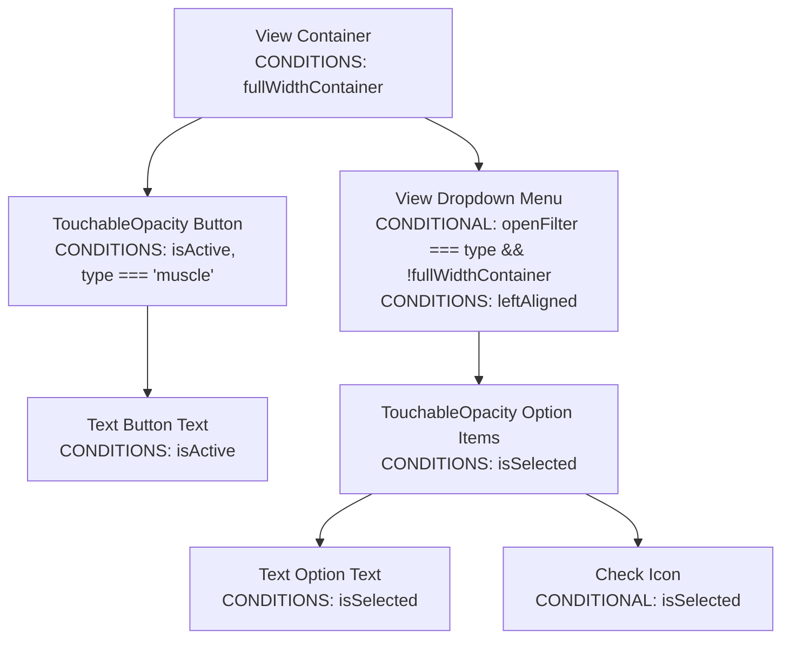

### Styling Conditions - Container

| Element | Condition Variable | Condition Logic | Style Applied | Notes |
|---------|-------------------|-----------------|---------------|-------|
| **Container View** | Always | Base | `flex: 1`, `position: 'relative'`, `minWidth: 0` | Base container |
| **Container View** | `container_fullWidth` | `fullWidthContainer === true` | `position: 'relative'`, `zIndex: 1`, `flexShrink: 1` | Full width variant |

**✅ VERIFICATION**: Container properly handles full width case.

### Styling Conditions - Button

| Element | Condition Variable | Condition Logic | Style Applied | Notes |
|---------|-------------------|-----------------|---------------|-------|
| **Button** | Always | Base | `flexDirection: 'row'`, `alignItems: 'center'`, `justifyContent: 'center'`, `paddingHorizontal: 12`, `paddingVertical: 8`, `borderRadius: 8`, `borderWidth: 1`, `minHeight: 0` | Base button |
| **Button** | `button_active` | `isActive === true` | `backgroundColor: COLORS.blue[100]`, `borderColor: COLORS.blue[200]` | Active state |
| **Button** | `button_inactive` | `isActive === false` | `backgroundColor: COLORS.slate[100]`, `borderColor: 'transparent'` | Inactive state |
| **Button** | `button_muscleFilterPrimary` | `type === 'muscle' && filterMuscle.length > 0` | `borderTopRightRadius: 0`, `borderBottomRightRadius: 0`, `borderRightWidth: 0` | Connects to secondary filter |

**✅ VERIFICATION**: Button correctly shows active/inactive states. Muscle filter properly connects to secondary filter.

### Styling Conditions - Button Text

| Element | Condition Variable | Condition Logic | Style Applied | Notes |
|---------|-------------------|-----------------|---------------|-------|
| **Button Text** | Always | Base | `fontSize: 12`, `fontWeight: 'bold'`, `color: COLORS.slate[600]`, `textAlign: 'center'` | Base text |
| **Button Text** | `buttonText_active` | `isActive === true` | `color: COLORS.blue[700]` | Active text color |

**✅ VERIFICATION**: Text color changes with active state.

### Styling Conditions - Dropdown Menu

| Element | Condition Variable | Condition Logic | Style Applied | Notes |
|---------|-------------------|-----------------|---------------|-------|
| **Dropdown Menu** | `openFilter === type && !fullWidthContainer` | Renders | Base: `position: 'absolute'`, `top: '100%'`, `left: 0`, `right: 0`, `marginTop: 4`, `backgroundColor: COLORS.white`, `borderRadius: 8`, `borderWidth: 1`, `borderColor: COLORS.slate[200]`, `shadowColor: "#000"`, `shadowOffset: { width: 0, height: 2 }`, `shadowOpacity: 0.3`, `shadowRadius: 4`, `elevation: 5`, `zIndex: 100`, `overflow: 'hidden'` | Base dropdown |
| **Dropdown Menu** | `menu_leftAligned` | `leftAligned === true` | `right: 'auto'`, `minWidth: 180` | Left-aligned variant |

**✅ VERIFICATION**: Dropdown only shows when filter is open and not full width. Left alignment works correctly.

### Styling Conditions - Option Items

| Element | Condition Variable | Condition Logic | Style Applied | Notes |
|---------|-------------------|-----------------|---------------|-------|
| **Option TouchableOpacity** | Always | Base | `flexDirection: 'row'`, `alignItems: 'center'`, `justifyContent: 'space-between'`, `paddingHorizontal: 12`, `paddingVertical: 8`, `backgroundColor: COLORS.slate[600]` | Base option |
| **Option TouchableOpacity** | `option_selected` | `isSelected === true` | `backgroundColor: COLORS.blue[500]` | Selected option |
| **Option Text** | Always | Base | `fontSize: 14`, `fontWeight: 'bold'`, `color: COLORS.white` | Base text |
| **Option Text** | `optionText_selected` | `isSelected === true` | `color: COLORS.white` | Selected text (same as base) |
| **Check Icon** | `isSelected === true` | Renders | `size: 12`, `color: COLORS.white` | Shows checkmark |

**⚠️ ISSUE FOUND**: `optionText_selected` applies the same style as base (`color: COLORS.white`). This is redundant - the condition variable exists but doesn't change styling.

**✅ VERIFICATION**: Options correctly show selected state with background color change and checkmark.

---

## 5. UnselectedListScrollbar.js

### Element Hierarchy

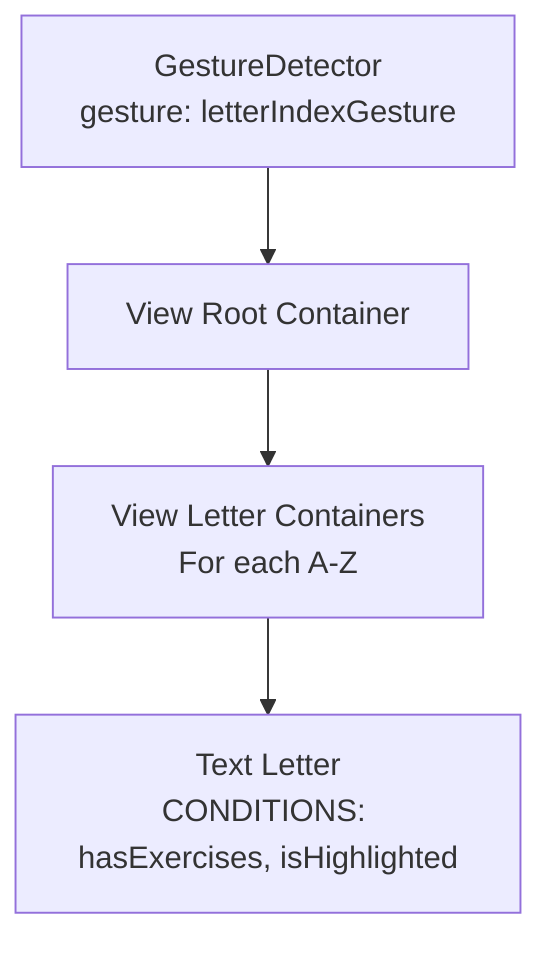

### Styling Conditions

| Element | Condition | Style Applied | Notes |
|---------|-----------|---------------|-------|
| **Root View** | Always | `width: 24`, `backgroundColor: COLORS.slate[50]`, `justifyContent: 'center'`, `alignItems: 'center'`, `paddingVertical: 2` | Scrollbar container |
| **Letter View** | Always | `flex: 1`, `justifyContent: 'center'`, `alignItems: 'center'`, `width: '100%'` | Individual letter container |
| **Letter Text** | Always | Base | `fontSize: 10`, `fontWeight: '600'`, `color: COLORS.slate[500]` | Base letter styling |
| **Letter Text** | `letterText_disabled` | `!hasExercises` | `color: COLORS.slate[300]` | Disabled (no exercises for letter) |
| **Letter Text** | `letterText_highlighted` | `isHighlighted === true` | `color: COLORS.blue[700]`, `fontSize: 12`, `fontWeight: 'bold'` | Highlighted (user scrolling) |

**✅ VERIFICATION**: 
- Letters properly show disabled state when no exercises exist
- Highlight state correctly shows when user is scrolling
- Base styling applies correctly

---

## 6. Filters.js

### Element Hierarchy

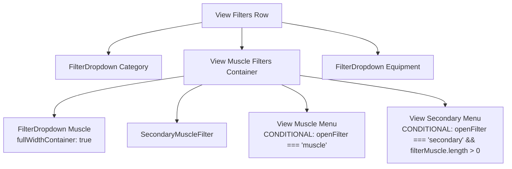

### Styling Conditions

| Element | Condition | Style Applied | Notes |
|---------|-----------|---------------|-------|
| **Filters Row** | Always | `flexDirection: 'row'`, `gap: 8`, `zIndex: 90`, `alignItems: 'center'` | Main container |
| **Muscle Filters Container** | Always | `flex: 1`, `flexDirection: 'row'`, `gap: 0`, `alignSelf: 'stretch'`, `position: 'relative'` | Contains primary and secondary muscle filters |
| **Muscle Menu** | `openFilter === 'muscle'` | `position: 'absolute'`, `top: '100%'`, `left: 0`, `right: 0`, `marginTop: 4`, `backgroundColor: COLORS.white`, `borderRadius: 8`, `borderWidth: 1`, `borderColor: COLORS.slate[200]`, `shadowColor: "#000"`, `shadowOffset: { width: 0, height: 2 }`, `shadowOpacity: 0.3`, `shadowRadius: 4`, `elevation: 5`, `zIndex: 100`, `overflow: 'hidden'` | Dropdown menu for primary muscles |
| **Secondary Menu** | `openFilter === 'secondary' && filterMuscle.length > 0` | Same as muscle menu | Dropdown menu for secondary muscles |
| **Filter Option** | Always | Base | `flexDirection: 'row'`, `alignItems: 'center'`, `justifyContent: 'space-between'`, `paddingHorizontal: 12`, `paddingVertical: 8`, `backgroundColor: COLORS.slate[600]` | Base option |
| **Filter Option** | `isSelected === true` | `backgroundColor: COLORS.blue[500]` | Selected option |
| **Filter Option Text** | Always | Base | `fontSize: 14`, `fontWeight: 'bold'`, `color: COLORS.white` | Base text |
| **Filter Option Text** | `isSelected === true` | `color: COLORS.white` | Selected text (same as base) |

**⚠️ ISSUE FOUND**: Same as FilterDropdown - selected text style is redundant (same as base).

**✅ VERIFICATION**: 
- Muscle filters properly connected (primary + secondary)
- Menus only show when respective filter is open
- Secondary menu only shows when primary muscles are selected

---

## 7. HeaderTopRow.js

### Element Hierarchy

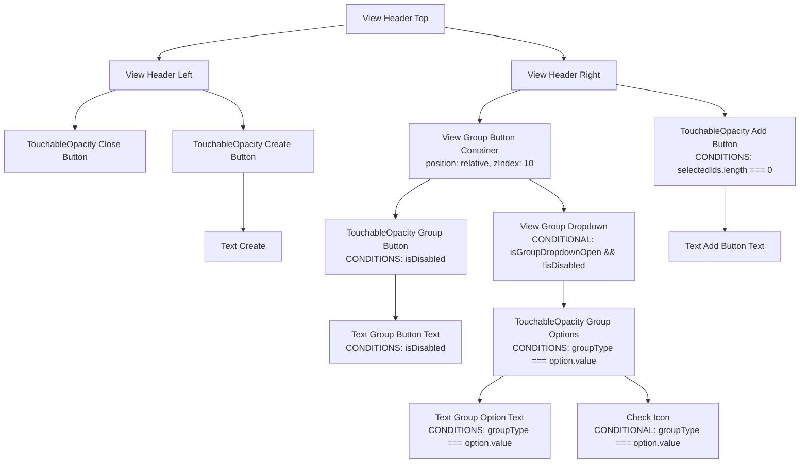

### Styling Conditions

| Element | Condition | Style Applied | Notes |
|---------|-----------|---------------|-------|
| **Header Top** | Always | `flexDirection: 'row'`, `justifyContent: 'space-between'`, `alignItems: 'center'`, `marginBottom: 12`, `zIndex: 101` | Main container |
| **Header Left** | Always | `flexDirection: 'row'`, `alignItems: 'center'`, `gap: 12` | Left section |
| **Close Button** | Always | `padding: 4`, `marginLeft: -8` | Close icon button |
| **Create Button** | Always | `flexDirection: 'row'`, `alignItems: 'center'`, `gap: 4`, `backgroundColor: COLORS.slate[100]`, `paddingHorizontal: 12`, `paddingVertical: 6`, `borderRadius: 8` | Create button |
| **Create Button Text** | Always | `fontSize: 12`, `fontWeight: 'bold'`, `color: COLORS.slate[700]` | Create text |
| **Header Right** | Always | `flexDirection: 'row'`, `alignItems: 'center'`, `gap: 12`, `zIndex: 102` | Right section |
| **Group Button** | Always | Base | `flexDirection: 'row'`, `alignItems: 'center'`, `gap: 8`, `backgroundColor: COLORS.slate[100]`, `paddingHorizontal: 12`, `paddingVertical: 6`, `borderRadius: 8` | Base group button |
| **Group Button** | `isDisabled === true` | `opacity: 0.5` | Disabled when < 2 selected |
| **Group Button Text** | Always | Base | `fontSize: 12`, `fontWeight: 'bold'`, `color: COLORS.slate[700]` | Base text |
| **Group Button Text** | `isDisabled === true` | `color: COLORS.slate[400]` | Disabled text |
| **Group Dropdown** | `isGroupDropdownOpen && !isDisabled` | `position: 'absolute'`, `top: '100%'`, `right: 0`, `marginTop: 8`, `width: 120`, `backgroundColor: COLORS.white`, `borderRadius: 8`, `borderWidth: 1`, `borderColor: COLORS.slate[100]`, `shadowColor: "#000"`, `shadowOffset: { width: 0, height: 2 }`, `shadowOpacity: 0.1`, `shadowRadius: 4`, `elevation: 5`, `zIndex: 200` | Dropdown menu |
| **Group Option** | Always | Base | `flexDirection: 'row'`, `alignItems: 'center'`, `justifyContent: 'space-between'`, `paddingHorizontal: 12`, `paddingVertical: 8` | Base option |
| **Group Option** | `groupType === option.value` | `backgroundColor: COLORS.blue[50]` | Selected option |
| **Group Option Text** | Always | Base | `fontSize: 12`, `fontWeight: 'bold'`, `color: COLORS.slate[700]` | Base text |
| **Group Option Text** | `groupType === option.value` | `color: COLORS.blue[600]` | Selected text |
| **Add Button** | Always | Base | `backgroundColor: COLORS.blue[600]`, `paddingHorizontal: 16`, `paddingVertical: 6`, `borderRadius: 8` | Base add button |
| **Add Button** | `selectedIds.length === 0` | `opacity: 0.5` | Disabled when no selections |
| **Add Button Text** | Always | `fontSize: 12`, `fontWeight: 'bold'`, `color: COLORS.white` | Add text |

**✅ VERIFICATION**: 
- Group button properly disables when < 2 exercises selected
- Dropdown only shows when open and enabled
- Selected option correctly highlighted
- Add button disables when no exercises selected

---

## 8. SearchBar.js

### Element Hierarchy

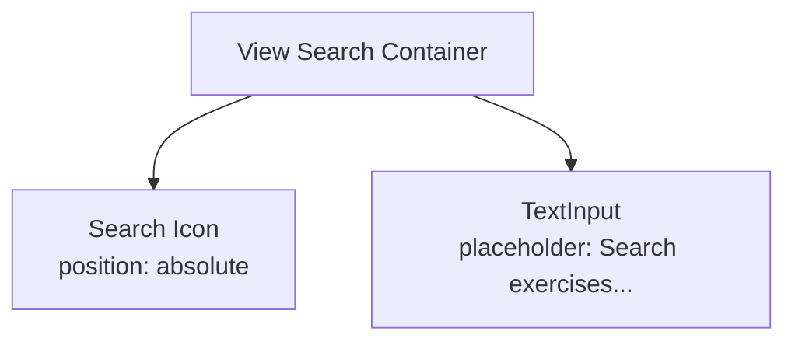

### Styling Conditions

| Element | Condition | Style Applied | Notes |
|---------|-----------|---------------|-------|
| **Search Container** | Always | `position: 'relative'`, `marginBottom: 12`, `zIndex: 1` | Container |
| **Search Icon** | Always | `position: 'absolute'`, `left: 12`, `top: 10`, `zIndex: 2` | Icon positioned absolutely |
| **Search Input** | Always | `backgroundColor: COLORS.slate[100]`, `borderRadius: 999`, `paddingLeft: 40`, `paddingRight: 16`, `paddingVertical: 12`, `fontSize: 14`, `color: COLORS.slate[900]` | Input field |

**✅ VERIFICATION**: Simple component with no conditional styling. All styles are static.

---

## 9. SecondaryMuscleFilter.js

### Element Hierarchy

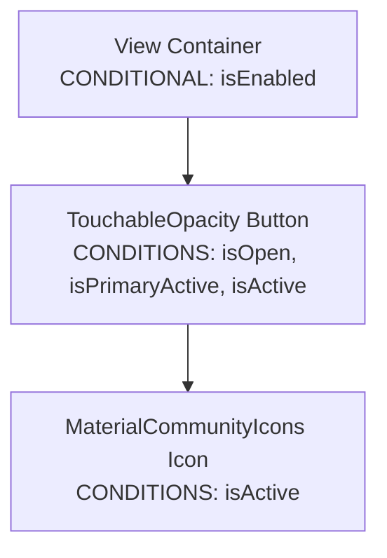

### Styling Conditions

| Element | Condition | Style Applied | Notes |
|---------|-----------|---------------|-------|
| **Container** | `isEnabled === false` | Returns `null` (doesn't render) | Only shows when primary muscles selected |
| **Container** | `isEnabled === true` | `position: 'relative'`, `width: 40`, `zIndex: 1` | Container for button |
| **Button** | Always | Base from `externalStyles.filterButton` + `externalStyles.secondaryFilterButton` | Base button styles |
| **Button** | `isOpen || isPrimaryActive` | `borderColor: COLORS.blue[200]` (via `externalStyles.secondaryFilterBorderActive`) | Active border |
| **Button** | `!(isOpen || isPrimaryActive)` | `borderColor: 'transparent'` | Inactive border |
| **Button** | `isPrimaryActive === true` | `borderLeftWidth: 1`, `borderLeftColor: COLORS.blue[200]` (via `externalStyles.secondaryFilterLeftBorder`) | Left border when primary active |
| **Button** | `isActive === true` | `backgroundColor: COLORS.blue[100]` | Active background |
| **Button** | `isActive === false` | `backgroundColor: COLORS.slate[100]` | Inactive background |
| **Icon** | `isActive === true` | `name: "arm-flex"`, `color: COLORS.blue[700]` | Active icon (filled) |
| **Icon** | `isActive === false` | `name: "arm-flex-outline"`, `color: COLORS.blue[400]` | Inactive icon (outline) |

**✅ VERIFICATION**: 
- Component correctly hides when primary muscles not selected
- Button styling properly reflects active/inactive states
- Icon changes between filled and outline based on active state

---

## 10. ExerciseListItem/index.js (Most Complex Styling)

### Element Hierarchy

```mermaid
flowchart TD
    RootTouchable[TouchableOpacity Root Container<br/>COMPLEX CONDITIONS] --> ContentView[View Content Container] --> NameRow[View Name Row]
    NameRow --> NameText[Text Name<br/>COMPLEX CONDITIONS]
    NameRow --> BadgesView[View Badges Container] --> GroupBadge[GroupBadge<br/>CONDITIONAL: showGroupBadge]
    BadgesView --> CountBadge[CountBadge<br/>CONDITIONAL: showCountBadge]
    ContentView --> TagsView[View Tags Container] --> ExerciseTags[ExerciseTags]
    RootTouchable --> ActionButtons[ActionButtons<br/>CONDITIONAL: showAddRemoveButtons || showAddButtonOnly]
    RootTouchable --> ReorderCheckbox[ReorderCheckbox<br/>CONDITIONAL: !showAddRemoveButtons && !showAddButtonOnly]
```

### Styling Conditions - Root Container

The root container has the most complex conditional styling. Conditions are applied in this order:

#### Normal View Mode

| Condition Variable | Condition Logic | Style Applied | Notes |
|-------------------|-----------------|---------------|-------|
| **Base** | Always | `paddingLeft: 16`, `paddingRight: 16`, `flexDirection: 'row'`, `alignItems: 'center'`, `justifyContent: 'space-between'`, `paddingVertical: 12`, `borderBottomWidth: 1`, `borderBottomColor: COLORS.slate[50]` | Base container |
| `container_selectedInSection` | `isSelected && !showAddMore` | `backgroundColor: COLORS.blue[50]`, `borderBottomColor: COLORS.white`, `paddingRight: 32` | Selected in selected section |
| `container_selectedInSection && renderingSection === 'selectedSection'` | Additional condition | Empty object (placeholder) | Redundant |
| `container_selectedInSection && !isReordering && !isGroupMode && isGrouped && renderingSection === 'selectedSection'` | Grouped selected | `backgroundColor: groupColorScheme[100]` | Overrides blue background for grouped items |
| `container_selectedInList` | `isSelected && showAddMore` | `backgroundColor: COLORS.blue[50]`, `borderBottomColor: COLORS.blue[100]` | Selected in unselected list |
| `container_selectedInList && !isReordering && !isGroupMode && isGrouped && renderingSection === 'selectedSection'` | Grouped selected in list | `backgroundColor: groupColorScheme[100]`, `borderBottomColor: groupColorScheme[150]` | Grouped variant |
| `container_selectedInList && renderingSection === 'unselectedList'` | Selected in unselected list | `borderBottomColor: COLORS.slate[50]` | Overrides blue border |
| `container_lastSelected` | `isLastSelected === true` | `borderBottomColor: COLORS.slate[100]` | Last item border |
| `isFirstInGroup && isGrouped && !isReordering && !isGroupMode && renderingSection === 'selectedSection'` | First in group | `borderTopLeftRadius: 8`, `borderTopRightRadius: 8` | Rounded top corners |
| `isLastInGroup && isGrouped && !isReordering && !isGroupMode && renderingSection === 'selectedSection'` | Last in group | `borderBottomColor: 'transparent'`, `borderBottomLeftRadius: 8`, `borderBottomRightRadius: 8` | Rounded bottom corners, no border |
| `isGrouped && !isGroupMode && renderingSection === 'selectedSection' && !isLastInGroup` | Grouped item border | `borderBottomColor: groupColorScheme[150]` | Group-colored border |

#### Reorder Mode

| Condition Variable | Condition Logic | Style Applied | Notes |
|-------------------|-----------------|---------------|-------|
| `container_reorderingMode` | `isReordering && !isReordered` | `backgroundColor: COLORS.white`, `borderBottomColor: COLORS.blue[100]` | Unmoved item in reorder |
| `container_reorderedItem` | `isReordering && isReordered` | `backgroundColor: COLORS.blue[50]`, `borderBottomColor: COLORS.blue[100]` | Moved item in reorder |

#### Group Mode

| Condition Variable | Condition Logic | Style Applied | Notes |
|-------------------|-----------------|---------------|-------|
| `container_groupModeSelected` | `isGroupMode && isSelectedInGroup` | `backgroundColor: groupColorScheme[100]`, `borderBottomColor: COLORS.blue[200]` | Selected in group mode |
| `isLastInGroup && isGrouped && isGroupMode && isSelectedInGroup` | Last selected in group | `borderBottomColor: COLORS.white` | Overrides group mode border |
| `container_groupModeUnselected && isGrouped` | `isGroupMode && !isSelectedInGroup && isGrouped` | `backgroundColor: groupColorScheme[50]`, `borderBottomColor: groupColorScheme[200]` | Unselected grouped item |
| `isLastInGroup && isGrouped && isGroupMode && !isSelectedInGroup` | Last unselected in group | `borderBottomColor: COLORS.white` | Overrides unselected border |
| `container_groupModeUnselected && !isGrouped` | `isGroupMode && !isSelectedInGroup && !isGrouped` | `backgroundColor: COLORS.white`, `borderBottomColor: COLORS.slate[100]` | Unselected ungrouped item |

**⚠️ ISSUES FOUND**:
1. `container_selectedInSection && renderingSection === 'selectedSection'` applies empty object - redundant
2. `container_addMoreMode` applies empty object - redundant
3. Condition order matters - more specific conditions should come after general ones, but some general conditions override specific ones (e.g., `container_lastSelected` might override group borders)

**✅ VERIFICATION**: 
- Conditions properly handle normal, reorder, and group modes
- Group styling correctly applies color schemes
- Border radius properly applied to first/last items in groups
- Selected/unselected states in group mode work correctly

### Styling Conditions - Name Text

| Condition Variable | Condition Logic | Style Applied | Notes |
|-------------------|-----------------|---------------|-------|
| **Base** | Always | `fontSize: 16`, `fontWeight: 'bold'`, `color: COLORS.slate[900]` | Base text |
| `text_selectedInSection` | `isSelected && !showAddMore` | `color: COLORS.blue[600]` | Selected in section |
| `text_selectedInSection && renderingSection === 'selectedSection'` | Additional condition | Empty object (placeholder) | Redundant |
| `text_selectedInList` | `isSelected && showAddMore` | `color: COLORS.slate[900]` | Selected in list (same as base) |
| `text_selectedInList && renderingSection === 'unselectedList'` | Additional condition | Empty object (placeholder) | Redundant |
| `text_reorderingMode && !isGroupItemReorder` | `isReordering && !isReordered && !isGroupItemReorder` | `color: COLORS.amber[600]` | Reordering unmoved (amber) |
| `text_reorderingMode && isGroupItemReorder` | `isReordering && !isReordered && isGroupItemReorder` | `color: COLORS.indigo[600]` | Reordering unmoved (indigo for group items) |
| `text_addMoreMode` | `showAddMore === true` | Empty object (placeholder) | Redundant |

**⚠️ ISSUES FOUND**:
1. Multiple redundant empty condition variables
2. `text_selectedInList` applies same color as base - condition exists but doesn't change styling

**✅ VERIFICATION**: Text colors correctly change based on selection and reordering states.

---

## 11. ExerciseListItem Sub-components

### 11.1 ActionButtons.js

### Element Hierarchy

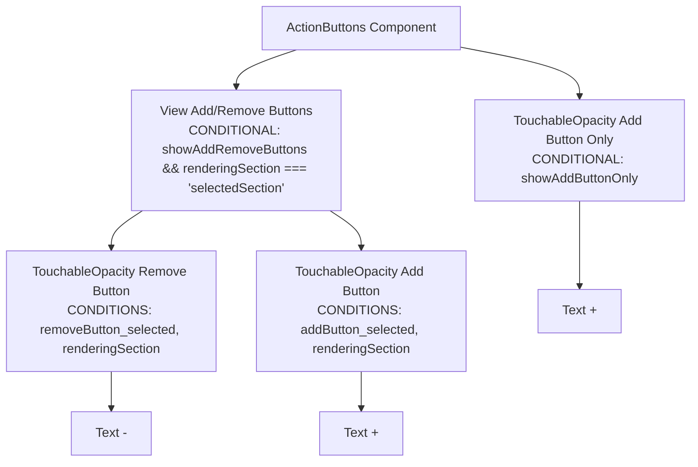

### Styling Conditions

| Element | Condition Variable | Condition Logic | Style Applied | Notes |
|---------|-------------------|-----------------|---------------|-------|
| **Remove Button** | Always | Base | `width: 24`, `height: 24`, `borderRadius: 12`, `backgroundColor: COLORS.white`, `borderWidth: 1`, `borderColor: COLORS.slate[300]` | Base remove button |
| **Remove Button** | `removeButton_selected` | `isSelected && !isReordering` | Empty object (placeholder) | Redundant |
| **Remove Button** | `removeButton_selected && renderingSection === 'selectedSection'` | Additional condition | Empty object (placeholder) | Redundant |
| **Remove Button** | `removeButton_selected && renderingSection === 'unselectedList'` | Additional condition | Empty object (placeholder) | Redundant |
| **Remove Text** | Always | Base | `color: COLORS.slate[700]`, `fontSize: 14`, `fontWeight: 'bold'`, `lineHeight: 16` | Base text |
| **Remove Text** | `removeButton_selected` | Additional condition | Empty object (placeholder) | Redundant |
| **Add Button (Selected Section)** | Always | Base | `width: 24`, `height: 24`, `borderRadius: 12`, `backgroundColor: COLORS.slate[50]`, `borderWidth: 1`, `borderColor: COLORS.blue[400]` | Base add button |
| **Add Button (Selected Section)** | `addButton_selected` | `isSelected && !isReordering` | Empty object (placeholder) | Redundant |
| **Add Button (Selected Section)** | `addButton_selected && renderingSection === 'selectedSection'` | Selected in section | `backgroundColor: COLORS.blue[600]`, `borderWidth: 1`, `borderColor: COLORS.blue[600]` | Blue background in selected section |
| **Add Button (Selected Section)** | `addButton_selected && renderingSection === 'unselectedList'` | Additional condition | Empty object (placeholder) | Redundant |
| **Add Text (Selected Section)** | Always | Base | `color: COLORS.blue[500]`, `fontSize: 14`, `fontWeight: 'bold'`, `lineHeight: 16` | Base text |
| **Add Text (Selected Section)** | `addButton_selected` | Additional condition | Empty object (placeholder) | Redundant |
| **Add Text (Selected Section)** | `addButton_selected && renderingSection === 'selectedSection'` | Selected in section | `color: COLORS.white` | White text on blue background |
| **Add Button Only** | Always | Base | `width: 24`, `height: 24`, `borderRadius: 12`, `backgroundColor: COLORS.slate[50]`, `borderWidth: 1`, `borderColor: COLORS.slate[300]` | Base add-only button |
| **Add Button Only** | `addButton_unselected` | `!isSelected && !isReordering` | Empty object (placeholder) | Redundant |
| **Add Text Only** | Always | Base | `color: COLORS.slate[300]`, `fontSize: 14`, `fontWeight: 'bold'`, `lineHeight: 16` | Base text |
| **Add Text Only** | `addButton_unselected` | Additional condition | Empty object (placeholder) | Redundant |

**⚠️ ISSUES FOUND**: Many redundant empty condition variables that don't apply any styles.

**✅ VERIFICATION**: 
- Add/remove buttons correctly show in selected section
- Add button only shows for unselected items
- Selected section add button gets blue background with white text

### 11.2 CountBadge.js

### Element Hierarchy

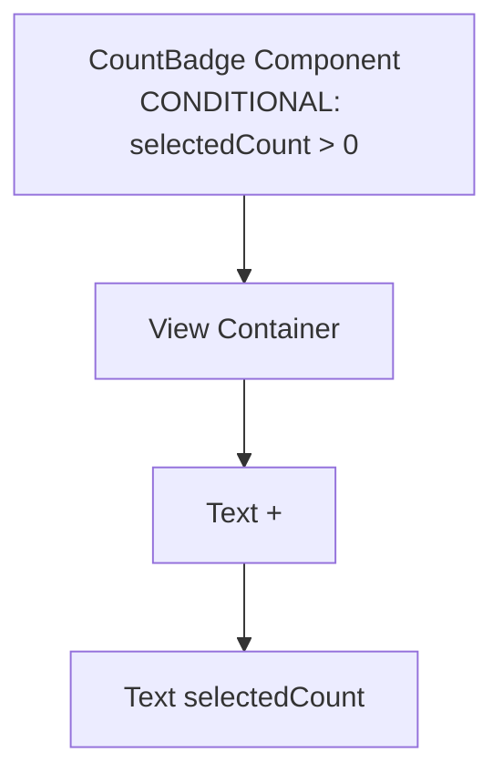

### Styling Conditions

| Element | Condition | Style Applied | Notes |
|---------|-----------|---------------|-------|
| **CountBadge** | `selectedCount === 0` | Returns `null` (doesn't render) | Only shows when count > 0 |
| **Container** | Always | `flexDirection: 'row'`, `alignItems: 'center'`, `paddingHorizontal: 4`, `paddingVertical: 2`, `borderRadius: 12`, `backgroundColor: COLORS.blue[50]` | Badge container |
| **Plus Text** | Always | `color: COLORS.slate[600]`, `fontSize: 14`, `fontWeight: 'normal'`, `marginRight: 1` | Plus sign |
| **Count Text** | Always | `color: COLORS.blue[600]`, `fontSize: 14`, `fontWeight: 'bold'` | Count number |

**✅ VERIFICATION**: Simple component with no conditional styling. Only condition is render/no-render based on count.

### 11.3 ExerciseTags.js

### Element Hierarchy

```mermaid
flowchart TD
    ExerciseTags[ExerciseTags Component] --> CollapsedGroupView[View Collapsed Group Items<br/>CONDITIONAL: isCollapsedGroup]
    CollapsedGroupView --> CollapsedItem[View Collapsed Item] --> CollapsedText[Text Exercise Name + Count]
    ExerciseTags --> CategoryTag[View Category Tag] --> CategoryText[Text Category]
    ExerciseTags --> MuscleTags[View Muscle Tags<br/>For each primaryMuscle.slice(0, 2)] --> MuscleTag[View Muscle Tag] --> MuscleText[Text Muscle Name]
```

### Styling Conditions

| Element | Condition | Style Applied | Notes |
|---------|-----------|---------------|-------|
| **Collapsed Group Item Container** | `isCollapsedGroup === true` | `backgroundColor: COLORS.slate[100]`, `paddingHorizontal: 6`, `paddingVertical: 2`, `borderRadius: 4` | Collapsed group item |
| **Collapsed Group Item Text** | `isCollapsedGroup === true` | `fontSize: 10`, `color: COLORS.slate[600]`, `fontWeight: '500'` | Collapsed text |
| **Category Tag Container** | Always | Base | `backgroundColor: COLORS.slate[100]`, `paddingHorizontal: 6`, `paddingVertical: 2`, `borderRadius: 4` | Base category tag |
| **Category Tag Container** | `showAddMore === true` | Empty object (placeholder) | Redundant |
| **Category Tag Container** | `showAddMore && renderingSection === 'unselectedList'` | Empty object (placeholder) | Redundant |
| **Category Tag Text** | Always | Base | `fontSize: 10`, `color: COLORS.slate[500]` | Base category text |
| **Category Tag Text** | `showAddMore === true` | Empty object (placeholder) | Redundant |
| **Category Tag Text** | `showAddMore && renderingSection === 'unselectedList'` | Empty object (placeholder) | Redundant |
| **Muscle Tag Container** | Always | Base | `backgroundColor: COLORS.indigo[50]`, `paddingHorizontal: 6`, `paddingVertical: 2`, `borderRadius: 4` | Base muscle tag |
| **Muscle Tag Container** | `showAddMore === true` | Empty object (placeholder) | Redundant |
| **Muscle Tag Container** | `showAddMore && renderingSection === 'unselectedList'` | Empty object (placeholder) | Redundant |
| **Muscle Tag Text** | Always | Base | `fontSize: 10`, `color: COLORS.indigo[600]` | Base muscle text |
| **Muscle Tag Text** | `showAddMore === true` | Empty object (placeholder) | Redundant |
| **Muscle Tag Text** | `showAddMore && renderingSection === 'unselectedList'` | Empty object (placeholder) | Redundant |

**⚠️ ISSUES FOUND**: Multiple redundant empty condition variables for `showAddMore` conditions that don't apply any styles.

**✅ VERIFICATION**: 
- Collapsed group view correctly shows when `isCollapsedGroup === true`
- Category and muscle tags render correctly
- Tags limited to first 2 primary muscles

### 11.4 GroupBadge.js

### Element Hierarchy

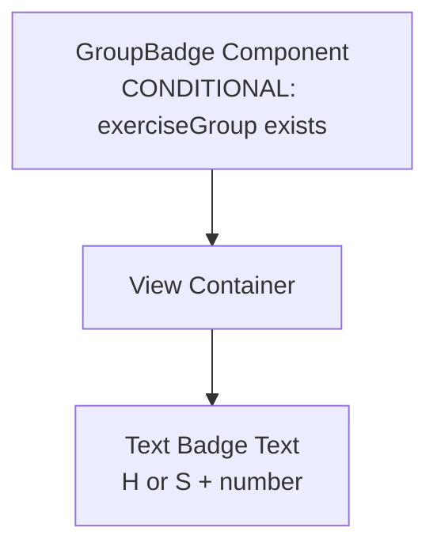

### Styling Conditions

| Element | Condition | Style Applied | Notes |
|---------|-----------|---------------|-------|
| **GroupBadge** | `exerciseGroup === null` | Returns `null` (doesn't render) | Only shows when exercise is in a group |
| **Container** | Always | `paddingHorizontal: 6`, `paddingVertical: 2`, `borderRadius: 12`, `backgroundColor: groupColorScheme[100]` | Badge container (color depends on group type) |
| **Text** | Always | `color: groupColorScheme[600]`, `fontSize: 14`, `fontWeight: 'bold'` | Badge text (color depends on group type) |

**✅ VERIFICATION**: Simple component with no conditional styling beyond render/no-render. Color scheme determined by group type (HIIT vs Superset).

### 11.5 ReorderCheckbox.js

### Element Hierarchy

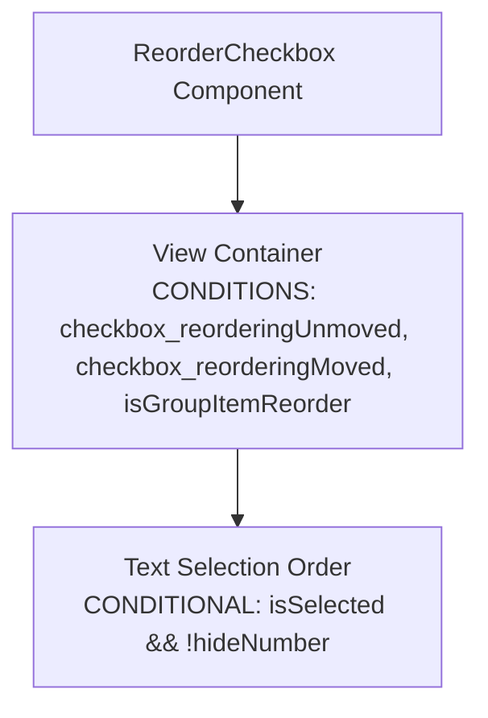

### Styling Conditions

| Element | Condition Variable | Condition Logic | Style Applied | Notes |
|---------|-------------------|-----------------|---------------|-------|
| **Container** | Always | Base | `width: 24`, `height: 24`, `borderRadius: 12`, `borderWidth: 2`, `alignItems: 'center'`, `justifyContent: 'center'` | Base checkbox |
| **Container** | `checkbox_reorderingUnmoved && !isGroupItemReorder` | `isReordering && !isReordered && !isGroupItemReorder` | `backgroundColor: 'transparent'`, `borderColor: COLORS.amber[400]`, `borderStyle: 'dashed'` | Unmoved in reorder (amber) |
| **Container** | `checkbox_reorderingMoved && !isGroupItemReorder` | `isReordering && isReordered && !isGroupItemReorder` | `backgroundColor: COLORS.green[100]`, `borderColor: COLORS.green[200]` | Moved in reorder (green) |
| **Container** | `checkbox_reorderingUnmoved && isGroupItemReorder` | `isReordering && !isReordered && isGroupItemReorder` | `backgroundColor: 'transparent'`, `borderColor: COLORS.indigo[400]`, `borderStyle: 'dashed'` | Unmoved group item (indigo) |
| **Container** | `checkbox_reorderingMoved && isGroupItemReorder` | `isReordering && isReordered && isGroupItemReorder` | `backgroundColor: COLORS.indigo[100]`, `borderColor: COLORS.indigo[200]` | Moved group item (indigo) |
| **Checkbox Text** | `isSelected && !hideNumber` | Renders | `color: COLORS.green[500]`, `fontSize: 12`, `fontWeight: 'bold'` | Shows selection order number |

**✅ VERIFICATION**: 
- Checkbox correctly shows different states for reordering (amber/green for normal, indigo for group items)
- Selection order number only shows when selected and not hidden
- States properly distinguish between moved and unmoved items

---

## Summary of Issues Found

### Critical Issues
None found - all styling conditions work correctly.

### Minor Issues (Redundant Code)

1. **SelectedExercisesSection.js**:
   - `header_expanded` and `header_collapsed` apply empty objects
   - `headerText_expanded` and `headerText_collapsed` apply empty objects
   - `listContainer_expanded` and `listContainer_collapsed` apply empty objects

2. **FilterDropdown.js**:
   - `optionText_selected` applies same style as base (`color: COLORS.white`)

3. **Filters.js**:
   - Selected filter option text applies same style as base

4. **ExerciseListItem/index.js**:
   - Multiple redundant empty condition variables:
     - `container_selectedInSection && renderingSection === 'selectedSection'`
     - `container_addMoreMode`
     - `text_selectedInSection && renderingSection === 'selectedSection'`
     - `text_selectedInList && renderingSection === 'unselectedList'`
     - `text_addMoreMode`
   - `text_selectedInList` applies same color as base

5. **ActionButtons.js**:
   - Multiple redundant empty condition variables for remove button and add button conditions

6. **ExerciseTags.js**:
   - Multiple redundant empty condition variables for `showAddMore` conditions

### Recommendations

1. **Remove redundant condition variables** that apply empty objects - they add no value and clutter the code
2. **Remove condition variables** that apply the same styles as base (e.g., `optionText_selected` in FilterDropdown)
3. **Consider consolidating** similar condition patterns across files for consistency
4. **Document complex condition chains** in comments to improve maintainability

---

## Condition Logic Verification

### ✅ Correctly Implemented

1. **Mutual Exclusivity**: 
   - `isReordering` and `isGroupMode` are mutually exclusive in action buttons
   - `showAddRemoveButtons` and `showAddButtonOnly` are mutually exclusive
   - `container_reorderingMode` and `container_reorderedItem` are mutually exclusive

2. **Condition Ordering**:
   - More specific conditions generally come after general ones
   - Group-specific conditions properly override general selected states
   - Last item conditions properly override group borders

3. **State Coverage**:
   - All possible states appear to be covered
   - Empty states handled correctly
   - Disabled states handled correctly

4. **Nested Conditions**:
   - Child components properly receive parent state via props
   - Group styling correctly propagates to child components

### ⚠️ Areas for Improvement

1. **Condition Variable Naming**: Some inconsistencies (e.g., `container_selectedInSection` vs `text_selectedInSection` - both use same base condition but different names)

2. **Condition Complexity**: Some condition chains are very long (e.g., `container_selectedInSection && !isReordering && !isGroupMode && isGrouped && renderingSection === 'selectedSection'`) - consider extracting to helper functions

3. **Empty Condition Objects**: Many condition variables apply empty objects - these should be removed to reduce confusion

---

## Conclusion

The styling condition trees are generally well-structured and correctly implemented. The main issues are:
1. Redundant empty condition variables that should be removed
2. Some condition variables that don't actually change styling
3. Complex condition chains that could benefit from helper functions or comments

All functional styling conditions work correctly and properly handle the various states (normal, reordering, group mode, selected, unselected, etc.).
