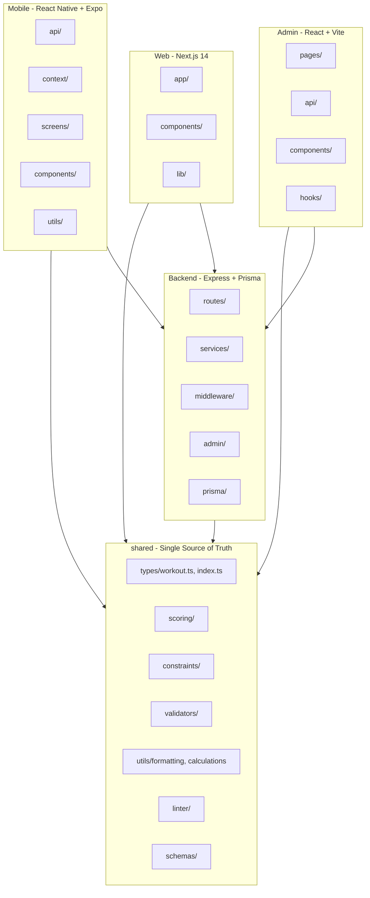
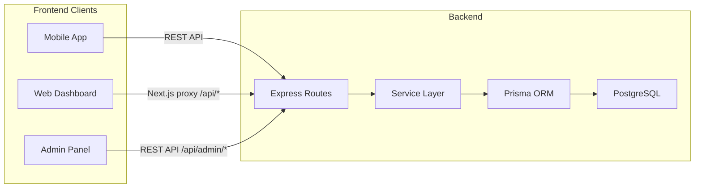

# Architecture Overview

This document describes the high-level architecture of the Solto fitness ecosystem: how the four applications (Mobile, Web, Admin, Backend) and the shared library are structured and how they depend on each other.

---

## 1. System Overview

The system consists of:

| Component | Technology | Purpose |
|-----------|------------|---------|
| **Mobile** | React Native, Expo 54 | Workout tracking, exercise library, profile, offline-first |
| **Web** | Next.js 14 (App Router) | Marketing site + authenticated dashboard (history, analytics, goals, measurements) |
| **Admin** | React 19, Vite 6 | Reference data management (tables, schema, scoring engine, Matrix V2 configs) |
| **Backend** | Express, Prisma, PostgreSQL | REST API: auth, user data, workouts, exercises, dashboard aggregate, admin CRUD |
| **Shared** | TypeScript (library) | Types, scoring engine, constraints, validators, formatting utils |

All runtime data is stored in **PostgreSQL**. The shared library is consumed by Mobile, Web, Admin, and Backend via the `@shared/*` path alias.

---

## 2. Project Dependency Graph



---

## 3. Data Flow



- **Mobile**: Uses `src/api/*` (fetch wrapper with auto-login). Caches workout history and exercise library in AsyncStorage; syncs with backend when online.
- **Web**: Uses `lib/api.ts`; Next.js rewrites `/api/*` to the backend. JWT stored in localStorage.
- **Admin**: Uses `src/api/*` (client, tables, schema, scoring, matrixConfigs). Vite proxy forwards `/api/*` to backend admin routes. No auth.

---

## 4. Folder Structure

### 4.1 Shared Library (`shared/`)

```
shared/
├── types/           # workout.ts (app types), index.ts (scoring/reference), matrixV2.ts
├── utils/           # formatting.ts, calculations.ts, muscleGrouping, deterministicHash
├── scoring/         # computeActivation, resolveDeltas, stripParentZeros
├── constraints/    # evaluator, deadZones
├── validators/      # matrixV2Validator
├── schemas/         # Zod validation
├── linter/          # deltaLinter
├── policy/          # scorePolicy, realismAdvisory
├── semantics/       # dictionary
├── version/         # manifest
└── __tests__/       # 11 test files
```

### 4.2 Backend (`backend/src/`)

```
├── middleware/      # auth, asyncHandler, errorHandler, paramId
├── routes/          # auth, workouts, exercises, measurements, goals, profile, dashboard, personalRecords, referenceV1
├── services/        # workoutService, exerciseService, measurementService, goalService, profileService, dashboardService, referenceService, matrixConfigService, matrixV2Resolver
├── admin/           # routes (tables, schema, scoring, matrixConfigs), tableRegistry, pgCrud
├── auth/            # authService
├── config/          # app config, db (Prisma client)
├── drizzle/         # Postgres pool, migrations
├── seed/            # seedPipeline (one-time migration)
├── setup/           # dbSetup
└── test/            # setup (Prisma mock for Vitest)
```

Pattern: **Routes** handle HTTP (parsing, validation, response). **Services** hold business logic and Prisma queries.

### 4.3 Admin (`admin/src/`)

```
├── api/             # client, tables, schema, scoring, matrixConfigs, index
├── pages/           # Dashboard/, TableEditor/, FilterMatrix/, MotionDeltaMatrix/, ScoringPanel/, RelationshipGraph/
├── components/     # Sidebar, RowEditor, FieldRenderers/, workstation/
├── hooks/           # useWorkstationState, useScoringSimulation
└── styles/
```

### 4.4 Web (`web/`)

```
├── app/             # Next.js App Router (dashboard, history, analytics, goals, measurements, pricing, privacy, terms)
├── components/      # marketing/, dashboard/, ui/
├── lib/             # api.ts, auth-context, dashboard-context, utils
├── types/           # index (re-exports from @shared)
└── vitest.config.ts, vitest-setup.ts
```

### 4.5 Mobile (`src/`)

```
├── api/             # client, workouts, exercises, profile, goals, measurements
├── components/      # common/, ExerciseEditor/, WorkoutTemplate/, ProfileTab components, etc.
├── context/         # WorkoutContext, UserSettingsContext
├── screens/         # Log, History, Library, LiveWorkout, EditWorkout, ProfileTab
├── database/        # providers, configFacade, useExerciseConfig
├── utils/           # workoutHelpers, workoutInstanceHelpers, exerciseFilters, equipmentIcons
├── constants/       # colors, data, defaultStyles, defaultToggles, layout, etc.
├── types/           # workout (re-exports from @shared)
└── config/          # resolveBackendUrl
```

---

## 5. Key Design Decisions

- **Single source of truth for types**: `shared/types/workout.ts` and `shared/types/index.ts`. Mobile and Web re-export from `@shared` to avoid duplication.
- **Single source of truth for formatting**: `shared/utils/formatting.ts` and `shared/utils/calculations.ts`.
- **Backend**: Postgres only; no JSON file I/O in request paths. Service layer separates HTTP from business logic.
- **Admin**: API split into domain modules (client, tables, schema, scoring, matrixConfigs). Pages organized by feature folder.
- **Mobile**: Contexts memoized; AsyncStorage writes debounced and reads batched for performance.

---

## 6. Related Documents

- [API catalog](api.md)
- [Getting started](getting-started.md)
- [Flowcharts](flowcharts.md)
- [Process diagrams](process-diagrams.md)
- [Testing](testing.md)
