# BIOMECHANICS_ARCHITECTURE.md

**Canonical Source of Truth for Exercise Configuration + Baseline Scoring Architecture**  
**Status:** Draft for review / lock  
**Last Updated:** 2026-02-26  
**Repository:** `fitness-app`  
**Primary Scope:** Admin-authored biomechanics data model + baseline scoring compatibility (UBSE / delta-cascade architecture)  
**Out of Scope:** Mobile UI implementation code, runtime frontend state wiring, final delta tuning values, composite/multi-phase sequence decomposition

---

<details>
<summary><strong>Table of Contents</strong></summary>

- [Purpose of this Document](#purpose-of-this-document)
- [Canonical Authority and Precedence](#canonical-authority-and-precedence)
- [Intended Audience](#intended-audience)
- **Part 1 — Canonical Table Model & Relationships**
  - [1.1 Architecture Principle](#11-architecture-principle-non-negotiable)
  - [1.2 In-Scope Canonical Biomechanics Tables](#12-in-scope-canonical-biomechanics-tables-for-this-doc)
  - [1.3 muscles Table](#13-muscles-table-unified-hierarchy-model)
  - [1.4 motions Table](#14-motions-table-canonical-baseline-motion-model)
  - [1.5 Modifier Tables](#15-modifier-tables-delta-carrying-dimensions)
  - [1.6 Relationship Model](#16-relationship-model-high-level)
  - [1.7 What Is Intentionally Not Modeled Here](#17-what-is-intentionally-not-modeled-here)
- **Part 2 — JSON Contracts & Math Boundaries**
  - [2.1 muscle_targets](#21-muscle_targets-absolute-baseline-contract)
  - [2.2 delta_rules](#22-delta_rules-relative-adjustment-contract)
  - [2.3 default_delta_configs](#23-default_delta_configs-home-base-motion-defaults)
  - [2.4 Baseline vs Delta Separation](#24-baseline-vs-delta-separation-non-negotiable)
  - [2.5 Mathematical Safety Boundaries](#25-mathematical-safety-boundaries-architecture-level)
  - [2.6 Example: Baseline + Delta](#26-example-baseline--delta-illustrative-only)
- **Part 3 — Neutral / Home-Base Conventions & Cascade Order**
  - [3.1 Why Home-Base Conventions Matter](#31-why-home-base-conventions-matter)
  - [3.2 Home-Base / Neutral Definition](#32-home-base--neutral-definition)
  - [3.3 Neutral Modifier Rows](#33-neutral-modifier-rows)
  - [3.4 Cascade Order](#34-cascade-order-deterministic-modifier-application-order)
  - [3.5 Dead-Zone Logic](#35-baseline-compatibility-with-dead-zone-logic-conceptual)
  - [3.6 Motion Children](#36-motion-children-parent_id-and-home-base-conventions)
- **Part 4 — Admin Authoring Guardrails**
  - [4.1 Admin Web-App Role](#41-admin-web-app-role-in-the-architecture)
  - [4.2 Guardrail Categories](#42-authoring-guardrail-categories)
  - [4.3 muscle_targets Validation](#43-muscle_targets-authoring-validation-requirements)
  - [4.4 delta_rules Validation](#44-delta_rules-authoring-validation-requirements)
  - [4.5 default_delta_configs Validation](#45-default_delta_configs-authoring-validation-requirements)
  - [4.6 Editor Ergonomics](#46-editor-ergonomics-and-safety-architecture-level-expectations)
  - [4.7 Dead-Zones / Filter Matrix](#47-dead-zones--filter-matrix--builder-guardrails-conceptual-integration-layer)
- **Part 5 — Biomechanical Validation Conventions**
  - [5.1 Authority Boundary](#51-authority-boundary-critical)
  - [5.2 Gym-Floor Validation Checklist](#52-gym-floor-validation-checklist-required-for-examples-and-canonical-rows)
  - [5.3 Example Language Rules](#53-example-language-rules-documentation-safety)
  - [5.4 Common Failure Modes](#54-common-biomechanics-documentation-failure-modes-to-prevent)
- **Part 6 — Deprecated Doc Map / Migration Notes**
  - [6.1 Why This Section Exists](#61-why-this-section-exists)
  - [6.2 Terminology Translation Table](#62-terminology-translation-table-legacy--canonical)
  - [6.3 Document Migration Rules](#63-document-migration-rules)
  - [6.4 Archive / Cleanup Policy](#64-archive--cleanup-policy-recommended)
- **Appendices**
  - [Appendix A: PR Review Checklist](#appendix-a-practical-review-checklist-for-prs-touching-biomechanics-tables)
  - [Appendix B: Explicit Non-Goals](#appendix-b-explicit-non-goals-to-prevent-scope-creep-during-table-finalization)
- [Final Summary (Lock Conditions)](#final-summary-lock-conditions)

</details>

---

## Purpose of this Document

This document is the **single canonical architecture reference** for the fitness app's exercise configuration and baseline scoring data model. It consolidates and supersedes older docs that described overlapping versions of the same system (including split-table motion/muscle models and earlier scoring terminology).

This file exists to ensure the team can safely:
- define and maintain a **normalized biomechanics-first table model**
- author data through the **admin web-app** without ambiguity
- preserve **scoring integrity** for the delta-cascade engine
- avoid duplicate or competing "truth systems" across docs, JSON files, and UI assumptions
- onboard contributors without reviving deprecated abstractions

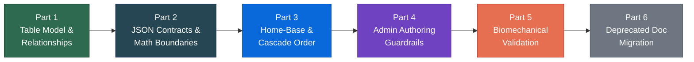

---

## Canonical Authority and Precedence

### Source-of-truth precedence (highest to lowest)

1. **Registry-backed schema implementation** (table registry + actual JSON table files)
2. **This document** (architecture constraints, contracts, conventions, terminology mapping)
3. Historical / deprecated docs (reference only; never authoritative)

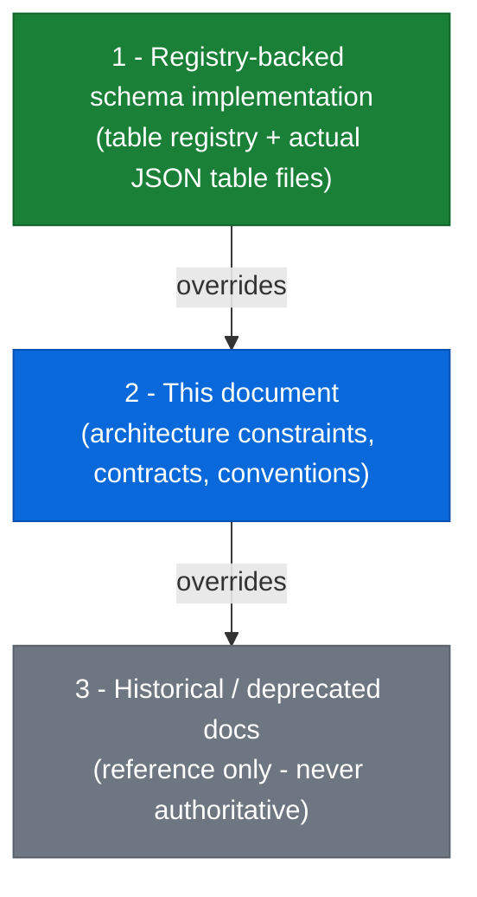

### Critical Rule
Prose in this document **explains and constrains usage**, but does **not** override the registry schema or live table definitions.

If this doc and the registry diverge:
- treat the **registry** as authoritative for structure/types
- treat this doc as needing update
- do **not** patch runtime behavior based only on prose

---

## Intended Audience

This doc is written for:
- **Backend / data architecture** contributors (normalization, FK integrity, import safety)
- **Admin web-app** contributors (table editor behavior, JSON field authoring/validation)
- **Scoring-system** contributors (baseline vs delta semantics, cascade assumptions)
- **Biomechanics / exercise-science reviewers** (taxonomy realism, naming, examples)
- **Future maintainers** replacing legacy docs and terminology

---

# Part 1: Canonical Table Model & Relationships (Registry-Backed)

## 1.1 Architecture Principle (Non-Negotiable)

The system uses a **composable biomechanics-first architecture**:

> An exercise is modeled as a **base motion** plus a set of **modifiers**, not as a hardcoded exercise variant row.

This means:
- `motions` provides the canonical baseline biomechanical intent
- modifier tables provide **relative adjustments** (`delta_rules`)
- admin authoring defines valid combinations and defaults
- scoring is derived through composition, not duplication

This architecture is required for:
- scalability
- row reuse
- consistent scoring behavior
- admin usability
- future delta tuning without schema rework

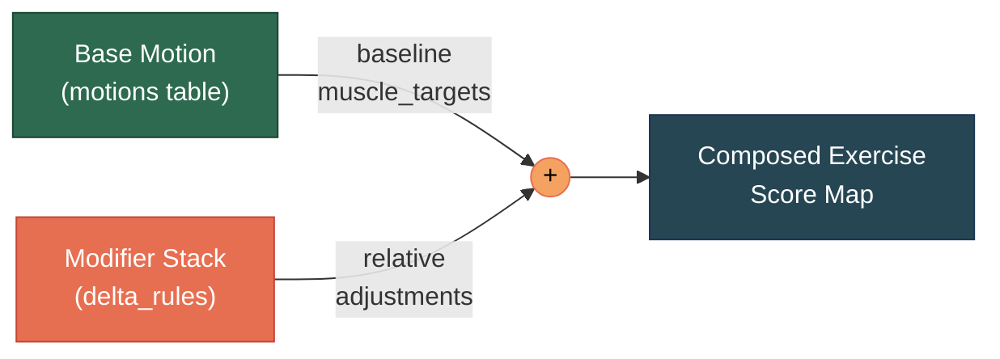

---

## 1.2 In-Scope Canonical Biomechanics Tables (for this doc)

### Core scoring tables
- `muscles`
- `motions`

### Modifier tables (carry `delta_rules`)
- `motionPaths`
- `torsoAngles`
- `torsoOrientations`
- `resistanceOrigin`
- `grips`
- `gripWidths`
- `elbowRelationship`
- `executionStyles`
- `footPositions`
- `stanceWidths`
- `stanceTypes`
- `loadPlacement`
- `supportStructures`
- `loadingAids`
- `rangeOfMotion`

### Explicitly out of scope for this doc (current discussion)
These may exist in the repo/admin but are not part of this architecture finalization scope:
- `exerciseCategories`
- `cardioTypes`
- `trainingFocus`
- `equipmentCategories`
- `equipment`
- `equipmentIcons`

> Note: equipment/filter tables may still influence admin UX and combo constraints, but they are not the focus of this biomechanics-table architecture lock.

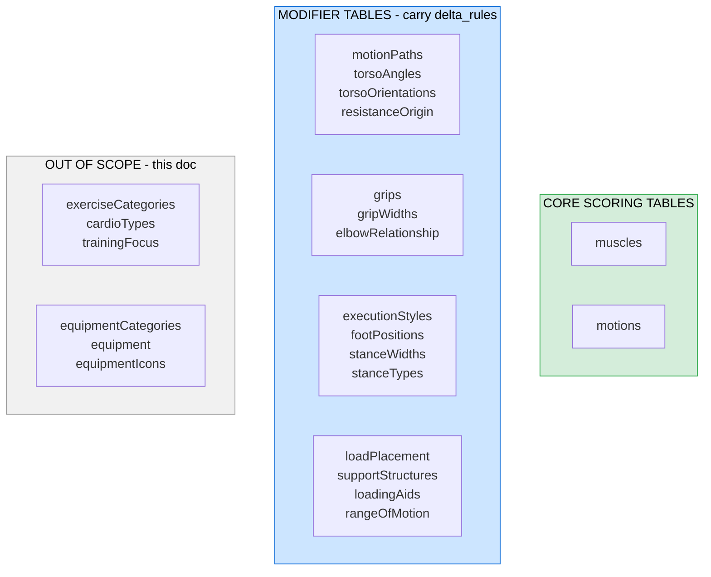

---

## 1.3 `muscles` Table (Unified Hierarchy Model)

### Why a single `muscles` table exists
Older designs often split muscles across multiple tables (e.g., muscle groups / primary / secondary / tertiary). The current architecture consolidates these into a **single hierarchical table** using `parent_ids`.

Benefits:
- one canonical namespace for muscle IDs
- simpler FK references from scoring JSON
- easier rollups and reporting
- fewer migration edge cases
- less duplication across tiers

### Conceptual role
`muscles` defines:
- the canonical muscle taxonomy
- hierarchy / parent-child relationships
- display labels and gym-language aliases
- descriptive metadata for admin/editor/education layers

### Canonical fields (registry-backed)
(Names below must match the actual current registry definitions, not historical variants.)

- `id`
- `label`
- `parent_ids`
- `common_names`
- `technical_name`
- `short_description`
- `function`
- `location`
- `triggers`
- `upper_lower`
- `sort_order`
- `icon`
- `is_active`
- `is_scorable` — boolean (default true); whether this muscle is included in scoring. When **false**, the admin muscle tree builders (muscle_targets and delta_rules editors) show the muscle in the tree but do not allow the user to assign or edit a score for it; "add muscle" dropdowns exclude it; and its id must not appear in any persisted `muscle_targets` or `delta_rules` object. The tree layout is unchanged; only input capability and persisted data are restricted.
- `is_default` — boolean (default true); whether this muscle is a default option in admin/UI
- `is_advanced` — boolean (default false); whether this muscle is shown only in advanced views

### Normalization boundary
`muscles` should **not** contain:
- baseline scoring values
- modifier deltas
- motion-specific targeting assumptions
- UI-only shortcut buckets that duplicate hierarchy truth

### Hierarchy conventions
- `id` is canonical and stable (used in JSON contracts)
- `parent_ids` allows hierarchical relationships (including multi-parent if intentionally supported)
- hierarchy must not create cycles
- labels and aliases may evolve; IDs should remain stable once referenced by scoring data

### Scoring relationship
`muscles` provides the valid keyspace for:
- `motions.muscle_targets`
- modifier `delta_rules`

Only muscles with `is_scorable !== false` may appear as keys in those JSON objects. The admin app enforces this in every muscle tree builder (MuscleTargetTree, MotionConfigTree, DeltaRulesField, MotionPathsField, DeltaBranchCard, Motion Delta Matrix InlineDeltaEditor): non-scorable muscles are shown read-only and are stripped from the payload on save.

---

## 1.4 `motions` Table (Canonical Baseline Motion Model)

### Conceptual role
`motions` is the **baseline biomechanical anchor** of the system.

Each motion row defines:
- canonical motion identity
- gym-friendly naming aliases
- absolute baseline muscle engagement (`muscle_targets`)
- which muscle to use when grouping the motion in admin UIs (`muscle_grouping_id`)
- default home-base modifier stack (`default_delta_configs`)
- optional parent-child motion relationships (`parent_id`) for composable motion taxonomy inheritance / specialization

### Canonical fields (registry-backed)
- `id`
- `label`
- `parent_id`
- `upper_lower`
- `muscle_targets`
- `muscle_grouping_id` — optional FK to `muscles.id`; which muscle to use when grouping this motion in the MOTIONS table and Motion Delta Matrix (e.g. "Arms" or "Biceps"). Configurable via the **Muscle Grouping** dropdown in the motion side-panel; default (and backfill) is the selectable muscle with highest **calculated** score (see Muscle grouping below).
- `default_delta_configs`
- `common_names`
- `short_description`
- `sort_order`
- `icon`
- `is_active`
- `is_scorable` — boolean (default true); reserved for future use (e.g. whether this motion is included in scoring or grouping). **Not currently enforced** in application code; the column is stored and editable in the admin table editor.
- `is_default` — boolean (default true); whether this motion is a default option in admin/UI
- `is_advanced` — boolean (default false); whether this motion is shown only in advanced views

### Muscle grouping (display)

When the admin shows motions grouped by muscle (MOTIONS table "Group by: Muscles" or Motion Delta Matrix motion list), each motion is placed under a **primary** muscle (root in the muscles hierarchy) and optionally a **secondary** (e.g. Biceps under Arms). The grouping key is `muscle_grouping_id` when set; otherwise the system falls back to the muscle with highest **calculated** score among selectable muscles (see below). The **Muscle Grouping** dropdown in the motion side-panel offers only muscles that **qualify** for grouping:

- **Calculated score:** For each muscle, the score used for qualification is its **calculated score**: the explicit value in `muscle_targets` if present, otherwise the sum of its children's calculated scores (recursive). Only muscles whose calculated score meets the threshold (e.g. ≥ 0.5) qualify.
- **Must have children:** Only muscles that have **at least one child** in the muscles hierarchy appear in the dropdown; leaf muscles (no children) never qualify, so users can only assign a motion to a group or sub-group (e.g. Arms or Biceps), not to a leaf muscle.
- **Independent evaluation:** Each muscle is evaluated on its own; a parent qualifying does not automatically include its children, and a child with high score does not add the parent unless the parent's own calculated score meets the threshold.

Options are grouped in the dropdown by primary → secondary → tertiary, sorted alphabetically. Default selection (when `muscle_grouping_id` is null) is the selectable muscle with the **highest calculated score**. Existing rows were backfilled so `muscle_grouping_id` defaults to that muscle.

### What a motion row is **not**
A motion row is **not**:
- a specific branded machine exercise
- a fully configured exercise entry
- an equipment preset
- a UI display card for end users

A motion row is the **biomechanical base** to which modifier rows apply.

---

## 1.5 Modifier Tables (Delta-Carrying Dimensions)

### Conceptual role
Each modifier table models one configurable dimension of exercise setup/execution. Rows in these tables may alter muscle emphasis relative to a motion baseline through `delta_rules`.

Examples:
- `torsoAngles` changes bias via angle
- `grips` changes hand orientation mechanics
- `stanceWidths` changes lower-body loading bias
- `supportStructures` changes stabilization requirements
- `rangeOfMotion` alters emphasis due to ROM changes

### Shared architectural pattern
Most modifier tables share a common logical structure:
- canonical row identity (`id`)
- display labels / aliases (`label`, `common_names`)
- human description (`short_description`)
- optional metadata
- `delta_rules` JSON (relative scoring adjustment definitions)

### Important distinction
Modifier rows do **not** define standalone baselines.  
They only define **relative effects** when applied to a motion context.

---

## 1.6 Relationship Model (High-Level)

### Core relationships
- `motions.muscle_targets` keys must reference valid `muscles.id`
- modifier `delta_rules` must reference valid:
  - `motions.id` (or inherited parent targets as supported by schema conventions)
  - `muscles.id`
- `motions.default_delta_configs` must reference valid row IDs in the corresponding modifier tables

### Self-reference relationship
- `motions.parent_id` enables parent-child motion relationships
- children may inherit conceptual behavior, but must remain schema-valid as independent rows

### Referential integrity goals
All JSON contracts must be import-safe and validator-safe:
- no missing motion IDs in `delta_rules`
- no missing muscle IDs in any scoring JSON
- no invalid modifier row IDs in `default_delta_configs`
- no stale references after renames (IDs should be stable to avoid this)

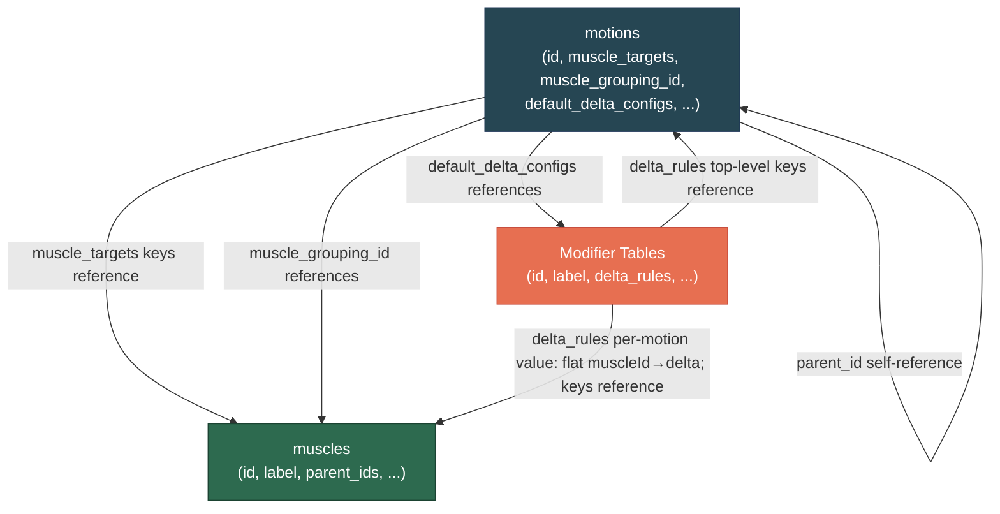

---

## 1.7 What Is Intentionally *Not* Modeled Here

This doc does **not** finalize:
- mobile builder flow state architecture
- frontend-specific "preset chips" or shortcut controls
- composite motion sequence decomposition (multi-phase exercises)
- final user-facing exercise naming strategy
- personalized or adaptive scoring overlays
- effort/load/progression scoring math beyond baseline+delta compatibility notes

---

# Part 2: JSON Contracts & Math Boundaries

This section defines the architecture-level semantics and safety rules for the scoring-relevant JSON fields.

---

## 2.1 `muscle_targets` (Absolute Baseline Contract)

### Location
- Stored on `motions` rows

### Purpose
Represents the **absolute baseline muscle engagement distribution** for the canonical motion.

This is the score map the engine begins from **before** applying active modifier deltas.

### Key properties
- absolute values (not deltas)
- canonical muscle IDs as keys (flat map only; no nested groups)
- motion-specific baseline only
- designed for downstream delta-cascade compatibility

### Storage format (flat only)
`muscle_targets` is a **single-level object**: `Record<muscleId, number>`. Only leaf-level (or explicitly scored) muscle IDs are stored. There are **no nested muscle groups** in the JSON. Parent/group totals are **not** stored; they are computed at **display time** from the `muscles` table hierarchy (`parent_ids`) when the admin UI (or any consumer) needs to show a tree. The scoring engine uses the flat map directly. **On save**, the backend strips parent muscle IDs that have score 0 (same as for `delta_rules`), so only non-zero parent entries and all leaf entries are persisted.

### Contract (conceptual shape)
```json
{
  "MUSCLE_ID_A": 0.42,
  "MUSCLE_ID_B": 0.28,
  "MUSCLE_ID_C": 0.10
}
```

### Contract rules (architecture-level)

1. Keys must be valid canonical `muscles.id`
2. Values must be numeric (float/int accepted by parser, normalized to float)
3. Shape must be **flat**: no nested objects; only `muscleId → number` pairs
4. Values should be bounded by agreed scoring range semantics (typically non-negative baseline contributions)
5. No duplicate keys (JSON parser-level)
6. No prose placeholders like `"inherit"` in `muscle_targets`
7. No motion IDs inside `muscle_targets` (that belongs to `delta_rules`)

### Baseline semantics rule

`muscle_targets` expresses the motion's **baseline engagement distribution**, not:

* max activation
* EMG certainty
* %1RM contribution
* direct hypertrophy outcome prediction

It is a canonical scoring baseline for internal composability.

---

## 2.2 `delta_rules` (Relative Adjustment Contract)

### Location

* Stored on rows across modifier tables

### Purpose

Represents **relative adjustments** to a motion baseline when that modifier row is active.

A modifier row may define different delta behavior for different motions.

### Storage format (flat per motion)
Each motion’s value in `delta_rules` is a **flat** object: `Record<muscleId, number>`. There are **no nested muscle groups**; only muscle IDs as keys and numeric deltas as values. The same flat structure used for `muscle_targets` is used per motion here. Display-time hierarchy (e.g. in the admin UI) is built from the `muscles` table (`parent_ids`); the stored JSON does not contain nested muscle objects. **On save**, the backend strips parent muscle IDs that have score 0 from each motion's value before persisting.

### Contract (conceptual shape)

```json
{
  "MOTION_ID_A": {
    "MUSCLE_ID_1": 0.08,
    "MUSCLE_ID_2": -0.05
  },
  "MOTION_ID_B": {
    "MUSCLE_ID_3": 0.04
  }
}
```

(Each value is a flat map of `muscleId → delta`; no nesting.)

### Contract rules (architecture-level)

1. Top-level keys are `motions.id`
2. Each motion’s value is a **flat** object: keys are `muscles.id`, values are numeric deltas (positive/negative), subject to engine constraints
3. No nested muscle groups inside a motion’s delta map—only `muscleId → number` pairs
4. No baseline totals are stored here
5. No standalone modifier-only muscle maps (must be motion-contextual)
6. No human labels as keys (`"chest"`, `"pecs"`, etc. invalid if not canonical IDs)
7. Must remain composable and additive within the delta-cascade model

### Inheritance semantics (if supported by current schema/editor)

If inheritance placeholders like `"inherit"` are supported in the live admin/editor contract, the allowed placement and interpretation must be explicitly documented and validator-enforced.

**Critical note:**
Inheritance tokens are a **schema/editor contract feature**, not a conceptual requirement of `delta_rules`. If the current registry/editor does not support `"inherit"` in the active implementation, this doc should not imply it does.

> Action for final lock: confirm exact accepted value types in the registry/editor implementation and document them here precisely.

---

## 2.3 `default_delta_configs` (Home-Base Motion Defaults)

### Location

* Stored on `motions` rows

### Purpose

Defines the motion's **canonical home-base / neutral modifier selections** used by the system before user overrides.

This field is critical because it links:

* motion semantics
* admin-authoring defaults
* builder initialization behavior
* baseline-vs-delta clarity
* biomechanics realism checks

### Contract (conceptual shape)

```json
{
  "torsoAngles": ["DEG_0"],
  "grips": ["PRONATED"],
  "gripWidths": ["SHOULDER_WIDTH"],
  "stanceTypes": ["BILATERAL"]
}
```

### Contract rules

1. Keys must correspond to valid modifier table identifiers supported by the system
2. Values must reference valid row IDs in those tables
3. If the field supports single-select vs multi-select differences by table, that must be documented and validator-enforced
4. Home-base defaults must be **motion-specific**, not global prose assumptions
5. These defaults are the canonical anchor used by doc examples and validation checklists

### Important semantic boundary

`default_delta_configs` does **not** store scoring values.
It stores the canonical default **modifier selections** that establish the motion's neutral/home-base modeled context.

---

## 2.4 Baseline vs Delta Separation (Non-Negotiable)

To avoid scoring drift and duplicated logic:

### Absolute baseline belongs only in:

* `motions.muscle_targets`

### Relative adjustments belong only in:

* modifier table `delta_rules`

### Default home-base selections belong only in:

* `motions.default_delta_configs`

Violations to avoid:

* putting baseline maps into modifier rows
* putting delta maps into motion baselines
* documenting "incline press baseline" as a separate motion if it is modeled via `torsoAngles + PRESS_*`
* creating prose-only defaults that contradict `default_delta_configs`

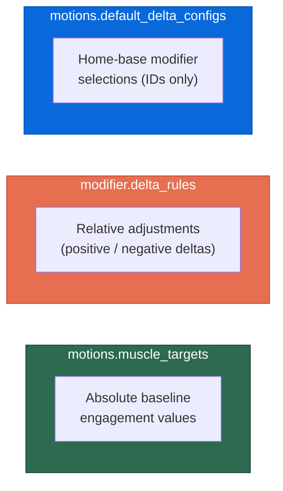

---

## 2.5 Mathematical Safety Boundaries (Architecture-Level)

This doc does not lock final tuning values, but it **does** lock safety expectations:

1. **Composability over precision theater**
   The system must remain mathematically composable and stable across modifiers; it is better to maintain consistent architecture than to overfit single examples.

2. **Deterministic cascade behavior**
   Given the same motion + modifier selections, the engine should produce the same output every time.

3. **No hidden baselines**
   Modifier rows cannot quietly act as alternate baselines.

4. **No doc-level ambiguity about what is summed**
   Baseline + active modifier deltas is the governing model (with downstream normalization/clamping/post-processing handled by engine rules).

5. **Validation before import**
   Scoring JSON should be schema-validated and referentially validated before being considered safe to import/use.

---

## 2.6 Example: Baseline + Delta (Illustrative Only)

> This example is conceptual and not a claim about final tuning values.

* Motion: `PRESS_FLAT`
* Baseline from `motions.muscle_targets`
* Active modifiers include:

  * `torsoAngles = DEG_30`
  * `gripWidths = WIDE`
  * `supportStructures = BENCH`

Engine flow:

1. Load `PRESS_FLAT` baseline map
2. Load the active modifier rows
3. Apply matching motion-specific `delta_rules` in cascade order
4. Run post-cascade checks/normalization/dead-zone logic as defined by engine architecture
5. Output final composed score map

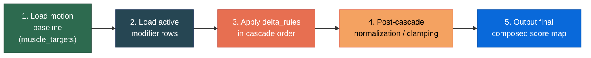

---

# Part 3: Neutral / Home-Base Conventions & Cascade Order

This section defines how the system avoids ambiguity around "default setup" and how modifier effects are applied consistently.

---

## 3.1 Why Home-Base Conventions Matter

Without explicit neutral/home-base conventions:

* contributors will invent prose defaults
* examples will drift
* admin entries will become inconsistent
* scoring comparisons become non-portable
* "modifier vs baseline" confusion returns

The system solves this by anchoring home-base conventions to:

* `motions.default_delta_configs` (authoritative per motion)
* validator-enforced modifier references
* documented cascade order

---

## 3.2 Home-Base / Neutral Definition

A motion's **home-base** is the canonical default set of modifier selections specified in that motion row's `default_delta_configs`.

### Critical rule

There is **no universal global neutral stack** that applies to all motions.
Neutral/home-base is **motion-specific**.

This prevents false assumptions like:

* every motion is "standing"
* every press is pronated shoulder-width
* every row defaults to the same path/origin/support profile

---

## 3.3 Neutral Modifier Rows

Some modifier rows function as "neutral" or "home-base" selections in many motion contexts.

### Convention

If a row is used as a neutral/default selection, its delta behavior should be explicitly documented and validated in the context of motion defaults.

### Safety note

Do **not** assume every neutral/default row must always have empty deltas across all motions unless that is truly part of the active engine contract.

There are two valid patterns depending on implementation:

* **Pattern A:** neutral rows are zero-effect rows (`{}` or no-op per motion)
* **Pattern B:** neutral rows may still define context-preserving adjustments in some motion families

> Final lock item: document which pattern the current engine/admin validators assume.

(If current implementation expects neutral rows to be no-op, this section should be hardened accordingly.)

---

## 3.4 Cascade Order (Deterministic Modifier Application Order)

Modifier application order must be deterministic to ensure:

* stable outputs
* reproducible testing
* consistent debugging
* predictable author expectations

### Architecture rule

The system defines a fixed modifier cascade order.
This order must be implemented in engine logic and reflected in docs/examples.

### Current expected order (subject to confirmation against live implementation)

1. `motionPaths`
2. `torsoAngles`
3. `torsoOrientations`
4. `resistanceOrigin`
5. `grips`
6. `gripWidths`
7. `elbowRelationship`
8. `executionStyles`
9. `footPositions`
10. `stanceWidths`
11. `stanceTypes`
12. `loadPlacement`
13. `supportStructures`
14. `loadingAids`
15. `rangeOfMotion`

> If the actual engine uses a different order, **update this section to match implementation**. Do not leave a doc-only order.

### Why order matters

Even in additive systems, order can matter when combined with:

* dead-zone bypass logic
* clamping/normalization stages
* inheritance resolution
* conditional delta application
* conflict resolution rules

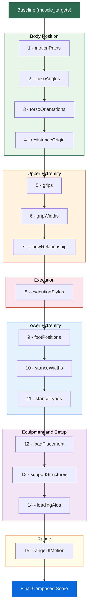

---

## 3.5 Baseline Compatibility with Dead-Zone Logic (Conceptual)

The composable scoring system may include dead-zone or conditional UI/engine behavior (especially in builder/admin translation layers).

Architecture requirement:

* dead-zone logic must operate **after** a clear baseline+delta composition model is established
* dead-zone behavior must not redefine baseline semantics
* dead-zone UX messaging must not imply modifier rows are separate motion baselines

This preserves conceptual clarity:

* baseline = motion
* configuration = modifier selection
* output = composed result

---

## 3.6 Motion Children (`parent_id`) and Home-Base Conventions

When `motions.parent_id` is used:

* child motion rows must still have explicit, validator-safe data
* inheritance should never create hidden dependencies that bypass validation
* docs/examples should clarify whether child rows:

  * define independent `muscle_targets`, or
  * inherit/override portions via explicit engine/editor logic

### Critical safety rule

Do not assume "child motion" = "configured exercise."
A child motion is still part of the motion taxonomy, not a replacement for modifier composition.

---

# Part 4: Admin Authoring Guardrails (Authoring Safety, Validation, and Translation)

This section defines the authoring constraints required for the admin web-app to safely manage the biomechanics tables.

---

## 4.1 Admin Web-App Role in the Architecture

The admin web-app is the **authoring interface** for canonical table data.

It is not a separate truth system.
Its responsibilities are to:

* expose registry-defined tables/fields
* validate row shape and referential integrity
* prevent malformed JSON
* guide authors toward composable, canonical entries
* reduce accidental duplication and semantic drift

---

## 4.2 Authoring Guardrail Categories

### A. Structural guardrails

* required fields enforced
* field types enforced
* FK/FK[] references validated
* inactive/deleted references surfaced before save/import

### B. JSON contract guardrails

* `muscle_targets` shape validation
* `delta_rules` shape validation
* `default_delta_configs` key/value validation
* canonical ID key enforcement (no labels in JSON keys)

### C. Semantic guardrails

* prevent duplicate concept rows
* alias/common-name uniqueness checks (table-level or scoped)
* warnings on likely deprecated terminology
* warnings when a modifier row appears to encode a baseline

### D. Translation guardrails (admin → builder/runtime)

* ensure author-facing labels map cleanly to runtime expectations
* preserve canonical IDs even if labels/common names change
* maintain explicit default selections for builder initialization

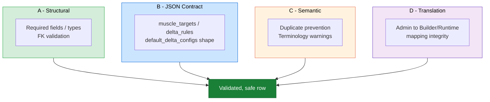

---

## 4.3 `muscle_targets` Authoring Validation Requirements

### Required validations

* JSON parses successfully
* **flat structure only**: no nested objects; only `muscleId → number` pairs
* all keys exist in `muscles`
* all values are numeric and within accepted bounds
* no disallowed tokens (`inherit`, labels, comments)
* deterministic serialization (recommended for diff hygiene)
* optional: sum/normalization checks per architecture rules

### Recommended warnings

* empty map on active motion row
* excessive number of keys (possible over-modeling)
* references to inactive muscles

---

## 4.4 `delta_rules` Authoring Validation Requirements

### Required validations

* JSON parses successfully
* top-level keys exist in `motions`
* each motion’s value is a **flat** object: keys are muscle IDs that exist in `muscles`, values are numeric deltas (no nested muscle groups)
* no malformed mixed structures (e.g., arrays where objects expected)
* no orphan motion references after motion deprecations

### Recommended warnings

* rows with no delta effect across all motions (if unintended)
* huge delta magnitudes likely to destabilize outputs
* duplicated delta intent across multiple modifier rows
* modifier row appears to encode a complete motion baseline

---

## 4.5 `default_delta_configs` Authoring Validation Requirements

### Required validations

* keys correspond to valid modifier dimensions supported by the system
* referenced IDs exist in the correct modifier tables
* selection cardinality matches dimension rules (single vs multi if applicable)
* no unknown modifier-table keys
* no references to inactive rows unless intentionally allowed

### Recommended warnings

* missing expected dimension defaults for active motion
* duplicate row IDs in same modifier dimension
* default stack inconsistent with documented home-base example
* home-base references deprecated modifier rows

---

## 4.6 Editor Ergonomics and Safety (Architecture-Level Expectations)

The admin UI should make canonical authoring easier than ad-hoc JSON editing.

Recommended UX support (implementation detail can vary):

* specialized JSON editors for scoring fields
* inline FK validation feedback
* canonical ID autocomplete for muscles/motions
* diff preview before save/import
* dependency impact preview for ID changes
* "where used" lookup for motions/muscles/modifier rows
* validation profiles (hard error vs warning)

This section does not prescribe exact UI components, but it does establish the **authoring safety expectations** the tooling must meet.

For implementation gotchas and fixes (e.g. React Rules of Hooks, JSON field parsing in the admin), see **ADMIN_UI_NOTES.md** in this folder.

---

## 4.7 Dead-Zones / Filter Matrix / Builder Guardrails (Conceptual Integration Layer)

Even though mobile UI runtime is out of scope, admin-authored data must remain compatible with the builder architecture.

### Architectural expectations

* impossible combinations should be prevented or clearly surfaced
* neutral/home-base defaults should initialize cleanly
* conditional UX states (dead-zones, hidden modifiers, invalid combos) must not mutate canonical baseline semantics
* filtering/constraints should guide selection, not redefine motion meaning

### Important boundary

Constraint/filter logic is not a substitute for canonical biomechanics modeling:

* use constraints to prevent impossible combos
* use motion/modifier tables to represent actual biomechanics semantics

**Where constraint authoring lives:** The **Matrix V2 Config** system (see Cross-References) is the implementation of this layer. The Matrix V2 workstation is the primary authoring surface for motion-scoped and group-scoped modifier constraints (applicability, allowed rows, defaults, optional one-per-group row assignment, torso/load placement rules, and export/import). Authoring there does not change the canonical JSON contracts in this document (`muscle_targets`, `delta_rules`, `default_delta_configs`); it configures which modifier options apply and how they are presented per motion or motion family.

---

# Part 5: Biomechanical Validation Conventions (Validation Layer, Not Schema Authority)

This section defines biomechanical realism checks used to review rows/examples/documentation **after** schema and JSON contracts are established.

## 5.1 Authority Boundary (Critical)

Part 5 is a **validation layer**.

It:

* validates realism and coaching-language clarity
* pressure-tests examples and default setups
* catches semantic drift

It does **not**:

* override canonical IDs
* create alternate schema structures
* introduce undocumented modifier dimensions
* replace registry contracts with prose "trainer preferences"

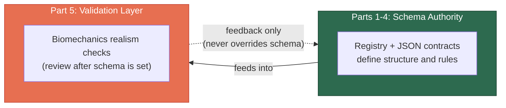

---

## 5.2 Gym-Floor Validation Checklist (Required for Examples and Canonical Rows)

Every row and every example used in docs/reviews should pass these checks before lock:

### 1) Common-names realism

Do `common_names` include phrases a real coach/lifter would actually say/search for?

Examples of good outcomes:

* "incline dumbbell press"
* "wide-grip pull-up"
* "neutral-grip row"

Avoid:

* awkward canonical-only phrasing that no user would say
* labels that imply a different modifier stack than intended

### 2) Neutral setup anchored to `default_delta_configs`

When the doc describes a motion's "home-base" setup, does it exactly match that motion row's `default_delta_configs`?

This prevents prose drift and subjective memory from becoming hidden architecture.

### 3) No modifier-as-baseline drift

Do examples correctly describe configured exercises as:

* base motion + modifiers

and **not** as:

* new standalone motion baselines (unless the taxonomy intentionally defines a distinct motion row for a different biomechanical primitive)

### 4) Scoring-integrity language guardrail (Chat)

Does any example wording imply that a modifier row contains an alternate baseline rather than a relative adjustment?

This is the most common source of future contributor confusion.

### 5) Biomechanical plausibility check (Grok pressure-test)

Do the baseline and delta examples preserve realistic prime mover vs stabilizer expectations without obvious overinflation/underrepresentation?

(Examples are illustrative, but they should still be plausible.)

---

## 5.3 Example Language Rules (Documentation Safety)

When writing examples:

* always name the base motion explicitly
* name the active modifiers explicitly when relevant
* avoid ambiguous shorthand if it conceals the modifier dimension
* do not use branded machine names as if they were motion IDs
* if using common gym names ("incline press"), clarify the implied modifier composition at least once in the example set

---

## 5.4 Common Biomechanics Documentation Failure Modes (to Prevent)

1. **Taxonomy inflation**
   Creating new motion rows for what should be modifier combinations.

2. **Alias drift**
   `common_names` suggest a different setup than the actual defaults.

3. **Baseline contamination**
   Modifier docs/examples treated like alternate baselines.

4. **Context loss**
   Examples mention "neutral" or "standard" setups without referencing `default_delta_configs`.

5. **Trainer-language overreach**
   Coaching preferences incorrectly elevated into schema rules.

---

# Part 6: Deprecated Doc Map / Migration Notes

This section preserves translation context from older docs so contributors can map legacy terminology into the current architecture.

## 6.1 Why this section exists

Older docs may describe valid conceptual ideas using outdated table names or split-table models. Without a translation map, contributors may:

* recreate deprecated tables
* misunderstand current registry structures
* duplicate concepts in new docs
* reintroduce baseline/modifier confusion

This section is intentionally retained to reduce migration regressions.

---

## 6.2 Terminology Translation Table (Legacy → Canonical)

| Legacy Term / Pattern                                  | Current Canonical Interpretation                                                                                                           | Notes                                                        |
| ------------------------------------------------------ | ------------------------------------------------------------------------------------------------------------------------------------------ | ------------------------------------------------------------ |
| `primaryMotions`                                       | `motions` (base rows)                                                                                                                      | Legacy split terminology replaced by unified `motions` table |
| `primaryMotionVariations`                              | `motions` child rows via `parent_id` (where used)                                                                                          | Variations are not separate hardcoded exercise definitions   |
| `motionPlanes` (as standalone scoring driver)          | Typically represented by current modifier dimensions such as `motionPaths` / `resistanceOrigin` / other current tables depending on intent | Do not blindly 1:1 map without semantics review              |
| split muscle tables (group/primary/secondary/tertiary) | unified `muscles` table + hierarchy via `parent_ids`                                                                                       | Single namespace for scoring JSON keys                       |
| "exercise variant row" as scoring anchor               | base motion + modifiers composition                                                                                                        | Core architecture shift                                      |
| prose "standard setup" defaults                        | `motions.default_delta_configs`                                                                                                            | Canonical home-base source                                   |

---

## 6.3 Document Migration Rules

When migrating or rewriting old docs:

1. Preserve useful concepts
2. Rewrite outdated table names to current canonical names
3. Remove split-model assumptions unless explicitly still supported
4. Mark uncertain mappings as "needs schema confirmation"
5. Never copy legacy examples that imply modifier rows are baselines
6. Re-validate all examples with Part 5 checklist

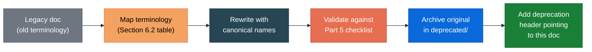

---

## 6.4 Archive / Cleanup Policy (Recommended)

To avoid losing critical rationale during cleanup:

### Recommended sequence

1. Create/merge the new canonical doc
2. Review/validate against this architecture
3. Move replaced docs to `archive/deprecated/`
4. Add deprecation headers pointing to this file
5. Optionally delete in a later commit after verification

### Why archive-first matters

* preserves audit trail
* supports rollback
* helps future contributors understand what changed
* prevents accidental loss of unique scoring/cascade notes

---

# Appendix A: Practical Review Checklist (For PRs Touching Biomechanics Tables)

Use this checklist when reviewing PRs that change `muscles`, `motions`, or modifier tables.

## A. Schema / normalization

* [ ] No duplicate concept introduced under a new label
* [ ] IDs are canonical/stable and not UI phrasing
* [ ] Parent-child relationships are valid and non-cyclic
* [ ] JSON fields match registry/editor contracts

## B. Scoring contract integrity

* [ ] `muscle_targets` remains baseline-only (no deltas/inheritance tokens unless explicitly supported)
* [ ] `delta_rules` remains modifier-relative and motion-contextual
* [ ] `default_delta_configs` references valid modifier rows only
* [ ] No example or row implies modifier = alternate baseline

## C. Admin authoring safety

* [ ] Changes are authorable/maintainable in admin tooling
* [ ] IDs/labels/common_names remain discoverable and unambiguous
* [ ] Validator behavior remains clear (hard errors vs warnings)

## D. Biomechanics realism

* [ ] Common names pass gym-floor language test
* [ ] Home-base examples match `default_delta_configs`
* [ ] Examples remain biomechanically plausible
* [ ] No taxonomy inflation from modifier combinations

---

# Appendix B: Explicit Non-Goals (to Prevent Scope Creep During Table Finalization)

The following are intentionally deferred and should not block locking the architecture:

* final delta magnitudes/tuning for every row
* personalized user-level scoring adjustments
* mobile UI component design
* visual exercise card naming strategy
* machine-brand-specific UX terminology
* composite motion sequence math
* advanced recommendation engine behaviors

---

# Cross-References

- **Matrix V2 Config System:** See [`MATRIX_V2_CONFIG_OVERVIEW.md`](../../MATRIX_V2_CONFIG_OVERVIEW.md) for the complete Matrix V2 config system documentation, including the constraint resolver, validation stack, and API endpoints.
- **Unified Authoring Workstation:** See [Section 17 of MATRIX_V2_CONFIG_OVERVIEW.md](../../MATRIX_V2_CONFIG_OVERVIEW.md#17-unified-authoring-workstation) for the V2 workstation that serves as the **primary authoring surface** for both constraint configuration and delta scoring. The workstation combines baseline `muscle_targets` editing, per-row `delta_rules` branch editing (with parent/child inheritance), and live client-side scoring simulation in a single unified panel.
- **Modifier Table Configuration (V2 motions):** See [Section 10 (Modifier Table Configuration) of MATRIX_V2_CONFIG_OVERVIEW.md](../../MATRIX_V2_CONFIG_OVERVIEW.md#modifier-table-configuration-workstation) for how modifier tables are authored in the V2 Matrix for motions. This includes: **all motions visible in sidebar** with hierarchical parent→child grouping, per-motion **"+ Draft"** button, and auto-draft bootstrapping on mount (`POST /ensure-drafts`); modifier tables **grouped by category** (Trajectory & Posture, Upper Body, Lower Body, Execution Variables) with collapsible sections; **Default / Home-Base** and **"1 row per group"** checkbox in the same row (checkbox immediately after dropdown); allowed rows below; **parent-child row visibility** with **children nested under parent** in display order (Allowed Rows, Default dropdown, Load Placement, Delta Scoring); **Allow 1 row per group** when enabled forces list view and shows inline assignment dropdown per allowed row button, delta_rules auto-move on reassignment; **Torso Angles** angle-range dropdowns (5° increments, auto-select/deselect rows with confirmation) and conditional **Torso Orientations** enable/disable; **Load Placement** secondary overrides and valid-secondary selection; **Export** (full JSON, table TSV, copy to clipboard) and **Import** via multi-step wizard (Source → Input → Review & Map → Apply; supports JSON, CSV/TSV, paste) with multi-row import, optional VERSION column for auto-mapping to draft versions, version mapping UI, motion ID validation (invalid IDs auto-skipped with warnings), and auto-incrementing version numbers on draft creation; **root motion delta editing** always opens in editable custom mode (no "inherit" state since there is no parent); **config deletion** (drafts and active configs with force option); **sidebar config list** with all motions always visible, each with active/draft count badges and "+ Draft" button; **Motion Context auto-hide** when a primary motion has no variations (auto-selects the only motion); **Delta Scoring section** with red color scheme (red-200 borders, red-700 label), centered score inputs, fixed-width (`w-40`) add-muscle dropdowns, inherit checkbox in `DeltaBranchCard` header, `inlineAssignment` prop for consolidated one_per_group headers, fixed-width (`min-w-[120px]`) allowed row buttons; **hierarchical delta muscle tree** with per-level add dropdowns (primary → secondary → tertiary) in both `DeltaBranchCard` (V2 Config tab) and `InlineDeltaEditor` (Delta Rules tab side-panel); **Delta Rules side-panel manual save** — all changes are buffered locally and only saved when the user clicks Save (closing/switching discards unsaved changes with confirmation); **delta-to-config sync** — all delta_rules saves are automatically synced to Matrix V2 configs at two levels: (1) a backend hook in `tables.ts` detects `delta_rules` in any reference table write (PUT row, POST row, full-table upsert, bulk-matrix) and calls `syncDeltasForMotion` for each motion ID, covering all generic table editors, MotionPathsField, and any other frontend; (2) frontend explicit calls from MotionDeltaMatrix and useWorkstationState also trigger `POST /sync-deltas/:motionId` plus bump `refreshKey` for V2 Config tab refresh; a batch endpoint `POST /sync-deltas` processes all motions; tests in `shared/__tests__/deltaSyncConfig.test.ts` and `shared/__tests__/matrixConfigIntegrity.test.ts`; **config integrity constraints** — PostgreSQL partial unique indexes enforce at most 1 active config per scope and unique version numbers per scope; all mutation paths use advisory locks for race-condition safety; `POST /deduplicate` endpoint for manual cleanup; motion CRUD hooks auto-create/delete configs; **active config inline editing** — active configs can be edited directly; saving creates a new version and activates it (with confirmation), demoting the old version to a draft; cancel with confirmation reverts edits; **inherit delta_rules display** — when a motion's delta_rules value is `"inherit"`, the expanded view shows "Inherited" text plus the motion's base muscle scores (ReadOnlyMuscleTree) instead of parsing the string as a tree. These behaviors align with this document’s motion/modifier model and do not change the canonical `muscle_targets` / `delta_rules` / `default_delta_configs` contracts.
- **Scoring Pipeline:** The client-side simulation in the workstation reuses the same shared scoring utilities (`shared/scoring/resolveDeltas.ts`, `shared/scoring/computeActivation.ts`) documented in Part 2 of this architecture.
- **Score Policy:** `shared/policy/scorePolicy.ts` defines clamping, normalization, and missing key behavior used by both backend and client-side scoring.
- **Realism Advisory:** `shared/policy/realismAdvisory.ts` provides informational realism flags (green/yellow/red) for simulation results.
- **Semantics Dictionary:** `shared/semantics/dictionary.ts` is a stub for per-modifier-table semantic descriptors, coaching cue templates, and ROM quality labels.

---

# Final Summary (Lock Conditions)

This architecture is considered "locked" for foundation purposes when the team reaches agreement on:

1. Canonical in-scope table set and normalization boundaries
2. JSON contract semantics (`muscle_targets`, `delta_rules`, `default_delta_configs`)
3. Motion-specific home-base conventions anchored to `default_delta_configs`
4. Deterministic cascade order (matching implementation)
5. Admin validation/authoring guardrails
6. Deprecated terminology mapping and cleanup plan

Once locked, future work (delta tuning, UI implementation, advanced scoring features) should build on this foundation without structural rework.
