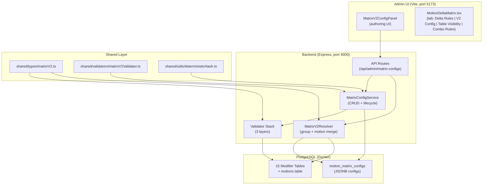
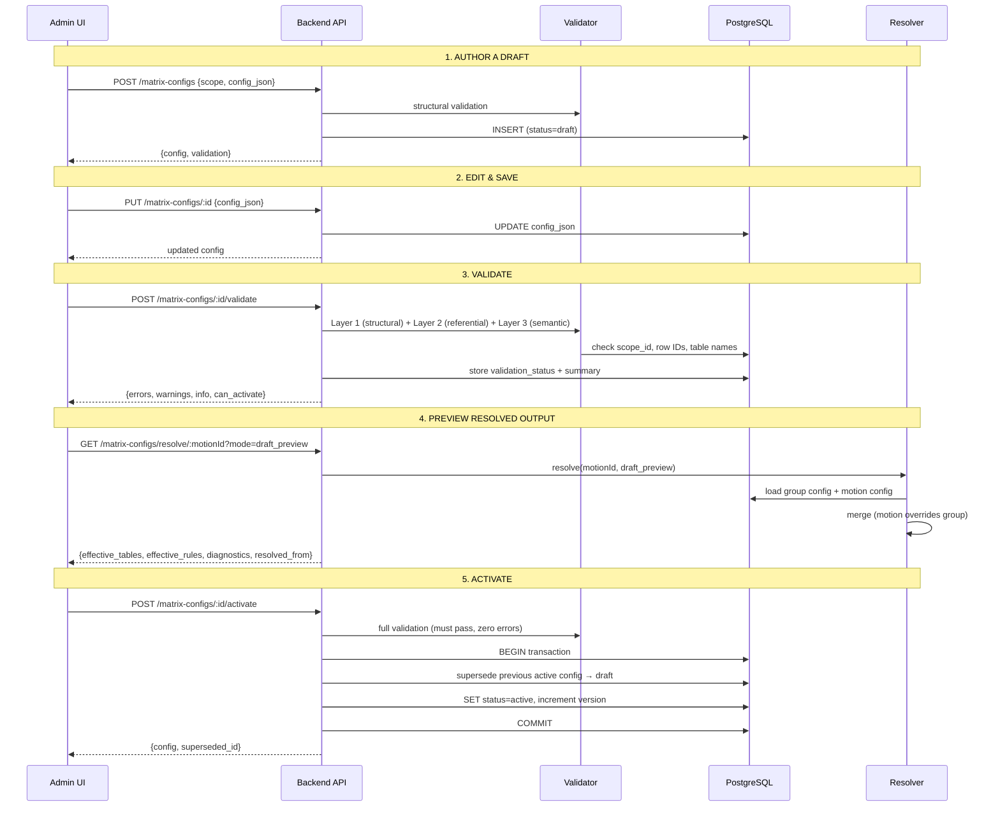
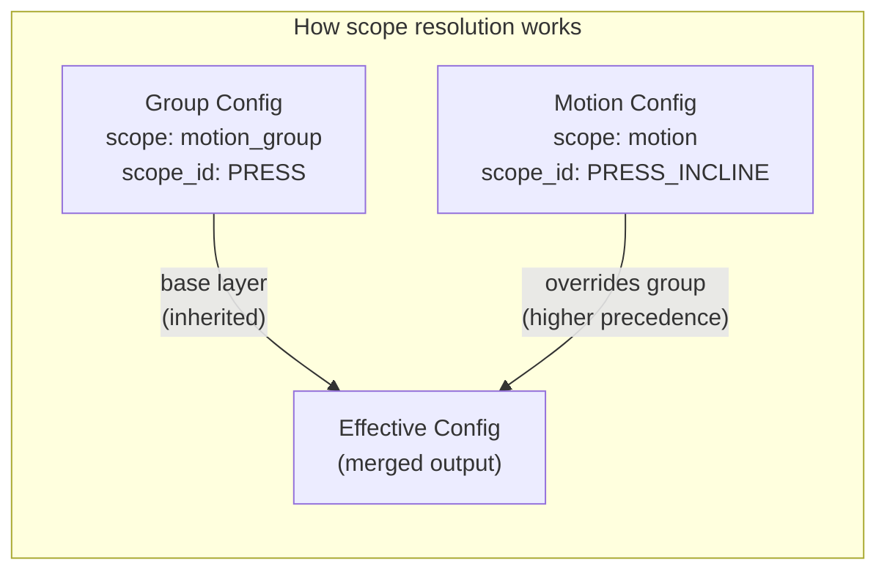
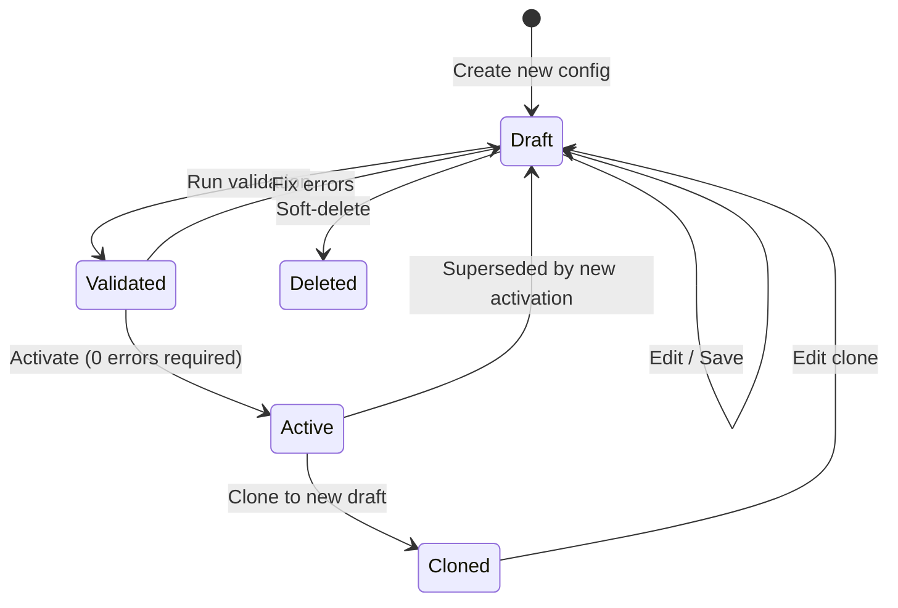
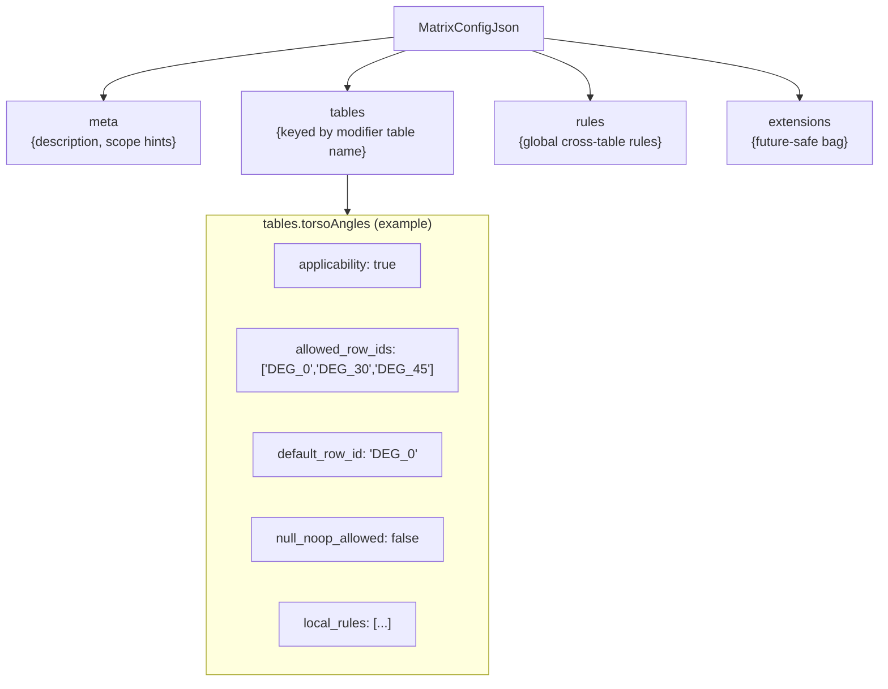
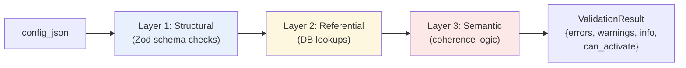
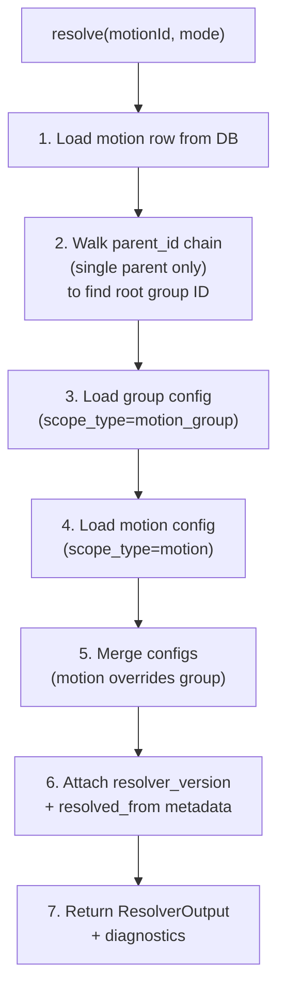
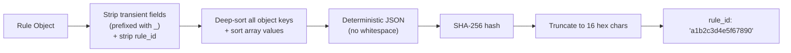
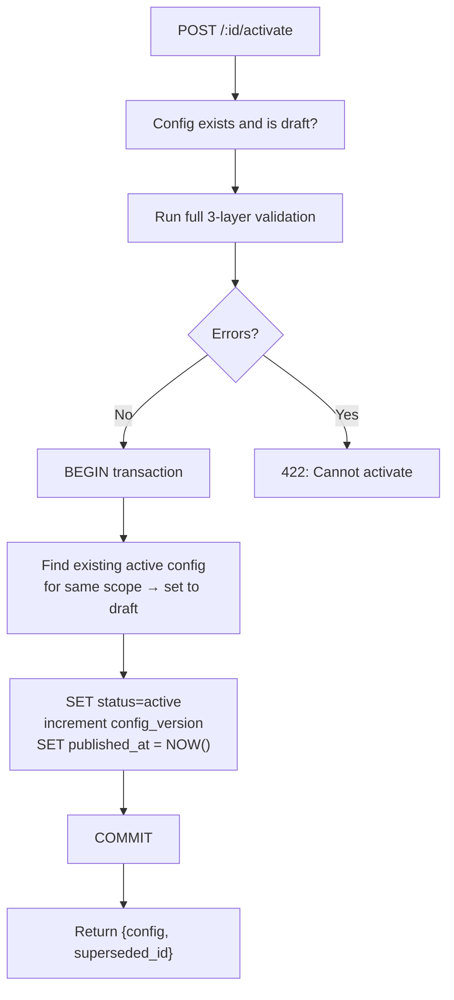

# Motion Delta Matrix V2 Config -- Complete System Guide

**Goal:** Implementation-accurate documentation for backend/data-integrity review and architecture discussion. Terminology and behavior below match the current codebase unless marked otherwise.

---

## Implementation Status Legend

| Term | Meaning |
|------|--------|
| **Implemented** | Behavior exists in code and is described as implemented. |
| **Partially Implemented** | Some behavior exists; gaps or limitations are noted. |
| **Planned** | Designed and documented but not yet built. |
| **Not Yet Implemented** | Explicitly not in code; docs do not imply it exists. |

Use these labels in the doc where clarity is needed. Default is **Implemented** for described behavior unless stated.

---

## Single-Parent Hierarchy (Locked)

- A given motion/variation has **exactly one** parent via `parent_id` (strict single-parent hierarchy).
- There is **no multi-parent inheritance** for motions. Scope resolution and group derivation assume a single chain from a motion up to one root.
- All references to "parent chain," "group derivation," or "scope resolution" in this document assume this single-parent model.

---

## Table of Contents

1. [What Is Matrix V2 Config?](#1-what-is-matrix-v2-config)
2. [Architecture Overview](#2-architecture-overview)
3. [Core Concepts](#3-core-concepts)
4. [Database Layer](#4-database-layer)
5. [Type System](#5-type-system)
6. [Validation Stack](#6-validation-stack)
7. [Resolver Engine](#7-resolver-engine)
8. [Deterministic Hashing](#8-deterministic-hashing)
9. [API Endpoints](#9-api-endpoints)
10. [Admin UI Components](#10-admin-ui-components)
11. [Import / Export](#11-import--export)
12. [Lifecycle & Safety Guards](#12-lifecycle--safety-guards)
13. [Adding New Modifier Tables](#13-adding-new-modifier-tables)
14. [File Map](#14-file-map)
15. [User-Friendly Guide](#15-user-friendly-guide)
16. [Implementation Reference (A–J)](#16-implementation-reference-aj)
17. [Unified Authoring Workstation](#17-unified-authoring-workstation)
18. [Known Gaps / Next Work](#18-known-gaps--next-work)
19. [Glossary / Terminology Lock](#19-glossary--terminology-lock)

---

## 1. What Is Matrix V2 Config?

Matrix V2 Config is a **scoped configuration layer** that sits on top of the existing 15 modifier tables (torso angles, grips, stance types, etc.). It lets you declaratively define, per motion family or individual motion:

- **Which modifier tables apply** (applicability on/off)
- **Which rows are allowed** within each applicable table
- **What the default/home-base value is** for each table
- **Rules** that conditionally hide, disable, or filter modifier options based on other selections

Without Matrix V2, every motion sees every row in every modifier table. With it, a Pressing motion can be constrained to only show relevant torso angles (0-45 degrees), relevant grips (pronated, neutral), and hide foot positions entirely.

### What Problem Does It Solve?

```
BEFORE (no Matrix V2):
  User selects "Incline Press"
  → All 11 torso angles shown (including irrelevant ones like 90 degrees)
  → All 25+ grips shown
  → Foot positions shown (irrelevant for pressing)
  → No default selection guidance

AFTER (with Matrix V2):
  User selects "Incline Press"
  → Only DEG_30 and DEG_45 shown (from motion-level override)
  → Only PRONATED, NEUTRAL, SEMI_PRONATED, ROTATING shown (from group config)
  → Foot positions hidden (inapplicable)
  → DEG_45 pre-selected as default
```

---

## 2. Architecture Overview



### How Data Flows Through the System



---

## 3. Core Concepts

### Scope Model

Every config targets either a **motion group** (family-level defaults) or a **specific motion** (per-motion overrides). Parentage is **strict single-parent**: each motion has at most one `parent_id`; there is no multi-parent inheritance.



| Scope Type | `scope_type` | Purpose | Example `scope_id` |
|---|---|---|---|
| Motion Group | `motion_group` | Shared defaults for a family | `PRESS`, `HORIZONTAL_ROW` |
| Motion | `motion` | Overrides for a specific child | `PRESS_INCLINE`, `ROW_HIGH` |

**Precedence rule:** `motion` always overrides `motion_group`. If a field is absent at motion scope, it inherits from the group. If the group is also absent, system defaults apply.

### Draft / Active Lifecycle



- **Draft**: Editable, can have validation errors, not visible to the resolver in `active_only` mode. Multiple drafts per (scope_type, scope_id) are allowed.
- **Active**: Locked (immutable), used by the resolver. **At most one active config per (scope_type, scope_id)**; activating a config supersedes the previous active for that scope (the old one is set back to draft). There is no multi-active-per-scope; we do not allow two "live" configs for the same motion or group.
- **Deleted**: Soft-deleted (`is_deleted = TRUE`), invisible to all default queries, preserved for audit

### The 15 Modifier Tables

These are the existing reference tables that Matrix V2 governs:

| # | Key | Table Name | Category |
|---|---|---|---|
| 1 | `motionPaths` | Motion Paths | Trajectory & Posture |
| 2 | `torsoAngles` | Torso Angles | Trajectory & Posture |
| 3 | `torsoOrientations` | Torso Orientations | Trajectory & Posture |
| 4 | `resistanceOrigin` | Resistance Origin | Trajectory & Posture |
| 5 | `grips` | Grips | Upper Body Mechanics |
| 6 | `gripWidths` | Grip Widths | Upper Body Mechanics |
| 7 | `elbowRelationship` | Elbow Relationship | Upper Body Mechanics |
| 8 | `executionStyles` | Execution Styles | Upper Body Mechanics |
| 9 | `footPositions` | Foot Positions | Lower Body Mechanics |
| 10 | `stanceWidths` | Stance Widths | Lower Body Mechanics |
| 11 | `stanceTypes` | Stance Types | Lower Body Mechanics |
| 12 | `loadPlacement` | Load Placement | Lower Body Mechanics |
| 13 | `supportStructures` | Support Structures | Execution Variables |
| 14 | `loadingAids` | Loading Aids | Execution Variables |
| 15 | `rangeOfMotion` | Range of Motion | Execution Variables |

---

## 4. Database Layer

### Table: `motion_matrix_configs`

**Migration:** `backend/src/drizzle/migrations/0003_matrix_configs.sql`
**Drizzle schema:** `backend/src/drizzle/schema/referenceTables.ts` (the `motionMatrixConfigs` export)

| Column | Type | Description |
|---|---|---|
| `id` | `TEXT PRIMARY KEY` | UUID, auto-generated |
| `scope_type` | `TEXT NOT NULL` | `'motion'` or `'motion_group'` |
| `scope_id` | `TEXT NOT NULL` | The motion or group ID this config targets |
| `status` | `TEXT NOT NULL` | `'draft'` or `'active'` |
| `schema_version` | `TEXT NOT NULL` | Config schema version (currently `'1.0'`) |
| `config_version` | `INTEGER NOT NULL` | Auto-incremented per scope on create/clone; also incremented on activation |
| `config_json` | `JSONB NOT NULL` | The full configuration payload (see below) |
| `notes` | `TEXT` | Freeform notes |
| `validation_status` | `TEXT` | `'valid'`, `'warning'`, or `'error'` |
| `validation_summary` | `JSONB` | Array of `ValidationMessage` objects |
| `is_deleted` | `BOOLEAN NOT NULL` | Soft-delete flag (default `FALSE`) |
| `created_at` | `TIMESTAMPTZ` | Auto-set on insert |
| `updated_at` | `TIMESTAMPTZ` | Updated on every write |
| `published_at` | `TIMESTAMPTZ` | Set when activated |
| `created_by` | `TEXT` | (Reserved for future auth) |
| `updated_by` | `TEXT` | (Reserved for future auth) |

**Indexes (partial, filtered on `is_deleted = FALSE`):**

- `idx_mmc_scope` -- `(scope_type, scope_id, status)` for list queries
- `idx_mmc_scope_updated` -- `(scope_type, scope_id, updated_at)` for ordering
- `idx_mmc_active_lookup` -- `(scope_type, scope_id)` filtered to `status = 'active'` for resolver fast-path

### pgAdmin Access

The table is visible in pgAdmin under the `onlyfit` database. Useful queries:

```sql
-- All active configs
SELECT id, scope_type, scope_id, config_version
FROM motion_matrix_configs
WHERE status = 'active' AND is_deleted = FALSE;

-- Inspect a specific config's JSONB payload
SELECT config_json->'tables'->'torsoAngles'
FROM motion_matrix_configs
WHERE scope_id = 'PRESS' AND status = 'active';

-- Count configs by scope type
SELECT scope_type, status, COUNT(*)
FROM motion_matrix_configs
WHERE is_deleted = FALSE
GROUP BY scope_type, status;
```

---

## 5. Type System

**File:** `shared/types/matrixV2.ts`

This is the shared contract used by backend, admin UI, and tests. All types are re-exported from `shared/types/index.ts`.

### `config_json` Payload Structure



### Key Interfaces

| Interface | Purpose |
|---|---|
| `MatrixConfigJson` | The main `config_json` payload shape: `meta`, `tables`, `rules`, `extensions` |
| `TableConfig` | Per-modifier-table settings: `applicability`, `allowed_row_ids`, `default_row_id`, `null_noop_allowed`, `local_rules`, plus optional extended fields (see below) |
| `LocalRule` | A rule scoped to one table: conditionally hides, disables, or filters rows based on another table's selection |
| `GlobalRule` | A cross-table rule: partitions, exclusivity constraints, invalid combinations |
| `RuleTombstone` | A marker that removes an inherited group rule at the motion level |
| `MatrixConfigRow` | Full database row shape (metadata + `config_json`) |
| `ValidationMessage` | `{ severity, code, path, message, suggested_fix? }` |
| `ValidationResult` | Aggregated result: `{ errors[], warnings[], info[], valid, can_activate }` |
| `ResolverOutput` | Merged effective config with provenance metadata and diagnostics |
| `ResolvedFrom` | Provenance: which group/motion config IDs and versions contributed to the resolved output |

### Rule System

**Local rules** are scoped to a single modifier table:

| Action | Effect |
|---|---|
| `hide_table` | Completely hides the table |
| `disable_table` | Shows the table but disables interaction |
| `reset_to_default` | Resets selection to the default row |
| `reset_to_null` | Clears the selection |
| `disable_row_ids` | Disables specific rows from `target_row_ids` |
| `filter_row_ids` | Shows only the rows in `target_row_ids` |

Each rule has a **condition** (`{ table, operator, value }`) that checks another table's current selection.

### Extended TableConfig Fields (Optional)

The following optional fields on `TableConfig` support workstation-specific authoring. All are validated by the structural layer (Zod) and preserved on save/activate.

| Field | Type | Purpose |
|-------|------|---------|
| `one_per_group` | `boolean` | When true, each allowed row can be assigned to exactly one motion in the current motion family. Used for "1 row per group" constraint authoring. |
| `row_motion_assignments` | `Record<string, string>` | Maps row ID → motion ID for tables with `one_per_group` enabled. Stored in config; delta scores remain in modifier row `delta_rules`. |
| `angle_range` | `{ min, max, step, default }` | For `torsoAngles` only. Bounds are derived from assigned angle row IDs (e.g. DEG_NEG_15 → -15); min/max constrained to lowest−10 and highest+10 degrees. |
| `secondary_overrides` | `Record<string, boolean>` | For `loadPlacement` only. Override `allows_secondary` per row (true→false). Rows with native `allows_secondary === false` cannot be set true. |
| `valid_secondary_ids` | `string[]` | For `loadPlacement` when a row allows secondary. Subset of rows with `is_valid_secondary === true` that are valid as secondary placements; user can deselect. |

**Global rules** span multiple tables:

| Type | Purpose |
|---|---|
| `partition` | Divides rows across motions (e.g., angle ranges) |
| `exclusivity` | Only one of N options can be selected |
| `invalid_combination` | Prevents specific cross-table combinations |
| `cross_table_dependency` | One table's options depend on another's selection |

### Tombstones

A motion-level config can **remove** an inherited group rule by adding:

```json
{ "rule_id": "abc123", "_tombstoned": true }
```

The resolver sees this and drops the matching group rule from the effective output.

---

## 6. Validation Stack

**File:** `shared/validators/matrixV2Validator.ts`

Three layers, each producing `ValidationMessage[]`:



### Layer 1: Structural (runs client-side AND server-side)

Validates the JSON shape using Zod schemas:

- Required top-level keys: `meta`, `tables`, `rules`, `extensions`
- No unknown top-level keys (`strict()` mode)
- Each table config has required fields: `applicability`, `allowed_row_ids`, `default_row_id`, `null_noop_allowed`; optional fields (validated when present): `one_per_group`, `row_motion_assignments`, `angle_range`, `secondary_overrides`, `valid_secondary_ids`
- Rule schemas: valid `action` enums, valid `operator` enums, `rule_id` present
- Table keys must be from the known 15 modifier tables

**Error codes:** `STRUCTURAL_INVALID`, `UNKNOWN_TABLE_KEY`, `MISSING_RULE_ID`

### Layer 2: Referential (requires database, backend-only)

Validates that all referenced IDs actually exist:

- `scope_id` exists in the `motions` table (for `motion` scope) or is a known parent (for `motion_group`)
- Every modifier table key maps to a real table
- Every `allowed_row_ids` entry exists in the corresponding table
- Every `default_row_id` exists in the corresponding table
- Rule conditions reference valid tables; rule `target_row_ids` exist

**Error codes:** `INVALID_SCOPE_ID`, `UNKNOWN_GROUP_ID`, `TABLE_NOT_IN_REGISTRY`, `INVALID_ROW_ID`, `INVALID_DEFAULT_ROW`, `RULE_REFS_UNKNOWN_TABLE`, `RULE_REFS_UNKNOWN_ROW`

### Layer 3: Semantic / Coherence

Validates logical consistency (no DB needed):

- Default row must be in the allowed rows list
- Inapplicable tables should not have populated rows, defaults, or rules (warnings)
- Applicable tables with zero allowed rows (warning)
- Duplicate row IDs in `allowed_row_ids` (error)
- Duplicate `rule_id` values (error)
- Global rules referencing inapplicable tables (warning)
- `selection_required` with no default and `null_noop_allowed = false` (warning)

**Error codes:** `DEFAULT_NOT_IN_ALLOWED`, `INAPPLICABLE_WITH_ROWS`, `INAPPLICABLE_WITH_DEFAULT`, `APPLICABLE_EMPTY_ROWS`, `DUPLICATE_ROW_IDS`, `DUPLICATE_GLOBAL_RULE_IDS`

### Severity Model

| Severity | Can Activate? | Meaning |
|---|---|---|
| `error` | Blocked | Must be fixed before activation |
| `warning` | Allowed | Something looks suspicious but won't prevent activation |
| `info` | Allowed | Informational note |

---

## 7. Resolver Engine

**File:** `backend/src/services/matrixV2Resolver.ts`

The resolver takes a `motionId` and produces the **effective config** — the single merged output of group + motion configs. It assumes **strict single-parent hierarchy**: group is derived by walking the single `parent_id` chain to the root (no multi-parent).



### Merge Rules (locked)

| Field | Merge Behavior |
|---|---|
| `applicability` | Motion overrides group |
| `allowed_row_ids` | Motion **replaces** group (not union) |
| `default_row_id` | Motion overrides group |
| `null_noop_allowed` | Motion overrides group |
| `local_rules` | Merge by `rule_id` (motion wins on collision) |
| `global_rules` | Merge by `rule_id` (motion wins on collision) |
| Tombstones | Motion `{ rule_id, _tombstoned: true }` removes inherited group rule |
| Absent fields | Inherit from group |

### Resolver Output Versioning

Every resolver response includes:

- `resolver_version` -- semver string (`"1.0.0"`) identifying the merge algorithm version
- `resolved_from` -- provenance block with:
  - `group_config_id` / `group_config_version` / `group_status`
  - `motion_config_id` / `motion_config_version` / `motion_status`
  - `resolved_at` -- ISO timestamp

This makes "why did this preview change?" always answerable: was the group config edited? Did someone activate a new version? Or did the resolver algorithm change?

### Resolver Modes

| Mode | Behavior (as implemented) |
|---|---|
| `active_only` | Only loads configs with `status = 'active'`. No draft configs are considered. |
| `draft_preview` | No status filter: loads one config per scope. **Selection order:** `ORDER BY CASE WHEN status = 'active' THEN 0 ELSE 1 END, updated_at DESC LIMIT 1`. So: prefer **active** if present; otherwise the **most recent by `updated_at`** (draft). Preview does **not** target a specific config ID; it is "best available" per scope. |

---

## 8. Deterministic Hashing

**File:** `shared/utils/deterministicHash.ts`

Rules need stable `rule_id` values so that overrides, tombstones, and import/export round-trips work reliably. The hash utility ensures the same logical rule always produces the same ID.

### How It Works



**Exported functions:**

| Function | Purpose |
|---|---|
| `canonicalizeRuleForHash(rule)` | Produces a stable canonical JSON string from a rule |
| `generateRuleId(rule)` | Calls canonicalize then SHA-256, returns 16-char hex string |
| `HASH_CONTRIBUTING_FIELDS` | Documents which fields contribute to the hash |

**Key guarantees:**
- Key insertion order does not affect the hash
- Transient UI fields (`_ui_collapsed`, `_last_edited_by`, etc.) are stripped
- The `rule_id` field itself is excluded (circular dependency prevention)
- Array values are sorted where semantically safe
- Works in both Node.js and browser (pure JS SHA-256, no crypto dependency)

---

## 9. API Endpoints

**File:** `backend/src/admin/routes/matrixConfigs.ts`
**Mounted at:** `/api/admin/matrix-configs`

| Endpoint | Method | Purpose | Status Codes |
|---|---|---|---|
| `/` | `GET` | List configs (filter by `scope_type`, `scope_id`, `status`, `include_deleted`) | 200, 500 |
| `/` | `POST` | Create new draft config | 201, 400, 500 |
| `/:id` | `GET` | Get single config by ID | 200, 404, 500 |
| `/:id` | `PUT` | Update config (`force: true` allows updating active configs for sync) | 200, 404, 409 (active without force), 500 |
| `/:id` | `DELETE` | Soft-delete config | 200, 404, 409 (active), 500 |
| `/:id/validate` | `POST` | Run full validation (3 layers) | 200, 500 |
| `/:id/activate` | `POST` | Activate config (blocks on errors) | 200, 422 (errors), 500 |
| `/:id/clone` | `POST` | Clone config to new draft | 201, 404, 500 |
| `/resolve/:motionId` | `GET` | Resolve effective config (`?mode=active_only\|draft_preview`) | 200, 500 |
| `/export/:id` | `GET` | Export config as deterministic JSON | 200, 404, 500 |
| `/import` | `POST` | Import JSON (preview or create draft) | 201, 400, 500 |
| `/sync-deltas/:motionId` | `POST` | Sync delta_rules for a single motion: ensures active config exists and includes all rows with deltas | 200, 500 |
| `/sync-deltas` | `POST` | Batch sync: scans all modifier tables and ensures every referenced motion has an active config | 200, 500 |
| `/ensure-drafts` | `POST` | Bootstrap: creates an empty draft config for every motion that doesn't have any config yet | 200, 500 |
| `/deduplicate` | `POST` | Cleanup: demotes duplicate active configs and renumbers duplicate version numbers | 200, 500 |

### Vite Proxy Note

The admin UI at port 5173 proxies `/api` requests to `http://localhost:4000` with a rewrite of `/api` to `/api/admin`. So the admin UI calls e.g. `/api/matrix-configs` which becomes `/api/admin/matrix-configs` on the backend.

---

## 10. Admin UI Components

For React and data-shape gotchas when editing admin components (e.g. Rules of Hooks, JSON/array parsing), see **ADMIN_UI_NOTES.md** in this folder.

### Tab Switcher

The existing Motion Delta Matrix page (`admin/src/pages/MotionDeltaMatrix/index.tsx`) now has two tabs:

- **Delta Rules** — Heatmap matrix view with authoring progress, motion search, and side-panel editing (see below).
- **Matrix V2 Config** — Configuration authoring panel (workstation) with per-table applicability, allowed rows, defaults, and **Sync Defaults to Motion** when an active config is selected.
- **Table Visibility** — Grid of applicability (TRUE/FALSE) per motion × modifier table.
- **Combo Rules** — Combo rule CRUD and inline lint.

### Delta Rules Tab — Toolbar and Authoring Progress

Above the matrix, the Delta Rules tab provides:

- **Motion search** — Text input filters the motion list by label or ID.
- **Show incomplete only** — Checkbox hides motions that have delta_rules in all 15 modifier tables, so authors can focus on remaining work.
- **Show Authoring Progress** — Collapsible banner with per-table coverage (X / Y motions have delta_rules), overall percentage complete, and a summary of the bottom tables by coverage.
- **Download CSV / Copy Matrix / Import** — Export and import delta data (unchanged).

The matrix uses the **filtered** motion list (search + incomplete filter). When a motion is selected, the side panel header shows **"X / Y tables authored"** (X = tables where at least one row has this motion in delta_rules; Y = 15). For **child motions** (with a parent), a **"Set empty to inherit"** button queues `"inherit"` for every modifier table where the motion currently has no delta_rules entry; the user clicks **Save** to persist.

### Delta Rules Tab — Side-Panel Behavior

When a motion row is clicked in the Delta Rules matrix, a **side panel** opens on the right showing all delta rule relationships for that motion across all modifier tables. Key behaviors:

- **Buffered editing** — All changes (score edits, inherit toggles, adding/removing rules) are buffered locally and not auto-saved. The panel header shows **"Unsaved changes"** when dirty, with **Save** and **Discard** buttons.
- **Save** — Persists all buffered changes to the database in one batch, reloads the matrix, and clears the draft state.
- **Close / Switch motion** — Closing the panel or switching to a different motion discards unsaved changes (with a confirmation prompt if dirty).
- **Muscle tree (flat data, hierarchical display)** — Stored data is **flat** (`Record<muscleId, number>` per motion in `delta_rules`). The inline delta editor builds a hierarchical display from the `muscles` table (`parent_ids`) and supports add-muscle dropdowns at each level (matching the `DeltaBranchCard` in the V2 Config tab). Parent scores are computed at display time from children.
- **Config sync** — After saving, the system calls `POST /sync-deltas/:motionId` (and parent if applicable) to ensure the active Matrix V2 config includes all rows with delta_rules for that motion. If no active config exists, one is auto-created and activated. The V2 Config tab refresh key is incremented so switching tabs shows updated data immediately.

### MatrixV2ConfigPanel Layout

**File:** `admin/src/pages/MotionDeltaMatrix/MatrixV2ConfigPanel.tsx`

```
┌──────────────────────────────────────────────────────────────────┐
│ Left Sidebar (272px)  │  Main Editing Area                       │
│                       │                                          │
│ ┌───────────────────┐ │ ┌──────────────────────────────────────┐ │
│ │ Matrix V2         │ │ │ Toolbar                              │ │
│ │ Workstation       │ │ │ Motion: Press  draft v1               │ │
│ │                   │ │ │ [Save][Validate][Activate][Clone]     │ │
│ ├───────────────────┤ │ │ [Preview][Export][Import][Save&Next]  │ │
│ │ All Motions       │ │ ├──────────────────────┬───────────────┤ │
│ │  Press [+ Draft]  │ │ │ Modifier Table Config│ Validation /  │ │
│ │   └ Flat  [+Draft]│ │ │ (grouped, collapsible)│ Preview      │ │
│ │   └ Incln [+Draft]│ │ │ ▶ Trajectory & Posture│ (280px)       │ │
│ │  Fly   [+ Draft]  │ │ │ ▼ Upper Body: Grips  │               │ │
│ │   └ Cable [+Draft]│ │ │   Default ▼  Rows    │               │ │
│ │ Preview As       │ │ │   Allow 1/group ☐    │               │ │
│ └───────────────────┘ │ └──────────────────────┴───────────────┘ │
└──────────────────────────────────────────────────────────────────┘
```

**Components:**

| Component | Location | Purpose |
|---|---|---|
| Motion Context | Left sidebar | Select which motion in the family drives baseline, delta editing, and simulation. **Hidden when the selected primary motion has no variations** (only one motion in the family); the lone motion is auto-selected. |
| Config List | Left sidebar | **All motions** are always visible, grouped parent→children, sorted alphabetically. Each motion card shows active/draft count badges plus a **"+ Draft"** blue button to create additional drafts. Cards with multiple configs are collapsible. Empty motions (no configs) are still shown but have no configs to click. On mount, `POST /ensure-drafts` bootstraps an empty draft for any motion lacking configs. |
| Toolbar | Main area top | Save Draft, Validate, Activate, Clone, **Delete**, **Sync Defaults to Motion** (when active config selected; copies `default_row_id` from config into `motions.default_delta_configs`), Preview, Export, Import, Save & Next. |
| Modifier Table Config | Main center | **Grouped** by category (Trajectory & Posture, Upper Body, Lower Body, Execution Variables); each group and each table card is collapsible. See below. |
| Validation Panel | Right sidebar | Errors/warnings/info with severity badges and suggested fixes. |
| Resolved Preview | Right sidebar | Raw JSON of resolver output with provenance; plus Simulation Preview, Diff vs Active. |

### Modifier Table Configuration (Workstation)

- **Grouping and collapse:** Tables are grouped into four categories (Trajectory & Posture, Upper Body Mechanics, Lower Body Mechanics, Execution Variables). Each group has a collapsible header; each table card within is independently expandable/collapsible.
- **Order and layout:** **Default / Home-Base** and the **"1 row per group"** checkbox share the same row: the checkbox is placed **immediately after** the Default dropdown (not aligned to the right). **Allowed Rows** appear below. Rows are shown **vertically** (list view) when: the table has **>10 options**, **parent-child hierarchy** (e.g. grips), or **"1 row per group" is enabled**. Otherwise rows wrap horizontally.
- **Parent-child visibility and nesting:** For tables with `parent_id` (e.g. grips): **child rows are only shown if their parent is in the allowed list**. **Display order nests children under their parent**: each parent is listed first, followed by its children (with └ prefix and indentation). This same order is used in the Default / Home-Base dropdown, Allowed Rows buttons, Load Placement secondary config, and Delta Scoring cards.
- **Allow 1 row per group:** Checkbox placed **immediately after** the Default / Home-Base dropdown in the same row. When enabled, Allowed Rows are **forced into list view** (vertical stack). Each allowed row button gets an **inline assignment dropdown** directly to its right. Reassigning a row from one motion to another on an active config automatically **moves delta_rules** (copies old motion's deltas to new, deletes from old) via `api.updateRow`. Assignments stored in `row_motion_assignments`; inline delta editing uses `DeltaBranchCard` with the `inlineAssignment` prop for consolidated headers.
- **Torso Angles / Orientations:** Torso Orientations card is **disabled** when no allowed Torso Angle row has `allow_torso_orientations === true`. For Torso Angles, an **Angle Range** editor (min, max, step, default) is shown. Min and max use **dropdown selects** with options in 5° increments (−90° to +90°). Changing min/max **auto-selects** rows within the new range and prompts before removing rows outside the range. Step and default remain numeric inputs. Stored in `TableConfig.angle_range`.
- **Load Placement secondary:** For rows with `allows_secondary === true`, a toggle can override to false (`secondary_overrides`). If kept true, rows with `is_valid_secondary === true` can be deselected as valid secondaries (`valid_secondary_ids`). Rows with `allows_secondary === false` are read-only.

### Key UI Behaviors

- **Active configs are editable** — active configs can be edited directly. Changes are tracked locally. When the user saves, a confirmation dialog explains that the changes will be saved as a **new version** and immediately **activated**, while the old active version is demoted to an inactive draft. A "Cancel Changes" button (also with confirmation) discards all edits and restores the original active config. The toolbar shows "Save as New Version" and "Cancel Changes" instead of "Save Draft" / "Activate" when editing a dirty active config. A banner ("Editing active — changes will save as new version") appears in the toolbar. When the config is not dirty, "Save Draft" and "Activate" buttons are disabled (since the config is already active).
- **Status badges** — green for active, yellow for draft.
- **Validation badges** — green for valid, red for error, yellow for warning.
- **Row buttons** — blue when allowed, gray when excluded. **List view** (vertical stack) is used when >10 rows, when the table has parent-child hierarchy, or when **1 row per group** is enabled. Rows are **ordered with children nested under their parent** for tables with `parent_id` (e.g. Grips: Rotating then └ Supinated, └ Pronated). Buttons are **fixed width** (`min-w-[120px]`, centered text, no wrapping). When `one_per_group` is enabled, each allowed row shows an **inline assignment dropdown** to its right.
- **Expand/collapse** — group headers and table card headers each toggle; table cards show Default + 1-per-group inline, then Allowed Rows (with inline assignments if applicable), then optional Angle Range / Load Placement secondary, then Inherited Rules and Delta Scoring.
- **All motions visible** — The sidebar shows **every** motion (parent and child), not just those with configs. On mount, the panel calls `POST /ensure-drafts` to create an empty draft for any motion missing a config. This makes it easy to see which motions haven't been configured yet (they'll show only a draft badge with no active). The old Motion/Variations dropdown and "New Draft" button have been removed.
- **"+ Draft" per motion** — Each motion card in the sidebar has a **"+ Draft"** blue badge button. Clicking it creates a new empty draft for that specific motion (scope_type is auto-determined from `parent_id`).
- **Config list grouping** — All motions are shown in the sidebar grouped parent→children, sorted alphabetically. Each motion card shows the motion label plus active/draft count badges. If a motion has only 1 config, clicking the card selects it directly. If a motion has multiple configs, clicking the card toggles expansion to show individual version cards.
- **Delete** — The Delete button opens a confirmation dialog. For active configs, the dialog includes a warning that the resolver will fall back to defaults. Deletion is a soft-delete (recoverable in the database).
- **Motion Context auto-hide** — When the selected primary motion has no variations (children), the Motion Context selector is hidden and the only motion is auto-selected.
- **Delta Scoring styling** — The Delta Scoring section uses a **red color scheme** (red-200 borders, red-700 label, red-50 hover on `DeltaBranchCard` headers) to visually distinguish it from other configuration sections. Score inputs are **center-aligned**, and "+ Add muscle" dropdowns have a **fixed width** (`w-40`) instead of full width.
- **Inherit checkbox in header** — The "Inherit from parent" checkbox is placed **in the `DeltaBranchCard` header bar** (after the row label, before the source chip) rather than in the expanded body. Uses `e.stopPropagation()` to prevent toggle conflicts.
- **Consolidated DeltaBranchCard** — When `one_per_group` is true, each `DeltaBranchCard` header shows: row label → assignment dropdown (via `inlineAssignment` prop) → inherit checkbox → source chip → muscle count. The body shows only the muscle score tree (no nested container).
- **Delta muscle tree (flat data, hierarchical display)** — Baseline and delta data are stored **flat**: `muscle_targets` and each motion’s entry in `delta_rules` are `Record<muscleId, number>` (no nested muscle groups). Delta scoring editors (Matrix V2 `DeltaBranchCard` and Delta Rules tab `InlineDeltaEditor`) build a hierarchical display from the `muscles` table (`parent_ids`) and support add-muscle dropdowns at each level. **Add-muscle dropdowns** use a grouped structure: the root-level dropdown shows all muscles grouped by root, with non-scorable roots as section headers; the child dropdown (under a given node) shows only muscles under that node, with **depth-based styling** (e.g. depth 1 bold, deeper levels indented) in a custom dropdown (`MuscleSecondarySelect`) rendered via a **portal** so the list is not clipped by tree containers. The muscle hierarchy is **recursive** (arbitrary depth); no fixed "primary/secondary/tertiary" limit. Only muscles with `is_scorable !== false` can be assigned a score or added; non-scorable muscles appear in the tree as read-only and are never persisted in those objects. Parent scores are computed at display time from children; removing a parent in the UI removes that muscle and all its descendants from the flat map.
- **Motion grouping by muscle** — On the **Motion Delta Matrix** page (Delta Rules tab), the motion rows in the matrix are grouped by muscle: a **primary** section (e.g. Arms) and, when present, **secondary** sections (e.g. Biceps, Triceps) under that primary. The same nested grouping is used on the admin **MOTIONS** table when "Group by: Muscles" is selected. Each motion's grouping is determined by its **Muscle Grouping** value (`muscle_grouping_id`): when set, that muscle (and its root) drive the section; when null, the system falls back to the selectable muscle with highest **calculated** score. The **Muscle Grouping** dropdown in the MOTIONS table side-panel lets users assign a motion to a muscle for display: options are built using **calculated score** per muscle (explicit in `muscle_targets` if set, else sum of children's calculated scores); only muscles whose calculated score meets the threshold (e.g. ≥ 0.5) **and** that **have at least one child** in the hierarchy qualify (leaf muscles never appear). Options are grouped by hierarchy (root, then children at each depth), sorted alphabetically; default selection is the selectable muscle with highest calculated score. See BIOMECHANICS_ARCHITECTURE §1.4 (Muscle grouping).
- **Delta Rules side-panel manual save** — Changes made in the Delta Rules tab side-panel (editing scores, toggling inherit, adding/removing rules) are **buffered locally** and not saved until the user clicks the **Save** button. Closing the panel discards unsaved changes (with a confirmation prompt if dirty). Switching to a different motion also prompts before discarding.
- **Delta-to-config sync** — **All** delta_rules saves are automatically synced to Matrix V2 configs, regardless of where the save originates. This is enforced at two levels:
  - **Backend hook** (`backend/src/admin/routes/tables.ts`): The generic reference table routes (`PUT /:key/rows/:id`, `POST /:key/rows`, `PUT /:key` full-table upsert, `POST /bulk-matrix`) detect when `delta_rules` is part of the saved data and automatically call `syncDeltasForMotion` for each motion ID found in the delta_rules. This covers saves from the generic table editors (grips, torsoAngles, etc.), the motions table, `MotionPathsField`, and any other component that calls `api.updateRow`.
  - **Frontend sync** (`MotionDeltaMatrix.tsx`, `useWorkstationState.ts`): The Delta Rules tab side-panel `handleSavePanel`, individual delta functions (`saveDelta`, `removeDelta`, `addDelta`), and the workstation `saveDeltaBranch` also call `POST /sync-deltas/:motionId` explicitly, plus bump the `v2RefreshKey` so the V2 Config tab shows updated data immediately on tab switch.
  - **Sync behavior**: Scans all 15 modifier tables for rows whose `delta_rules` reference the motion, then: (a) if an active config already exists, updates its `allowed_row_ids` to include any new rows (directly updating active configs via `force` flag); (b) if no active config exists, auto-creates one with all discovered rows and activates it. A batch endpoint `POST /sync-deltas` processes all motions referenced across all delta_rules.
  - **Active uniqueness**: All config mutation paths (`create`, `activate`, `clone`, `syncDeltasForMotion`) use PostgreSQL transactions with advisory locks (`pg_advisory_xact_lock`) scoped to `(scope_type, scope_id)`. This guarantees at most **1 active config per scope** and **unique version numbers per scope**, even under concurrent writes. Database-level partial unique indexes (`uq_mmc_one_active_per_scope`, `uq_mmc_version_per_scope`) enforce these constraints as a safety net.
  - **Auto-draft bootstrapping**: On page load, `POST /ensure-drafts` creates an empty draft config for any motion that lacks configs entirely. When a motion is added via `POST /:key/rows` on the `motions` table, a draft is auto-created. When a motion is deleted via `DELETE /:key/rows/:id`, all its associated configs are soft-deleted.
  - **Deduplication**: `POST /deduplicate` can be called manually to clean up any stale duplicates: it demotes extra active configs (keeping the most recently updated) and renumbers configs with duplicate version numbers within the same scope.
- **Inherit delta_rules display** — In the `DeltaRulesField` (used in the table editor side-panel for modifier tables), when a motion's delta_rules value is `"inherit"`, the expanded view shows "Inherited — delta rules come from parent motion" text plus the motion's **base muscle scores** (ReadOnlyMuscleTree). The `"inherit"` string is never parsed as a tree object.

---

## 11. Import / Export

### Export (API and UI)

**API:** `GET /api/admin/matrix-configs/export/:id` returns a deterministic JSON file with sorted keys and `Content-Disposition: attachment` for direct download. Payload includes metadata (`scope_type`, `scope_id`, `status`, `schema_version`, `config_version`) plus the full `config_json`.

**UI Export modal (Export button):** The admin panel shows a modal with three options:

| Option | Behavior |
|--------|----------|
| **Full JSON** | Same as API: downloads the full config as a `.json` file (current behavior). |
| **Table (TSV)** | Builds a **table format** client-side: one row per motion in the **current scope family** (parent + children by `parent_id`). Columns: `MOTION_ID`, `MUSCLE_TARGETS` (JSON), then one column per modifier table key; each table cell is a JSON object `{ config, deltas }` for that table as it applies to that motion. Downloaded as `.tsv` for Excel. |
| **Copy Table to Clipboard** | Same table structure as above, tab-separated, copied to clipboard for pasting into Excel or sheets. |

Table export scope: only motions in the **current scope** (the motion family when editing a group, or the single motion when editing a motion config).

### Import (API and UI)

**API:** `POST /api/admin/matrix-configs/import` accepts `{ data, mode }`. Required in `data`: `config_json`, `scope_type`, `scope_id`. Optional: `notes`. Other fields are ignored; a new id is generated on create.

- `mode: "preview"` — structural validation only, returns `{ preview: data, validation: structural, imported: false }` without saving.
- Any other mode (e.g. `"create"`): structural validation; if errors, return preview without saving; otherwise create draft, run full validation, return `{ config, validation, imported: true }`.

**UI Import Wizard (Import button):** Opens a multi-step wizard modal supporting **multi-row import** (each row can be a different motion or variation). Steps:

1. **Source Selection** — Choose from three import source types:

| Option | Behavior |
|--------|----------|
| **Full JSON** | Upload a complete Matrix V2 config JSON file. Parses and sends to import API; creates new draft or shows validation errors. |
| **CSV / TSV File** | Upload a delimited table file. Expected columns: `MOTION_ID` (required), `MUSCLE_TARGETS`, `VERSION` (optional), then modifier table columns. Proceeds to Map Import Columns. |
| **Paste Table** | Textarea for pasted tab-separated data (same column format). Click "Parse Data" to proceed to Map Import Columns. |

2. **Input** — Upload a file or paste data. Auto-detects delimiters (tab, comma).

3. **Map Import Columns** — (CSV/TSV and Paste only.) One row per import column (file headers as rows). For each column:
   - **Map to:** Dropdown to map the column to a modifier table (or "— Not mapped —"). Auto-detection matches headers to modifier table keys/labels; user can correct mismatches.
   - **Import / Exclude:** Per-column choice. **Exclude** columns are not applied during import; excluded rows are styled as disabled.
   - **Bulk select:** Choose "Import" or "Exclude", select multiple rows via checkboxes, then click **Apply to selected** to set all selected rows to that action.
   - **Continue to Review** advances to the next step. Only columns set to **Import** with a valid **Map to** are applied when applying the import.

4. **Review & Map** — Shows:
   - **Stats bar**: Total rows parsed, valid rows, skipped rows (invalid motion IDs).
   - **Invalid motion ID warnings**: Rows where the `MOTION_ID` does not exist in the motions table are flagged in a red warning box and automatically skipped. The user is shown each invalid motion ID and the skip reason.
   - **Version mapping table**: For each valid row:
     - If a `VERSION` column is present in the data, the version is shown as read-only (the system matches by version number to an existing config).
     - If **no VERSION column**, each row shows a dropdown to select the target config version: existing drafts/active configs for that motion (listed as `v{N} (status)`) or **"+ Create New Draft"**. If a motion has exactly one existing config, it's auto-selected. If none exist, "Create New Draft" is auto-selected. The user can also choose "Skip this row" to exclude it.
   - The import button shows the count of rows that will be applied.

5. **Apply Import** — For each mapped row:
   - If target is "Create New Draft", a new draft config is created (with auto-incremented version number).
   - The config's `config_json.tables` are updated with the imported table data. Only columns that were set to **Import** with a valid **Map to** in the Map Import Columns step are applied; the mapping from import column header to modifier table key is used.
   - If one or more target configs are **active**, the wizard shows an **"Are you sure?"** confirmation: "One or more target configs are active. Importing will overwrite them." On **Yes, proceed**, the update is sent with `force: true` so the backend allows overwriting active configs. On Cancel, the import is not run.
   - If muscle targets are included, a note is added that they should be applied via the baseline card.
   - A detailed results log shows the outcome for every row (updated, skipped, failed).

**Motion ID validation:** Any row with a `MOTION_ID` that does not exist in the motions table is automatically skipped and reported in the review step. Empty `MOTION_ID` values are also skipped.

### Example Import Table

Below is a complete example showing the expected table format (TSV/CSV) with a JSON object for every delta modifier table column. Each cell contains a `{ "config": {...}, "deltas": {...} }` JSON object where `config` holds the `TableConfig` fields and `deltas` holds the per-row delta scores for that motion.

**Columns:** `MOTION_ID`, `MUSCLE_TARGETS`, `VERSION` (optional), then one column per modifier table key.

```
MOTION_ID	MUSCLE_TARGETS	VERSION	motionPaths	torsoAngles	torsoOrientations	resistanceOrigin	grips	gripWidths	elbowRelationship	executionStyles	footPositions	stanceWidths	stanceTypes	loadPlacement	supportStructures	loadingAids	rangeOfMotion
PRESS_FLAT	{"pec_major_sternal":{"score":85},"anterior_deltoid":{"score":60},"triceps_lateral":{"score":40}}	2	{"config":{"applicability":true,"allowed_row_ids":["MID_MID","HIGH_HIGH"],"default_row_id":"MID_MID","null_noop_allowed":false},"deltas":{"MID_MID":{"pec_major_sternal":5},"HIGH_HIGH":{"anterior_deltoid":3}}}	{"config":{"applicability":true,"allowed_row_ids":["DEG_0","DEG_15","DEG_NEG_15"],"default_row_id":"DEG_0","null_noop_allowed":false,"angle_range":{"min":-25,"max":25,"step":5,"default":0}},"deltas":{"DEG_0":{"pec_major_sternal":10},"DEG_15":{"anterior_deltoid":8},"DEG_NEG_15":{"pec_major_sternal":12,"anterior_deltoid":-3}}}	{"config":{"applicability":true,"allowed_row_ids":["FACING_FORWARD","FACING_AWAY"],"default_row_id":"FACING_FORWARD","null_noop_allowed":false},"deltas":{"FACING_FORWARD":{},"FACING_AWAY":{"posterior_deltoid":5}}}	{"config":{"applicability":true,"allowed_row_ids":["ABOVE","BELOW","FRONT"],"default_row_id":"FRONT","null_noop_allowed":false},"deltas":{"ABOVE":{"upper_trap":3},"BELOW":{"pec_major_sternal":5},"FRONT":{}}}	{"config":{"applicability":true,"allowed_row_ids":["PRONATED","NEUTRAL","SUPINATED"],"default_row_id":"PRONATED","null_noop_allowed":false},"deltas":{"PRONATED":{"pec_major_sternal":5,"anterior_deltoid":-2},"NEUTRAL":{"triceps_lateral":3},"SUPINATED":{"biceps_short":5,"pec_major_sternal":-3}}}	{"config":{"applicability":true,"allowed_row_ids":["NARROW","STANDARD","WIDE"],"default_row_id":"STANDARD","null_noop_allowed":false},"deltas":{"NARROW":{"triceps_lateral":8,"pec_major_sternal":-5},"STANDARD":{},"WIDE":{"pec_major_sternal":7,"triceps_lateral":-4}}}	{"config":{"applicability":true,"allowed_row_ids":["FLARED","TUCKED","NEUTRAL"],"default_row_id":"NEUTRAL","null_noop_allowed":false},"deltas":{"FLARED":{"pec_major_sternal":6,"anterior_deltoid":4},"TUCKED":{"triceps_lateral":7,"pec_major_sternal":-3},"NEUTRAL":{}}}	{"config":{"applicability":true,"allowed_row_ids":["STANDARD","PAUSE","TEMPO"],"default_row_id":"STANDARD","null_noop_allowed":false},"deltas":{"STANDARD":{},"PAUSE":{"pec_major_sternal":3},"TEMPO":{"triceps_lateral":2,"anterior_deltoid":1}}}	{"config":{"applicability":true,"allowed_row_ids":["FLAT","ELEVATED"],"default_row_id":"FLAT","null_noop_allowed":false},"deltas":{"FLAT":{},"ELEVATED":{"gluteus_maximus":2}}}	{"config":{"applicability":false,"allowed_row_ids":[],"default_row_id":null,"null_noop_allowed":true},"deltas":{}}	{"config":{"applicability":true,"allowed_row_ids":["STANDING","SEATED"],"default_row_id":"SEATED","null_noop_allowed":false},"deltas":{"STANDING":{"core_rectus_abdominis":5},"SEATED":{}}}	{"config":{"applicability":true,"allowed_row_ids":["FRONT","BACK"],"default_row_id":"FRONT","null_noop_allowed":false,"secondary_overrides":{"FRONT":false},"valid_secondary_ids":["BACK"]},"deltas":{"FRONT":{"anterior_deltoid":3},"BACK":{"posterior_deltoid":4}}}	{"config":{"applicability":true,"allowed_row_ids":["BENCH","FLOOR"],"default_row_id":"BENCH","null_noop_allowed":false},"deltas":{"BENCH":{},"FLOOR":{"core_rectus_abdominis":3}}}	{"config":{"applicability":false,"allowed_row_ids":[],"default_row_id":null,"null_noop_allowed":true},"deltas":{}}	{"config":{"applicability":true,"allowed_row_ids":["FULL","PARTIAL"],"default_row_id":"FULL","null_noop_allowed":false},"deltas":{"FULL":{},"PARTIAL":{"pec_major_sternal":-5,"triceps_lateral":3}}}
```

**Individual modifier table cell structure (expanded for readability):**

```json
{
  "config": {
    "applicability": true,
    "allowed_row_ids": ["PRONATED", "NEUTRAL", "SUPINATED"],
    "default_row_id": "PRONATED",
    "null_noop_allowed": false
  },
  "deltas": {
    "PRONATED": { "pec_major_sternal": 5, "anterior_deltoid": -2 },
    "NEUTRAL": { "triceps_lateral": 3 },
    "SUPINATED": { "biceps_short": 5, "pec_major_sternal": -3 }
  }
}
```

**Key notes:**
- The `VERSION` column is optional. If present, import maps each row to the specified config version. If absent, the import wizard prompts the user to map each row to an existing config version or create a new draft.
- `MOTION_ID` values that don't exist in the `motions` table are silently skipped with a notification.
- `MUSCLE_TARGETS` is the baseline muscle scores as a **flat** JSON object: `Record<muscleId, number>` (no nested muscle groups; see BIOMECHANICS_ARCHITECTURE §2.1).
- When a modifier table is inapplicable for a motion, use `{"config":{"applicability":false,"allowed_row_ids":[],"default_row_id":null,"null_noop_allowed":true},"deltas":{}}`.
- Optional `TableConfig` fields like `angle_range`, `one_per_group`, `row_motion_assignments`, `secondary_overrides`, and `valid_secondary_ids` can be included in the `config` object.

### Round-Trip Stability

- **JSON:** Export uses `sortObjectKeys()` for deterministic key ordering. Import keeps `rule_id` from file. Export → import → export produces identical JSON (new id/timestamps on create).
- **Table:** Table export/import is a separate format for spreadsheet use; round-trip (export table → paste → import) applies to the current scope and current motion context.

---

## 12. Lifecycle & Safety Guards

**File:** `backend/src/services/matrixConfigService.ts`

### Version Numbering

The `config_version` field is **auto-incremented per scope** (`scope_type` + `scope_id`). When creating a new draft or cloning a config, the service queries `MAX(config_version)` across all configs (including soft-deleted) for that scope and sets the new config to `max + 1`. This ensures each config for a scope has a unique, monotonically increasing version number — e.g., the first draft is v1, the next is v2, etc., regardless of deletions or status changes. Version is also incremented on activation.

### Activation Flow



### Soft-Delete

The `DELETE /:id` endpoint supports both draft and active config deletion:

1. **Draft configs** can be deleted directly. The config is soft-deleted (`is_deleted = TRUE`).

2. **Active configs** require `?force=true` query parameter. When force-deleted:
   - The config's status is set to `draft` and `is_deleted = TRUE`.
   - The response includes `was_active: true` so the UI can inform the user that no config is active for that scope until a new one is activated.
   - The resolver will fall back to defaults for this scope until a replacement config is activated.

3. **Soft-deleted configs are invisible by default.** They remain in the database for audit/recovery but are excluded from list queries, resolver queries, and the admin UI unless explicitly requested with `?include_deleted=true`.

**Admin UI:** The **Delete** button in the toolbar opens a confirmation dialog. If the config is active, the dialog shows a warning explaining that deleting an active config means the resolver will fall back to defaults. The user must confirm before deletion proceeds.

### Edit Protection

Active configs cannot be edited via `PUT /:id` without the `force` flag. The service returns `409 Conflict` with "Cannot edit an active config. Clone it to a draft first." The **import wizard** is an exception: when the user selects one or more **active** configs as import targets and clicks Apply Import, the UI shows an "Are you sure?" confirmation; on confirm, it sends `PUT /:id` with `force: true`, which the backend accepts for overwriting active configs.

To modify an active config (without using the import wizard):
1. **Clone** it to a new draft
2. **Edit** the clone
3. **Activate** the clone (which supersedes the old active config)

---

## 13. Adding New Modifier Tables

If a new modifier table is added to the system (e.g., `breathingPatterns`), here is every place that needs updating:

### Step 1: Add the table key to the shared type registry

**File:** `shared/types/matrixV2.ts`

Add the new key to the `MODIFIER_TABLE_KEYS` array:

```typescript
export const MODIFIER_TABLE_KEYS = [
  "motionPaths",
  "torsoAngles",
  // ... existing keys ...
  "rangeOfMotion",
  "breathingPatterns",  // ← new
] as const;
```

This automatically updates the `ModifierTableKey` type used throughout the system.

### Step 2: Add the label mapping in the admin UI

**File:** `admin/src/pages/MotionDeltaMatrix/MatrixV2ConfigPanel.tsx`

Add to `MODIFIER_TABLE_LABELS`:

```typescript
const MODIFIER_TABLE_LABELS: Record<string, string> = {
  // ... existing entries ...
  breathingPatterns: 'Breathing Patterns',  // ← new
};
```

### Step 3: Add the camelCase-to-snake_case mapping in the service

**File:** `backend/src/services/matrixConfigService.ts`

Add to the `tableKeyToPg` map inside `buildReferentialContext()`:

```typescript
const tableKeyToPg: Record<string, string> = {
  // ... existing entries ...
  breathingPatterns: "breathing_patterns",  // ← new
};
```

### Step 4: (Optional) Add to the Delta Rules matrix view

**File:** `admin/src/pages/MotionDeltaMatrix/index.tsx`

If the new table has `delta_rules`, add it to the `DELTA_TABLES` array and `TABLE_GROUP_MAP`.

### That's it.

No migration changes needed (the `config_json` is JSONB -- the new key is just a new JSON property). No route changes. No resolver changes. The validator will automatically accept the new key once it's in `MODIFIER_TABLE_KEYS`, and the referential validator will automatically check its row IDs against the database.

---

## 14. File Map

```
fitness-app/
├── backend/
│   ├── src/
│   │   ├── admin/
│   │   │   └── routes/
│   │   │       └── matrixConfigs.ts       ← API route handlers (11 endpoints)
│   │   ├── drizzle/
│   │   │   ├── migrations/
│   │   │   │   └── 0003_matrix_configs.sql ← SQL migration for the table
│   │   │   └── schema/
│   │   │       └── referenceTables.ts      ← Drizzle schema (motionMatrixConfigs added)
│   │   ├── services/
│   │   │   ├── matrixConfigService.ts      ← CRUD service with soft-delete guards
│   │   │   └── matrixV2Resolver.ts         ← Effective config resolver engine
│   │   └── index.ts                        ← Route registration
│   └── package.json
├── admin/
│   └── src/
│       ├── api.ts                          ← API client (matrix config methods added)
│       └── pages/
│           └── MotionDeltaMatrix/
│               ├── index.tsx               ← Main page (tab switcher: Delta Rules | V2 Config | Table Visibility | Combo Rules)
│               ├── MatrixV2ConfigPanel.tsx ← V2 config authoring panel
│               └── ComboRulesPanel.tsx      ← Combo Rules tab (CRUD, motion filter, inline lint)
├── shared/
│   ├── scoring/
│   │   ├── resolveComboRules.ts            ← Combo rule resolution (order-independent; effectiveMotionId, overrides, clampMap, rulesFired)
│   │   ├── resolveDeltas.ts                ← Delta resolution per modifier
│   │   └── computeActivation.ts           ← Baseline + deltas + overrides/clampMap → final scores
│   ├── types/
│   │   ├── index.ts                        ← Re-exports matrixV2 + ComboRule, RuleFiredEntry, etc.
│   │   └── matrixV2.ts                     ← All type definitions
│   ├── validators/
│   │   └── matrixV2Validator.ts            ← 3-layer validation stack
│   ├── utils/
│   │   └── deterministicHash.ts            ← Canonicalize + hash for rule_id
│   ├── fixtures/
│   │   └── pilotConfigs.ts                 ← Pilot family configs for testing
│   └── __tests__/
│       └── matrixV2.test.ts                ← 49 tests (validation, hashing, lifecycle, export/import, etc.)
└── MATRIX_V2_CONFIG_OVERVIEW.md            ← This file
```

---

## 15. User-Friendly Guide

### How to Use the Matrix V2 Config Tab

This section explains how to use the Matrix V2 Config panel in plain language, step by step.

---

### Getting There

1. Open the admin web app at `http://localhost:5173`
2. Navigate to the **Motion Delta Matrix** page
3. Use the top tabs: **Delta Rules** (matrix grid + side-panel), **Matrix V2 Config** (workstation), **Table Visibility** (applicability grid), or **Combo Rules** (combo rule CRUD and lint). Click **Matrix V2 Config** for the full workstation.

---

### Creating Your First Config

**Goal:** Set up shared defaults for a motion family (like all Pressing exercises).

1. In the **left sidebar**, you'll see all motions listed hierarchically (root motions with their child variations indented below). Every motion automatically has at least one draft config (created on page load via `POST /ensure-drafts`).

2. Click a motion card to select its config (if it has only one config) or expand it to see individual version cards. To create an additional draft for any motion, click the **"+ Draft"** blue badge button on that motion's card.

3. You are now looking at the **Modifier Table Configuration** panel in the center. Each card represents one modifier table.

---

### Configuring Modifier Tables

Modifier tables are **grouped** (Trajectory & Posture, Upper Body Mechanics, Lower Body Mechanics, Execution Variables). Click a group header to expand/collapse it; then expand a table card to configure it.

For each modifier table, you can:

**Turn it on or off:**
- **Check the checkbox** next to the table name to mark it as **applicable**
- **Uncheck it** to mark it as **not applicable** (table will be hidden from the user)

**Set a default (shown first):**
- Use the **Default / Home-Base** dropdown to pick which row should be pre-selected; it must be one of the allowed rows. The dropdown lists rows in **nested order** (parents first, then └ children) for tables with `parent_id`.

**Pick allowed rows:**
- Click the **expand arrow** (▼) next to a table name to see its rows
- Click the **row buttons** to toggle them on (blue) or off (gray). For tables with `parent_id` (e.g. Grips), **children are nested under their parent** in the list (e.g. Rotating, then └ Supinated, └ Pronated). Child rows only appear if their parent is in the allowed list. Rows are shown in a **vertical list** when the table has many rows, has parent/child structure, or when "1 row per group" is checked.
- Only the blue rows will be available for selection in the app

**Optional: Allow 1 row per group** — The checkbox sits **immediately after** the Default / Home-Base dropdown. When checked, Allowed Rows are **always** shown in list view and each allowed row gets an inline assignment dropdown. Assign each allowed row to exactly one motion in the current family; you can then edit delta scores per row for that motion.

**Torso Angles:** Use the Angle Range fields (min, max, step, default) if needed; bounds are based on the angles you allowed. **Torso Orientations** is disabled if no selected torso angle allows orientations.

**Load Placement:** For rows that allow secondary placement, you can override to disable or pick which rows count as valid secondaries.

---

### Saving Your Work

- Click **Save Draft** in the toolbar at any time. Your config is saved to the database as a draft.
- Drafts can be edited freely. Active configs cannot.

---

### Validating Your Config

Before activating, check for problems:

1. Click **Validate** in the toolbar
2. The **right panel** shows results:
   - **Green "Can Activate"** -- no errors, ready to go
   - **Red errors** -- must be fixed before activation (e.g., default row not in allowed list)
   - **Yellow warnings** -- something looks odd but won't block activation

---

### Previewing the Resolved Output

To see what the system will actually use:

1. Click **Preview** in the toolbar
2. The right panel shows the **resolved effective config** -- the merged result of group + motion configs
3. This includes provenance metadata (which configs contributed, resolver version, timestamp)

---

### Activating a Config

When your config is validated and error-free:

1. Click **Activate** in the toolbar
2. The config becomes **active** (green badge) and is immediately used by the resolver
3. If there was a previous active config for the same scope, it is automatically **superseded** (demoted back to draft)
4. Active configs are **read-only** -- you can't edit them directly

---

### Editing an Active Config

Active configs can be edited directly:

1. Select the active config in the left sidebar
2. Make your changes — a banner will appear: "Editing active — changes will save as new version"
3. When done, click **Save as New Version** in the toolbar
4. A confirmation dialog asks you to confirm: "Your changes will be saved as a new version and immediately activated. The current active version will become an inactive draft."
5. Click **Save & Activate** to confirm. A new version is created, activated, and the old version becomes a draft.
6. To discard changes, click **Cancel Changes** — a confirmation dialog asks if you want to discard all changes.

**Alternative approach** — you can also use Clone:

1. Select the active config in the left sidebar
2. Click **Clone** in the toolbar
3. A new draft is created with the same settings
4. Edit the clone, validate it, then **Activate** it
5. The old active config is automatically superseded

---

### Adding Motion-Level Overrides

Motion (group) configs set family-wide defaults. To override for a specific variation:

1. In the left sidebar, find the variation under its parent motion (e.g., "Incline Press" under "Press").
2. Click the variation's card to select its draft config, or click **"+ Draft"** to create a new draft for it.
3. Only configure the tables that differ from the group
   - Example: For Incline Press, change Torso Angles to only allow DEG_30 and DEG_45
4. Tables you don't configure in the variation override will **inherit from the group**

---

### Importing and Exporting

**Export:** Click **Export** in the toolbar. A modal offers:
- **Full JSON** — download the complete config as a `.json` file (same as before)
- **Table (TSV)** — download a motion × modifier table spreadsheet (MOTION_ID, MUSCLE_TARGETS, one column per table) for the current scope family
- **Copy Table to Clipboard** — same table as tab-separated text for pasting into Excel

**Import:** Click **Import** in the toolbar. A multi-step wizard opens:
1. **Source** — choose Full JSON, CSV/TSV File, or Paste Table
2. **Input** — upload your file or paste data; click "Parse Data" for paste mode. Include an optional `VERSION` column to auto-map rows to specific draft versions.
3. **Map Import Columns** (CSV/TSV and Paste only) — map each file column to a modifier table, set Import/Exclude per column, and use bulk select to apply Import or Exclude to multiple columns. Click "Continue to Review" when done.
4. **Review & Map** — see which rows are valid and which are skipped (invalid motion IDs are flagged). For each valid row, choose which config version to apply the data to — existing versions (including **active**) are listed, or select "Create New Draft." If a VERSION column was present, mapping is automatic. If you choose an active config, applying import will show an "Are you sure?" confirmation before overwriting it.
5. **Apply** — click "Apply Import" to update each target config. A detailed results log shows which rows were applied, created, or skipped.

---

### Quick Reference: Button Guide

| Button | What It Does | When to Use |
|---|---|---|
| **+ Draft** (sidebar) | Creates a blank draft config for the clicked motion | Adding another draft version for a specific motion |
| **Save Draft** | Saves your current edits to the database | After making changes to a draft |
| **Save as New Version** | Creates a new version from your edits, activates it, demotes the old active to draft (with confirmation) | When editing an active config and ready to save |
| **Cancel Changes** | Discards all unsaved edits to the active config (with confirmation) | When editing an active config and want to revert |
| **Validate** | Checks the config for errors and warnings | Before activating |
| **Activate** | Makes the config live (errors must be zero) | When ready for production |
| **Clone** | Copies a config into a new draft | When you want a separate copy to edit |
| **Delete** | Deletes the config (soft-delete, recoverable). Active configs require confirmation warning. | Cleaning up unused drafts or removing configs |
| **Preview** | Shows the merged resolver output | To verify what the system will use |
| **Export** | Opens modal: Full JSON download, Table TSV download, or Copy table to clipboard | For backup, sharing, or Excel |
| **Import** | Opens multi-step wizard: Source → Input → Map Import Columns (CSV/Paste) → Review & Map → Apply. Supports multi-row import with version mapping; can import into active configs (confirmation required). Column mapping and Import/Exclude per column; invalid motion IDs auto-skipped. | For importing config data across multiple motions/variations |

---

### Troubleshooting

| Problem | Cause | Fix |
|---|---|---|
| "Not Found" error on + Draft | Backend not running or API path issue | Make sure backend is running on port 4000 |
| Validation error: "Default row not in allowed list" | The default row was set to a row that isn't in the allowed list | Add the row to allowed rows, or change the default |
| Cannot delete a config | The config is active | Activate a replacement first, then delete the old one (or use force-delete) |
| Preview shows empty tables | No active or draft configs exist for this motion's group | Create a group config first |
| Warning: "Table is applicable but has no allowed rows" | You turned on a table but didn't pick any rows | Pick at least one allowed row, or turn off applicability |
| Delta Rules side-panel says "Unsaved changes" | Changes are buffered until you click Save | Click **Save** to persist, or **Discard** / close the panel to revert |
| New delta rule not showing in V2 Config | The active config's allowed rows haven't synced | Save from the Delta Rules side-panel — new rows are automatically added to the active config's `allowed_row_ids` |

---

## 16. Implementation Reference (A–J)

The following subsections lock exact behavior from the current implementation for backend/data-integrity review.

### A. Scope Resolution / Inheritance

| Topic | Implemented behavior |
|-------|----------------------|
| **Deriving matrix group from a motion** | Resolver calls `resolveGroupId(motionId)`: start at `motionId`, repeatedly query `motions.parent_id` until `parent_id` is null. The **group ID** is the last non-null parent (the root of the single-parent chain). Cycle protection: a `visited` set breaks on repeat. |
| **Group scope target** | **Implemented:** Resolver loads exactly one group config: `scope_type = 'motion_group'`, `scope_id = <root parent id>`. Only the **root** of the chain is used as the group for resolution. Configs stored with `scope_type = 'motion_group'` and an **intermediate** parent as `scope_id` are valid in the DB and referential validation, but the resolver does **not** currently merge multiple group levels; it uses a single group (root) + single motion. |
| **Fallback when no config** | If neither group nor motion config exists: resolver returns `emptyOutput` with `effective_tables: {}`, `effective_rules: []`, and a diagnostic `NO_CONFIG_FOUND`. No system-wide default config is applied. |
| **Motions with null `parent_id`** | Treated as **roots**. `resolveGroupId` returns `null` for such a motion (no group config is loaded). Referential context treats roots as valid `validGroupIds`; group configs can target them. |

### B. Draft Preview Semantics

| Topic | Implemented behavior |
|-------|----------------------|
| **Which config(s) preview uses** | Resolver does **not** accept a config ID. For each scope (group and motion), it loads **one** row: `loadConfig(scopeType, scopeId, statusFilter)`. For `draft_preview`, `statusFilter = null`; SQL orders by `CASE WHEN status = 'active' THEN 0 ELSE 1 END, updated_at DESC LIMIT 1`. So: **active** if present, else **most recent by `updated_at`**. |
| **"Most recent" field** | `updated_at DESC` (only when no active config exists for that scope). |
| **Targeting specific config ID** | **Not implemented.** Preview is always "best available" per scope. There is no `?configId=` or similar. |
| **Group vs motion preview** | Same rule for both: one config per scope, same ORDER. For **group** scope in the UI, preview uses the **first child motion** of the selected group to call `GET /resolve/:motionId` (so the resolved output is for that child, not a synthetic "group-only" view). |

**Example:** Scope = group PRESS, one active group config, one draft motion config for PRESS_INCLINE. Preview with motionId = PRESS_INCLINE and mode = `draft_preview` returns merged result from that active group config + that draft motion config (draft is "most recent" for motion scope).

### C. Resolver Runtime Contract

**Output schema (exact field names, always present):**

| Field | Type | Presence |
|-------|------|----------|
| `resolver_version` | string | Always (e.g. `"1.0.0"`) |
| `resolved_from` | object | Always |
| `resolved_from.group_config_id` | string \| null | Always |
| `resolved_from.group_config_version` | number \| null | Always |
| `resolved_from.group_status` | string \| null | Always |
| `resolved_from.motion_config_id` | string \| null | Always |
| `resolved_from.motion_config_version` | number \| null | Always |
| `resolved_from.motion_status` | string \| null | Always |
| `resolved_from.resolved_at` | string (ISO) | Always |
| `motion_id` | string | Always |
| `resolved_group_id` | string \| null | Always |
| `mode` | string | Always |
| `effective_tables` | object | Always (may be `{}`) |
| `effective_rules` | array | Always (may be `[]`) |
| `diagnostics` | array | Always |

**Rule application order:** **Not implemented** at runtime. Rules are merged by `rule_id`; no defined evaluation order for applying rules to UI/runtime. Conflict resolution: motion overwrites group for same `rule_id`; tombstone removes group rule.

**Merge precedence (implemented):**

| Field | Behavior |
|-------|----------|
| `applicability` | Motion value used (motion overrides group). |
| `allowed_row_ids` | Motion **replaces** group if motion has `allowed_row_ids.length > 0`; else group's list is used. |
| `default_row_id` | Motion wins if `motion.default_row_id !== undefined`; else group. |
| `null_noop_allowed` | Motion value. |
| `local_rules` / `global_rules` | Merged by `rule_id`. Motion rule overwrites group; motion tombstone (`_tombstoned: true`) removes group rule. Tombstone with no matching group rule produces diagnostic `TOMBSTONE_NO_TARGET` / `GLOBAL_TOMBSTONE_NO_TARGET`. |

**Canonical example 1 — inheritance only:**  
Group has `torsoAngles.applicability: true`, `allowed_row_ids: ['DEG_0','DEG_30']`. Motion has no table entry for `torsoAngles`. Result: `effective_tables.torsoAngles` from group only; `source: "group"`.

**Canonical example 2 — motion override with tombstone:**  
Group has `local_rules: [{ rule_id: "r1", action: "filter_row_ids", condition: {...}, target_row_ids: ["A"] }]`. Motion has `local_rules: [{ rule_id: "r1", _tombstoned: true }]`. Result: that rule is removed from merged `local_rules`; diagnostic only if `r1` were not in group.

### D. Rule System Contract

**LocalRule (implemented shape):** `rule_id`, `action` (enum), `condition` (single `RuleCondition`), optional `target_row_ids`, optional `description`, optional `_tombstoned`.

**GlobalRule:** `rule_id`, `type` (enum), `tables` (string[]), `conditions` (array of `RuleCondition`), optional `description`, optional `_tombstoned`.

**RuleTombstone:** In practice a rule object with `rule_id` and `_tombstoned: true`; no separate type at runtime.

**rule_id:** Required (Zod + manual checks). Deterministic hash: `generateRuleId(rule)` in `shared/utils/deterministicHash.ts` — canonicalize (strip `_*` and `rule_id`), sort keys/arrays, SHA-256, truncate to **16 hex chars**. Collision handling: **Not implemented** (no dedup or collision detection).

**Condition DSL:** Single condition per local rule (`condition: RuleCondition`). Operators: `equals`, `in`, `not_in`. Value: string or string[]. **Not supported in v1:** multi-condition AND/OR, null checks, other operators. **Runtime cycle protection:** Not implemented (no cycle detection for rule dependencies).

### E. Validation Contract

| Layer | Responsibility (exact) |
|-------|------------------------|
| **Layer 1 (Structural)** | Zod schema: `meta`, `tables`, `rules`, `extensions` required; strict (no unknown top-level). Table keys must be in `MODIFIER_TABLE_KEYS`. Each table: required `applicability`, `allowed_row_ids`, `default_row_id`, `null_noop_allowed`; optional `local_rules`, `selection_required`, `selection_mode`, `ui_hints`, `one_per_group`, `row_motion_assignments`, `angle_range`, `secondary_overrides`, `valid_secondary_ids`. Rules: `rule_id` required, valid action/type enums, condition with `table`, `operator`, `value`. |
| **Layer 2 (Referential)** | Requires DB context. Validates `scope_id` (motion or group exists in context). Validates every `allowed_row_id` and `default_row_id` exists in corresponding modifier table. Validates rule conditions and target_row_ids reference existing tables/rows. |
| **Layer 3 (Semantic)** | Default in allowed list; no duplicate row IDs or rule IDs; inapplicable table coherence (warnings if inapplicable has rows/default/rules); applicable empty allowed rows (warning); global rule on inapplicable table (warning). |

**Path format:** Dot notation, e.g. `tables.torsoAngles.default_row_id`, `tables.${tableKey}.local_rules[${i}]`, `rules[${i}]`. Not JSON Pointer.

**Stable diagnostic codes (as in code):** STRUCTURAL_INVALID, UNKNOWN_TABLE_KEY, MISSING_RULE_ID, INVALID_SCOPE_ID, UNKNOWN_GROUP_ID, TABLE_NOT_IN_REGISTRY, INVALID_ROW_ID, INVALID_DEFAULT_ROW, RULE_REFS_UNKNOWN_TABLE, RULE_REFS_UNKNOWN_ROW, GLOBAL_RULE_REFS_UNKNOWN_TABLE, GLOBAL_RULE_COND_UNKNOWN_TABLE, DEFAULT_NOT_IN_ALLOWED, INAPLICABLE_WITH_ROWS, INAPLICABLE_WITH_DEFAULT, INAPLICABLE_WITH_RULES, NO_DEFAULT_SELECTION_REQUIRED, APPLICABLE_EMPTY_ROWS, DUPLICATE_ROW_IDS, DUPLICATE_GLOBAL_RULE_IDS, DUPLICATE_LOCAL_RULE_IDS, GLOBAL_RULE_ON_INAPPLICABLE, CONFIG_NOT_FOUND, MERGED_DEFAULT_NOT_IN_ALLOWED, TOMBSTONE_NO_TARGET, GLOBAL_TOMBSTONE_NO_TARGET, MOTION_NOT_FOUND, NO_CONFIG_FOUND, MOTION_ONLY_CONFIG, GROUP_ONLY_CONFIG.

**Publish-blocking:** `can_activate` is true only when `errors.length === 0`. Any severity `error` blocks activation.

### F. Hashing Contract

**Canonicalization:** Strip keys starting with `_` and key `rule_id`; deep sort object keys; sort array elements when all elements are string or number. Then `JSON.stringify(sorted)`.

**Contributing fields (from code):** Local: `action`, `condition`, `target_row_ids`, `description`. Global: `type`, `tables`, `conditions`, `description`. Condition: `table`, `operator`, `value`.

**Collision handling:** Not implemented (no detection or fallback).

**Deterministic hash length:** 16 hex characters (SHA-256 truncated). Rationale: sufficient uniqueness for rule IDs without storing full hash; not documented in code comments.

### G. Lifecycle / Concurrency / Safety

| Topic | Implemented behavior |
|-------|----------------------|
| **Activation flow** | Validate; if `!can_activate` return 422. Then `BEGIN`; find existing active for same `(scope_type, scope_id)`; set that row to `status = 'draft'`; set target to `status = 'active'`, increment `config_version`, set `published_at = NOW()`; `COMMIT`. |
| **Active uniqueness** | **Application-level only.** No DB UNIQUE on `(scope_type, scope_id)` where status = active. Race: two concurrent activates could leave two actives; not prevented. |
| **Edit/delete protections** | Active configs: `PUT` returns 409 "Cannot edit an active config. Clone it to a draft first." unless `force: true` is sent (used by the import wizard after user confirmation). `DELETE` supports `?force=true` for active configs; without force returns 409. |
| **Draft/active/deleted** | Draft ↔ active only via Activate (draft becomes active, previous active becomes draft). Deleted: soft-delete (`is_deleted = TRUE`); list and resolver exclude by default; `?include_deleted=true` for list. Active configs can be force-deleted via `?force=true`, leaving no active config for that scope. |

### H. Import / Export Contract

**Import payload accepted:** `{ data, mode }`. `data` must have `config_json`, `scope_type`, `scope_id`; `notes` optional. Other fields (id, status, config_version, etc.) are **ignored** on create; no ID or version from file is used.

**Sanitization:** Structural validation is strict (unknown top-level in `config_json` fail Zod). No explicit strip of UI-only or unknown fields beyond that. Export uses `sortObjectKeys` for deterministic order; import does not rewrite `config_json` beyond passing to create.

**Round-trip:** Export → import (create) produces a new draft with same `config_json` and scope; IDs and timestamps are new. Round-trip stability for rule_id: export does not regenerate rule_id; import keeps rule_id from file. If rule_id was generated by `generateRuleId` before export, re-import keeps it.

**UI table format (client-side):** Export modal can generate a **table** (TSV): columns MOTION_ID, MUSCLE_TARGETS, then one per modifier table; each cell is JSON `{ config, deltas }`. Scope = current scope family only. Import wizard (multi-step: Source → Input → Map Import Columns → Review & Map → Apply) accepts **Full JSON**, **CSV/TSV file upload**, or **Paste table**; for CSV/Paste, **Map Import Columns** lets the user map file columns to modifier tables and set Import/Exclude per column (with bulk select); supports multi-row import with optional `VERSION` column; can target active configs (confirmation required); validates motion IDs (skips invalid); version mapping UI when no VERSION column. See Section 11.

**Preview vs create:** `mode === "preview"` → return `{ preview: data, validation: structural, imported: false }` without saving. Any other mode with valid structural: create draft and return `{ config, validation: fullValidation, imported: true }`. If structural has errors and mode !== "preview", return `{ preview: data, validation: structural, imported: false }` (no create).

### I. Admin UI Authoring Reality

| Feature | Status |
|--------|--------|
| Sidebar (all motions) | Implemented. **No scope dropdown.** All motions (roots and children) are always visible in the left sidebar, grouped parent→children. Each motion card has a **"+ Draft"** button. On mount, `POST /ensure-drafts` ensures every motion has at least one config. |
| Config list with status/version | Implemented. Configs listed under each motion card; multiple configs per motion are collapsible. Each card shows active/draft count badges. |
| Create draft, Save, Validate, Activate, Clone, **Delete** | Implemented. Delete button with confirmation dialog; active configs can be force-deleted with a warning about resolver fallback. **Active config editing**: active configs are editable; saving creates a new version and activates it (with confirmation dialog), demoting the old version to a draft. Cancel with confirmation reverts edits. |
| Modifier tables grouped by category | Implemented. Four collapsible groups: Trajectory & Posture, Upper Body, Lower Body, Execution Variables. |
| Per-table applicability, default above allowed rows | Implemented. Default / Home-Base and "1 row per group" checkbox in same row (checkbox **immediately after** dropdown). Allowed rows below. Vertical list when >10 rows, when hierarchical, or when 1 row per group is enabled. |
| Parent-child row visibility and nesting | Implemented. Child rows only shown when parent is in allowed list. **Display order nests children under parent** in Allowed Rows, Default dropdown, Load Placement, and Delta Scoring (e.g. Grips: Rotating then └ Supinated, └ Pronated). |
| Allow 1 row per group | Implemented. Checkbox immediately after Default/Home-Base; when enabled, Allowed Rows forced to list view; inline assignment dropdown next to each allowed row button; delta_rules auto-move on reassignment; consolidated `DeltaBranchCard` header with `inlineAssignment` prop; stored in `row_motion_assignments`. |
| Torso Orientations conditional disable | Implemented. Card disabled when no allowed Torso Angle has `allow_torso_orientations === true`. |
| Torso Angles angle_range editor | Implemented. Min/max/step/default with bounds from assigned angles ±10°; stored in `TableConfig.angle_range`. |
| Load Placement secondary config | Implemented. Override `allows_secondary` per row; select/deselect `valid_secondary_ids` when allows secondary. |
| Preview (resolve API + show JSON) | Implemented |
| Export modal (JSON / Table TSV / Copy) | Implemented. Full JSON download, table-format TSV download, or copy table to clipboard (scope family only). |
| Import wizard (JSON / CSV / Paste) | Implemented. Multi-step wizard: Source → Input → Map Import Columns (CSV/Paste) → Review & Map → Apply. Map Import Columns: one row per file column, map to modifier table, Import/Exclude per column, bulk select to apply Import or Exclude. Supports multi-row import across different motions/variations; can import into active configs (Are you sure? confirmation, then force update). Optional `VERSION` column for auto-mapping. Version mapping UI when no VERSION column. Invalid motion IDs auto-skipped. Detailed results log. |
| Motion context selector | Implemented. Dropdown selects a motion within the scope family to drive baseline, delta, and simulation views. **Auto-hidden** when the primary motion has no variations (auto-selects the only motion). |
| Baseline card (muscle_targets) | Implemented. Embeds `MuscleTargetTree` with Save Baseline button; writes only to motions table. Baseline is stored as **flat** `Record<muscleId, number>` (no nested groups). |
| Motion grouping by muscle (Delta Rules tab; MOTIONS table) | Implemented. Motion rows grouped by primary muscle then optional secondary (nested sections). Key = `muscle_grouping_id` when set, else fallback to highest-scoring muscle in `muscle_targets`. Same logic on MOTIONS table when "Group by: Muscles" is selected. |
| Muscle Grouping dropdown (motion side-panel) | Implemented. In MOTIONS table side-panel, **Muscle Grouping** dropdown: options = muscles that (1) have **calculated score** ≥ threshold (explicit or sum of children), (2) **have at least one child** (no leaf muscles); grouped primary → secondary → tertiary, sorted alphabetically; default = selectable muscle with highest calculated score. Persisted as `muscle_grouping_id`; backfill applied to existing rows. |
| Delta branch editing per row | Implemented. `DeltaBranchCard` per allowed row with inherit toggle **in header** (child motions), clone-on-branch, provenance chips, and per-row Save Delta Branch. Root motions (no parent) always open in editable custom mode. **Red color scheme** (red borders, red header hover). **Centered** score inputs. **Fixed-width** (`w-40`) add-muscle dropdowns; **primary** dropdown = all muscles grouped by root; **secondary** dropdown = custom portaled list (bold secondaries, indented tertiaries) so it is not clipped. Supports `inlineAssignment` prop for consolidated one_per_group headers. **Flat muscle data** (`Record<muscleId, number>`); UI builds hierarchy from `muscles.parent_ids` with per-level add dropdowns. |
| Client-side scoring simulation | Implemented. Live recomputation using shared `resolveComboRules` (combo-rule-aware), then `resolveAllDeltas` + `computeActivation` with optional delta overrides and clamp map. Combo rules for the selected motion are loaded and passed into `useScoringSimulation`; result includes `effectiveMotionId` and `rulesFired`. Debounced updates. |
| Simulation preview | Implemented. Base vs Effective table, Top-3 Impact, delta source provenance, realism advisory, coaching cues (stub), ROM summary. |
| Dirty indicators | Implemented. `DirtyBadge` with per-domain tracking (baseline, config, delta branches). |
| Save & Next Motion | Implemented. Saves all dirty domains then advances to next sibling motion. |
| Group preview context | Implemented. "Preview as" dropdown to select which child motion to use for resolver preview. |
| Inherited rules in UI | Implemented. Motion-scope configs show inherited group rules with [inherited] / [tombstoned] tags. |
| Compare to active | Implemented. Diff panel shows tables added/removed, rows added/removed, defaults changed vs active config. |
| Rule authoring UI | Not implemented. Rules are JSON/manual only; no UI to add/edit local or global rules or tombstones. |
| Preview mode | UI passes `mode=draft_preview` when selected config is draft, else `active_only`. Resolver does not receive "current editing config ID." |

### J. Operational / Coverage / Testing

| Topic | Implemented behavior |
|-------|----------------------|
| **Pilot families in fixtures** | `shared/fixtures/pilotConfigs.ts`: Pressing (PRESS group + PRESS_INCLINE, PRESS_DECLINE overrides), Horizontal Pull (HORIZONTAL_ROW group + ROW_HIGH override). Motion IDs verified against motions data. |
| **Test coverage** | `shared/__tests__/matrixV2.test.ts`: structural validation (including new TableConfig fields: one_per_group, row_motion_assignments, angle_range, secondary_overrides, valid_secondary_ids), referential validation, semantic validation, hashing (canonicalize, generateRuleId), lifecycle (activate supersede), resolver merge and tombstone behavior, golden-style outputs; **activation safety** (config and delta_rules format preserved); **parent-child row filtering**; **angle range bounds** computation; **table export format**; **CSV/paste import** round-trip parsing. `shared/__tests__/matrixConfigIntegrity.test.ts` (29 tests): active config uniqueness per scope, version uniqueness per scope, deduplication (active demotion + version renumbering), activation demotion (demotes ALL prior actives), auto-draft ensure logic, motion delete config cleanup, angle range auto-select logic, delta reassignment logic, scope lock key hashing consistency. No backend integration tests for routes or DB. |
| **Coverage tracking** | Not implemented (no coverage gates or primitives in doc). |
| **Local verification** | Run backend (e.g. port 4000), admin (e.g. port 5173); open Motion Delta Matrix → Matrix V2 Config tab; create/validate/activate a config; call `GET /api/admin/matrix-configs/resolve/:motionId?mode=active_only` for a motion with active config. |

---

## 17. Unified Authoring Workstation

**Status: Implemented**

The Matrix V2 Config panel has been extended into a **unified authoring workstation** that combines constraint configuration, baseline scoring, delta branch editing, and live scoring simulation in a single screen.

### Architecture: Constraint Resolver vs. Scoring Simulation

These are **distinct systems** with different responsibilities:

| Concern | Constraint Resolver (Backend) | Scoring Simulation (Client-Side) |
|---------|-------------------------------|----------------------------------|
| Purpose | Merge group + motion configs into effective constraint config | Compute muscle activation from baseline + modifiers |
| Location | `backend/src/services/matrixV2Resolver.ts` | `shared/scoring/resolveComboRules.ts`, `resolveDeltas.ts`, `computeActivation.ts` |
| Data source | `motion_matrix_configs` table | `motions.muscle_targets` + modifier row `delta_rules` |
| Data format | — | **Flat only:** `muscle_targets` and each motion’s value in `delta_rules` are `Record<muscleId, number>` (no nested muscle groups). See BIOMECHANICS_ARCHITECTURE §2.1, §2.2. |
| Output | Effective table applicability, allowed rows, defaults, rules | `ActivationResult` (base scores, final scores, raw scores, applied deltas) |
| API | `GET /matrix-configs/resolve/:motionId` | None (client-side only) |

### Delta Branch Inheritance Model

Motion-keyed entries in each modifier row's `delta_rules` JSONB field serve as "branches":

- **Root motion** (e.g., `PRESS`): Always editable in the UI — opens in custom edit mode with an explicit `Record<muscleId, number>` entry in `delta_rules` (or empty `{}` if none exists yet)
- **Child variation** (e.g., `PRESS_INCLINE`): Either `"inherit"` (walks `parent_id` chain) or has its own custom override entry
- Resolution via `resolveSingleDelta()` walks the `parent_id` chain when it encounters `"inherit"` or a missing entry

The UI shows this via:
- **Root motions** (no `parent_id`): Always editable — the `DeltaBranchCard` opens in custom/edit mode since there is no parent to inherit from. If no `delta_rules` entry exists yet, the card starts with an empty editable delta set.
- **Inherit toggle** on child motions: ON = read-only view of parent's deltas; OFF = editable custom override
- **Clone-on-branch**: Toggling inherit OFF clones parent delta as starting point
- **Provenance chips**: "Inherited from PRESS" vs. "Custom for PRESS_INCLINE"
- **Muscle tree (flat storage, hierarchical UI)**: Stored data is **flat** (`Record<muscleId, number>` for baseline and per-motion `delta_rules`). The UI builds a hierarchy from `muscles.parent_ids` and shows per-level add dropdowns (primary → secondary → tertiary). Parent scores are computed at display time from children; removing a parent cascades to remove that muscle and all descendants from the flat map. This pattern is used in both the `DeltaBranchCard` (V2 Config tab) and `InlineDeltaEditor` (Delta Rules tab side-panel).

### Client-Side Live Scoring Simulation

- Loads **combo rules** for the selected motion from the API (`comboRules` table); passes them into the simulation so resolution is **combo-rule-aware** (same as backend scoring).
- Reuses `resolveComboRules`, `resolveAllDeltas`, and `computeActivation` from `shared/scoring/`. Overrides and clamp map from combo rules are passed into `computeActivation`; final scores (including CLAMP_MUSCLE) come from shared only.
- Uses **local unsaved state** for both baseline edits and delta overrides
- Debounced at ~150ms for responsive feedback
- Two modes: "Simulate Defaults" (uses `default_row_id` from config) and "Custom Test Combo" (manual modifier selection)
- Simulation result includes **`effectiveMotionId`** and **`rulesFired`** (ruleId, actionType, matchedConditions, specificity, priority, winnerReason) for display in Simulation Preview.

### Simulation Preview Output

| Section | Description |
|---------|-------------|
| Combo Rules Fired | When any combo rules match, shows action type (SWITCH_MOTION / REPLACE_DELTA / CLAMP_MUSCLE), rule label, and winner reason (only match, highest specificity, priority tie-break, id tie-break). Shown only when `rulesFired.length > 0`. |
| Top-3 Impact | Top 3 muscles by absolute delta shift, with delta bars |
| Base vs Effective | Side-by-side flat muscle scores with delta indicators |
| Delta Sources | Per-modifier provenance chips with inherited/custom tags |
| Realism Advisory | Green/yellow/red badge based on score distribution sanity |
| Coaching Cues | Merged cues from semantics dictionary (stub) |
| ROM Summary | Per-modifier ROM quality flags from semantics dictionary |
| Provenance | Chips showing data source (Local Unsaved / Saved / Draft Config) |

### Localized Save Paths

| Domain | API | Data Written |
|--------|-----|-------------|
| Baseline | `PUT /tables/motions/rows/:id` | `{ muscle_targets: ... }` |
| Delta Branch | `PUT /tables/:modifierTable/rows/:rowId` | `{ delta_rules: ... }` (updated entry for current motion) |
| Matrix Config | `PUT /matrix-configs/:id` | `{ config_json: ..., notes: ... }` |

Each save path has its own dirty indicator and explicit save button. The "Save & Next Motion" accelerator fires all dirty saves then advances to the next sibling.

### Workstation Layout

```
+--------------------+--------------------------------+------------------------+
| Left Sidebar       | Center Editing Area            | Right Preview          |
| (272px)            |                                | (320px)                |
|                    | [Toolbar: Save/Validate/etc]   |                        |
| All Motions        |                                | Simulation Preview     |
|  [+ Draft] each    | [Baseline Card]                |   Mode toggle          |
|                    |                                |   Base vs Effective    |
| Motion Context     | [Modifier Table Cards          |   Per-muscle deltas    |
|   Selector         |  with delta editing]           |   Top-3 impact         |
|                    |                                |   Realism advisory     |
| Preview As         | [Matrix Config (tables/rows/   |   Coaching cues        |
|   (group scope)    |  defaults/rules)]              |   ROM summary          |
|                    |                                | Validation Panel       |
|                    |                                | Diff vs Active         |
+--------------------+--------------------------------+------------------------+
```

### Shared Artifacts

| File | Purpose |
|------|---------|
| `shared/policy/realismAdvisory.ts` | Realism flag evaluation (green/yellow/red) based on `ActivationResult` |
| `shared/semantics/dictionary.ts` | Per-modifier-table semantic descriptors, coaching cue templates, ROM descriptors (stub) |
| `shared/policy/scorePolicy.ts` | Score clamping, normalization, missing key behavior |

### New Files

| File | Purpose |
|------|---------|
| `admin/src/hooks/useWorkstationState.ts` | Unified state for selected motion, local baseline/delta edits, dirty tracking, localized saves |
| `admin/src/hooks/useScoringSimulation.ts` | Client-side scoring simulation hook; loads combo rules for selected motion, calls `resolveComboRules` then `resolveAllDeltas` + `computeActivation` with overrides/clampMap; returns `effectiveMotionId` and `rulesFired`. Debounced. |
| `admin/src/pages/MotionDeltaMatrix/ComboRulesPanel.tsx` | Combo Rules tab content: motion filter, rule list with inline lint, modal create/edit (action type, trigger conditions and action payload JSON, priority, notes). |
| `admin/src/components/workstation/BaselineCard.tsx` | Baseline muscle_targets editor card |
| `admin/src/components/workstation/DeltaBranchCard.tsx` | Per-row delta editor with inherit toggle and provenance |
| `admin/src/components/workstation/SimulationPreview.tsx` | Live scoring preview panel; shows "Combo Rules Fired" section when `rulesFired.length > 0`. |
| `admin/src/components/workstation/DirtyBadge.tsx` | Dirty state indicator |

### Modifier Table Configuration Overhaul (Implemented)

The following extensions to the workstation are implemented and documented in Section 10 (Modifier Table Configuration) and Section 5 (Extended TableConfig Fields):

- **TableConfig** in `shared/types/matrixV2.ts` includes optional: `one_per_group`, `row_motion_assignments`, `angle_range`, `secondary_overrides`, `valid_secondary_ids`. The structural validator (`shared/validators/matrixV2Validator.ts`) accepts and validates these fields; activation does not mutate modifier row `delta_rules` or strip these keys.
- **Modifier rows** loaded for the panel include `parent_id`, `allow_torso_orientations`, `allows_secondary`, `is_valid_secondary` so the UI can apply parent-child filtering, torso-orientations gating, and load-placement secondary logic.
- **Export/Import:** Table format (motion × modifier table with MOTION_ID, MUSCLE_TARGETS, one column per table) is built client-side; export scope is current scope family. Import (CSV or paste) maps into current motion with a confirmation dialog. See Section 11.
- **Tests:** `shared/__tests__/matrixV2.test.ts` includes structural validation for new TableConfig fields, activation-safety (delta_rules and config shape preserved), parent-child filtering logic, angle-range bounds computation, table export format, and CSV/paste import round-trip parsing. `shared/__tests__/matrixConfigIntegrity.test.ts` covers config integrity constraints (active uniqueness, version uniqueness, deduplication, auto-drafts, motion delete cleanup, angle range auto-select, delta reassignment, advisory lock hashing).

---

## 18. Known Gaps / Next Work

- **Backend:** DB UNIQUE constraints enforce at most one active config per scope (`uq_mmc_one_active_per_scope`) and unique version numbers per scope (`uq_mmc_version_per_scope`). All mutation paths use PostgreSQL advisory locks for race-condition safety. Auto-draft bootstrapping (`POST /ensure-drafts`) and motion CRUD hooks are implemented. Resolver does not support multi-level group inheritance (only root group + motion). Preview does not accept a specific config ID.
- **Shared:** Rule condition DSL is single-condition only; no cycle detection for rules. Hash collision handling not implemented.
- **Admin UI:** No rule authoring UI (local/global/tombstone). Visual rule builder is a future phase. Coaching cues and ROM data in semantics dictionary are stubs pending biomechanics authoring. Modifier table grouping, Default-above-rows, parent-child hiding, one-per-group, torso/load placement features, multi-row import wizard with version mapping and motion ID validation, config deletion (with active force-delete), sidebar config grouping/collapse with per-motion "+ Draft" buttons, auto-incrementing version numbers, root-motion delta editing, flat muscle_targets/delta_rules (muscle IDs only) with hierarchical UI display, Motion Context auto-hide, Delta Rules side-panel manual save with buffered editing, delta-to-config sync, active config inline editing (save as new version with confirmation), inherit delta_rules display with base muscle tree, Delta Scoring red color scheme, centered score inputs, fixed-width add-muscle dropdowns, inherit checkbox in header, inline assignment dropdowns, angle range dropdowns with auto-select, delta reassignment on re-assign, auto-draft bootstrapping for all motions, and motion CRUD config hooks are **implemented** (see Sections 10, 11, and 12).
- **Simulation:** Simulation loads all modifier table data client-side; may need optimization for very large datasets (currently mitigated by loading only active rows and debouncing).
- **Tests:** Structural, referential, semantic, and new TableConfig/activation/parent-child/angle-range/export-import tests exist in `shared/__tests__/matrixV2.test.ts` (49 tests). Delta-to-config sync logic tests are in `shared/__tests__/deltaSyncConfig.test.ts` (19 tests covering scope type assignment, delta scanning, config building, merging, sync decisions, and MODIFIER_TABLE_KEYS consistency). Config integrity constraint tests are in `shared/__tests__/matrixConfigIntegrity.test.ts` (29 tests covering active uniqueness, version uniqueness, deduplication, activation demotion, auto-draft creation, motion delete cleanup, angle range auto-select, delta reassignment, and advisory lock key hashing). No API/route or DB integration tests for matrix configs; no coverage tracking.
- **Docs:** Any behavior not yet implemented should remain explicitly marked "Not Yet Implemented" as code evolves.

---

## 19. Glossary / Terminology Lock

| Term | Definition |
|------|-------------|
| **motion** | A single exercise variation (row in `motions` table). Identified by `id`. Has at most one `parent_id`. |
| **motion group** | A family of motions sharing a common root parent. The resolver derives the group for a motion by walking the single `parent_id` chain to the root. `scope_type = 'motion_group'` with `scope_id` = that root. |
| **Sidebar (Matrix V2)** | The left panel shows **all motions** (roots and children), grouped hierarchically. No separate "Motions" or "Variations" scope dropdown; each motion has a "+ Draft" button. Scope is determined by which motion/config the user selects. |
| **parent_id** | Foreign key on a motion to its single parent motion. Null for root motions. Strict single-parent; no multi-parent. On modifier tables (e.g. grips), `parent_id` is used to nest child rows under their parent in the UI (Allowed Rows, Default dropdown, Load Placement, Delta Scoring). |
| **muscle_grouping_id** | Optional column on `motions`: which muscle (FK to `muscles.id`) to use when grouping this motion in the MOTIONS table and Motion Delta Matrix. Set via the **Muscle Grouping** dropdown in the motion side-panel; default/backfill = selectable muscle with highest **calculated** score (only muscles with children qualify; see BIOMECHANICS_ARCHITECTURE §1.4). |
| **motions / muscles row flags** | Both tables include booleans `is_scorable`, `is_default`, `is_advanced` (defaults: true, true, false). Editable in the Admin table editor side-panel. **Muscles is_scorable:** when false, the muscle cannot be assigned a score in any admin muscle tree builder (muscle_targets, delta_rules); the tree still shows it but the score cell is read-only, add-muscle dropdowns exclude it, and its id is never written to `muscle_targets` or `delta_rules`. **Motions is_scorable:** stored and editable but **not currently used** by the application; reserved for future use (e.g. filtering motions in scoring or grouping). |
| **scope_type** | Either `'motion'` or `'motion_group'`. Determines whether the config applies to one motion or to a group (root). |
| **scope_id** | The motion id or group (root) id targeted by the config. |
| **active config** | A saved config with `status = 'active'`. At most one per (scope_type, scope_id) is intended; enforced in application code on activate. Used by resolver when `mode = 'active_only'`. |
| **draft config** | A saved config with `status = 'draft'`. Editable; not used by resolver in `active_only` mode. Multiple drafts per scope allowed. |
| **effective config** | The merged output of group + motion configs produced by the resolver for a given motion and mode. |
| **local rule** | A rule scoped to one modifier table (e.g. conditionally filter rows based on another table's selection). |
| **global rule** | A cross-table rule (partition, exclusivity, invalid_combination, cross_table_dependency). |
| **tombstone** | A motion-level entry that removes an inherited group rule: same `rule_id` with `_tombstoned: true`. |
| **resolver** | The service that, given a motion id and mode, loads group and motion configs and returns the merged effective config plus provenance and diagnostics. |
| **combo_rules** | Postgres table (admin key `comboRules`). Rows target a motion and define trigger conditions (AND-match on active modifiers) and an action: SWITCH_MOTION, REPLACE_DELTA, or CLAMP_MUSCLE. **Not** in `MODIFIER_TABLE_KEYS`; resolution is order-independent. Used when the additive delta model is wrong for specific modifier combos. See background_ScoringSystem.md §3.4. |
| **effectiveMotionId** | After combo-rule resolution, the motion whose baseline is used for scoring (may differ from selected motion if SWITCH_MOTION fired). Returned by trace/compute and by client simulation. |
| **rulesFired** | Array of rule entries that matched the current modifier set (ruleId, actionType, matchedConditions, specificity, priority, winnerReason). Fixed schema for trace and Simulation Preview. |
