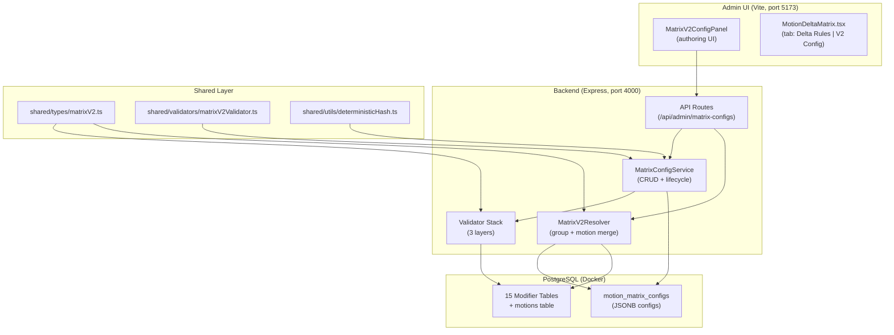
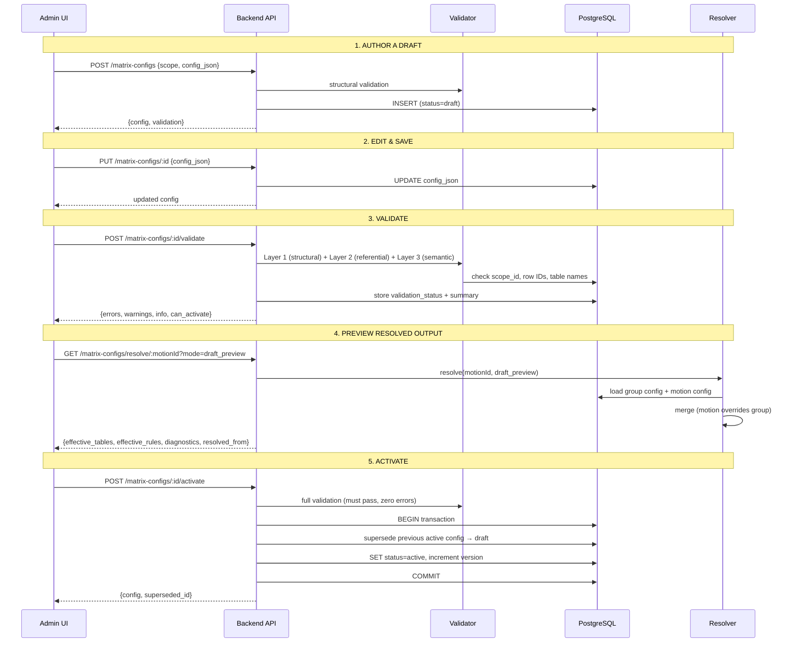
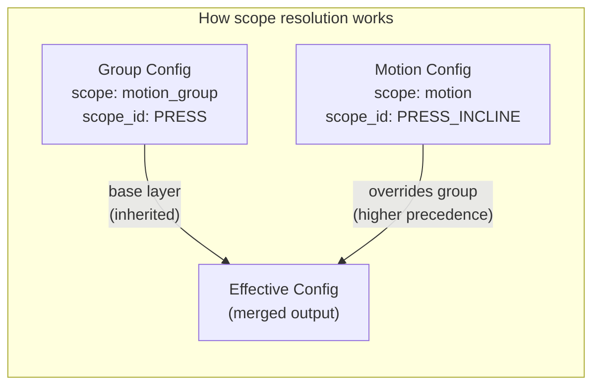
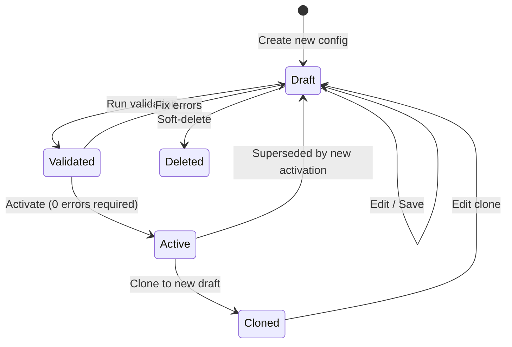
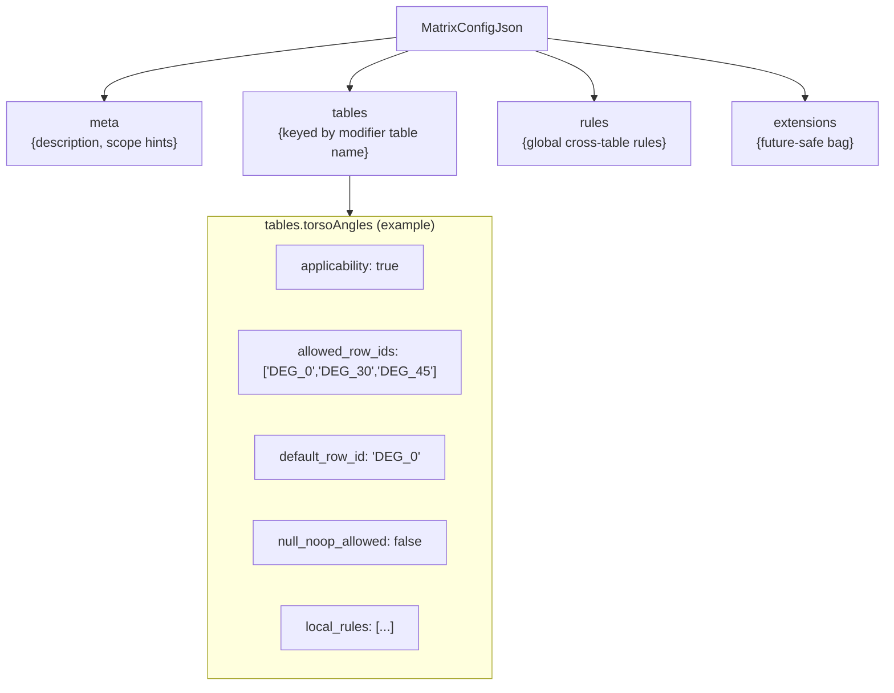
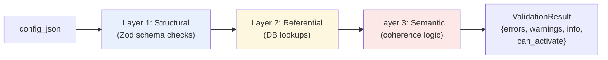
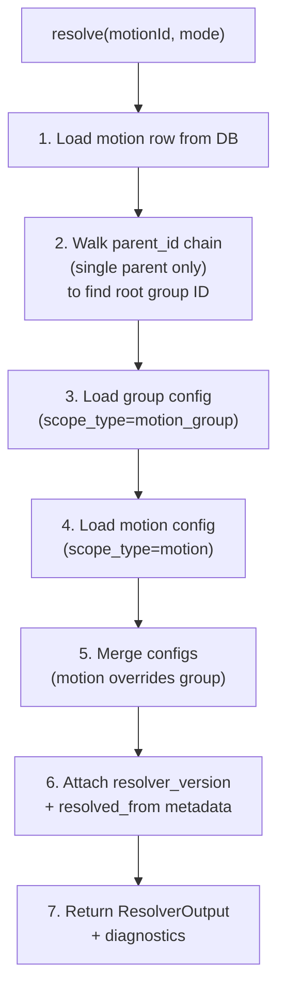
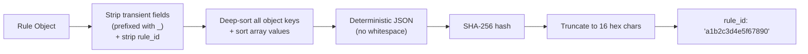
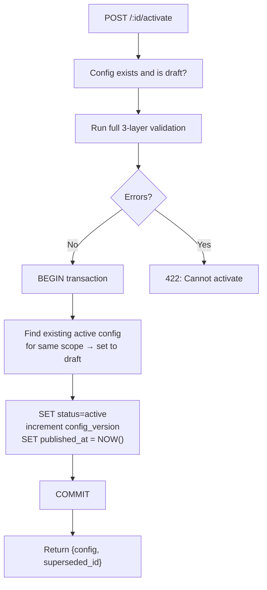

# Motion Delta Matrix V2 Config -- Complete System Guide

**Goal:** Implementation-accurate documentation for backend/data-integrity review and architecture discussion. Terminology and behavior below match the current codebase unless marked otherwise.

---

## Implementation Status Legend

| Term | Meaning |
|------|--------|
| **Implemented** | Behavior exists in code and is described as implemented. |
| **Partially Implemented** | Some behavior exists; gaps or limitations are noted. |
| **Planned** | Designed and documented but not yet built. |
| **Not Yet Implemented** | Explicitly not in code; docs do not imply it exists. |

Use these labels in the doc where clarity is needed. Default is **Implemented** for described behavior unless stated.

---

## Single-Parent Hierarchy (Locked)

- A given motion/variation has **exactly one** parent via `parent_id` (strict single-parent hierarchy).
- There is **no multi-parent inheritance** for motions. Scope resolution and group derivation assume a single chain from a motion up to one root.
- All references to "parent chain," "group derivation," or "scope resolution" in this document assume this single-parent model.

---

## Table of Contents

1. [What Is Matrix V2 Config?](#1-what-is-matrix-v2-config)
2. [Architecture Overview](#2-architecture-overview)
3. [Core Concepts](#3-core-concepts)
4. [Database Layer](#4-database-layer)
5. [Type System](#5-type-system)
6. [Validation Stack](#6-validation-stack)
7. [Resolver Engine](#7-resolver-engine)
8. [Deterministic Hashing](#8-deterministic-hashing)
9. [API Endpoints](#9-api-endpoints)
10. [Admin UI Components](#10-admin-ui-components)
11. [Import / Export](#11-import--export)
12. [Lifecycle & Safety Guards](#12-lifecycle--safety-guards)
13. [Adding New Modifier Tables](#13-adding-new-modifier-tables)
14. [File Map](#14-file-map)
15. [User-Friendly Guide](#15-user-friendly-guide)
16. [Implementation Reference (A–J)](#16-implementation-reference-aj)
17. [Unified Authoring Workstation](#17-unified-authoring-workstation)
18. [Known Gaps / Next Work](#18-known-gaps--next-work)
19. [Glossary / Terminology Lock](#19-glossary--terminology-lock)

---

## 1. What Is Matrix V2 Config?

Matrix V2 Config is a **scoped configuration layer** that sits on top of the existing 15 modifier tables (torso angles, grips, stance types, etc.). It lets you declaratively define, per motion family or individual motion:

- **Which modifier tables apply** (applicability on/off)
- **Which rows are allowed** within each applicable table
- **What the default/home-base value is** for each table
- **Rules** that conditionally hide, disable, or filter modifier options based on other selections

Without Matrix V2, every motion sees every row in every modifier table. With it, a Pressing motion can be constrained to only show relevant torso angles (0-45 degrees), relevant grips (pronated, neutral), and hide foot positions entirely.

### What Problem Does It Solve?

```
BEFORE (no Matrix V2):
  User selects "Incline Press"
  → All 11 torso angles shown (including irrelevant ones like 90 degrees)
  → All 25+ grips shown
  → Foot positions shown (irrelevant for pressing)
  → No default selection guidance

AFTER (with Matrix V2):
  User selects "Incline Press"
  → Only DEG_30 and DEG_45 shown (from motion-level override)
  → Only PRONATED, NEUTRAL, SEMI_PRONATED, ROTATING shown (from group config)
  → Foot positions hidden (inapplicable)
  → DEG_45 pre-selected as default
```

---

## 2. Architecture Overview



### How Data Flows Through the System



---

## 3. Core Concepts

### Scope Model

Every config targets either a **motion group** (family-level defaults) or a **specific motion** (per-motion overrides). Parentage is **strict single-parent**: each motion has at most one `parent_id`; there is no multi-parent inheritance.



| Scope Type | `scope_type` | Purpose | Example `scope_id` |
|---|---|---|---|
| Motion Group | `motion_group` | Shared defaults for a family | `PRESS`, `HORIZONTAL_ROW` |
| Motion | `motion` | Overrides for a specific child | `PRESS_INCLINE`, `ROW_HIGH` |

**Precedence rule:** `motion` always overrides `motion_group`. If a field is absent at motion scope, it inherits from the group. If the group is also absent, system defaults apply.

### Draft / Active Lifecycle



- **Draft**: Editable, can have validation errors, not visible to the resolver in `active_only` mode. Multiple drafts per (scope_type, scope_id) are allowed.
- **Active**: Locked (immutable), used by the resolver. **At most one active config per (scope_type, scope_id)**; activating a config supersedes the previous active for that scope (the old one is set back to draft). There is no multi-active-per-scope; we do not allow two "live" configs for the same motion or group.
- **Deleted**: Soft-deleted (`is_deleted = TRUE`), invisible to all default queries, preserved for audit

### The 15 Modifier Tables

These are the existing reference tables that Matrix V2 governs:

| # | Key | Table Name | Category |
|---|---|---|---|
| 1 | `motionPaths` | Motion Paths | Trajectory & Posture |
| 2 | `torsoAngles` | Torso Angles | Trajectory & Posture |
| 3 | `torsoOrientations` | Torso Orientations | Trajectory & Posture |
| 4 | `resistanceOrigin` | Resistance Origin | Trajectory & Posture |
| 5 | `grips` | Grips | Upper Body Mechanics |
| 6 | `gripWidths` | Grip Widths | Upper Body Mechanics |
| 7 | `elbowRelationship` | Elbow Relationship | Upper Body Mechanics |
| 8 | `executionStyles` | Execution Styles | Upper Body Mechanics |
| 9 | `footPositions` | Foot Positions | Lower Body Mechanics |
| 10 | `stanceWidths` | Stance Widths | Lower Body Mechanics |
| 11 | `stanceTypes` | Stance Types | Lower Body Mechanics |
| 12 | `loadPlacement` | Load Placement | Lower Body Mechanics |
| 13 | `supportStructures` | Support Structures | Execution Variables |
| 14 | `loadingAids` | Loading Aids | Execution Variables |
| 15 | `rangeOfMotion` | Range of Motion | Execution Variables |

---

## 4. Database Layer

### Table: `motion_matrix_configs`

**Migration:** `backend/src/drizzle/migrations/0003_matrix_configs.sql`
**Drizzle schema:** `backend/src/drizzle/schema/referenceTables.ts` (the `motionMatrixConfigs` export)

| Column | Type | Description |
|---|---|---|
| `id` | `TEXT PRIMARY KEY` | UUID, auto-generated |
| `scope_type` | `TEXT NOT NULL` | `'motion'` or `'motion_group'` |
| `scope_id` | `TEXT NOT NULL` | The motion or group ID this config targets |
| `status` | `TEXT NOT NULL` | `'draft'` or `'active'` |
| `schema_version` | `TEXT NOT NULL` | Config schema version (currently `'1.0'`) |
| `config_version` | `INTEGER NOT NULL` | Incremented on each activation |
| `config_json` | `JSONB NOT NULL` | The full configuration payload (see below) |
| `notes` | `TEXT` | Freeform notes |
| `validation_status` | `TEXT` | `'valid'`, `'warning'`, or `'error'` |
| `validation_summary` | `JSONB` | Array of `ValidationMessage` objects |
| `is_deleted` | `BOOLEAN NOT NULL` | Soft-delete flag (default `FALSE`) |
| `created_at` | `TIMESTAMPTZ` | Auto-set on insert |
| `updated_at` | `TIMESTAMPTZ` | Updated on every write |
| `published_at` | `TIMESTAMPTZ` | Set when activated |
| `created_by` | `TEXT` | (Reserved for future auth) |
| `updated_by` | `TEXT` | (Reserved for future auth) |

**Indexes (partial, filtered on `is_deleted = FALSE`):**

- `idx_mmc_scope` -- `(scope_type, scope_id, status)` for list queries
- `idx_mmc_scope_updated` -- `(scope_type, scope_id, updated_at)` for ordering
- `idx_mmc_active_lookup` -- `(scope_type, scope_id)` filtered to `status = 'active'` for resolver fast-path

### pgAdmin Access

The table is visible in pgAdmin under the `onlyfit` database. Useful queries:

```sql
-- All active configs
SELECT id, scope_type, scope_id, config_version
FROM motion_matrix_configs
WHERE status = 'active' AND is_deleted = FALSE;

-- Inspect a specific config's JSONB payload
SELECT config_json->'tables'->'torsoAngles'
FROM motion_matrix_configs
WHERE scope_id = 'PRESS' AND status = 'active';

-- Count configs by scope type
SELECT scope_type, status, COUNT(*)
FROM motion_matrix_configs
WHERE is_deleted = FALSE
GROUP BY scope_type, status;
```

---

## 5. Type System

**File:** `shared/types/matrixV2.ts`

This is the shared contract used by backend, admin UI, and tests. All types are re-exported from `shared/types/index.ts`.

### `config_json` Payload Structure



### Key Interfaces

| Interface | Purpose |
|---|---|
| `MatrixConfigJson` | The main `config_json` payload shape: `meta`, `tables`, `rules`, `extensions` |
| `TableConfig` | Per-modifier-table settings: `applicability`, `allowed_row_ids`, `default_row_id`, `null_noop_allowed`, `local_rules`, plus optional extended fields (see below) |
| `LocalRule` | A rule scoped to one table: conditionally hides, disables, or filters rows based on another table's selection |
| `GlobalRule` | A cross-table rule: partitions, exclusivity constraints, invalid combinations |
| `RuleTombstone` | A marker that removes an inherited group rule at the motion level |
| `MatrixConfigRow` | Full database row shape (metadata + `config_json`) |
| `ValidationMessage` | `{ severity, code, path, message, suggested_fix? }` |
| `ValidationResult` | Aggregated result: `{ errors[], warnings[], info[], valid, can_activate }` |
| `ResolverOutput` | Merged effective config with provenance metadata and diagnostics |
| `ResolvedFrom` | Provenance: which group/motion config IDs and versions contributed to the resolved output |

### Rule System

**Local rules** are scoped to a single modifier table:

| Action | Effect |
|---|---|
| `hide_table` | Completely hides the table |
| `disable_table` | Shows the table but disables interaction |
| `reset_to_default` | Resets selection to the default row |
| `reset_to_null` | Clears the selection |
| `disable_row_ids` | Disables specific rows from `target_row_ids` |
| `filter_row_ids` | Shows only the rows in `target_row_ids` |

Each rule has a **condition** (`{ table, operator, value }`) that checks another table's current selection.

### Extended TableConfig Fields (Optional)

The following optional fields on `TableConfig` support workstation-specific authoring. All are validated by the structural layer (Zod) and preserved on save/activate.

| Field | Type | Purpose |
|-------|------|---------|
| `one_per_group` | `boolean` | When true, each allowed row can be assigned to exactly one motion in the current motion family. Used for "1 row per group" constraint authoring. |
| `row_motion_assignments` | `Record<string, string>` | Maps row ID → motion ID for tables with `one_per_group` enabled. Stored in config; delta scores remain in modifier row `delta_rules`. |
| `angle_range` | `{ min, max, step, default }` | For `torsoAngles` only. Bounds are derived from assigned angle row IDs (e.g. DEG_NEG_15 → -15); min/max constrained to lowest−10 and highest+10 degrees. |
| `secondary_overrides` | `Record<string, boolean>` | For `loadPlacement` only. Override `allows_secondary` per row (true→false). Rows with native `allows_secondary === false` cannot be set true. |
| `valid_secondary_ids` | `string[]` | For `loadPlacement` when a row allows secondary. Subset of rows with `is_valid_secondary === true` that are valid as secondary placements; user can deselect. |

**Global rules** span multiple tables:

| Type | Purpose |
|---|---|
| `partition` | Divides rows across motions (e.g., angle ranges) |
| `exclusivity` | Only one of N options can be selected |
| `invalid_combination` | Prevents specific cross-table combinations |
| `cross_table_dependency` | One table's options depend on another's selection |

### Tombstones

A motion-level config can **remove** an inherited group rule by adding:

```json
{ "rule_id": "abc123", "_tombstoned": true }
```

The resolver sees this and drops the matching group rule from the effective output.

---

## 6. Validation Stack

**File:** `shared/validators/matrixV2Validator.ts`

Three layers, each producing `ValidationMessage[]`:



### Layer 1: Structural (runs client-side AND server-side)

Validates the JSON shape using Zod schemas:

- Required top-level keys: `meta`, `tables`, `rules`, `extensions`
- No unknown top-level keys (`strict()` mode)
- Each table config has required fields: `applicability`, `allowed_row_ids`, `default_row_id`, `null_noop_allowed`; optional fields (validated when present): `one_per_group`, `row_motion_assignments`, `angle_range`, `secondary_overrides`, `valid_secondary_ids`
- Rule schemas: valid `action` enums, valid `operator` enums, `rule_id` present
- Table keys must be from the known 15 modifier tables

**Error codes:** `STRUCTURAL_INVALID`, `UNKNOWN_TABLE_KEY`, `MISSING_RULE_ID`

### Layer 2: Referential (requires database, backend-only)

Validates that all referenced IDs actually exist:

- `scope_id` exists in the `motions` table (for `motion` scope) or is a known parent (for `motion_group`)
- Every modifier table key maps to a real table
- Every `allowed_row_ids` entry exists in the corresponding table
- Every `default_row_id` exists in the corresponding table
- Rule conditions reference valid tables; rule `target_row_ids` exist

**Error codes:** `INVALID_SCOPE_ID`, `UNKNOWN_GROUP_ID`, `TABLE_NOT_IN_REGISTRY`, `INVALID_ROW_ID`, `INVALID_DEFAULT_ROW`, `RULE_REFS_UNKNOWN_TABLE`, `RULE_REFS_UNKNOWN_ROW`

### Layer 3: Semantic / Coherence

Validates logical consistency (no DB needed):

- Default row must be in the allowed rows list
- Inapplicable tables should not have populated rows, defaults, or rules (warnings)
- Applicable tables with zero allowed rows (warning)
- Duplicate row IDs in `allowed_row_ids` (error)
- Duplicate `rule_id` values (error)
- Global rules referencing inapplicable tables (warning)
- `selection_required` with no default and `null_noop_allowed = false` (warning)

**Error codes:** `DEFAULT_NOT_IN_ALLOWED`, `INAPPLICABLE_WITH_ROWS`, `INAPPLICABLE_WITH_DEFAULT`, `APPLICABLE_EMPTY_ROWS`, `DUPLICATE_ROW_IDS`, `DUPLICATE_GLOBAL_RULE_IDS`

### Severity Model

| Severity | Can Activate? | Meaning |
|---|---|---|
| `error` | Blocked | Must be fixed before activation |
| `warning` | Allowed | Something looks suspicious but won't prevent activation |
| `info` | Allowed | Informational note |

---

## 7. Resolver Engine

**File:** `backend/src/services/matrixV2Resolver.ts`

The resolver takes a `motionId` and produces the **effective config** — the single merged output of group + motion configs. It assumes **strict single-parent hierarchy**: group is derived by walking the single `parent_id` chain to the root (no multi-parent).



### Merge Rules (locked)

| Field | Merge Behavior |
|---|---|
| `applicability` | Motion overrides group |
| `allowed_row_ids` | Motion **replaces** group (not union) |
| `default_row_id` | Motion overrides group |
| `null_noop_allowed` | Motion overrides group |
| `local_rules` | Merge by `rule_id` (motion wins on collision) |
| `global_rules` | Merge by `rule_id` (motion wins on collision) |
| Tombstones | Motion `{ rule_id, _tombstoned: true }` removes inherited group rule |
| Absent fields | Inherit from group |

### Resolver Output Versioning

Every resolver response includes:

- `resolver_version` -- semver string (`"1.0.0"`) identifying the merge algorithm version
- `resolved_from` -- provenance block with:
  - `group_config_id` / `group_config_version` / `group_status`
  - `motion_config_id` / `motion_config_version` / `motion_status`
  - `resolved_at` -- ISO timestamp

This makes "why did this preview change?" always answerable: was the group config edited? Did someone activate a new version? Or did the resolver algorithm change?

### Resolver Modes

| Mode | Behavior (as implemented) |
|---|---|
| `active_only` | Only loads configs with `status = 'active'`. No draft configs are considered. |
| `draft_preview` | No status filter: loads one config per scope. **Selection order:** `ORDER BY CASE WHEN status = 'active' THEN 0 ELSE 1 END, updated_at DESC LIMIT 1`. So: prefer **active** if present; otherwise the **most recent by `updated_at`** (draft). Preview does **not** target a specific config ID; it is "best available" per scope. |

---

## 8. Deterministic Hashing

**File:** `shared/utils/deterministicHash.ts`

Rules need stable `rule_id` values so that overrides, tombstones, and import/export round-trips work reliably. The hash utility ensures the same logical rule always produces the same ID.

### How It Works



**Exported functions:**

| Function | Purpose |
|---|---|
| `canonicalizeRuleForHash(rule)` | Produces a stable canonical JSON string from a rule |
| `generateRuleId(rule)` | Calls canonicalize then SHA-256, returns 16-char hex string |
| `HASH_CONTRIBUTING_FIELDS` | Documents which fields contribute to the hash |

**Key guarantees:**
- Key insertion order does not affect the hash
- Transient UI fields (`_ui_collapsed`, `_last_edited_by`, etc.) are stripped
- The `rule_id` field itself is excluded (circular dependency prevention)
- Array values are sorted where semantically safe
- Works in both Node.js and browser (pure JS SHA-256, no crypto dependency)

---

## 9. API Endpoints

**File:** `backend/src/admin/routes/matrixConfigs.ts`
**Mounted at:** `/api/admin/matrix-configs`

| Endpoint | Method | Purpose | Status Codes |
|---|---|---|---|
| `/` | `GET` | List configs (filter by `scope_type`, `scope_id`, `status`, `include_deleted`) | 200, 500 |
| `/` | `POST` | Create new draft config | 201, 400, 500 |
| `/:id` | `GET` | Get single config by ID | 200, 404, 500 |
| `/:id` | `PUT` | Update draft config | 200, 404, 409 (active), 500 |
| `/:id` | `DELETE` | Soft-delete config | 200, 404, 409 (active), 500 |
| `/:id/validate` | `POST` | Run full validation (3 layers) | 200, 500 |
| `/:id/activate` | `POST` | Activate config (blocks on errors) | 200, 422 (errors), 500 |
| `/:id/clone` | `POST` | Clone config to new draft | 201, 404, 500 |
| `/resolve/:motionId` | `GET` | Resolve effective config (`?mode=active_only\|draft_preview`) | 200, 500 |
| `/export/:id` | `GET` | Export config as deterministic JSON | 200, 404, 500 |
| `/import` | `POST` | Import JSON (preview or create draft) | 201, 400, 500 |

### Vite Proxy Note

The admin UI at port 5173 proxies `/api` requests to `http://localhost:4000` with a rewrite of `/api` to `/api/admin`. So the admin UI calls e.g. `/api/matrix-configs` which becomes `/api/admin/matrix-configs` on the backend.

---

## 10. Admin UI Components

### Tab Switcher

The existing `MotionDeltaMatrix.tsx` page now has two tabs:

- **Delta Rules** -- the original heatmap matrix view (existing functionality)
- **Matrix V2 Config** -- the new configuration authoring panel

### MatrixV2ConfigPanel Layout

**File:** `admin/src/pages/MatrixV2ConfigPanel.tsx`

```
┌──────────────────────────────────────────────────────────────────┐
│ Left Sidebar (272px)  │  Main Editing Area                       │
│                       │                                          │
│ ┌───────────────────┐ │ ┌──────────────────────────────────────┐ │
│ │ Scope Picker      │ │ │ Toolbar                              │ │
│ │ [Primary Motion ▼]│ │ │ Primary Motion: Press  draft v1       │ │
│ │ [Motion ▼]        │ │ │ [Save][Validate][Activate][Clone]     │ │
│ │ [New Draft]       │ │ │ [Preview][Export][Import][Save&Next]  │ │
│ ├───────────────────┤ │ ├──────────────────────┬───────────────┤ │
│ │ Motion Context    │ │ │ Modifier Table Config│ Validation /  │ │
│ │ Config List      │ │ │ (grouped, collapsible)│ Preview      │ │
│ │ Preview As       │ │ │ ▶ Trajectory & Posture│ (280px)       │ │
│ │                   │ │ │ ▼ Upper Body: Grips  │               │ │
│ │                   │ │ │   Default ▼  Rows    │               │ │
│ │                   │ │ │   Allow 1/group ☐    │               │ │
│ └───────────────────┘ │ └──────────────────────┴───────────────┘ │
└──────────────────────────────────────────────────────────────────┘
```

**Components:**

| Component | Location | Purpose |
|---|---|---|
| Scope Picker | Left sidebar top | First dropdown: **Primary Motion** (group) or **Motion**. Second: scope ID; when Motion, options are nested by parent (optgroups). |
| Motion Context | Left sidebar | Select which motion in the family drives baseline, delta editing, and simulation. |
| Config List | Left sidebar | Shows all configs with status badges, version numbers, validation status. |
| Toolbar | Main area top | Save Draft, Validate, Activate, Clone, Preview, Export, Import, Save & Next. |
| Modifier Table Config | Main center | **Grouped** by category (Trajectory & Posture, Upper Body, Lower Body, Execution Variables); each group and each table card is collapsible. See below. |
| Validation Panel | Right sidebar | Errors/warnings/info with severity badges and suggested fixes. |
| Resolved Preview | Right sidebar | Raw JSON of resolver output with provenance; plus Simulation Preview, Diff vs Active. |

### Modifier Table Configuration (Workstation)

- **Grouping and collapse:** Tables are grouped into four categories (Trajectory & Posture, Upper Body Mechanics, Lower Body Mechanics, Execution Variables). Each group has a collapsible header; each table card within is independently expandable/collapsible.
- **Scope label:** The first scope dropdown is labeled **Primary Motion** (not "Group") when selecting a motion group. The second dropdown, when "Motion" is selected, shows **nested motions** via optgroups: parent as group label, children as options (e.g. FLY → FLY_FLAT, FLY_INCLINE).
- **Order and layout:** **Default / Home-Base** appears **above** Allowed Rows. If a table has **>10 options** or **parent-child hierarchy** (e.g. grips), allowed rows are shown **vertically** (stacked) with child rows indented (└). Otherwise rows are wrapped horizontally.
- **Parent-child visibility:** For tables with `parent_id` (e.g. grips): **child rows are only shown if their parent is in the allowed list**. Unselecting a parent hides its children from the picker.
- **Allow 1 row per group:** Optional checkbox per table. When enabled, the **motion family** (parent + children by `parent_id`) is shown; each allowed row is assigned to exactly one family motion via dropdown. Assignments stored in `row_motion_assignments`; inline delta editing uses `DeltaBranchCard` and writes to modifier row `delta_rules`.
- **Torso Angles / Orientations:** Torso Orientations card is **disabled** when no allowed Torso Angle row has `allow_torso_orientations === true`. For Torso Angles, an **Angle Range** editor (min, max, step, default) is shown; bounds are derived from assigned angle IDs (lowest−10° to highest+10°), stored in `TableConfig.angle_range`.
- **Load Placement secondary:** For rows with `allows_secondary === true`, a toggle can override to false (`secondary_overrides`). If kept true, rows with `is_valid_secondary === true` can be deselected as valid secondaries (`valid_secondary_ids`). Rows with `allows_secondary === false` are read-only.

### Key UI Behaviors

- **Active configs are read-only** — checkboxes and buttons are disabled when viewing an active config.
- **Status badges** — green for active, yellow for draft.
- **Validation badges** — green for valid, red for error, yellow for warning.
- **Row buttons** — blue when allowed, gray when excluded; vertical stack when >10 rows or hierarchical.
- **Expand/collapse** — group headers and table card headers each toggle; table cards show Default first, then Allowed Rows, then optional Angle Range / Load Placement secondary / Allow 1 row per group, then Inherited Rules and Delta Scoring.

---

## 11. Import / Export

### Export (API and UI)

**API:** `GET /api/admin/matrix-configs/export/:id` returns a deterministic JSON file with sorted keys and `Content-Disposition: attachment` for direct download. Payload includes metadata (`scope_type`, `scope_id`, `status`, `schema_version`, `config_version`) plus the full `config_json`.

**UI Export modal (Export button):** The admin panel shows a modal with three options:

| Option | Behavior |
|--------|----------|
| **Full JSON** | Same as API: downloads the full config as a `.json` file (current behavior). |
| **Table (TSV)** | Builds a **table format** client-side: one row per motion in the **current scope family** (parent + children by `parent_id`). Columns: `MOTION_ID`, `MUSCLE_TARGETS` (JSON), then one column per modifier table key; each table cell is a JSON object `{ config, deltas }` for that table as it applies to that motion. Downloaded as `.tsv` for Excel. |
| **Copy Table to Clipboard** | Same table structure as above, tab-separated, copied to clipboard for pasting into Excel or sheets. |

Table export scope: only motions in the **current scope** (the motion family when editing a group, or the single motion when editing a motion config).

### Import (API and UI)

**API:** `POST /api/admin/matrix-configs/import` accepts `{ data, mode }`. Required in `data`: `config_json`, `scope_type`, `scope_id`. Optional: `notes`. Other fields are ignored; a new id is generated on create.

- `mode: "preview"` — structural validation only, returns `{ preview: data, validation: structural, imported: false }` without saving.
- Any other mode (e.g. `"create"`): structural validation; if errors, return preview without saving; otherwise create draft, run full validation, return `{ config, validation, imported: true }`.

**UI Import modal (Import button):** Three options:

| Option | Behavior |
|--------|----------|
| **Upload JSON** | File input (`.json`). Parses and sends to import API as above; creates new draft or shows validation. |
| **Upload CSV / TSV** | File input (`.csv`, `.tsv`, `.txt`). Expects the **table format** (header: MOTION_ID, MUSCLE_TARGETS, then modifier table keys; rows = motion rows). After parsing, shows confirmation: **"Import to current motion: [label]?"** — import applies to the **currently selected motion context**. Parsed table row for that motion ID (or first row if no match) is applied: `muscle_targets` and per-table config/deltas are merged into current editing state. |
| **Paste Table** | Textarea for pasted tab-separated data (same format as Copy Table). Same confirmation and mapping as Upload CSV/TSV; no file, data pasted from clipboard. |

For table import there is no config ID in the table; the UI clarifies that data will be imported **into the current motion** (whichever motion is selected in Motion Context).

### Round-Trip Stability

- **JSON:** Export uses `sortObjectKeys()` for deterministic key ordering. Import keeps `rule_id` from file. Export → import → export produces identical JSON (new id/timestamps on create).
- **Table:** Table export/import is a separate format for spreadsheet use; round-trip (export table → paste → import) applies to the current scope and current motion context.

---

## 12. Lifecycle & Safety Guards

**File:** `backend/src/services/matrixConfigService.ts`

### Activation Flow



### Soft-Delete Safety Guards

The `DELETE /:id` endpoint enforces two constraints:

1. **Cannot delete an active config.** Returns `409 Conflict` with a message to deactivate first. This prevents accidentally removing the only active config for a scope.

2. **Soft-deleted configs are invisible by default.** They remain in the database (`is_deleted = TRUE`) for audit/recovery but are excluded from list queries, resolver queries, and the admin UI unless explicitly requested with `?include_deleted=true`.

### Edit Protection

Active configs cannot be edited via `PUT /:id`. The service returns `409 Conflict` with "Cannot edit an active config. Clone it to a draft first."

To modify an active config:
1. **Clone** it to a new draft
2. **Edit** the clone
3. **Activate** the clone (which supersedes the old active config)

---

## 13. Adding New Modifier Tables

If a new modifier table is added to the system (e.g., `breathingPatterns`), here is every place that needs updating:

### Step 1: Add the table key to the shared type registry

**File:** `shared/types/matrixV2.ts`

Add the new key to the `MODIFIER_TABLE_KEYS` array:

```typescript
export const MODIFIER_TABLE_KEYS = [
  "motionPaths",
  "torsoAngles",
  // ... existing keys ...
  "rangeOfMotion",
  "breathingPatterns",  // ← new
] as const;
```

This automatically updates the `ModifierTableKey` type used throughout the system.

### Step 2: Add the label mapping in the admin UI

**File:** `admin/src/pages/MatrixV2ConfigPanel.tsx`

Add to `MODIFIER_TABLE_LABELS`:

```typescript
const MODIFIER_TABLE_LABELS: Record<string, string> = {
  // ... existing entries ...
  breathingPatterns: 'Breathing Patterns',  // ← new
};
```

### Step 3: Add the camelCase-to-snake_case mapping in the service

**File:** `backend/src/services/matrixConfigService.ts`

Add to the `tableKeyToPg` map inside `buildReferentialContext()`:

```typescript
const tableKeyToPg: Record<string, string> = {
  // ... existing entries ...
  breathingPatterns: "breathing_patterns",  // ← new
};
```

### Step 4: (Optional) Add to the Delta Rules matrix view

**File:** `admin/src/pages/MotionDeltaMatrix.tsx`

If the new table has `delta_rules`, add it to the `DELTA_TABLES` array and `TABLE_GROUP_MAP`.

### That's it.

No migration changes needed (the `config_json` is JSONB -- the new key is just a new JSON property). No route changes. No resolver changes. The validator will automatically accept the new key once it's in `MODIFIER_TABLE_KEYS`, and the referential validator will automatically check its row IDs against the database.

---

## 14. File Map

```
testing-workout-app/
├── backend/
│   ├── src/
│   │   ├── admin/
│   │   │   └── routes/
│   │   │       └── matrixConfigs.ts       ← API route handlers (11 endpoints)
│   │   ├── drizzle/
│   │   │   ├── migrations/
│   │   │   │   └── 0003_matrix_configs.sql ← SQL migration for the table
│   │   │   └── schema/
│   │   │       └── referenceTables.ts      ← Drizzle schema (motionMatrixConfigs added)
│   │   ├── services/
│   │   │   ├── matrixConfigService.ts      ← CRUD service with soft-delete guards
│   │   │   └── matrixV2Resolver.ts         ← Effective config resolver engine
│   │   └── index.ts                        ← Route registration
│   └── package.json
├── admin/
│   └── src/
│       ├── api.ts                          ← API client (matrix config methods added)
│       └── pages/
│           ├── MotionDeltaMatrix.tsx        ← Main page (tab switcher added)
│           └── MatrixV2ConfigPanel.tsx      ← V2 config authoring panel (new)
├── shared/
│   ├── types/
│   │   ├── index.ts                        ← Re-exports matrixV2
│   │   └── matrixV2.ts                     ← All type definitions
│   ├── validators/
│   │   └── matrixV2Validator.ts            ← 3-layer validation stack
│   ├── utils/
│   │   └── deterministicHash.ts            ← Canonicalize + hash for rule_id
│   ├── fixtures/
│   │   └── pilotConfigs.ts                 ← Pilot family configs for testing
│   └── __tests__/
│       └── matrixV2.test.ts                ← 33 tests (validation, hashing, lifecycle, golden)
└── MATRIX_V2_CONFIG_OVERVIEW.md            ← This file
```

---

## 15. User-Friendly Guide

### How to Use the Matrix V2 Config Tab

This section explains how to use the Matrix V2 Config panel in plain language, step by step.

---

### Getting There

1. Open the admin web app at `http://localhost:5173`
2. Navigate to the **Motion Delta Matrix** page
3. Click the **Matrix V2 Config** tab at the top of the page

---

### Creating Your First Config

**Goal:** Set up shared defaults for a motion family (like all Pressing exercises).

1. In the **left sidebar**, you'll see two dropdowns:
   - **First dropdown:** Choose **Primary Motion** (for a whole family) or **Motion** (for a specific exercise)
   - **Second dropdown:** Pick the primary or group name (e.g., "Press"), or if Motion is selected, pick from **nested options** (parents as groups, e.g. FLY with FLY_FLAT, FLY_INCLINE under it)

2. Click **New Draft**. A blank draft config appears.

3. You are now looking at the **Modifier Table Configuration** panel in the center. Each card represents one modifier table.

---

### Configuring Modifier Tables

Modifier tables are **grouped** (Trajectory & Posture, Upper Body Mechanics, Lower Body Mechanics, Execution Variables). Click a group header to expand/collapse it; then expand a table card to configure it.

For each modifier table, you can:

**Turn it on or off:**
- **Check the checkbox** next to the table name to mark it as **applicable**
- **Uncheck it** to mark it as **not applicable** (table will be hidden from the user)

**Set a default (shown first):**
- Use the **Default / Home-Base** dropdown to pick which row should be pre-selected; it must be one of the allowed rows

**Pick allowed rows:**
- Click the **expand arrow** (▼) next to a table name to see its rows
- Click the **row buttons** to toggle them on (blue) or off (gray). If the table has many rows or parent/child structure (e.g. Grips with ROTATING and its children), rows are shown in a **vertical list**; **child rows only appear if their parent is allowed**
- Only the blue rows will be available for selection in the app

**Optional: Allow 1 row per group** — Check this to assign each allowed row to exactly one motion in the current family; you can then edit delta scores per row for that motion.

**Torso Angles:** Use the Angle Range fields (min, max, step, default) if needed; bounds are based on the angles you allowed. **Torso Orientations** is disabled if no selected torso angle allows orientations.

**Load Placement:** For rows that allow secondary placement, you can override to disable or pick which rows count as valid secondaries.

---

### Saving Your Work

- Click **Save Draft** in the toolbar at any time. Your config is saved to the database as a draft.
- Drafts can be edited freely. Active configs cannot.

---

### Validating Your Config

Before activating, check for problems:

1. Click **Validate** in the toolbar
2. The **right panel** shows results:
   - **Green "Can Activate"** -- no errors, ready to go
   - **Red errors** -- must be fixed before activation (e.g., default row not in allowed list)
   - **Yellow warnings** -- something looks odd but won't block activation

---

### Previewing the Resolved Output

To see what the system will actually use:

1. Click **Preview** in the toolbar
2. The right panel shows the **resolved effective config** -- the merged result of group + motion configs
3. This includes provenance metadata (which configs contributed, resolver version, timestamp)

---

### Activating a Config

When your config is validated and error-free:

1. Click **Activate** in the toolbar
2. The config becomes **active** (green badge) and is immediately used by the resolver
3. If there was a previous active config for the same scope, it is automatically **superseded** (demoted back to draft)
4. Active configs are **read-only** -- you can't edit them directly

---

### Editing an Active Config

You can't edit active configs directly. Instead:

1. Select the active config in the left sidebar
2. Click **Clone** in the toolbar
3. A new draft is created with the same settings
4. Edit the clone, validate it, then **Activate** it
5. The old active config is automatically superseded

---

### Adding Motion-Level Overrides

Primary Motion (group) configs set family-wide defaults. To override for a specific motion:

1. Switch the first dropdown to **Motion**
2. In the second dropdown, select the specific motion (e.g., under "Press" you might see "Incline Press", "Decline Press"; options are **nested by parent**)
3. Click **New Draft**
4. Only configure the tables that differ from the group
   - Example: For Incline Press, change Torso Angles to only allow DEG_30 and DEG_45
5. Tables you don't configure in the motion override will **inherit from the group**

---

### Importing and Exporting

**Export:** Click **Export** in the toolbar. A modal offers:
- **Full JSON** — download the complete config as a `.json` file (same as before)
- **Table (TSV)** — download a motion × modifier table spreadsheet (MOTION_ID, MUSCLE_TARGETS, one column per table) for the current scope family
- **Copy Table to Clipboard** — same table as tab-separated text for pasting into Excel

**Import:** Click **Import** in the toolbar. A modal offers:
- **Upload JSON** — choose a `.json` file; the system validates and creates a new draft (or shows validation issues)
- **Upload CSV / TSV** — choose a table-format file; you'll be asked to confirm "Import to current motion: [label]?" and data is applied to the **currently selected motion**
- **Paste Table** — paste tab-separated table data into the box, then click Import; same confirmation and current-motion targeting

---

### Quick Reference: Button Guide

| Button | What It Does | When to Use |
|---|---|---|
| **New Draft** | Creates a blank draft config for the selected scope | Starting fresh |
| **Save Draft** | Saves your current edits to the database | After making changes |
| **Validate** | Checks the config for errors and warnings | Before activating |
| **Activate** | Makes the config live (errors must be zero) | When ready for production |
| **Clone** | Copies a config into a new draft | When editing an active config |
| **Preview** | Shows the merged resolver output | To verify what the system will use |
| **Export** | Opens modal: Full JSON download, Table TSV download, or Copy table to clipboard | For backup, sharing, or Excel |
| **Import** | Opens modal: Upload JSON, Upload CSV/TSV, or Paste table | For restoring configs or importing table data into current motion |

---

### Troubleshooting

| Problem | Cause | Fix |
|---|---|---|
| "Not Found" error on New Draft | Backend not running or API path issue | Make sure backend is running on port 4000 |
| Validation error: "Default row not in allowed list" | The default row was set to a row that isn't in the allowed list | Add the row to allowed rows, or change the default |
| Cannot edit a config | The config is active (green badge) | Clone it first, then edit the clone |
| Cannot delete a config | The config is active | Activate a replacement first, then delete the old one |
| Preview shows empty tables | No active or draft configs exist for this motion's group | Create a group config first |
| Warning: "Table is applicable but has no allowed rows" | You turned on a table but didn't pick any rows | Pick at least one allowed row, or turn off applicability |

---

## 16. Implementation Reference (A–J)

The following subsections lock exact behavior from the current implementation for backend/data-integrity review.

### A. Scope Resolution / Inheritance

| Topic | Implemented behavior |
|-------|----------------------|
| **Deriving matrix group from a motion** | Resolver calls `resolveGroupId(motionId)`: start at `motionId`, repeatedly query `motions.parent_id` until `parent_id` is null. The **group ID** is the last non-null parent (the root of the single-parent chain). Cycle protection: a `visited` set breaks on repeat. |
| **Group scope target** | **Implemented:** Resolver loads exactly one group config: `scope_type = 'motion_group'`, `scope_id = <root parent id>`. Only the **root** of the chain is used as the group for resolution. Configs stored with `scope_type = 'motion_group'` and an **intermediate** parent as `scope_id` are valid in the DB and referential validation, but the resolver does **not** currently merge multiple group levels; it uses a single group (root) + single motion. |
| **Fallback when no config** | If neither group nor motion config exists: resolver returns `emptyOutput` with `effective_tables: {}`, `effective_rules: []`, and a diagnostic `NO_CONFIG_FOUND`. No system-wide default config is applied. |
| **Motions with null `parent_id`** | Treated as **roots**. `resolveGroupId` returns `null` for such a motion (no group config is loaded). Referential context treats roots as valid `validGroupIds`; group configs can target them. |

### B. Draft Preview Semantics

| Topic | Implemented behavior |
|-------|----------------------|
| **Which config(s) preview uses** | Resolver does **not** accept a config ID. For each scope (group and motion), it loads **one** row: `loadConfig(scopeType, scopeId, statusFilter)`. For `draft_preview`, `statusFilter = null`; SQL orders by `CASE WHEN status = 'active' THEN 0 ELSE 1 END, updated_at DESC LIMIT 1`. So: **active** if present, else **most recent by `updated_at`**. |
| **"Most recent" field** | `updated_at DESC` (only when no active config exists for that scope). |
| **Targeting specific config ID** | **Not implemented.** Preview is always "best available" per scope. There is no `?configId=` or similar. |
| **Group vs motion preview** | Same rule for both: one config per scope, same ORDER. For **group** scope in the UI, preview uses the **first child motion** of the selected group to call `GET /resolve/:motionId` (so the resolved output is for that child, not a synthetic "group-only" view). |

**Example:** Scope = group PRESS, one active group config, one draft motion config for PRESS_INCLINE. Preview with motionId = PRESS_INCLINE and mode = `draft_preview` returns merged result from that active group config + that draft motion config (draft is "most recent" for motion scope).

### C. Resolver Runtime Contract

**Output schema (exact field names, always present):**

| Field | Type | Presence |
|-------|------|----------|
| `resolver_version` | string | Always (e.g. `"1.0.0"`) |
| `resolved_from` | object | Always |
| `resolved_from.group_config_id` | string \| null | Always |
| `resolved_from.group_config_version` | number \| null | Always |
| `resolved_from.group_status` | string \| null | Always |
| `resolved_from.motion_config_id` | string \| null | Always |
| `resolved_from.motion_config_version` | number \| null | Always |
| `resolved_from.motion_status` | string \| null | Always |
| `resolved_from.resolved_at` | string (ISO) | Always |
| `motion_id` | string | Always |
| `resolved_group_id` | string \| null | Always |
| `mode` | string | Always |
| `effective_tables` | object | Always (may be `{}`) |
| `effective_rules` | array | Always (may be `[]`) |
| `diagnostics` | array | Always |

**Rule application order:** **Not implemented** at runtime. Rules are merged by `rule_id`; no defined evaluation order for applying rules to UI/runtime. Conflict resolution: motion overwrites group for same `rule_id`; tombstone removes group rule.

**Merge precedence (implemented):**

| Field | Behavior |
|-------|----------|
| `applicability` | Motion value used (motion overrides group). |
| `allowed_row_ids` | Motion **replaces** group if motion has `allowed_row_ids.length > 0`; else group's list is used. |
| `default_row_id` | Motion wins if `motion.default_row_id !== undefined`; else group. |
| `null_noop_allowed` | Motion value. |
| `local_rules` / `global_rules` | Merged by `rule_id`. Motion rule overwrites group; motion tombstone (`_tombstoned: true`) removes group rule. Tombstone with no matching group rule produces diagnostic `TOMBSTONE_NO_TARGET` / `GLOBAL_TOMBSTONE_NO_TARGET`. |

**Canonical example 1 — inheritance only:**  
Group has `torsoAngles.applicability: true`, `allowed_row_ids: ['DEG_0','DEG_30']`. Motion has no table entry for `torsoAngles`. Result: `effective_tables.torsoAngles` from group only; `source: "group"`.

**Canonical example 2 — motion override with tombstone:**  
Group has `local_rules: [{ rule_id: "r1", action: "filter_row_ids", condition: {...}, target_row_ids: ["A"] }]`. Motion has `local_rules: [{ rule_id: "r1", _tombstoned: true }]`. Result: that rule is removed from merged `local_rules`; diagnostic only if `r1` were not in group.

### D. Rule System Contract

**LocalRule (implemented shape):** `rule_id`, `action` (enum), `condition` (single `RuleCondition`), optional `target_row_ids`, optional `description`, optional `_tombstoned`.

**GlobalRule:** `rule_id`, `type` (enum), `tables` (string[]), `conditions` (array of `RuleCondition`), optional `description`, optional `_tombstoned`.

**RuleTombstone:** In practice a rule object with `rule_id` and `_tombstoned: true`; no separate type at runtime.

**rule_id:** Required (Zod + manual checks). Deterministic hash: `generateRuleId(rule)` in `shared/utils/deterministicHash.ts` — canonicalize (strip `_*` and `rule_id`), sort keys/arrays, SHA-256, truncate to **16 hex chars**. Collision handling: **Not implemented** (no dedup or collision detection).

**Condition DSL:** Single condition per local rule (`condition: RuleCondition`). Operators: `equals`, `in`, `not_in`. Value: string or string[]. **Not supported in v1:** multi-condition AND/OR, null checks, other operators. **Runtime cycle protection:** Not implemented (no cycle detection for rule dependencies).

### E. Validation Contract

| Layer | Responsibility (exact) |
|-------|------------------------|
| **Layer 1 (Structural)** | Zod schema: `meta`, `tables`, `rules`, `extensions` required; strict (no unknown top-level). Table keys must be in `MODIFIER_TABLE_KEYS`. Each table: required `applicability`, `allowed_row_ids`, `default_row_id`, `null_noop_allowed`; optional `local_rules`, `selection_required`, `selection_mode`, `ui_hints`, `one_per_group`, `row_motion_assignments`, `angle_range`, `secondary_overrides`, `valid_secondary_ids`. Rules: `rule_id` required, valid action/type enums, condition with `table`, `operator`, `value`. |
| **Layer 2 (Referential)** | Requires DB context. Validates `scope_id` (motion or group exists in context). Validates every `allowed_row_id` and `default_row_id` exists in corresponding modifier table. Validates rule conditions and target_row_ids reference existing tables/rows. |
| **Layer 3 (Semantic)** | Default in allowed list; no duplicate row IDs or rule IDs; inapplicable table coherence (warnings if inapplicable has rows/default/rules); applicable empty allowed rows (warning); global rule on inapplicable table (warning). |

**Path format:** Dot notation, e.g. `tables.torsoAngles.default_row_id`, `tables.${tableKey}.local_rules[${i}]`, `rules[${i}]`. Not JSON Pointer.

**Stable diagnostic codes (as in code):** STRUCTURAL_INVALID, UNKNOWN_TABLE_KEY, MISSING_RULE_ID, INVALID_SCOPE_ID, UNKNOWN_GROUP_ID, TABLE_NOT_IN_REGISTRY, INVALID_ROW_ID, INVALID_DEFAULT_ROW, RULE_REFS_UNKNOWN_TABLE, RULE_REFS_UNKNOWN_ROW, GLOBAL_RULE_REFS_UNKNOWN_TABLE, GLOBAL_RULE_COND_UNKNOWN_TABLE, DEFAULT_NOT_IN_ALLOWED, INAPLICABLE_WITH_ROWS, INAPLICABLE_WITH_DEFAULT, INAPLICABLE_WITH_RULES, NO_DEFAULT_SELECTION_REQUIRED, APPLICABLE_EMPTY_ROWS, DUPLICATE_ROW_IDS, DUPLICATE_GLOBAL_RULE_IDS, DUPLICATE_LOCAL_RULE_IDS, GLOBAL_RULE_ON_INAPPLICABLE, CONFIG_NOT_FOUND, MERGED_DEFAULT_NOT_IN_ALLOWED, TOMBSTONE_NO_TARGET, GLOBAL_TOMBSTONE_NO_TARGET, MOTION_NOT_FOUND, NO_CONFIG_FOUND, MOTION_ONLY_CONFIG, GROUP_ONLY_CONFIG.

**Publish-blocking:** `can_activate` is true only when `errors.length === 0`. Any severity `error` blocks activation.

### F. Hashing Contract

**Canonicalization:** Strip keys starting with `_` and key `rule_id`; deep sort object keys; sort array elements when all elements are string or number. Then `JSON.stringify(sorted)`.

**Contributing fields (from code):** Local: `action`, `condition`, `target_row_ids`, `description`. Global: `type`, `tables`, `conditions`, `description`. Condition: `table`, `operator`, `value`.

**Collision handling:** Not implemented (no detection or fallback).

**Deterministic hash length:** 16 hex characters (SHA-256 truncated). Rationale: sufficient uniqueness for rule IDs without storing full hash; not documented in code comments.

### G. Lifecycle / Concurrency / Safety

| Topic | Implemented behavior |
|-------|----------------------|
| **Activation flow** | Validate; if `!can_activate` return 422. Then `BEGIN`; find existing active for same `(scope_type, scope_id)`; set that row to `status = 'draft'`; set target to `status = 'active'`, increment `config_version`, set `published_at = NOW()`; `COMMIT`. |
| **Active uniqueness** | **Application-level only.** No DB UNIQUE on `(scope_type, scope_id)` where status = active. Race: two concurrent activates could leave two actives; not prevented. |
| **Edit/delete protections** | Active configs: `PUT` returns 409 "Cannot edit an active config. Clone it to a draft first." `DELETE` returns 409 with message to deactivate first. |
| **Draft/active/deleted** | Draft ↔ active only via Activate (draft becomes active, previous active becomes draft). Deleted: soft-delete (`is_deleted = TRUE`); list and resolver exclude by default; `?include_deleted=true` for list. |

### H. Import / Export Contract

**Import payload accepted:** `{ data, mode }`. `data` must have `config_json`, `scope_type`, `scope_id`; `notes` optional. Other fields (id, status, config_version, etc.) are **ignored** on create; no ID or version from file is used.

**Sanitization:** Structural validation is strict (unknown top-level in `config_json` fail Zod). No explicit strip of UI-only or unknown fields beyond that. Export uses `sortObjectKeys` for deterministic order; import does not rewrite `config_json` beyond passing to create.

**Round-trip:** Export → import (create) produces a new draft with same `config_json` and scope; IDs and timestamps are new. Round-trip stability for rule_id: export does not regenerate rule_id; import keeps rule_id from file. If rule_id was generated by `generateRuleId` before export, re-import keeps it.

**UI table format (client-side):** Export modal can generate a **table** (TSV): columns MOTION_ID, MUSCLE_TARGETS, then one per modifier table; each cell is JSON `{ config, deltas }`. Scope = current scope family only. Import modal accepts **Upload CSV/TSV** or **Paste table**; parsing is client-side; user confirms "Import to current motion: [label]?" and data is applied to the currently selected motion context (no config ID in table). See Section 11.

**Preview vs create:** `mode === "preview"` → return `{ preview: data, validation: structural, imported: false }` without saving. Any other mode with valid structural: create draft and return `{ config, validation: fullValidation, imported: true }`. If structural has errors and mode !== "preview", return `{ preview: data, validation: structural, imported: false }` (no create).

### I. Admin UI Authoring Reality

| Feature | Status |
|--------|--------|
| Scope picker (Primary Motion / Motion + ID) | Implemented. Label "Primary Motion" for group; Motion dropdown uses optgroups (parent → children). |
| Config list with status/version | Implemented |
| Create draft, Save, Validate, Activate, Clone | Implemented |
| Modifier tables grouped by category | Implemented. Four collapsible groups: Trajectory & Posture, Upper Body, Lower Body, Execution Variables. |
| Per-table applicability, default above allowed rows | Implemented. Default / Home-Base shown first; allowed rows below; vertical layout when >10 rows or hierarchical. |
| Parent-child row visibility | Implemented. Child rows only shown when parent is in allowed list (e.g. ROTATING children only if ROTATING allowed). |
| Allow 1 row per group | Implemented. Checkbox per table; family motion assignment dropdown per row; inline delta editing via DeltaBranchCard; stored in `row_motion_assignments`. |
| Torso Orientations conditional disable | Implemented. Card disabled when no allowed Torso Angle has `allow_torso_orientations === true`. |
| Torso Angles angle_range editor | Implemented. Min/max/step/default with bounds from assigned angles ±10°; stored in `TableConfig.angle_range`. |
| Load Placement secondary config | Implemented. Override `allows_secondary` per row; select/deselect `valid_secondary_ids` when allows secondary. |
| Preview (resolve API + show JSON) | Implemented |
| Export modal (JSON / Table TSV / Copy) | Implemented. Full JSON download, table-format TSV download, or copy table to clipboard (scope family only). |
| Import modal (JSON / CSV / Paste) | Implemented. Upload JSON, upload CSV/TSV table, or paste table; table import targets current motion with confirmation. |
| Motion context selector | Implemented. Dropdown selects a motion within the scope family to drive baseline, delta, and simulation views. |
| Baseline card (muscle_targets) | Implemented. Embeds `MuscleTargetTree` with Save Baseline button; writes only to motions table. |
| Delta branch editing per row | Implemented. `DeltaBranchCard` per allowed row with inherit toggle, clone-on-branch, provenance chips, and per-row Save Delta Branch. |
| Client-side scoring simulation | Implemented. Live recomputation using shared `resolveAllDeltas` + `computeActivation` with debounced updates. |
| Simulation preview | Implemented. Base vs Effective table, Top-3 Impact, delta source provenance, realism advisory, coaching cues (stub), ROM summary. |
| Dirty indicators | Implemented. `DirtyBadge` with per-domain tracking (baseline, config, delta branches). |
| Save & Next Motion | Implemented. Saves all dirty domains then advances to next sibling motion. |
| Group preview context | Implemented. "Preview as" dropdown to select which child motion to use for resolver preview. |
| Inherited rules in UI | Implemented. Motion-scope configs show inherited group rules with [inherited] / [tombstoned] tags. |
| Compare to active | Implemented. Diff panel shows tables added/removed, rows added/removed, defaults changed vs active config. |
| Rule authoring UI | Not implemented. Rules are JSON/manual only; no UI to add/edit local or global rules or tombstones. |
| Preview mode | UI passes `mode=draft_preview` when selected config is draft, else `active_only`. Resolver does not receive "current editing config ID." |

### J. Operational / Coverage / Testing

| Topic | Implemented behavior |
|-------|----------------------|
| **Pilot families in fixtures** | `shared/fixtures/pilotConfigs.ts`: Pressing (PRESS group + PRESS_INCLINE, PRESS_DECLINE overrides), Horizontal Pull (HORIZONTAL_ROW group + ROW_HIGH override). Motion IDs verified against motions data. |
| **Test coverage** | `shared/__tests__/matrixV2.test.ts`: structural validation (including new TableConfig fields: one_per_group, row_motion_assignments, angle_range, secondary_overrides, valid_secondary_ids), referential validation, semantic validation, hashing (canonicalize, generateRuleId), lifecycle (activate supersede), resolver merge and tombstone behavior, golden-style outputs; **activation safety** (config and delta_rules format preserved); **parent-child row filtering**; **angle range bounds** computation; **table export format**; **CSV/paste import** round-trip parsing. No backend integration tests for routes or DB. |
| **Coverage tracking** | Not implemented (no coverage gates or primitives in doc). |
| **Local verification** | Run backend (e.g. port 4000), admin (e.g. port 5173); open Motion Delta Matrix → Matrix V2 Config tab; create/validate/activate a config; call `GET /api/admin/matrix-configs/resolve/:motionId?mode=active_only` for a motion with active config. |

---

## 17. Unified Authoring Workstation

**Status: Implemented**

The Matrix V2 Config panel has been extended into a **unified authoring workstation** that combines constraint configuration, baseline scoring, delta branch editing, and live scoring simulation in a single screen.

### Architecture: Constraint Resolver vs. Scoring Simulation

These are **distinct systems** with different responsibilities:

| Concern | Constraint Resolver (Backend) | Scoring Simulation (Client-Side) |
|---------|-------------------------------|----------------------------------|
| Purpose | Merge group + motion configs into effective constraint config | Compute muscle activation from baseline + modifiers |
| Location | `backend/src/services/matrixV2Resolver.ts` | `shared/scoring/resolveDeltas.ts` + `computeActivation.ts` |
| Data source | `motion_matrix_configs` table | `motions.muscle_targets` + modifier row `delta_rules` |
| Output | Effective table applicability, allowed rows, defaults, rules | `ActivationResult` (base scores, final scores, raw scores, applied deltas) |
| API | `GET /matrix-configs/resolve/:motionId` | None (client-side only) |

### Delta Branch Inheritance Model

Motion-keyed entries in each modifier row's `delta_rules` JSONB field serve as "branches":

- **Primary motion** (e.g., `PRESS`): Has an explicit `Record<muscleId, number>` entry in `delta_rules`
- **Child motion** (e.g., `PRESS_INCLINE`): Either `"inherit"` (walks `parent_id` chain) or has its own custom override entry
- Resolution via `resolveSingleDelta()` walks the `parent_id` chain when it encounters `"inherit"` or a missing entry

The UI shows this via:
- **Inherit toggle** on child motions: ON = read-only view of parent's deltas; OFF = editable custom override
- **Clone-on-branch**: Toggling inherit OFF clones parent delta as starting point
- **Provenance chips**: "Inherited from PRESS" vs. "Custom for PRESS_INCLINE"

### Client-Side Live Scoring Simulation

- Reuses `resolveAllDeltas` and `computeActivation` from `shared/scoring/`
- Uses **local unsaved state** for both baseline edits and delta overrides
- Debounced at ~150ms for responsive feedback
- Two modes: "Simulate Defaults" (uses `default_row_id` from config) and "Custom Test Combo" (manual modifier selection)

### Simulation Preview Output

| Section | Description |
|---------|-------------|
| Top-3 Impact | Top 3 muscles by absolute delta shift, with delta bars |
| Base vs Effective | Side-by-side flat muscle scores with delta indicators |
| Delta Sources | Per-modifier provenance chips with inherited/custom tags |
| Realism Advisory | Green/yellow/red badge based on score distribution sanity |
| Coaching Cues | Merged cues from semantics dictionary (stub) |
| ROM Summary | Per-modifier ROM quality flags from semantics dictionary |
| Provenance | Chips showing data source (Local Unsaved / Saved / Draft Config) |

### Localized Save Paths

| Domain | API | Data Written |
|--------|-----|-------------|
| Baseline | `PUT /tables/motions/rows/:id` | `{ muscle_targets: ... }` |
| Delta Branch | `PUT /tables/:modifierTable/rows/:rowId` | `{ delta_rules: ... }` (updated entry for current motion) |
| Matrix Config | `PUT /matrix-configs/:id` | `{ config_json: ..., notes: ... }` |

Each save path has its own dirty indicator and explicit save button. The "Save & Next Motion" accelerator fires all dirty saves then advances to the next sibling.

### Workstation Layout

```
+--------------------+--------------------------------+------------------------+
| Left Sidebar       | Center Editing Area            | Right Preview          |
| (272px)            |                                | (320px)                |
|                    | [Toolbar: Save/Validate/etc]   |                        |
| Scope Picker       |                                | Simulation Preview     |
| Config List        | [Baseline Card]                |   Mode toggle          |
|                    |                                |   Base vs Effective    |
| Motion Context     | [Modifier Table Cards          |   Per-muscle deltas    |
|   Selector         |  with delta editing]           |   Top-3 impact         |
|                    |                                |   Realism advisory     |
| Preview As         | [Matrix Config (tables/rows/   |   Coaching cues        |
|   (group scope)    |  defaults/rules)]              |   ROM summary          |
|                    |                                | Validation Panel       |
|                    |                                | Diff vs Active         |
+--------------------+--------------------------------+------------------------+
```

### Shared Artifacts

| File | Purpose |
|------|---------|
| `shared/policy/realismAdvisory.ts` | Realism flag evaluation (green/yellow/red) based on `ActivationResult` |
| `shared/semantics/dictionary.ts` | Per-modifier-table semantic descriptors, coaching cue templates, ROM descriptors (stub) |
| `shared/policy/scorePolicy.ts` | Score clamping, normalization, missing key behavior |

### New Files

| File | Purpose |
|------|---------|
| `admin/src/hooks/useWorkstationState.ts` | Unified state for selected motion, local baseline/delta edits, dirty tracking, localized saves |
| `admin/src/hooks/useScoringSimulation.ts` | Client-side scoring simulation hook with debounced recomputation |
| `admin/src/components/workstation/BaselineCard.tsx` | Baseline muscle_targets editor card |
| `admin/src/components/workstation/DeltaBranchCard.tsx` | Per-row delta editor with inherit toggle and provenance |
| `admin/src/components/workstation/SimulationPreview.tsx` | Live scoring preview panel |
| `admin/src/components/workstation/DirtyBadge.tsx` | Dirty state indicator |

### Modifier Table Configuration Overhaul (Implemented)

The following extensions to the workstation are implemented and documented in Section 10 (Modifier Table Configuration) and Section 5 (Extended TableConfig Fields):

- **TableConfig** in `shared/types/matrixV2.ts` includes optional: `one_per_group`, `row_motion_assignments`, `angle_range`, `secondary_overrides`, `valid_secondary_ids`. The structural validator (`shared/validators/matrixV2Validator.ts`) accepts and validates these fields; activation does not mutate modifier row `delta_rules` or strip these keys.
- **Modifier rows** loaded for the panel include `parent_id`, `allow_torso_orientations`, `allows_secondary`, `is_valid_secondary` so the UI can apply parent-child filtering, torso-orientations gating, and load-placement secondary logic.
- **Export/Import:** Table format (motion × modifier table with MOTION_ID, MUSCLE_TARGETS, one column per table) is built client-side; export scope is current scope family. Import (CSV or paste) maps into current motion with a confirmation dialog. See Section 11.
- **Tests:** `shared/__tests__/matrixV2.test.ts` includes structural validation for new TableConfig fields, activation-safety (delta_rules and config shape preserved), parent-child filtering logic, angle-range bounds computation, table export format, and CSV/paste import round-trip parsing.

---

## 18. Known Gaps / Next Work

- **Backend:** No DB UNIQUE constraint for "at most one active per (scope_type, scope_id)"; race possible. Resolver does not support multi-level group inheritance (only root group + motion). Preview does not accept a specific config ID.
- **Shared:** Rule condition DSL is single-condition only; no cycle detection for rules. Hash collision handling not implemented.
- **Admin UI:** No rule authoring UI (local/global/tombstone). Visual rule builder is a future phase. Coaching cues and ROM data in semantics dictionary are stubs pending biomechanics authoring. Modifier table grouping, Primary Motion label, nested motion dropdown, Default-above-rows, parent-child hiding, one-per-group, torso/load placement features, and export/import table modals are **implemented** (see Section 10 and 11).
- **Simulation:** Simulation loads all modifier table data client-side; may need optimization for very large datasets (currently mitigated by loading only active rows and debouncing).
- **Tests:** Structural, referential, semantic, and new TableConfig/activation/parent-child/angle-range/export-import tests exist in `shared/__tests__/matrixV2.test.ts`. No API/route or DB integration tests for matrix configs; no coverage tracking.
- **Docs:** Any behavior not yet implemented should remain explicitly marked "Not Yet Implemented" as code evolves.

---

## 19. Glossary / Terminology Lock

| Term | Definition |
|------|-------------|
| **motion** | A single exercise variation (row in `motions` table). Identified by `id`. Has at most one `parent_id`. |
| **motion group** | A family of motions sharing a common root parent. The resolver derives the group for a motion by walking the single `parent_id` chain to the root. `scope_type = 'motion_group'` with `scope_id` = that root. |
| **Primary Motion** | UI label used in the Matrix V2 workstation for the scope type `motion_group` (the first scope dropdown). Denotes that the config targets a motion family/root, not a single motion. |
| **parent_id** | Foreign key on a motion to its single parent motion. Null for root motions. Strict single-parent; no multi-parent. |
| **scope_type** | Either `'motion'` or `'motion_group'`. Determines whether the config applies to one motion or to a group (root). |
| **scope_id** | The motion id or group (root) id targeted by the config. |
| **active config** | A saved config with `status = 'active'`. At most one per (scope_type, scope_id) is intended; enforced in application code on activate. Used by resolver when `mode = 'active_only'`. |
| **draft config** | A saved config with `status = 'draft'`. Editable; not used by resolver in `active_only` mode. Multiple drafts per scope allowed. |
| **effective config** | The merged output of group + motion configs produced by the resolver for a given motion and mode. |
| **local rule** | A rule scoped to one modifier table (e.g. conditionally filter rows based on another table's selection). |
| **global rule** | A cross-table rule (partition, exclusivity, invalid_combination, cross_table_dependency). |
| **tombstone** | A motion-level entry that removes an inherited group rule: same `rule_id` with `_tombstoned: true`. |
| **resolver** | The service that, given a motion id and mode, loads group and motion configs and returns the merged effective config plus provenance and diagnostics. |
