# Flowcharts Report

This document provides flowcharts for **user flows**, **data flows**, and **request flows** across the Solto ecosystem. Each diagram is in Mermaid format and can be rendered in any Markdown viewer that supports Mermaid (e.g. GitHub, VS Code with Mermaid extension).

---

## 1. User Flows

### 1.1 Mobile: Start and Finish a Workout

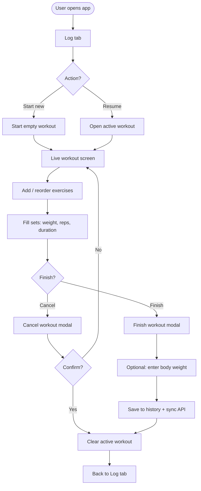

### 1.2 Mobile: Exercise Library and Sync

```mermaid
flowchart LR
    subgraph device [Device]
        UI[Library screen]
        LocalCache[AsyncStorage cache]
        Context[WorkoutContext]
    end
    subgraph backend [Backend]
        API[/api/exercises]
        DB[(Postgres)]
    end
    UI --> Context
    Context -->|On load| LocalCache
    Context -->|Then| API
    API --> DB
    API -->|Merge with cache| Context
    Context --> LocalCache
    Context --> UI
```

### 1.3 Web: Dashboard Login and Data Load

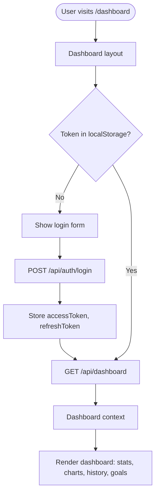

### 1.4 Admin: Edit Reference Table Row

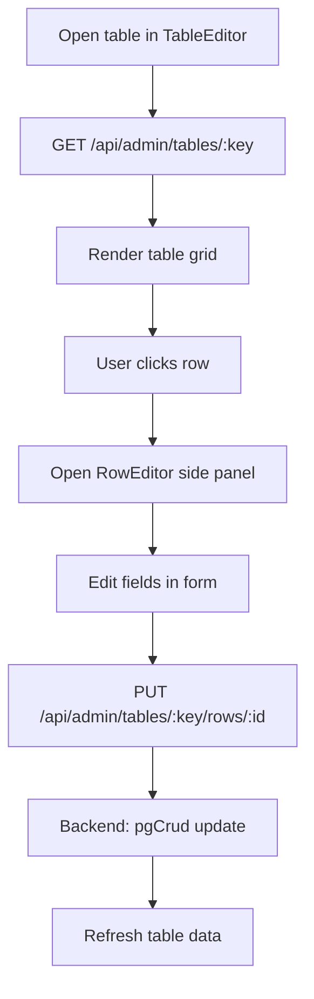

---

## 2. Data Flows

### 2.1 High-Level Data Flow (All Clients to Postgres)

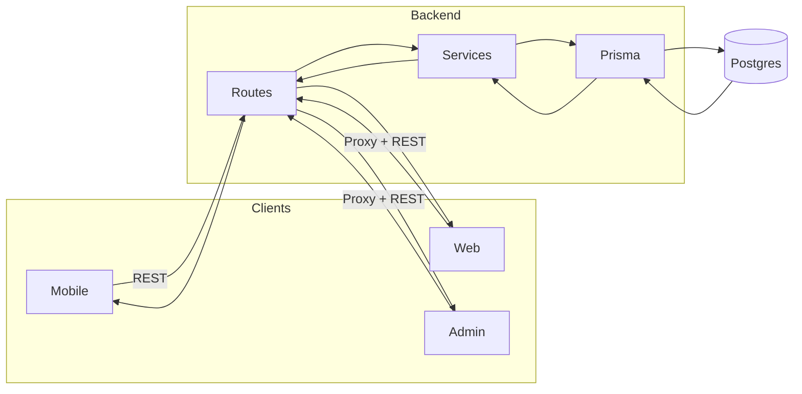

### 2.2 Mobile Offline-First Sync (WorkoutContext)

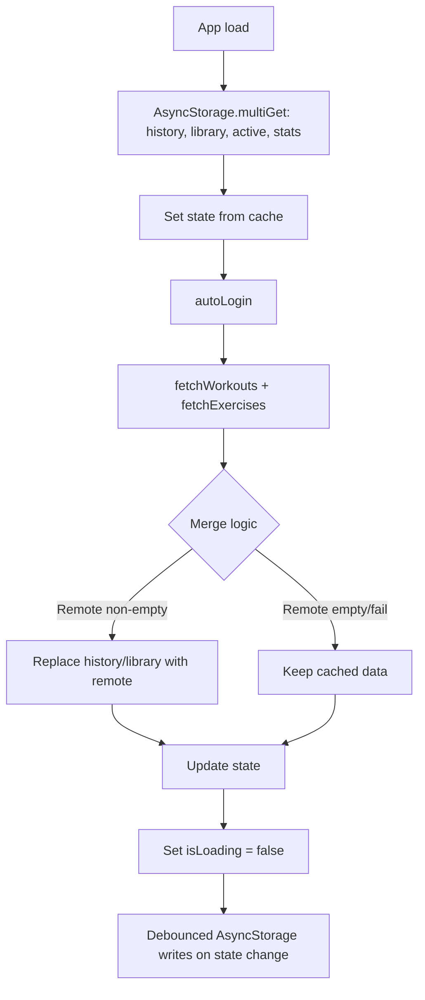

### 2.3 Dashboard Aggregate (Backend)

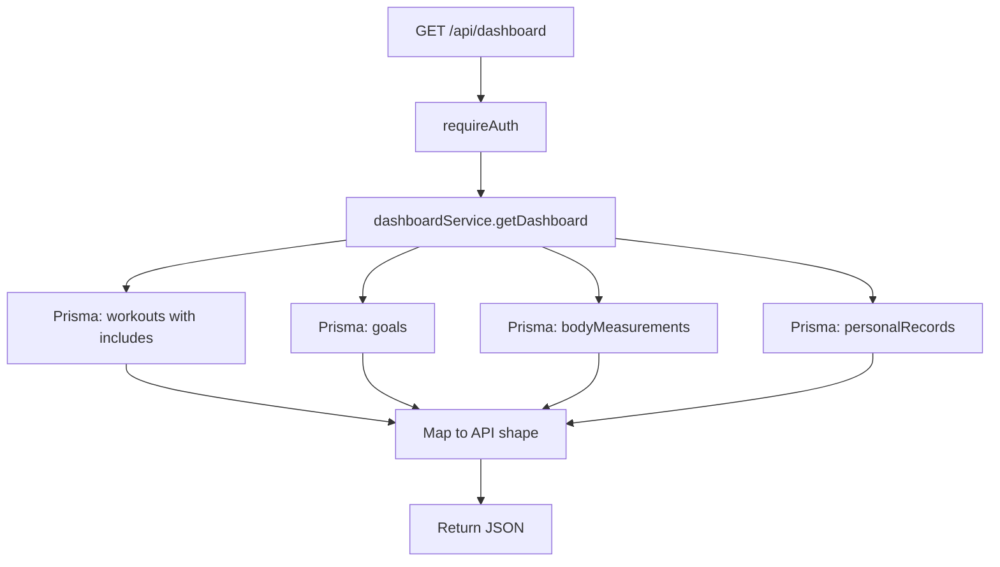

---

## 3. Request Flows

### 3.1 Authenticated Request (e.g. GET /api/workouts)

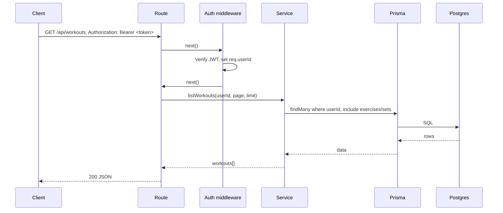

### 3.2 Admin Table CRUD (No Auth)

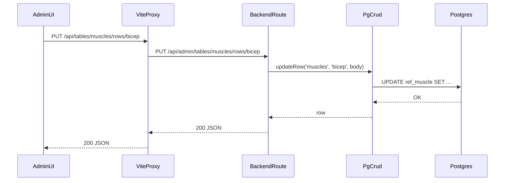

### 3.3 Web Dashboard Request (Proxy)

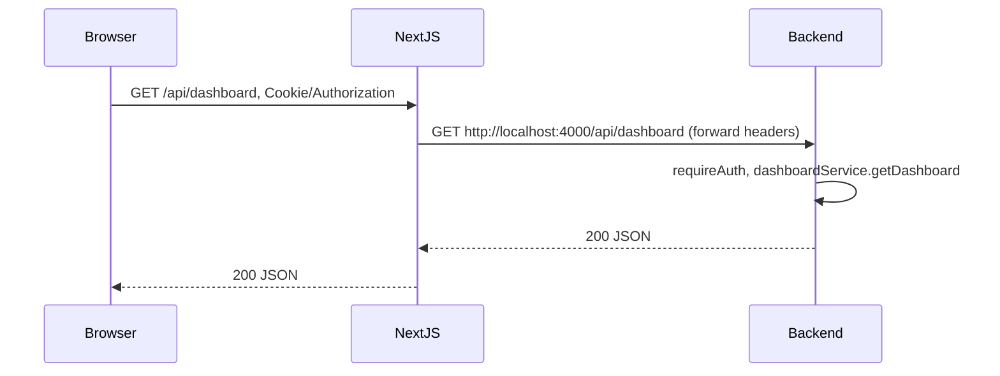

---

## 4. Scoring and Reference Data Flow (Admin / Backend)

### 4.1 Scoring Compute Request

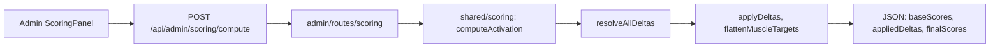

### 4.2 Reference Data: Mobile Bootstrap

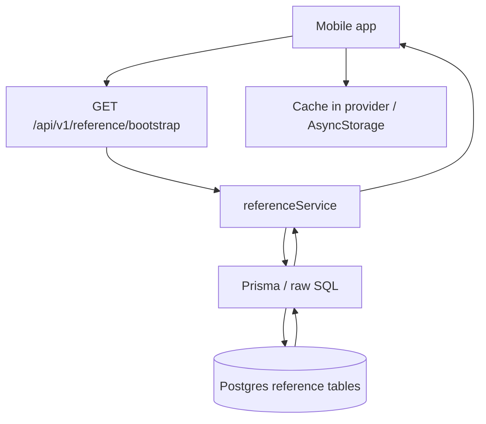

---

## 5. Diagram Index

| Section | Diagram | Description |
|---------|---------|-------------|
| 1.1 | Mobile: Start and Finish a Workout | User path from Log tab to finishing or canceling a workout |
| 1.2 | Mobile: Exercise Library and Sync | How library data is loaded from cache and API |
| 1.3 | Web: Dashboard Login and Data Load | Auth check and dashboard fetch |
| 1.4 | Admin: Edit Reference Table Row | Table editor → row edit → save |
| 2.1 | High-Level Data Flow | All clients → backend → Postgres |
| 2.2 | Mobile Offline-First Sync | WorkoutContext load and merge |
| 2.3 | Dashboard Aggregate | Backend building dashboard response |
| 3.1 | Authenticated Request | JWT → route → service → Prisma → response |
| 3.2 | Admin Table CRUD | Admin → Vite proxy → backend → pgCrud |
| 3.3 | Web Dashboard Request | Browser → Next.js proxy → backend |
| 4.1 | Scoring Compute | Admin scoring panel → shared scoring engine |
| 4.2 | Reference Data Bootstrap | Mobile bootstrap from Postgres |

---

## 6. Related Documents

- [Architecture](architecture.md)
- [Process diagrams](process-diagrams.md)
- [API catalog](api.md)
