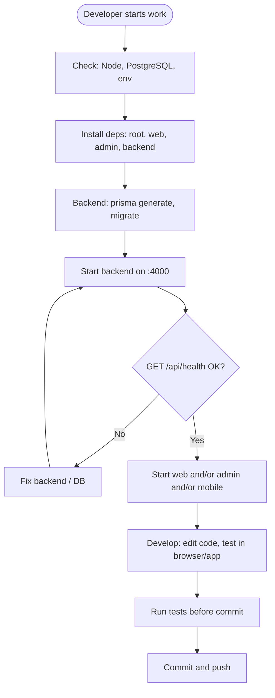
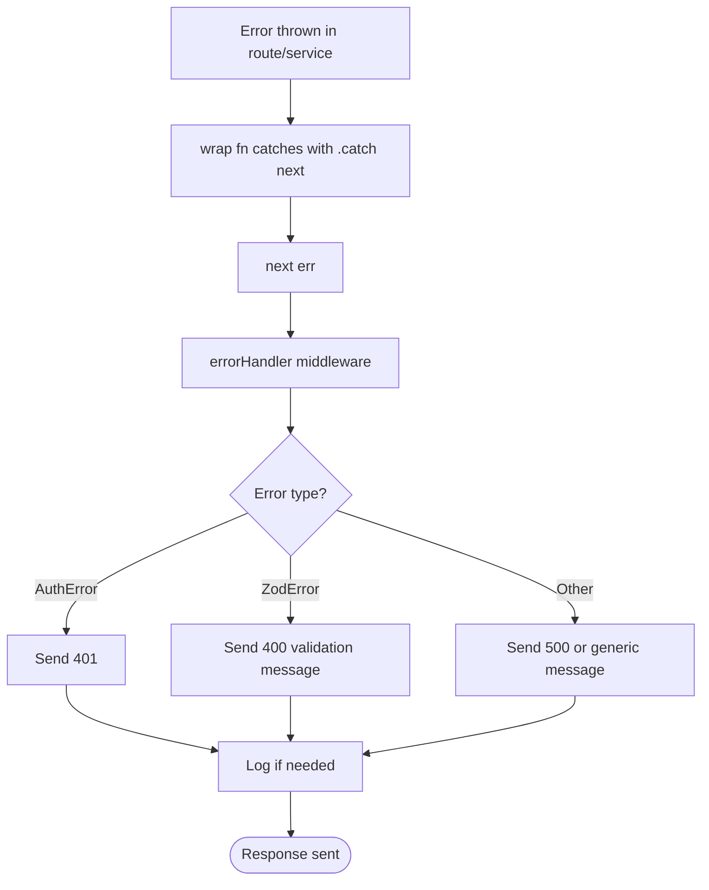
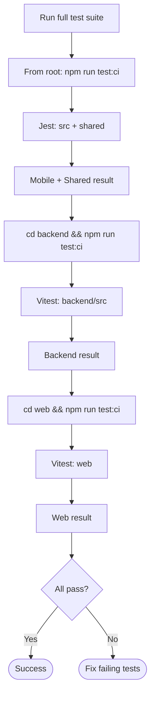
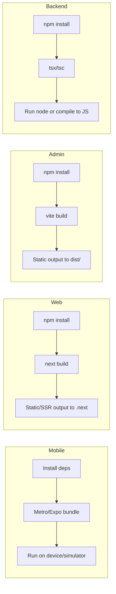
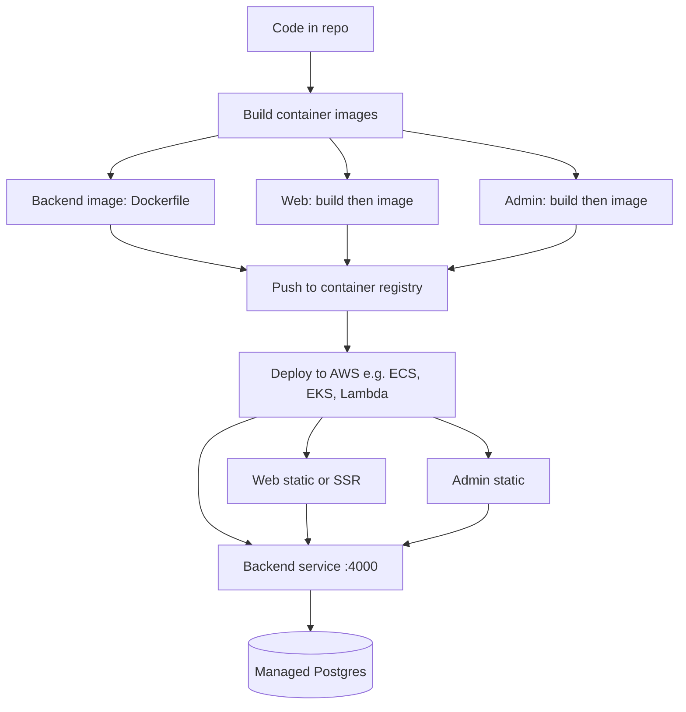
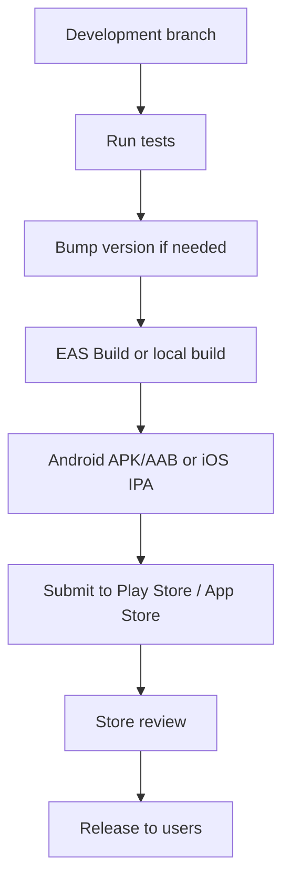
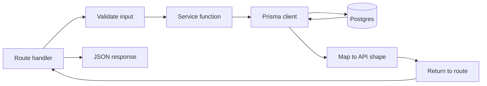

# Process Diagrams Report

This document describes **processes** in the Solto ecosystem: development workflow, request handling, deployment, testing, and release. Each process is documented with a Mermaid diagram and a short explanation.

---

## 1. Development Workflow

### 1.1 Local Development Startup Process



**Summary:** Install dependencies and set up the database, start the backend and verify health, then start the frontend(s) you need. Run tests before committing.

---

### 1.2 Request Handling Process (Backend)

```mermaid
flowchart LR
    Incoming[Incoming HTTP request] --> Router[Express router]
    Router --> CORS[CORS middleware]
    CORS --> AuthRoute{Auth required?}
    AuthRoute -->|Yes| AuthMW[requireAuth: verify JWT]
    AuthRoute -->|No| Parse[Parse body, params, query]
    AuthMW -->|Valid| Parse
    AuthMW -->|Invalid| Err401[401 Unauthorized]
    Parse --> RouteHandler[Route handler wrapped with wrap]
    RouteHandler --> Validate[Validate input e.g. Zod]
    Validate --> ServiceCall[Call service layer]
    ServiceCall --> ServiceLogic[Service: Prisma queries, logic]
    ServiceLogic --> Response[Send JSON response]
    Response --> Outgoing[Outgoing HTTP response]
```



**Summary:** Request passes through CORS, optional auth, parsing, validation, then the route calls a service. The service uses Prisma and returns data; the route sends the HTTP response. Errors are handled by the error-handling middleware.

---

### 1.3 Error Handling Process (Backend)



**Summary:** Async route handlers are wrapped so rejections are passed to `next`. The error handler maps known error types to status codes and sends a consistent JSON error response.

---

## 2. Build and Test Processes

### 2.1 Test Execution Process (Full Suite)



**Summary:** Run mobile/shared tests from root, then backend tests from `backend/`, then web tests from `web/`. All must pass for a green build.

---

### 2.2 Build Process (Per Application)



**Summary:** Each app has its own build: Mobile uses Expo/Metro, Web uses Next.js build, Admin uses Vite build, Backend uses TypeScript (tsx or tsc) and runs with Node.

---

## 3. Deployment Process

### 3.1 Containerized Deployment (Target: AWS)



**Summary:** Backend, Web, and Admin are built into container images, pushed to a registry, then deployed to AWS. Backend connects to managed Postgres; Web and Admin call the backend API.

---

### 3.2 Mobile Release Process



**Summary:** After tests and version bump, build the app (e.g. EAS), produce the store artifact, submit to the store, and release after review.

---

## 4. Data and Sync Processes

### 4.1 Mobile: Write Path (Create Workout)

```mermaid
flowchart TD
    UserAction[User finishes workout] --> Context[WorkoutContext.finishWorkout]
    Context --> LocalUpdate[Update state: add to history, clear active]
    LocalUpdate --> PersistLocal[Debounced AsyncStorage write]
    Context --> ApiCreate[apiCreateWorkout to backend]
    ApiCreate --> BackendRoute[POST /api/workouts]
    BackendRoute --> WorkoutService[workoutService.createWorkout]
    WorkoutService --> PrismaCreate[Prisma create]
    PrismaCreate --> DB[(Postgres)]
    PersistLocal --> Done([UI updated, cache updated]
    DB --> Done
```

**Summary:** Finishing a workout updates local state and persists to AsyncStorage (debounced), and sends the workout to the backend. Backend persists to Postgres. UI and cache are updated regardless of API success (offline-first).

---

### 4.2 Backend: Service Layer Pattern



**Summary:** Routes validate input, call a service function with `userId` and params, and the service performs Prisma operations and mapping. The route sends the JSON response.

---

## 5. Process Index

| Section | Process | Description |
|---------|---------|-------------|
| 1.1 | Local Development Startup | Order of starting services and verifying health |
| 1.2 | Request Handling (Backend) | Path of an HTTP request through Express to response |
| 1.3 | Error Handling (Backend) | How errors are caught and turned into HTTP responses |
| 2.1 | Test Execution (Full Suite) | Running mobile, backend, and web tests |
| 2.2 | Build (Per Application) | How each app is built |
| 3.1 | Containerized Deployment | Building and deploying to AWS |
| 3.2 | Mobile Release | From dev to store submission and release |
| 4.1 | Mobile Write Path | Finishing a workout: local + API |
| 4.2 | Service Layer Pattern | Route → service → Prisma → response |

---

## 6. Related Documents

- [Architecture](architecture.md)
- [Flowcharts](flowcharts.md)
- [Getting started](getting-started.md)
- [API catalog](api.md)
