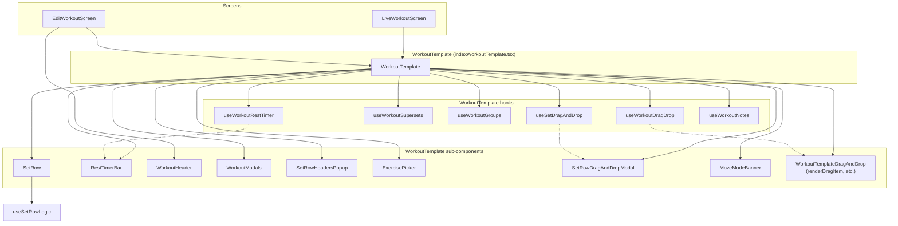

# Architecture Map — Workout App

Visual reference for a planned large-scale refactor of the `src/` codebase.

---

## 1. High-Level Directory Tree

```
src/
├── components/                    # Reusable UI and feature components
│   ├── common/                   # Shared primitives (e.g. SwipeToDelete)
│   ├── ExerciseEditor/           # Create/edit exercise definitions (library & config)
│   ├── WorkoutTemplate/         # Core workout UI: list of exercises, sets, rest, drag-drop
│   ├── ActiveWorkoutBanner.tsx   # In-app banner when a workout is in progress
│   ├── ExerciseHistoryModal.tsx  # Modal showing history for an exercise
│   ├── SavedNoteItem.tsx         # Display of a saved note in workout/session
│   └── ...
├── context/                      # Global React Context providers
│   ├── WorkoutContext.tsx        # Active workout, history, library, stats, CRUD
│   └── UserSettingsContext.tsx   # User preferences (units, rest timer, etc.)
├── database/                     # Local DB and reference data
│   ├── tables/                   # JSON reference data (muscles, equipment, motions, etc.)
│   ├── initDatabase.ts           # DB initialization
│   ├── exerciseConfigService.ts  # Exercise config read/write
│   └── useExerciseConfig.ts     # Hooks for exercise config (categories, etc.)
├── screens/                      # Top-level app screens (navigation targets)
│   ├── LiveWorkoutScreen.tsx     # Active workout flow → delegates to WorkoutTemplate
│   ├── EditWorkoutScreen.tsx     # Edit past workout → WorkoutTemplate + WorkoutHeader
│   ├── HistoryScreen.tsx         # Workout history list and stats view
│   ├── LogScreen.tsx             # Log home: start workout, routines
│   ├── LibraryScreen.tsx         # Exercise library (no WorkoutTemplate)
│   └── ProfileTab/               # Profile: settings, goals, measurements, PRs
├── types/                        # Shared TypeScript types
│   └── workout.ts                # Workout, Exercise, Set, and app domain types
├── utils/                        # Pure helpers (workout, exercise, equipment)
│   ├── workoutHelpers.ts         # Workout/exercise tree updates, formatting
│   ├── workoutInstanceHelpers.ts # Creating exercise instances and set groups
│   ├── exerciseFilters.ts         # Filtering exercises by category/muscle/equip
│   └── equipmentIcons.ts         # Equipment icon resolution
└── constants/                    # Theme, layout, static data
    ├── colors.js
    ├── layout.ts
    ├── data.js                   # Format helpers, default toggles, history stub
    └── ...
```

### Key directory summaries

| Directory | Responsibility |
|-----------|----------------|
| `components/WorkoutTemplate/` | Orchestrates live/edit workout: exercise list, set rows, rest timers, supersets, drag-and-drop, modals. **Central “god” area** — refactor priority. |
| `components/ExerciseEditor/` | Creating/editing exercise library items (name, category, equipment, motions, chips, etc.). Used by WorkoutTemplate (create from picker) and LibraryScreen. |
| `context/` | `WorkoutContext`: active workout, history, exercise library, stats, start/finish/cancel. `UserSettingsContext`: units, rest timer default, keep screen awake, etc. |
| `screens/` | Navigation roots. `LiveWorkoutScreen` and `EditWorkoutScreen` both render `WorkoutTemplate` with different props; `HistoryScreen`, `LogScreen`, `LibraryScreen`, and `ProfileTab` use context and navigation only. |
| `database/` | SQLite (or similar) init and exercise config; `tables/` hold static JSON (muscles, equipment, motions, categories). |
| `utils/` | Stateless helpers for workout/exercise trees, instance creation, filtering, formatting. No React. |

<details>
<summary>Full file list (expand)</summary>

- `components/common/SwipeToDelete.tsx`
- `components/ExerciseEditor/*` (Chip, CustomDropdown, EditExercise, EditExerciseFields, EquipmentPickerModal, GripTypeWidthPicker, MotionPickerModal, StanceTypeWidthPicker, editExerciseFieldConfig, EditExercise.styles, index)
- `components/WorkoutTemplate/indexWorkoutTemplate.tsx`, `SetRow.tsx`, `WorkoutHeader.tsx`, `WorkoutTemplateDragAndDrop.tsx`
- `components/WorkoutTemplate/components/RestTimerBar.tsx`, `WorkoutModals.tsx`, `MoveModeBanner.tsx`, `SetRowHeadersPopup/*`
- `components/WorkoutTemplate/hooks/useWorkoutRestTimer.ts`, `useWorkoutGroups.ts`, `useWorkoutNotes.ts`, `useSetRowLogic.ts`, `useWorkoutSupersets.ts`, `useWorkoutDragDrop.ts`, `useSetDragAndDrop.ts`
- `components/WorkoutTemplate/modals/ExercisePicker/*`, `SetRowDragAndDropModal/*`, `CustomNumberKeyboard.tsx`, `ActiveRestTimerPopup.tsx`, `CancelWorkoutModal.tsx`, `FinishWorkoutModal.tsx`
- `components/WorkoutTemplate/Keyboards/timerKeyboardUtil.tsx`
- `screens/LiveWorkoutScreen.tsx`, `EditWorkoutScreen.tsx`, `HistoryScreen.tsx`, `LogScreen.tsx`, `LibraryScreen.tsx`
- `screens/ProfileTab/*` (ProfileIndex, modals, components, hooks)
- `context/WorkoutContext.tsx`, `UserSettingsContext.tsx`
- `database/initDatabase.ts`, `exerciseConfigService.ts`, `useExerciseConfig.ts`, `tables/*.json`, `tables/README.md`
- `types/workout.ts`
- `utils/workoutHelpers.ts`, `workoutInstanceHelpers.ts`, `exerciseFilters.ts`, `equipmentIcons.ts`
- `constants/*` (colors, layout, data, defaultStyles, defaultToggles, stance/grip images/labels, etc.)

</details>

---

## 2. Component Dependency Graph (Mermaid)

Screens → WorkoutTemplate → sub-components and hooks.



**Delegation summary**

- **LiveWorkoutScreen**: Gets `activeWorkout`, `updateWorkout`, `finishWorkout`, `cancelWorkout`, library, stats from `WorkoutContext`; renders `WorkoutTemplate` in `mode="live"` with `onFinish`/`onCancel` that call context and navigate back.
- **EditWorkoutScreen**: Holds local `editedWorkout` state; uses `WorkoutContext` for `updateHistory`, library, stats; renders `WorkoutHeader` (custom header) and `WorkoutTemplate` in `mode="edit"` with custom header/finish button; on finish updates history and navigates back.
- **WorkoutTemplate**:
  - Renders the main scroll/drag list of exercises; each exercise block uses **SetRow** (and optionally **RestTimerBar**) per set.
  - Uses **useWorkoutRestTimer** for active rest timer state and **RestTimerBar** for UI.
  - Uses **useWorkoutSupersets** / **useWorkoutGroups** for superset and drop-set selection/creation.
  - Uses **useWorkoutDragDrop** and **useWorkoutTemplateDragAndDrop** for reordering exercises/groups; **useSetDragAndDrop** for reordering sets (and SetRowDragAndDrop modal).
  - Uses **useWorkoutNotes** and **WorkoutModals** for session/exercise notes and finish/cancel modals.
  - Opens **ExercisePicker** to add exercises (and create new via **EditExercise**); opens **SetRowHeadersPopup** for set header legend.

---

## 3. State Management Map

### Global contexts

| Context | Purpose | Major consumers |
|--------|---------|------------------|
| **WorkoutContext** | `activeWorkout`, `workoutHistory`, `exercisesLibrary`, `exerciseStats`; `startEmptyWorkout`, `updateWorkout`, `updateHistory`, `finishWorkout`, `cancelWorkout`, `addExerciseToLibrary`, `updateExerciseInLibrary`, `isLoading` | **LiveWorkoutScreen**, **EditWorkoutScreen**, **HistoryScreen**, **LogScreen**, **LibraryScreen**, **ActiveWorkoutBanner**, **ProfileTab/ProfileIndex**, **AddGoalModal**, **usePersonalRecords** |
| **UserSettingsContext** | `settings` (units, rest timer, vibrate, keep screen awake), `updateSettings`, `isLoaded` | **ProfileTab/ProfileIndex**, **AddGoalModal**, **AddMeasurementModal** |

### WorkoutTemplate hooks → features

| Hook | File | Feature / UI |
|------|------|---------------|
| **useWorkoutRestTimer** | `hooks/useWorkoutRestTimer.ts` | Rest timer state and countdown; **RestTimerBar** displays and starts/stops it; **ActiveRestTimerPopup** for full-screen timer. |
| **useWorkoutSupersets** | `hooks/useWorkoutSupersets.ts` | Superset create/edit: selection mode, confirm/cancel; used when adding to superset or editing group. |
| **useWorkoutGroups** | `hooks/useWorkoutGroups.ts` | Drop-set (and group set) selection mode; which sets are in a drop-set; submit/cancel drop-set. |
| **useWorkoutNotes** / **useExerciseNotes** | `hooks/useWorkoutNotes.ts` | Session notes and exercise notes state; **WorkoutModals** for note modal and finish/cancel. `useExerciseNotes` handles per-exercise note modal and save. |
| **useSetRowLogic** | `hooks/useSetRowLogic.ts` | **SetRow** focus handling, refs, and custom keyboard open/close (per-row input behavior). |
| **useWorkoutDragDrop** | `hooks/useWorkoutDragDrop.ts` | Flattened list, reorder exercises/groups; used by **WorkoutTemplateDragAndDrop** for main list drag. |
| **useSetDragAndDrop** | `hooks/useSetDragAndDrop.ts` | Set reorder and set-group (dropset) editing; **SetRowDragAndDropModal** and **ExercisePicker** (when editing sets from picker). |

---

## 4. Critical Logic Hotspots

### God components / high complexity

| File | Approx. size | Notes |
|------|--------------|--------|
| **`components/WorkoutTemplate/indexWorkoutTemplate.tsx`** | ~4,100+ lines | **Primary refactor target.** Holds almost all workout UI state (picker, modals, rest period, focus, selection modes, drag), inline handlers, and large JSX. Tightly couples UI and business logic. |
| **`components/WorkoutTemplate/SetRow.tsx`** | ~1,700+ lines | **High prop density** (~40+ props). Renders one set row (weight/reps/duration/distance, check, rest, drop-set, keyboard). Mix of layout, validation, and keyboard logic. |
| **`components/WorkoutTemplate/modals/ExercisePicker/ExercisePickerIndex.tsx`** | ~1,900+ lines | Add exercises to workout, create supersets/dropsets from picker, set-count and set-group configuration; embeds **SetRowDragAndDropModal** and heavy local state. |
| **`components/WorkoutTemplate/modals/SetRowDragAndDropModal/indexSetRowDragAndDrop.tsx`** | ~1,100+ lines | Reorder sets and edit drop-set structure in a modal; uses **useSetRowDragAndDrop** and large inline styles/logic. |
| **`components/WorkoutTemplate/components/RestTimerBar.tsx`** | ~750+ lines | Rest timer bar UI, animations, selection mode; many props and local state. |
| **`components/WorkoutTemplate/components/SetRowHeadersPopup/SetRowHeadersPopup.tsx`** | ~870+ lines | Set header legend popup and **SetRowHeadersInformation**; toggles and layout. |

### Tight coupling (UI ↔ business logic)

- **WorkoutTemplate**: Directly calls `updateExercisesDeep`, `findExerciseDeep`, and other helpers from `workoutHelpers` inside event handlers; rest timer, superset, and group logic live next to JSX. **Refactor**: Move “workout state transitions” into a single layer (e.g. reducer or service) and keep WorkoutTemplate as a view.
- **SetRow**: Parsing/formatting and validation for weight/reps/duration/distance mixed with focus and keyboard logic. **Refactor**: Extract set-field parsing/formatting and validation to utils or a small hook; keep SetRow as presentational where possible.
- **ExercisePicker**: Add-to-workout logic (instance creation, set groups, superset/dropset) mixed with filter state and modal visibility. **Refactor**: Separate “build payload to add to workout” from picker UI state and filtering.

### Other large files

- **`context/WorkoutContext.tsx`**: ~220+ lines — load/persist workout, history, library, stats; finish/cancel logic. Good candidate to keep as single source of truth but clarify boundaries with WorkoutTemplate.
- **`utils/workoutHelpers.ts`**: Core for any refactor; keep pure and well-tested.

---

## 5. Data Structure Reference

Core models from **`src/types/workout.ts`** that drive application state:

### Workout & exercises

- **`Workout`**: `id`, `name`, `startedAt`, `exercises` (`ExerciseItem[]`), `sessionNotes?`, `finishedAt?`, `endedAt?`, `duration?`, `date?`.
- **`ExerciseItem`**: `Exercise | ExerciseGroup` (discriminated by `type`).
- **`Exercise`**: `instanceId`, `exerciseId`, `name`, `category` (`ExerciseCategory`), `type: 'exercise'`, `sets` (`Set[]`), `notes?`, `weightUnit?`, `collapsed?`, `trackDuration?`, `trackReps?`, `trackDistance?`, weight/reps/distance config, `assistedNegative?`, etc.
- **`ExerciseGroup`**: `instanceId`, `type: 'group'`, `groupType` (`'Superset' | 'HIIT'`), `children` (`Exercise[]`).
- **`Set`**: `id`, `type` (`'Working' | 'Warmup' | 'Failure'`), `weight`, `reps`, `duration`, `distance` (strings), optional `weight2`/`reps2`, `completed`, `restPeriodSeconds?`, `restTimerCompleted?`, `dropSetId?`, `isWarmup?`, `isDropset?`, `isFailure?`.

### Supporting types

- **`RestTimer`**: `exerciseId`, `setId`, `remainingSeconds`, `totalSeconds`, `isPaused`.
- **`Note` / `SessionNote`**: `id`, `text`, `date`, `pinned`.
- **`FlatExerciseRow`**: For flattened list UI; `type`, `id`, `data` (`ExerciseItem`), `depth`, `groupId`.
- **`FocusNextSet`**, **`RestPeriodSetInfo`**: Used by WorkoutTemplate/SetRow for focus and rest-period modal.
- **`ExerciseStats`**, **`ExerciseStatsMap`**: PR and history per exercise; consumed by context and UI.

### Profile & settings

- **`UserSettings`**: `distanceUnit`, `weightUnit`, `weightCalcMode`, `repsConfigMode`, `defaultRestTimerSeconds`, `vibrateOnTimerFinish`, `keepScreenAwake`.
- **`UserProfile`**, **`BodyMeasurement`**, **`UserGoal`**, **`PersonalRecord`**: Used by ProfileTab and related hooks.

---

*Generated as a visual reference for refactoring. Update this document as the architecture changes.*
